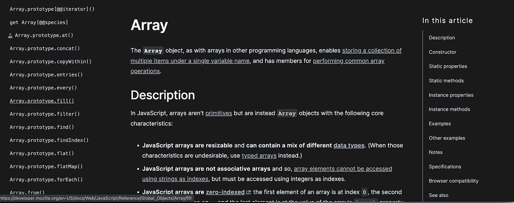
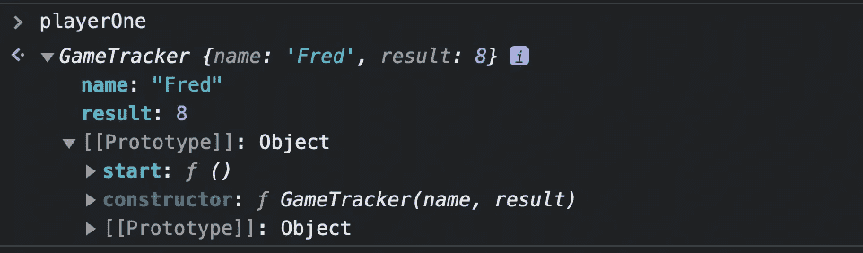

# 在 JavaScript 中引入原型

> 原文：<https://blog.devgenius.io/introducing-prototypes-in-javascript-b2353028d470?source=collection_archive---------6----------------------->

## 面向初学者的原型概念的可视化介绍


## 面向对象的 JavaScript

虽然 JavaScript 不是基于类的语言，也没有实现传统意义上的面向对象编程，但它确实提供了使我们能够使用面向对象编程概念的特性和模式。我们可以称之为**原型继承**。

## JavaScript 中的原型是什么？

JavaScript 中原型的核心概念是一个对象可以从另一个对象继承属性或方法。如果你考虑下面的家谱，在底部的人与在顶部的一个人联系在一起，你可以沿着这条路线一步一步向上到达顶部。


在 JavaScript 中，你可以把一个原型想象成一个蓝图、一个模板或者一个包含方法的基本对象，所创建的对象的任何实例都可以访问这些方法。如果我们没有原型，那么我们将不得不在一个对象的每一个实例上定义方法，这将不是非常有效的，它将消耗大量的内存。

有两个原型，我们需要了解原型属性和对象原型本身。让我们从原型属性开始。

## 原型属性

当我们在数组上使用诸如 *pop* 或 *includes* 之类的 JavaScript 方法时，我们使用的是 JavaScript 内的内置方法。让我们从视觉上来看。我们可以从访问数组原型构造函数的原型属性开始。


现在让我们创建一个数组，看看如何在数组内部查看 prototype 属性。


在上面的例子中，一个名为 *ourArray* 的变量被声明并用一个包含值 1、2 和 3 的数组初始化。之后，我们的*阵列*被检查。当我们想从数组末尾移除一个元素时，我们可以使用 *pop* 方法。这是从哪里来的呢？让我们再检查一下我们的阵列。


JavaScript 中的每个对象都有一个 *[[Prototype]]* 属性。这是一个内部属性，由包围它的双括号表示。当我们选择[[Prototype]]属性时，我们可以看到可用的方法，在我们的例子中，这些方法继承自数组构造函数。我们还可以使用方法 *getPrototypeOf* ，该方法将返回给定对象的 *[[Prototype]]* 属性(记住数组是一种特殊类型的对象)。

值得注意的是，你可能会遇到使用 *__proto__* 的例子。这是一个遗留特性，eslint 有一个规则(no-proto)来防止它的使用。 *__proto__* 属性公开一个对象的内部 *[[Prototype]]* 。最好使用如下图所示的 *getPrototypeOf* 。


我们可以将此与 [mdn](https://developer.mozilla.org/en-US/docs/Web/JavaScript/Reference/Global_Objects/Array) 网站上列出的方法进行对比。所以，所有的数组都可以访问这些方法，但是它们本身并没有这些方法的属性。



这些是每个数组都可以使用的方法，但是这些方法不是在每个数组中单独定义，而是在原型对象上定义。这并不特定于数组，也适用于 JavaScript 中的其他内置对象。我们也可以在创建对象时使用它。

## 这一切怎么可能？

作为*[[原型]]* 属性的值的对象是我们正在检查的任何对象的原型。如果不存在，它将为空。当我们在*我们的数组*上使用 *pop* 方法时，JavaScript 解释器最初会在*我们的数组*上寻找该方法。当它在那里找不到它时，它将在原型上寻找。


我们称这个过程为*原型继承*或*原型链*。这个过程可以一直持续下去，但是最好不要创建复杂的链，因为调试它会变得令人困惑。使用原型链，你可以只在一个对象上存储一个函数，如果解释器在第一个对象中找不到它，它就会查找这个对象。让我们看一些代码中的例子。

```
function GameTracker(name, result) {
  this.name = name;
  this.result = result;
}
```

在上面的代码中，我们用参数 *name* 和 *result* 声明了一个名为 *GameTracker* 的构造函数。当它被存储在内存中时，它被存储为一个带有对象的函数。该对象有一个空对象的原型属性。任何使用 GameTracker 构造函数创建的函数都可以访问 prototype 属性。在函数内部，我们使用这个函数设置了*名称*和*结果*，因此它们引用对象的当前实例。

```
let playerOne = new GameTracker("Fred", 8);
```

接下来，我们创建一个名为 *playerOne* 的变量，它最初是未初始化的。然后通过使用 new 关键字，创建了一个新的游戏追踪器实例。当我们使用 *new* 关键字时，prototype 属性被设置，这将是对 GameTracker 对象的引用。如果我们检查 playerOne，我们将看到以下内容。

```
console.log(playerOne);
//Returns ---> GameTracker {name: 'Fred', result: 8}
```

现在让我们试着找出 playerOne 的构造函数。

```
Object.getPrototypeOf(playerOne);//Returns ---> **constructor**: *ƒ GameTracker(name, result)*
```

使用原型，我们可以向原型添加一个方法。我们将添加一个开始我们的游戏。

```
GameTracker.prototype.start = function() {
  return `Hello ${this.name} the game is ready.`;
}
```

现在让我们再次检查 playerOne 对象。我们可以看到启动功能存储在原型中。



所以我们可以使用 playerOne 上的启动功能。让我们试一试。

```
playerOne.start();//Returns ---> 'Hello Fred the game is ready.'
```

我希望你喜欢阅读这篇文章。请随时发表任何评论、问题或反馈，并关注我以获取更多内容！

*   [https://developer . Mozilla . org/en-US/docs/Web/JavaScript/Reference/Global _ Objects/Array](https://developer.mozilla.org/en-US/docs/Web/JavaScript/Reference/Global_Objects/Array)