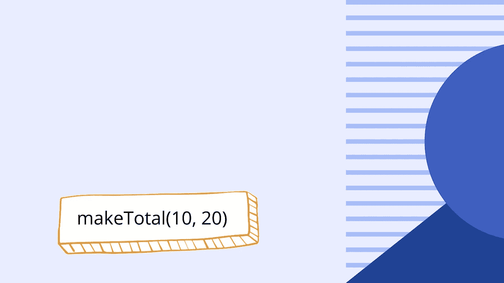
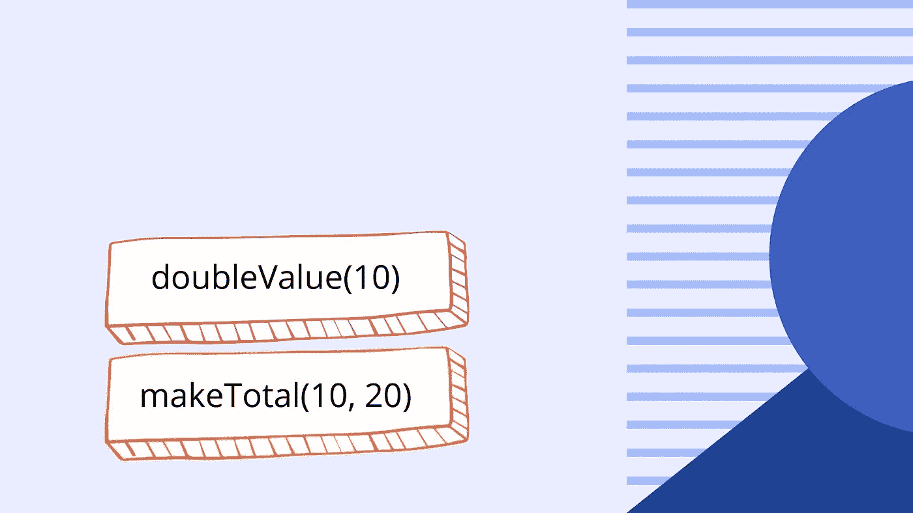
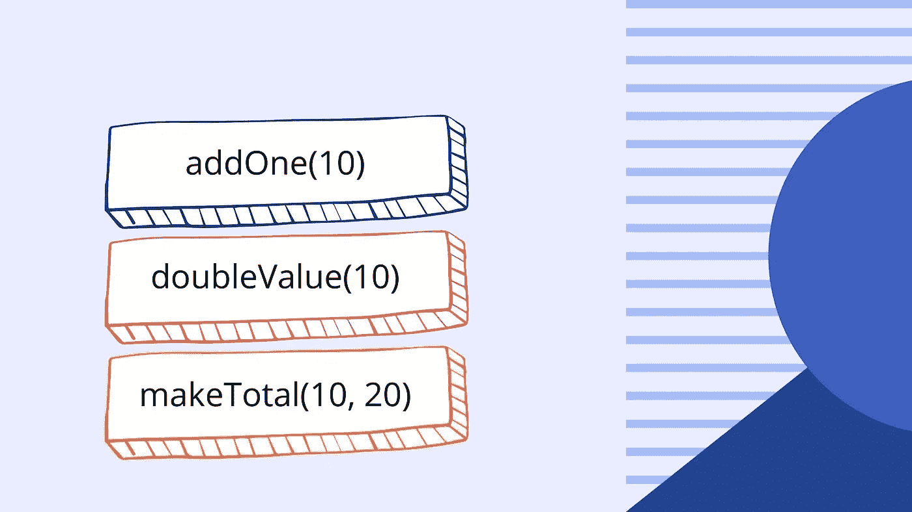
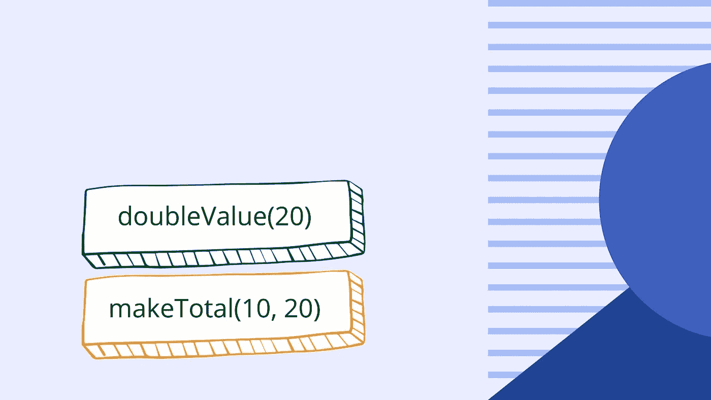
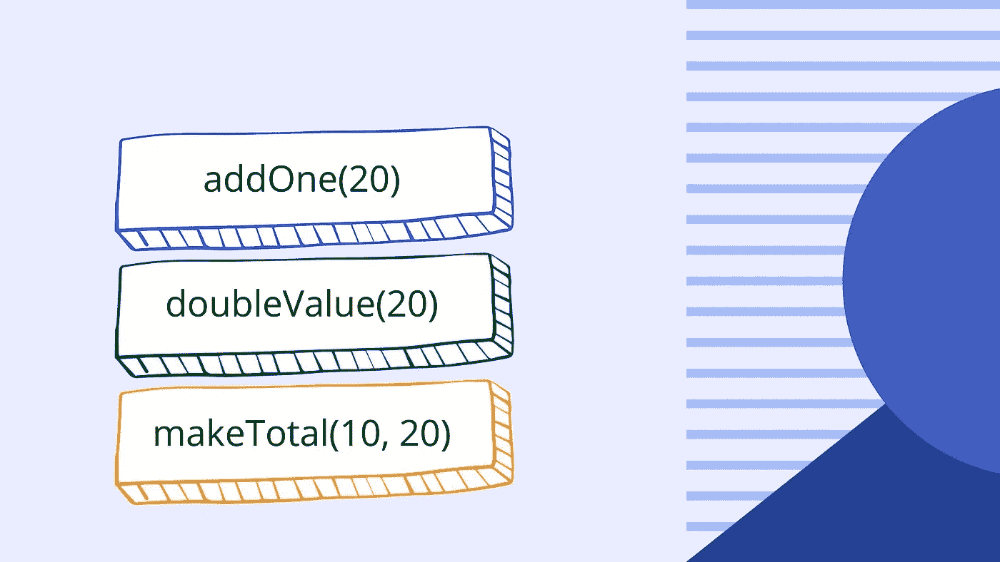

# JavaScript 调用堆栈简介

> 原文：<https://blog.devgenius.io/introducing-the-javascript-call-stack-8981970438e5?source=collection_archive---------10----------------------->

## JavaScript 调用堆栈的可视化指南


## 什么是调用栈？

调用堆栈不仅是 JavaScript 的一个特性，也是许多其他编程语言的一个特性。当代码运行时，调用堆栈使 JavaScript 解释器(如何读取文件)能够跟踪它在代码中的位置以及哪个函数当前正在运行。如果有一个函数调用另一个函数，这就变得很有必要。

## 什么是堆栈？

在计算机科学中，栈是一种基本的数据结构。就像当你叠一些乐高积木或者你叠一些书时，最后放在堆叠上的东西会放在堆叠的最上面。它也成为第一个被移除的东西。调用堆栈以同样的方式工作。一个函数被推到调用堆栈上，稍后当一个值从一个函数返回时，它将被弹出调用堆栈。


如果我们有一个程序，当程序启动时有许多函数调用，那么解释器到达的第一个函数被添加到调用栈中。然后运行该函数，如果该函数调用另一个函数，则该函数被添加到调用堆栈的顶部。这个过程一直持续到其中一个函数返回某个值。发生这种情况时，该函数将从调用堆栈中移除。当前正在运行(或正在执行)的函数位于调用堆栈的顶部。让我们看一个例子。

## 了解 JavaScript 调用栈？

```
const addOne = (value) => value + 1;const doubleValue = (value) => addOne(value) * 2;const makeTotal = (a, b) => {
  return doubleValue(a) + doubleValue(b);
}makeTotal(10, 20);//Returns ---> 64
```

在上面的代码示例中，我们创建了一个名为 *addOne* 的函数，它接受一个值，然后将该值加 1。我们创建第二个名为 *doubleValue* 的函数，它调用 *addOne* 函数并将返回值乘以 2。我们创建第三个函数，名为 *makeTotal* 。该函数使用参数 *a* 和 *b* 将来自 *doubleValue* 函数的返回值相加。然后我们继续调用 *makeTotal* 函数，传递参数 10 和 20。让我们使用 JavaScript 调用堆栈来一步一步了解这是如何工作的。

## 可视化调用堆栈

当我们调用 *makeTotal* 时，它被推入调用堆栈，如下图所示。10 成为参数 *a* 的值，20 成为参数 *b* 的值。 *MakeTotal* 通过调用带有参数 *a* 的函数 *doubleValue* 启动。



接下来， *makeTotal* 用参数 *a* (值 10)调用 *doubleValue* 函数。 *MakeTotal* 没有返回任何内容，因此它保留在调用堆栈中，并且 *doubleValue* 也被推送到调用堆栈中。如下图所示。



函数 *doubleValue* 调用 *addOne* 函数，传递来自 *makeTotal* 函数(10)的 a 参数值参数。 *doubleValue* 函数还没有返回任何东西，所以它仍然保留在调用堆栈中。addOne*函数也被添加到调用堆栈中。如下图所示。*



函数 *addOne* 返回*值*参数(10)加 1 的总和。由于该函数返回值，所以现在从调用堆栈中弹出，调用堆栈的当前状态如下图所示。


然后，函数 *doubleValue* 从 *addOne* 函数(11)获取返回值，并将其乘以 2。然后这个值被返回，因此 *doubleValue* 函数从调用堆栈中弹出，如下图所示。


函数 *makeTotal* 现在继续使用 *b* 参数(20)调用 *doubleValue* ，因此 *doubleValue* 再次被添加到调用堆栈中。



*doubleValue* 函数继续调用 *addOne* 函数，因此它也被添加到调用堆栈中。



*addOne* 函数返回*值*参数和 1 相加的总和。当这个函数完成并返回一个值*时，一个*从调用堆栈中弹出。


*doubleValue* 函数将 *addOne* 函数的输出相乘，然后返回一个值。这将从调用堆栈中弹出。


*makeTotal* 函数然后返回总数，留给我们一个空的调用堆栈。

我希望你喜欢这篇文章，请随时发表任何意见，问题或反馈，并关注我的更多内容！