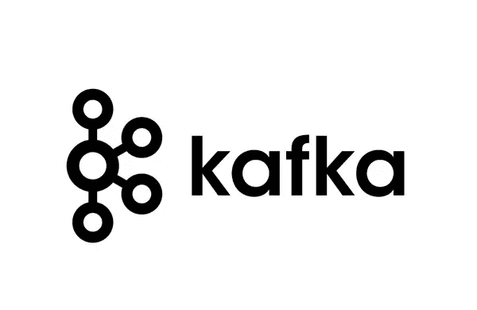
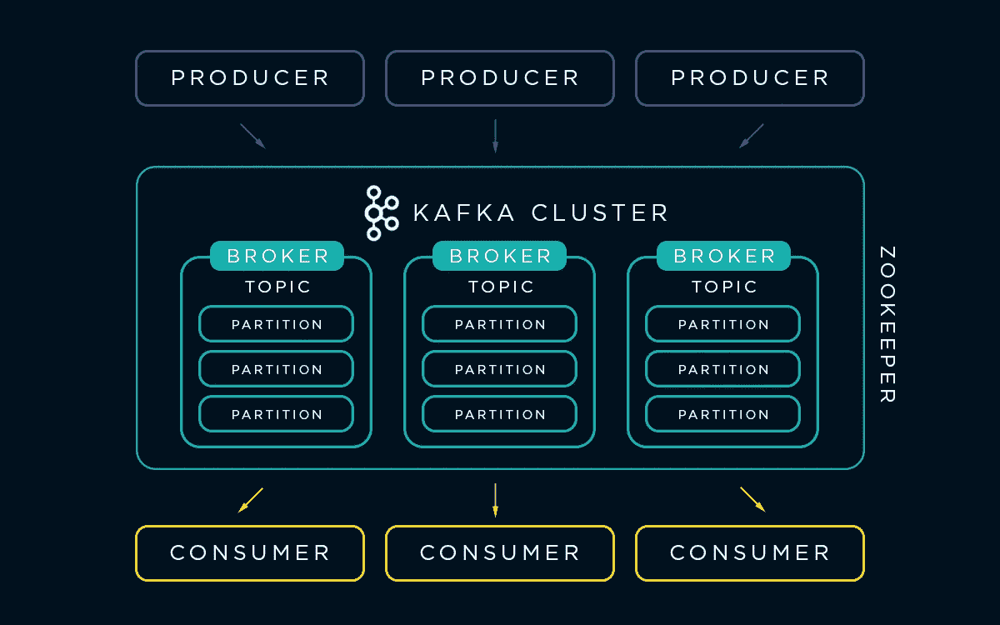
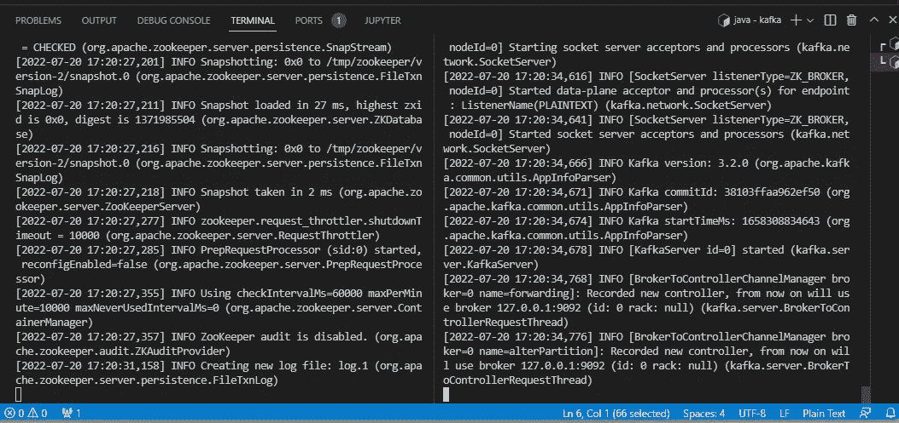
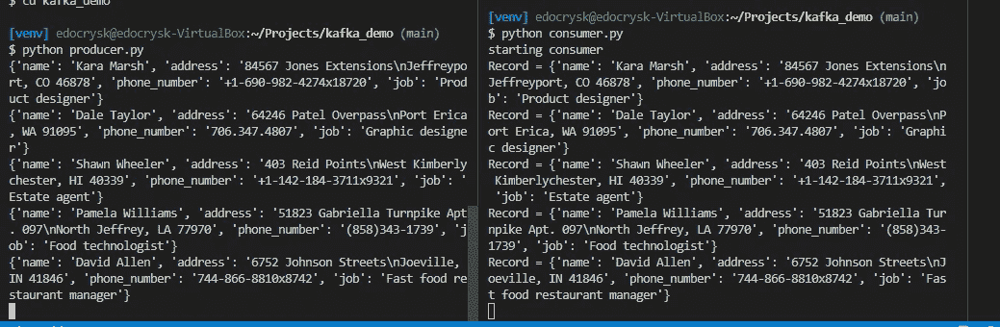

# Apache Kafka 简介和快速入门！

> 原文：<https://blog.devgenius.io/introduction-and-quick-start-to-apache-kafka-50a20f1e8fb2?source=collection_archive---------16----------------------->

问候！如果你想第一次接触 Apache Kafka，你来对地方了！本文将带您完成 Kafka 的基本安装和一个使用 Kafka 的流数据的小 Python 演示！



**简介**

Apache Kafka 是一个分布式事件存储和流处理平台，能够实时接收和处理大量数据。Kafka 旨在处理来自多个来源的同步数据流，并以高吞吐量、高可扩展性、低延迟和高容错能力将它们交付给多个消费者。

可以把卡夫卡想象成一个高度可靠的中间人，他能够将数十亿条信息从发件人那里几乎瞬间传递给他们想要的收件人。

**为什么阿帕奇卡夫卡如此重要？**

在大数据时代，公司配备实时流数据管道至关重要，这使他们能够对收集的大量数据进行处理和及时的数据分析。这些管道必须快速、可靠且具有容错能力，以便不会遗漏关键任务数据。

Apache Kafka 提供了上述以及更多功能，允许公司迅速做出关键业务决策。

**阿帕奇卡夫卡的突出用途**

Apache Kafka 由于其通用性和可伸缩性而被许多公司使用。知名公司的一些比较突出的使用案例是:

1.  **《纽约时报》**使用 Apache Kafka 和 Kafka Streams API 向不同平台的读者实时发布内容。
2.  **Paypal** 使用 Kafka 对来自用户行为跟踪、商户监控以及风险和合规性分析的事件、日志和指标进行实时流处理和批处理。
3.  **CloudFlare** 使用 Kafka 进行日志处理和分析管道，每天从全球数千台服务器收集数十亿个事件。

**架构概述**



卡夫卡体系有四个主要组成部分:

1.  动物园管理员

ZooKeeper 维护集群(代理、主题、用户)的状态和配置。ZooKeeper 还支持在跨代理的分区中选择代理领导者和副本。这确保了在代理失败时的容错能力。

**2。经纪人**

代理处理来自客户端(生产者/消费者)的所有请求，并确保集群内的数据复制。在每个代理中，可以有多个主题，每个主题都有多个分区来存储称为偏移的记录。

**3。制片人**

生产者向集群发送记录，这些记录由代理接收并附加到生产者指定的特定分区。

**4。消费者**

消费者组中的消费者从经纪人处读取记录批次。消费者组是指消费来自同一主题的记录的许多消费者。

**开始**

在对卡夫卡建筑有了基本了解后，我们可以在您的机器上安装卡夫卡了。

**第一步:下载最新的阿帕奇卡夫卡**

```
# directly download the tar file into your directory
wget [https://www.apache.org/dyn/closer.cgi?path=/kafka/3.2.0/kafka_2.12-3.2.0.tgz](https://www.apache.org/dyn/closer.cgi?path=/kafka/3.2.0/kafka_2.12-3.2.0.tgz)# unzip the tar file
tar -xvzf kafka_2.12-3.2.0.tgz# cd into the unzipped folder
cd kafka_2.12-3.2.0
```

**第 2 步:初始化卡夫卡环境**

首先，我们需要启动动物园管理员服务:

```
bin/zookeeper-server-start.sh config/zookeeper.properties
```

接下来，我们将打开另一个终端会话，导航到 Kafka _ 2.12–3 . 2 . 0 文件夹。我们现在将推出卡夫卡经纪人服务:

```
JMX_PORT=8004 bin/kafka-server-start.sh config/server.properties
```



左终端是动物园管理员服务，右终端是卡夫卡经纪人服务

**第 3 步:打造你的第一个卡夫卡主题**

```
# Create your first topic
bin/kafka-topics.sh --create --topic myFirstTopic --bootstrap-server localhost:9092# List all topics
bin/kafka-topics.sh --bootstrap-server=localhost:9092 --list
```

恭喜你！你创造了你的第一个卡夫卡主题！在下一部分，我们将探索生产者和消费者的小型演示。

**用造假者制造小规模流媒体事件**

在本节中，我们将使用 Apache Kafka 运行一个数据流的小演示。我们将使用 Python 包 Faker，以便为流生成虚拟记录。

**第 1 步:安装依赖项**

```
pip install kafka-python
pip install Faker
```

**第 2 步:date_generator.py**

我们将首先创建我们的数据生成器脚本。该脚本将使用 Faker 生成虚拟记录。

**第 3 步:生产者. py**

接下来，我们将创建 define 生产者. py 模块。该模块将向卡夫卡集群提供记录。

**第 4 步:消费者购买**

我们现在将创建我们的 consumer.py 模块。本模块将使用我们卡夫卡集群中的记录。

**第 5 步:全部运行**

1.  初始化卡夫卡环境(如果没有，请参考上一节)
2.  在终端会话中运行生产者. py。
3.  在另一个终端会话中运行 consumer.py。

如果一切正常，我们应该分别看到生产者和消费者的生产和消费记录！多酷啊！



左终端是生产者，右终端是消费者。

要结束流，只需分别终止生产者. py 和消费者. py。

**结论**

恭喜你！我们已经开始了进入阿帕奇卡夫卡的旅程！我们对卡夫卡的浅尝辄止让我们瞥见了卡夫卡的能力。希望你从这篇文章中学到了一两件事！快乐流！

**参考文献**

[什么是阿帕奇卡夫卡？它如何工作，如何受益&挑战(qlik.com)](https://www.qlik.com/us/streaming-data/apache-kafka)

[什么是阿帕奇卡夫卡？|汇合](https://www.confluent.io/what-is-apache-kafka/)

[什么是阿帕奇卡夫卡？| AWS(Amazon.com)](https://aws.amazon.com/msk/what-is-kafka/)

[阿帕奇卡夫卡](https://kafka.apache.org/powered-by#:~:text=Today%2C%20Kafka%20is%20used%20by,strategies%20with%20event%20streaming%20architecture.)

[向每天一万亿条卡夫卡信息进军:在贝宝上大规模运行卡夫卡——汇流](https://www.confluent.io/resources/kafka-summit-2020/marching-toward-a-trillion-kafka-messages-per-day-running-kafka-at-scale-at-paypal/)

[阿帕奇卡夫卡](https://kafka.apache.org/quickstart)

[SelfTuts — YouTube](https://www.youtube.com/c/SelfTuts)