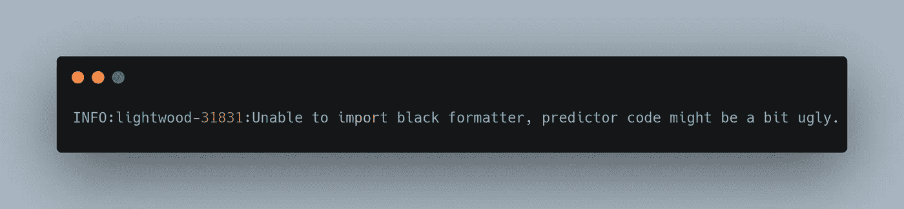
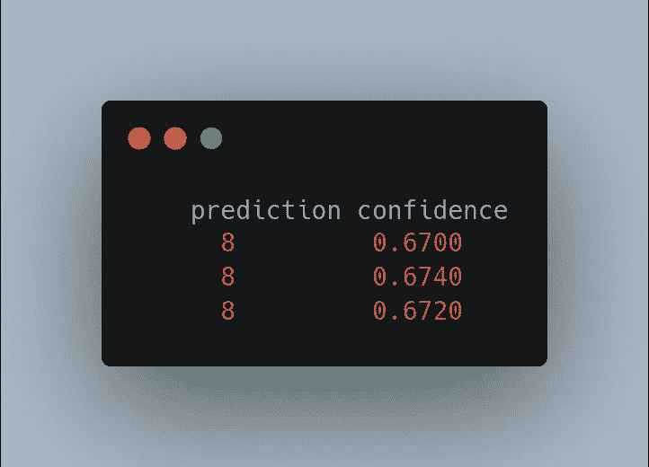

# 如何在 Lightwood 中设计自定义模型混音器

> 原文：<https://blog.devgenius.io/introduction-e2f933c40f4c?source=collection_archive---------18----------------------->


致谢:[米卡·鲍梅斯特](https://unsplash.com/photos/Wpnoqo2plFA?utm_source=63921&utm_medium=referral)

# 介绍

混合器是 lightwood 的核心，负责学习编码特征和目标表示之间的映射。Lightwood 是一个 AutoML 框架，它使你能够使用名为 JSON-AI 的声明性语法来生成和定制机器学习管道。混音器学习映射编码表示，它们是 lightwood 的 AutoML 的核心。在本教程中，我们将尝试将 LightGBM 实现为处理分类目标和整数目标的混合器。

# 安装和设置

您可以按如下方式安装 Lightwood:

```
pip install lightwood
```

# 设置 VSCode 环境

*   使用 GitHub 帐户安装并启用设置同步(如果您使用多台机器)
*   安装 pylance(用于类型),并确保禁用 pyright
*   转到`Python > Lint: Enabled`并禁用除薄片 8 之外的所有
*   *将`python.linting.flake8Path`设置为 flake8 的完整路径(哪个 flake8)*
*   *将`Python › Formatting: Provider`设置为 autopep8*
*   *将`-global-config=<path_to>/lightwood/.flake8`和`-experimental`添加到`Python › Formatting: Autopep8 Args`*
*   *安装实时共享和实时共享白板*

***注意**:在 python 3.8 或 3.9 版本的 python 虚拟环境中运行*

# *步骤 1:混音器界面*

*混音器接口由`BaseMixer`类定义，混音器需要 4 个任务的方法:*拟合(`fit` ) *预测(`__call__` ) *构造(`__init__` ) *部分拟合(`partial_fit`)，尽管这个是可选的*

# *步骤 2:编写我们的混音器*

*我将在我们的虚拟环境中创建一个名为`lightgbm_mixer.py`的文件。在它里面，我们将用下面几行代码实现我们的混合器*

```
*from lightwood.mixer import BaseMixer
from lightwood.api.types import PredictionArguments
from lightwood.data.encoded_ds import EncodedDs, ConcatedEncodedDs
from lightwood import dtype
from lightwood.encoder import BaseEncoderimport torch
import pandas as pd
import lightgbmclass LightGBM(BaseMixer):
    model: lightgbm.LGBMClassifier def __init__(self, stop_after: int, dtype_dict: dict, target: str, target_encoder: BaseEncoder):
        super().__init__(stop_after)
        self.target_encoder = target_encoder
# Throw in case someone tries to use this for a problem that's not classification, I'd fail anyway, but this way the error message is more intuitive
        if dtype_dict[target] not in (dtype.categorical, dtype.integer):
            raise Exception(f'This mixer can only be used for classification problems! Got target dtype {dtype_dict[target]} instead!')
            # We could also initialize this in `fit` if some of the parameters depend on the input data, since `fit` is called exactly once
        self.model = lightgbm.LGBMClassifier(max_depth=30)
        def fit(self, train_data: EncodedDs, dev_data: EncodedDs) -> None:
            X, Y = [], []
        # By default mixers get some train data and a bit of dev data on which to do early stopping or hyper parameter optimization. For this mixer, we don't need dev data, so we're going to concat the two in order to get more training data. Then, we're going to turn them into an sklearn friendly foramat.
            for x, y in ConcatedEncodedDs([train_data, dev_data]):
                X.append(x.tolist())
                Y.append(y.tolist())
            self.model.fit(X, Y) def __call__(self, ds: EncodedDs,
                 args: PredictionArguments = PredictionArguments()) -> pd.DataFrame:
        # Turn the data into an sklearn friendly format
        X = []
        for x, _ in ds:
            X.append(x.tolist()) Yh = self.model.predict(X) # Lightwood encoders are meant to decode torch tensors, so we have to cast the predictions first
        decoded_predictions = self.target_encoder.decode(torch.Tensor(Yh)) # Finally, turn the decoded predictions into a dataframe with a single column called `prediction`. This is the standard behaviour all lightwood mixers use
        ydf = pd.DataFrame({'prediction': decoded_predictions}) return ydf # We'll skip implementing `partial_fit`, thus making this mixer unsuitable for online training tasks*
```

# *第三步:使用我们的搅拌机*

*我们将使用我们的混合器，根据所有五张牌的花色和级别来确定我们的扑克手牌实力:*

*[https://raw . githubusercontent . com/Tes-program/light wood _ tutorial/main/poker-hand-training . CSV](https://raw.githubusercontent.com/Tes-program/lightwood_tutorial/main/poker-hand-training.csv)*

*首先，由于我们不想为这个数据集从头开始编写 Json AI，我们将让 lightwood 自动生成一个。*

```
*from lightwood.api.high_level import ProblemDefinition, json_ai_from_problem, load_custom_module
import pandas as pd
import lightgbm_mixer# load the code
load_custom_module('lightgbm_mixer.py')# read dataset
df = pd.read_csv('<https://raw.githubusercontent.com/Tes-program/lightwood_tutorial/main/poker-hand-training.csv>')# define the predictive task
pdef = ProblemDefinition.from_dict({
    'target': 'Poker_Hand', # column you want to predict
})# generate the Json AI intermediate representation from the data and its corresponding settings
json_ai = json_ai_from_problem(df, problem_definition=pdef)# Print it (you can also put it in a file and edit it there)
print(json_ai.to_json())*
```

*预期产出将是:*

```
*╰─ python predictor.py                                                       ─╯
INFO:lightwood-17958:No torchvision detected, image helpers not supported.
INFO:lightwood-17958:No torchvision/pillow detected, image encoder not supported
/home/teslim/test/lib/python3.8/site-packages/gluonts/json.py:101: UserWarning: Using `json`-module for json-handling. Consider installing one of `orjson`, `ujson` to speed up serialization and deserialization.
  warnings.warn(
/home/teslim/test/lib/python3.8/site-packages/gluonts/model/deepar/__init__.py:18: FutureWarning: The module gluonts.model.deepar has been moved to gluonts.mx.model.deepar. In GluonTS v0.12 it will be no longer possible to use the old path. Try to use 'from gluonts.mx import DeepAREstimator'.
  warnings.warn(
INFO:lightwood-17958:Analyzing a sample of 11020
INFO:lightwood-17958:from a total population of 25010, this is equivalent to 44.1% of your data.
INFO:lightwood-17958:Using 3 processes to deduct types.
INFO:lightwood-17958:Infering type for: Suit_of_Card_1
INFO:lightwood-17958:Infering type for: Rank_of_Card_1
INFO:lightwood-17958:Infering type for: Suit_of_Card_2
INFO:lightwood-17958:Column Suit_of_Card_2 has data type categorical
INFO:lightwood-17958:Infering type for: Rank_of_Card_2
INFO:lightwood-17958:Column Suit_of_Card_1 has data type categorical
INFO:lightwood-17958:Column Rank_of_Card_1 has data type integer
INFO:lightwood-17958:Infering type for: Suit_of_Card_3
INFO:lightwood-17958:Infering type for: Rank_of_Card_3
INFO:lightwood-17958:Column Suit_of_Card_3 has data type categorical
INFO:lightwood-17958:Infering type for: Suit_of_Card_4
INFO:lightwood-17958:Column Rank_of_Card_2 has data type integer
INFO:lightwood-17958:Infering type for: Rank_of_Card_4
INFO:lightwood-17958:Column Rank_of_Card_3 has data type integer
INFO:lightwood-17958:Infering type for: Suit_of_Card_5
INFO:lightwood-17958:Column Suit_of_Card_4 has data type categorical
INFO:lightwood-17958:Infering type for: Rank_of_Card_5
INFO:lightwood-17958:Column Suit_of_Card_5 has data type categorical
INFO:lightwood-17958:Infering type for: Poker_Hand
INFO:lightwood-17958:Column Rank_of_Card_4 has data type integer
INFO:lightwood-17958:Column Rank_of_Card_5 has data type integer
INFO:lightwood-17958:Column Poker_Hand has data type integer
INFO:lightwood-17958:Starting statistical analysis
INFO:lightwood-17958:Finished statistical analysis
{
    "encoders": {
        "Poker_Hand": {
            "module": "NumericEncoder",
            "args": {
                "is_target": "True",
                "positive_domain": "$statistical_analysis.positive_domain"
            }
        },
        "Suit_of_Card_1": {
            "module": "OneHotEncoder",
            "args": {}
        },
        "Rank_of_Card_1": {
            "module": "NumericEncoder",
            "args": {}
        },
        "Suit_of_Card_2": {
            "module": "OneHotEncoder",
            "args": {}
        },
        "Rank_of_Card_2": {
            "module": "NumericEncoder",
            "args": {}
        },
        "Suit_of_Card_3": {
            "module": "OneHotEncoder",
            "args": {}
        },
        "Rank_of_Card_3": {
            "module": "NumericEncoder",
            "args": {}
        },
        "Suit_of_Card_4": {
            "module": "OneHotEncoder",
            "args": {}
        },
        "Rank_of_Card_4": {
            "module": "NumericEncoder",
            "args": {}
        },
        "Suit_of_Card_5": {
            "module": "OneHotEncoder",
            "args": {}
        },
        "Rank_of_Card_5": {
            "module": "NumericEncoder",
            "args": {}
        }
    },
    "dtype_dict": {
        "Suit_of_Card_1": "categorical",
        "Rank_of_Card_1": "integer",
        "Suit_of_Card_2": "categorical",
        "Rank_of_Card_2": "integer",
        "Suit_of_Card_3": "categorical",
        "Rank_of_Card_3": "integer",
        "Suit_of_Card_4": "categorical",
        "Rank_of_Card_4": "integer",
        "Suit_of_Card_5": "categorical",
        "Rank_of_Card_5": "integer",
        "Poker_Hand": "integer"
    },
    "dependency_dict": {},
    "model": {
        "module": "BestOf",
        "args": {
            "submodels": [
                {
                    "module": "Neural",
                    "args": {
                        "fit_on_dev": true,
                        "stop_after": "$problem_definition.seconds_per_mixer",
                        "search_hyperparameters": true
                    }
                },
                {
                    "module": "LightGBM",
                    "args": {
                        "stop_after": "$problem_definition.seconds_per_mixer",
                        "fit_on_dev": true
                    }
                },
                {
                    "module": "Regression",
                    "args": {
                        "stop_after": "$problem_definition.seconds_per_mixer"
                    }
                },
                {
                    "module": "RandomForest",
                    "args": {
                        "stop_after": "$problem_definition.seconds_per_mixer",
                        "fit_on_dev": true
                    }
                }
            ]
        }
    },
    "problem_definition": {
        "target": "Poker_Hand",
        "pct_invalid": 2,
        "unbias_target": true,
        "seconds_per_mixer": 42768.0,
        "seconds_per_encoder": null,
        "expected_additional_time": 2.305413007736206,
        "time_aim": 259200,
        "target_weights": null,
        "positive_domain": false,
        "timeseries_settings": {
            "is_timeseries": false,
            "order_by": null,
            "window": null,
            "group_by": null,
            "use_previous_target": true,
            "horizon": null,
            "historical_columns": null,
            "target_type": "",
            "allow_incomplete_history": true,
            "eval_incomplete": false,
            "interval_periods": []
        },
        "anomaly_detection": false,
        "use_default_analysis": true,
        "ignore_features": [],
        "fit_on_all": true,
        "strict_mode": true,
        "seed_nr": 1
    },
    "identifiers": {},
    "imputers": [],
    "accuracy_functions": [
        "r2_score"
    ]
}*
```

*现在我们必须编辑这个 JSON ai 的`mixer's`键来告诉 lightwood 使用我们的定制混合器。我们可以和其他人一起使用它，也可以在最后和他们一起使用，或者单独使用。但是在这种情况下，我将用下面的语法替换所有现有的混合器*

```
*json_ai.model['submodels'] = [{
    'module': 'lightgbm',

}]*
```

*然后，我们将生成一些代码，最后，将这些代码转换成预测器对象，并使用以下语法将它应用于原始数据:*

```
*from lightwood.api.high_level import code_from_json_ai, predictor_from_codecode = code_from_json_ai(json_ai)
predictor = predictor_from_code(code)*
```

*预期的输出应该是:*

**

*预期终端输出*

*现在，让我们用以下内容来训练我们的预测模型:*

```
*predictor.learn(df)*
```

*您的预期输出应该是:*

```
*INFO:lightwood-69350:No torchvision detected, image helpers not supported.
INFO:lightwood-69350:No torchvision/pillow detected, image encoder not supported
INFO:lightwood-69350:Analyzing a sample of 11020
INFO:lightwood-69350:from a total population of 25010, this is equivalent to 44.1% of your data.
INFO:lightwood-69350:Using 3 processes to deduct types.
INFO:lightwood-69350:Infering type for: Suit_of_Card_1
INFO:lightwood-69350:Infering type for: Rank_of_Card_1
INFO:lightwood-69350:Infering type for: Suit_of_Card_2
INFO:lightwood-69350:Column Suit_of_Card_1 has data type categorical
INFO:lightwood-69350:Infering type for: Rank_of_Card_2
INFO:lightwood-69350:Column Suit_of_Card_2 has data type categorical
INFO:lightwood-69350:Column Rank_of_Card_1 has data type integer
INFO:lightwood-69350:Infering type for: Suit_of_Card_3
INFO:lightwood-69350:Infering type for: Rank_of_Card_3
INFO:lightwood-69350:Column Suit_of_Card_3 has data type categorical
INFO:lightwood-69350:Infering type for: Suit_of_Card_4
INFO:lightwood-69350:Column Rank_of_Card_2 has data type integer
INFO:lightwood-69350:Infering type for: Rank_of_Card_4
INFO:lightwood-69350:Column Rank_of_Card_3 has data type integer
INFO:lightwood-69350:Infering type for: Suit_of_Card_5
INFO:lightwood-69350:Column Suit_of_Card_4 has data type categorical
INFO:lightwood-69350:Infering type for: Rank_of_Card_5
INFO:lightwood-69350:Column Rank_of_Card_4 has data type integer
INFO:lightwood-69350:Infering type for: Poker_Hand
INFO:lightwood-69350:Column Rank_of_Card_5 has data type integer
INFO:lightwood-69350:Column Suit_of_Card_5 has data type categorical
INFO:lightwood-69350:Column Poker_Hand has data type integer
INFO:lightwood-69350:Starting statistical analysis
INFO:lightwood-69350:Finished statistical analysis
INFO:lightwood-69350:Unable to import black formatter, predictor code might be a bit ugly.
INFO:lightwood-69350:[Learn phase 1/8] - Statistical analysis
INFO:lightwood-69350:Starting statistical analysis
INFO:lightwood-69350:Finished statistical analysis
DEBUG:lightwood-69350: `analyze_data` runtime: 1.3 seconds
INFO:lightwood-69350:[Learn phase 2/8] - Data preprocessing
INFO:lightwood-69350:Cleaning the data
DEBUG:lightwood-69350: `preprocess` runtime: 0.51 seconds
INFO:lightwood-69350:[Learn phase 3/8] - Data splitting
INFO:lightwood-69350:Splitting the data into train/test
DEBUG:lightwood-69350: `split` runtime: 0.07 seconds
INFO:lightwood-69350:[Learn phase 4/8] - Preparing encoders
INFO:lightwood-69350:Encoding UNKNOWN categories as index 0
INFO:lightwood-69350:Encoding UNKNOWN categories as index 0
INFO:lightwood-69350:Done running for: Suit_of_Card_1
INFO:lightwood-69350:Encoding UNKNOWN categories as index 0
INFO:lightwood-69350:Done running for: Rank_of_Card_1
INFO:lightwood-69350:Done running for: Suit_of_Card_2
INFO:lightwood-69350:Encoding UNKNOWN categories as index 0
INFO:lightwood-69350:Done running for: Rank_of_Card_2
INFO:lightwood-69350:Done running for: Suit_of_Card_3
INFO:lightwood-69350:Done running for: Rank_of_Card_3
INFO:lightwood-69350:Done running for: Suit_of_Card_4
INFO:lightwood-69350:Encoding UNKNOWN categories as index 0
INFO:lightwood-69350:Done running for: Rank_of_Card_4
INFO:lightwood-69350:Done running for: Suit_of_Card_5
INFO:lightwood-69350:Done running for: Rank_of_Card_5
DEBUG:lightwood-69350: `prepare` runtime: 0.76 seconds
INFO:lightwood-69350:[Learn phase 5/8] - Feature generation
INFO:lightwood-69350:Featurizing the data
DEBUG:lightwood-69350: `featurize` runtime: 0.0 seconds
INFO:lightwood-69350:[Learn phase 6/8] - Mixer training
INFO:lightwood-69350:Training the mixers
INFO:lightwood-69350:Loss of 66.96073913574219 with learning rate 0.0001
INFO:lightwood-69350:Loss of 73.57966613769531 with learning rate 0.00014
INFO:lightwood-69350:Found learning rate of: 0.0001
INFO:lightwood-69350:Loss @ epoch 1: 69.4616584777832
INFO:lightwood-69350:Loss @ epoch 2: 65.4459950373723
INFO:lightwood-69350:Loss @ epoch 3: 60.80090155968299
INFO:lightwood-69350:Loss @ epoch 4: 55.934378990760216
INFO:lightwood-69350:Loss @ epoch 5: 51.119818467360275
INFO:lightwood-69350:Loss @ epoch 6: 46.61281350942758
INFO:lightwood-69350:Loss @ epoch 7: 42.459257272573616
INFO:lightwood-69350:Loss @ epoch 8: 39.36399899996244
INFO:lightwood-69350:Loss @ epoch 9: 37.174588423508865
INFO:lightwood-69350:Loss @ epoch 10: 35.81990872896635
INFO:lightwood-69350:Loss @ epoch 11: 35.092872913067154
INFO:lightwood-69350:Loss @ epoch 12: 34.748955946702225
INFO:lightwood-69350:Loss @ epoch 13: 34.594378838172325
INFO:lightwood-69350:Loss @ epoch 14: 34.534512739915115
INFO:lightwood-69350:Loss @ epoch 15: 34.50775733360877
INFO:lightwood-69350:Loss @ epoch 16: 34.49432549109826
INFO:lightwood-69350:Loss @ epoch 17: 34.48627471923828
INFO:lightwood-69350:Loss @ epoch 18: 34.47985076904297
INFO:lightwood-69350:Loss @ epoch 19: 34.473904829758865
INFO:lightwood-69350:Loss @ epoch 20: 34.46845861581656
INFO:lightwood-69350:Loss @ epoch 21: 34.46300271841196
INFO:lightwood-69350:Loss @ epoch 22: 34.45746994018555
INFO:lightwood-69350:Loss @ epoch 23: 34.45192072941707
INFO:lightwood-69350:Loss @ epoch 24: 34.445784055269684
INFO:lightwood-69350:Loss @ epoch 25: 34.43961539635291
INFO:lightwood-69350:Loss @ epoch 26: 34.43367033738356
INFO:lightwood-69350:Loss @ epoch 27: 34.427734375
INFO:lightwood-69350:Loss @ epoch 28: 34.421786088209885
INFO:lightwood-69350:Loss @ epoch 29: 34.41596603393555
INFO:lightwood-69350:Loss @ epoch 30: 34.409483396089996
INFO:lightwood-69350:Loss @ epoch 31: 34.403370490440956
INFO:lightwood-69350:Loss @ epoch 32: 34.39738435011644
INFO:lightwood-69350:Loss @ epoch 33: 34.39150678194486
INFO:lightwood-69350:Loss @ epoch 34: 34.3857788672814
INFO:lightwood-69350:Loss @ epoch 35: 34.380235818716194
INFO:lightwood-69350:Loss @ epoch 36: 34.3740595304049
INFO:lightwood-69350:Loss @ epoch 37: 34.36870927077074
INFO:lightwood-69350:Loss @ epoch 38: 34.36332027728741
INFO:lightwood-69350:Loss @ epoch 39: 34.358152829683746
INFO:lightwood-69350:Loss @ epoch 40: 34.3531012901893
INFO:lightwood-69350:Loss @ epoch 41: 34.34839307344877
INFO:lightwood-69350:Loss @ epoch 42: 34.342967106745796
INFO:lightwood-69350:Loss @ epoch 43: 34.338902106651894
INFO:lightwood-69350:Loss @ epoch 44: 34.33445358276367
INFO:lightwood-69350:Loss @ epoch 45: 34.33023922259991
INFO:lightwood-69350:Loss @ epoch 46: 34.326259026160606
INFO:lightwood-69350:Loss @ epoch 47: 34.32264416034405
INFO:lightwood-69350:Loss @ epoch 48: 34.31824199969952
INFO:lightwood-69350:Loss @ epoch 49: 34.31558961134691
INFO:lightwood-69350:Loss @ epoch 50: 34.312175457294174
INFO:lightwood-69350:Loss @ epoch 51: 34.30907880342924
INFO:lightwood-69350:Loss @ epoch 52: 34.30618432851938
INFO:lightwood-69350:Loss @ epoch 53: 34.30370506873498
INFO:lightwood-69350:Loss @ epoch 54: 34.30031438974234
INFO:lightwood-69350:Loss @ epoch 55: 34.29912596482497
INFO:lightwood-69350:Loss @ epoch 56: 34.29673913808969
INFO:lightwood-69350:Loss @ epoch 57: 34.294622274545524
INFO:lightwood-69350:Loss @ epoch 58: 34.29275483351488
INFO:lightwood-69350:Loss @ epoch 59: 34.291160583496094
INFO:lightwood-69350:Loss @ epoch 60: 34.288580674391525
INFO:lightwood-69350:Loss @ epoch 61: 34.288435422457184
INFO:lightwood-69350:Loss @ epoch 62: 34.28676135723408
INFO:lightwood-69350:Loss @ epoch 63: 34.28536576491136
INFO:lightwood-69350:Loss @ epoch 64: 34.2841430077186
INFO:lightwood-69350:Loss @ epoch 65: 34.283219850980316
INFO:lightwood-69350:Loss @ epoch 66: 34.28125528188852
INFO:lightwood-69350:Loss @ epoch 67: 34.281844505896935
INFO:lightwood-69350:Loss @ epoch 68: 34.280723278339096
INFO:lightwood-69350:Loss @ epoch 69: 34.279798654409554
INFO:lightwood-69350:Loss @ epoch 70: 34.27906007033128
INFO:lightwood-69350:Loss @ epoch 71: 34.27853628305289
INFO:lightwood-69350:Loss @ epoch 72: 34.27686661940355
INFO:lightwood-69350:Loss @ epoch 73: 34.27788866483248
INFO:lightwood-69350:Loss @ epoch 74: 34.276988102839546
INFO:lightwood-69350:Loss @ epoch 75: 34.27630556546725
INFO:lightwood-69350:Loss @ epoch 76: 34.27573101337139
INFO:lightwood-69350:Loss @ epoch 77: 34.275352478027344
INFO:lightwood-69350:Loss @ epoch 78: 34.27378463745117
INFO:lightwood-69350:Loss @ epoch 79: 34.27494137103741
INFO:lightwood-69350:Loss @ epoch 1: 34.26769755146291
INFO:lightwood-69350:Loss @ epoch 2: 34.247992751621965
INFO:lightwood-69350:Loss @ epoch 3: 34.248576589150005
INFO:lightwood-69350:Loss @ epoch 4: 34.24419905407594
INFO:lightwood-69350:Loss @ epoch 5: 34.25551952701984
DEBUG:lightwood-69350: `fit_mixer` runtime: 355.49 seconds
INFO:lightwood-69350:Started fitting LGBM model
INFO:lightwood-69350:A single GBM iteration takes 0.14085173606872559 seconds
INFO:lightwood-69350:Training GBM (<module 'optuna.integration.lightgbm' from '/home/teslim/test/lib/python3.8/site-packages/optuna/integration/lightgbm.py'>) with 121450 iterations given 42766.44290494919 seconds constraint
INFO:lightwood-69350:Lightgbm model contains 822 weak estimators
INFO:lightwood-69350:Updating lightgbm model with 51.0 iterations
INFO:lightwood-69350:Model now has a total of 823 weak estimators
DEBUG:lightwood-69350: `fit_mixer` runtime: 134.86 seconds
INFO:lightwood-69350:Fitting Linear Regression model
INFO:lightwood-69350:Regression based correlation of: 0.3340088172833158
DEBUG:lightwood-69350: `fit_mixer` runtime: 0.79 seconds
INFO:lightwood-69350:Started fitting RandomForest model
INFO:lightwood-69350:The number of trials (Optuna) is 20.
INFO:lightwood-69350:RandomForest parameters of the best trial: {'num_estimators': 482, 'max_depth': 15, 'min_samples_split': 11, 'min_samples_leaf': 1, 'max_features': 0.7093681838916794}
INFO:lightwood-69350:RandomForest based correlation of (train data): 0.3944169749039024
INFO:lightwood-69350:RandomForest based correlation of (dev data): 0.3880994368278863
DEBUG:lightwood-69350: `fit_mixer` runtime: 330.04 seconds
INFO:lightwood-69350:Ensembling the mixer
INFO:lightwood-69350:Mixer: Neural got accuracy: 0.0
INFO:lightwood-69350:Mixer: LightGBM got accuracy: 0.55
INFO:lightwood-69350:Mixer: Regression got accuracy: 0.0
INFO:lightwood-69350:Mixer: RandomForest got accuracy: 0.0
INFO:lightwood-69350:Picked best mixer: LightGBM
DEBUG:lightwood-69350: `fit` runtime: 846.97 seconds
INFO:lightwood-69350:[Learn phase 7/8] - Ensemble analysis
INFO:lightwood-69350:Analyzing the ensemble of mixers
INFO:lightwood-69350:The block ICP is now running its analyze() method
INFO:lightwood-69350:The block ConfStats is now running its analyze() method
INFO:lightwood-69350:The block AccStats is now running its analyze() method
INFO:lightwood-69350:The block PermutationFeatureImportance is now running its analyze() method
INFO:lightwood-69350:[PFI] Using a random sample (1000 rows out of 2501).
INFO:lightwood-69350:[PFI] Set to consider first 10 columns out of 10: ['Suit_of_Card_1', 'Rank_of_Card_1', 'Suit_of_Card_2', 'Rank_of_Card_2', 'Suit_of_Card_3', 'Rank_of_Card_3', 'Suit_of_Card_4', 'Rank_of_Card_4', 'Suit_of_Card_5', 'Rank_of_Card_5'].
DEBUG:lightwood-69350: `analyze_ensemble` runtime: 4.15 seconds
INFO:lightwood-69350:[Learn phase 8/8] - Adjustment on validation requested
INFO:lightwood-69350:Updating the mixers
torch.cuda.amp.GradScaler is enabled, but CUDA is not available.  Disabling.
INFO:lightwood-69350:Loss @ epoch 1: 34.25837150506214
INFO:lightwood-69350:Loss @ epoch 2: 34.26038431488307
INFO:lightwood-69350:Loss @ epoch 3: 34.259460753044195
INFO:lightwood-69350:Loss @ epoch 4: 34.26046121647928
INFO:lightwood-69350:Loss @ epoch 5: 34.260302923421946
INFO:lightwood-69350:Model now has a total of 824 weak estimators
INFO:lightwood-69350:Fitting Linear Regression model
INFO:lightwood-69350:Regression based correlation of: 0.3338930435705283
DEBUG:lightwood-69350: `adjust` runtime: 28.23 seconds
DEBUG:lightwood-69350: `learn` runtime: 882.1 seconds*
```

*最后，我们可以使用经过训练的预测器进行一些预测:*

```
*predictions = predictor.predict(pd.DataFrame({
    'Suit_of_Card_1': [1, 2, 3],
    'Rank_of_Card_1': [10, 11, 12],
    'Suit_of_Card_2': [1, 2, 3],
    'Rank_of_Card_2': [11, 13, 11],
    'Suit_of_Card_3': [1, 2, 3],
    'Rank_of_Card_3': [1, 2, 3],
    'Suit_of_Card_4': [1, 2, 3],
    'Rank_of_Card_4': [12, 12, 10],
		'Suit_of_Card_5': [1, 2, 3],
		'Rank_of_Card_5': [1, 1, 1]
}))
print(predictions)*
```

**

*使用定制模型混合器从我们的模型进行预测*

*就是这样，使用您自己的定制混音器来解决 lightwood 的预测问题。*

# *下一步是什么？*

*在自己尝试的同时享受乐趣！*

*   *星 [**MindsDB 储存在 GitHub**](https://github.com/mindsdb/mindsdb) 上。*
*   *注册一个 [**免费 MindsDB 账户**](https://cloud.mindsdb.com/register?_ga=2.126448781.1875715573.1663498526-358045687.1658244666&_gl=1*1us5k78*_ga*MzU4MDQ1Njg3LjE2NTgyNDQ2NjY.*_ga_7LGFPGV6XV*MTY2MzYwNjcxNi4zNi4xLjE2NjM2MDY3MzUuMC4wLjA)*
*   *在 [**Slack**](https://mindsdb.com/joincommunity?_ga=2.126448781.1875715573.1663498526-358045687.1658244666&_gl=1*1us5k78*_ga*MzU4MDQ1Njg3LjE2NTgyNDQ2NjY.*_ga_7LGFPGV6XV*MTY2MzYwNjcxNi4zNi4xLjE2NjM2MDY3MzUuMC4wLjA) 或 [**GitHub**](https://github.com/mindsdb/mindsdb/discussions) 上参与 MindsDB 社区，提出问题并分享您的想法和想法。*

*如果本教程有帮助，请给个赞或评论*