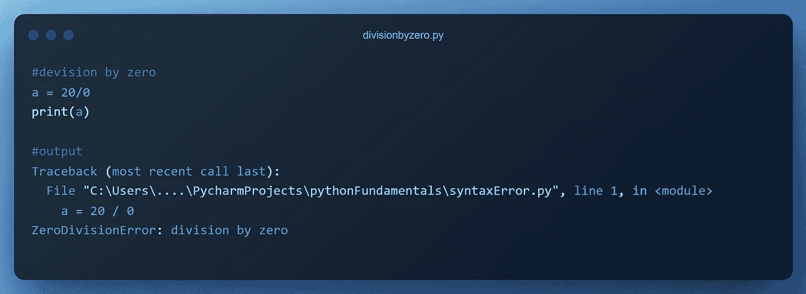
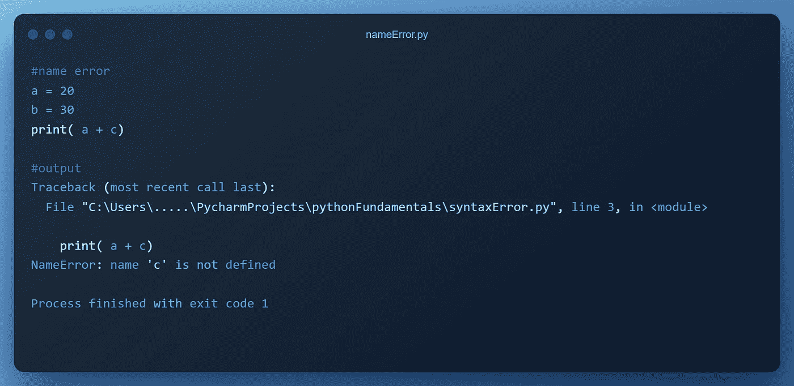
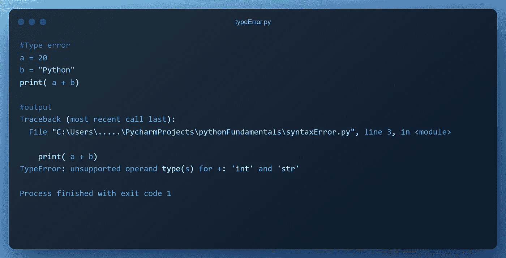
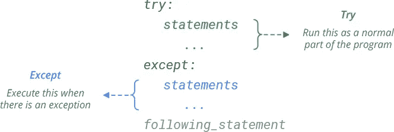
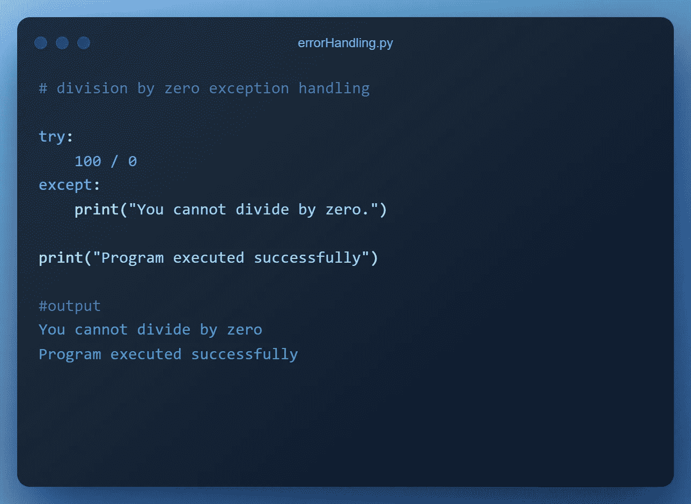
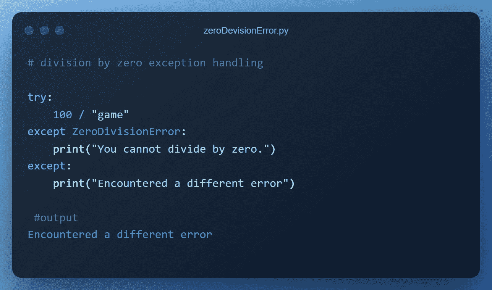
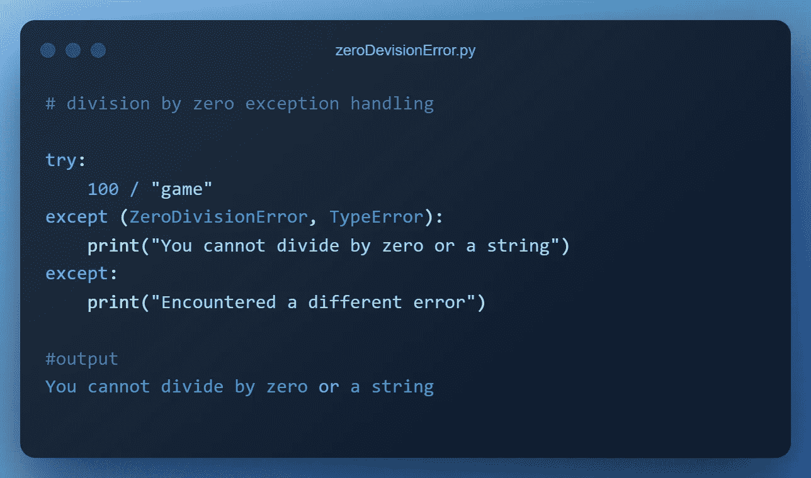
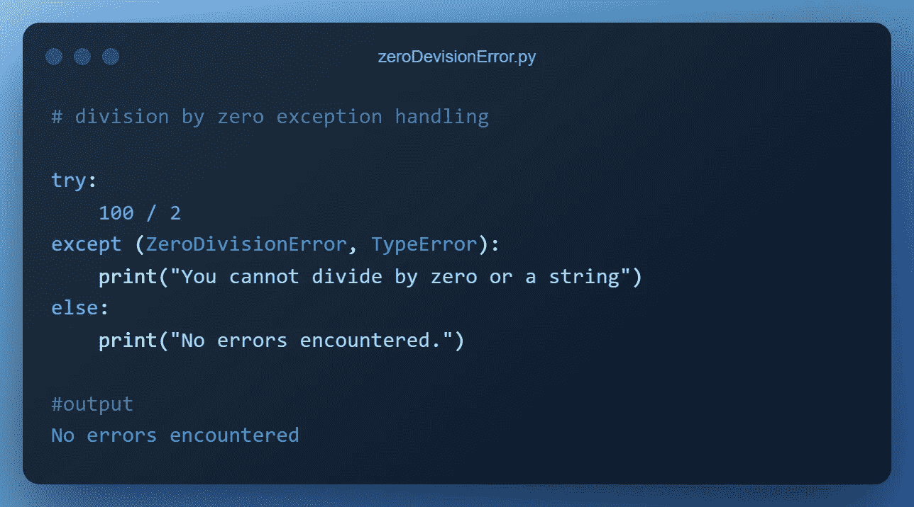
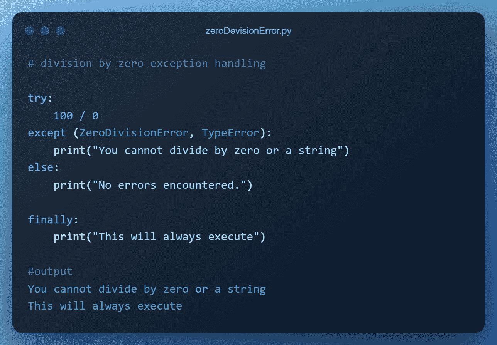

# Python 中的错误处理简介

> 原文：<https://blog.devgenius.io/introduction-error-handling-in-python-1dac7c026456?source=collection_archive---------12----------------------->

## 错误处理的深入介绍

## 介绍

如果你一直在用 Python 编程，你可能会遇到一些导致你的程序停止运行的错误。错误通常被称为 bug，调试是识别和纠正代码中错误的过程。Python 有两种类型的错误——语法错误和异常。本教程将向您介绍 Python 中两种不同的错误以及如何处理它们。您将学习识别和调试语法错误。您还将了解异常、 *try-except* 语句以及 *else* 和 *finally* 子句。


照片由 [Cookie 在](https://unsplash.com/@cookiethepom?utm_source=unsplash&utm_medium=referral&utm_content=creditCopyText) [Unsplash](https://unsplash.com/s/photos/error?utm_source=unsplash&utm_medium=referral&utm_content=creditCopyText) 上的 Pom 拍摄

## 语法错误

也被称为*解析错误*，语法错误是您在使用 Python 时会遇到的最常见的一种错误。当您没有使用 Python 语言的正确结构时，就会出现这种情况。换句话说，语法错误是由代码中的错误引起的。常见的语法错误包括:

*   不正确的缩进，
*   忘记了 if 语句中的冒号，
*   忘记了右括号，
*   拼错一个关键词，以及
*   将关键字放在错误的位置。

我们来看几个例子。在你最喜欢的代码编辑器中尝试它们，看看你是否能修复它们。

```
# 1\. syntax error in print statement 
print("Hello world!) **#output** 
 print("Hello world!)
          ^
SyntaxError: unterminated string literal (detected at line 2)
```

在上面的代码中，你会注意到我们忘记了右引号，导致了语法错误。让我们再看一个例子。

```
num = 0
if num < 3
    print("Number is less than 3.")
else:
    print("Number is greater than 3.") **#output
** File "C:\Users\....\PycharmProjects\pythonFundamentals\syntaxError.py", line 3
    if num < 3
              ^
SyntaxError: expected ':'
```

在上面的代码中，我们“不小心”在 if 语句中省略了一个冒号，导致了一个错误。

正如您在上面的例子中看到的，语法错误相对容易修复。Python 会告诉你是什么导致了错误，并给出错误发生的行号。这使得解决语法错误变得很容易，通过更多的 Python 编程实践，您将会提高这一技能。

## 例外

第二种错误是运行时错误*。在这种情况下，程序的语法是正确的，但是在其中一个语句的执行过程中出现了错误，导致解释器停止执行程序。异常在程序被解析时不会被检测到，只有在运行时导致程序停止时才会被检测到。当 python 程序引发异常时，会创建一个异常对象。如果您的代码不处理此异常，您的程序将会停止。*

*有各种类型的异常和 python，包括以下常见示例:*

1.  ***除以零***

*当分母为零时，也就是当你试图将一个数除以零时，就会出现这种情况。*

```
*#devision by zero 
a = 20/0 
print(a)*
```

**

*除以零误差示例*

***2。名称错误***

*当您拼错变量名或试图在声明变量之前使用它时，会出现此错误。*

```
*#Name error 
a = 20
b = 30
print( a + c)*
```

**

*名称错误示例*

***3。类型错误***

*当对错误的数据类型执行算术运算时，会出现这种情况。*

```
*#type error 
a = 20
b = "Python"
print( a + b)*
```

**

*类型错误示例*

*Python 有几个内置的异常，你可以在这里查看。*

## *处理异常*

*我们可以使用 Python 中的 try-except 块来捕获和处理异常。这遵循以下逻辑:*

```
*try:
   run this code 
except:
   run this code if there is an exeption* 
```

**

*尝试和 except 块语法。来源[以身作则](https://www.learnbyexample.org/python-exceptions-try-except/)*

*作为程序的正常部分，try 块在 except 块之前执行。但是，如果在执行过程中出现错误，将跳过块的其余部分，Python 将执行 except 块。简而言之，except 代码定义了如何处理异常。异常处理的一个简单例子是用户试图被零除的情况。让我们使用 try 和 except 块修改前面的代码。*

```
*# division by zero exception handling

try:
    100 / 0
except:
    print("You cannot divide by zero.")

print("Program executed successfully")*
```

**

*被零除错误处理示例*

*请注意程序是如何继续运行并打印“程序执行成功”消息的，即使它遇到了被零除的错误。这是因为我们用 except 块处理了异常，防止程序崩溃。*

*即使我们捕获了被零除的异常，我们当前的代码也会为所有其他异常打印相同的消息。例如，尝试将零改为字符串，看看会发生什么。Python 允许您定义尽可能多的异常，并在 except 语句中指定它们。这与我们之前捕捉所有异常的代码形成了对比。让我们修改代码来指定我们想要捕捉的错误类型。*

```
*# division by zero exception handling

try:
    100 / "game"
except ZeroDivisionError:
    print("You cannot divide by zero.")
except:
    print("Encountered a different error")*
```

**

*在上面的代码中，第二个异常处理其他类型的错误，包括因试图用字符串进行除法运算而导致的 TypeError。通过在 except 块中将多个异常指定为元组，也可以为多个异常执行相同的代码块。*

```
*# division by zero exception handling

try:
    100 / "game"
except (ZeroDivisionError, TypeError):
    print("You cannot divide by zero or a string")
except:
    print("Encountered a different error")*
```

**

*多个异常处理示例*

## *Else 和 finally 子句*

*try 和 except 块有两个可选子句，即 else 和 finally 子句。只有在没有引发异常时，才会执行 else 子句。如果存在异常，它不会执行。让我们试一试，看看效果如何。*

```
*# division by zero exception handling

try:
    100 / 2
except (ZeroDivisionError, TypeError):
    print("You cannot divide by zero or a string")
else:
    print("No errors encountered.")*
```

**

*最后，我们可以使用可选的 Finally 子句(没有双关的意思),无论异常是否发生，该子句都会被执行。*

```
*# division by zero exception handling

try:
    100 / 0
except (ZeroDivisionError, TypeError):
    print("You cannot divide by zero or a string")
else:
    print("No errors encountered.")

finally:
    print("This will always execute")*
```

**

*finally 子句通常用于执行清理操作，不管在什么情况下都应该执行这些操作。例子包括清理一些资源或关闭一个文件。*

## *总结一下*

*我们现在已经结束了关于处理 python 错误的介绍性教程。在本教程中，您了解了语法错误以及如何纠正它们。您还了解了异常以及它们与语法错误的区别。最后，您学习了如何使用 try-except 块来处理 python 中的错误。我希望你发现教程内容丰富，并将继续练习和提高你的 python 技能。*