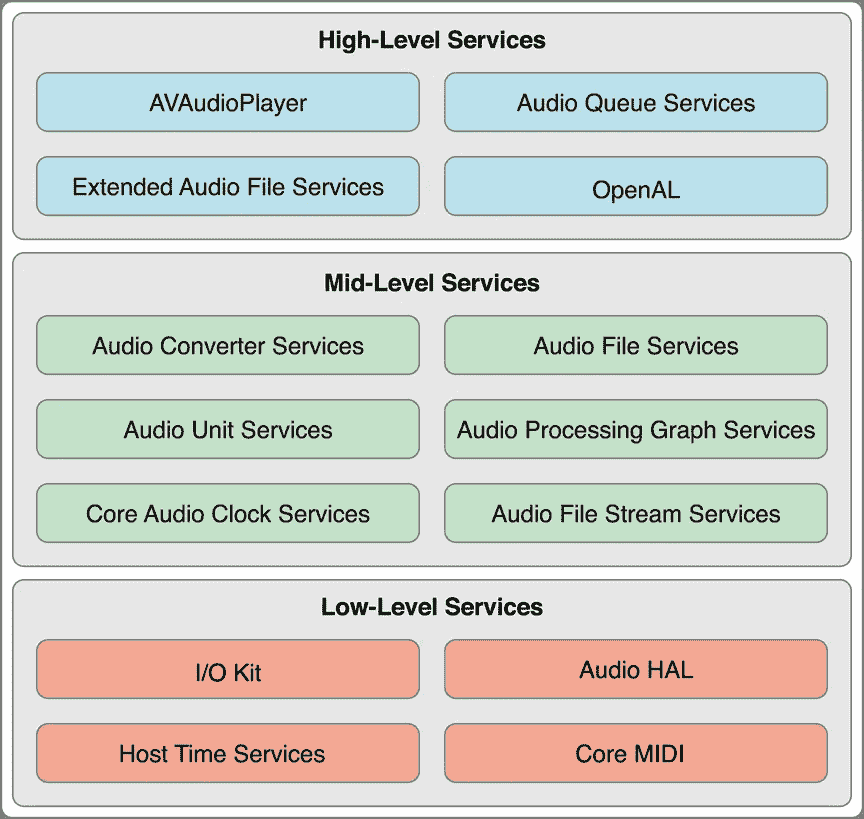
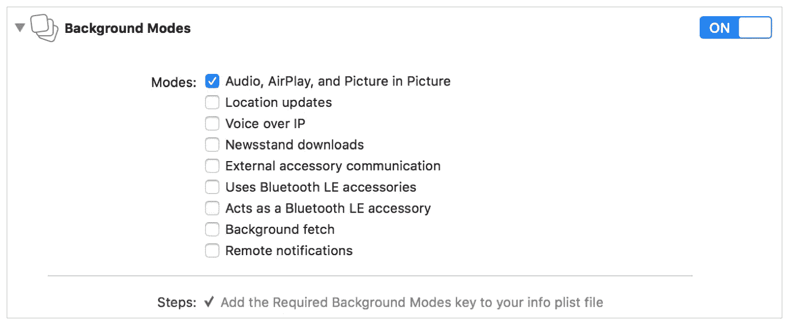

# iOS 核心音频简介

> 原文：<https://blog.devgenius.io/introduction-into-ios-core-audio-1ec9ea15c47c?source=collection_archive---------1----------------------->


照片由 [C D-X](https://unsplash.com/@cdx2?utm_source=medium&utm_medium=referral) 在 [Unsplash](https://unsplash.com?utm_source=medium&utm_medium=referral) 上拍摄

在开始播放、流式播放、录制声音或配置您的应用和操作系统应如何响应中断之前，我们需要先了解一下核心音频和音频的一些定义，以便全面了解情况。在接下来的部分中，我们将更详细地讨论启动和运行。

# 什么是核心音频？

Core Audio 是 iOS 和 OS X 的数字音频基础设施。它包括一套软件框架，旨在处理应用程序中的音频需求，并针对电池供电的移动平台中的计算资源进行了优化。

Core Audio 使用代理对象的概念来表示文件、流、音频播放器等等。例如，当您希望您的应用程序处理磁盘上的音频文件时，第一步是实例化一个类型为`[AudioFileID](https://developer.apple.com/documentation/audiotoolbox/audiofileid)`的音频文件对象，该对象被声明为不透明数据。

```
typealias AudioFileID = OpaquePointer
```

通过调用`[AudioFileCreateWithURL](https://developer.apple.com/documentation/audiotoolbox/1502333-audiofilecreatewithurl)`函数，实例化一个音频文件对象并创建一个与该对象相关的实际音频文件。该函数为您提供了对新音频文件对象的引用。

苹果公司使用分层、合作、以任务为中心的方法设计了 Core Audio 的软件界面，分为三层:



[https://developer . apple . com/library/archive/documentation/music audio/Conceptual/core audio overview/Art/core _ audio _ layers _ 2x . png](https://developer.apple.com/library/archive/documentation/MusicAudio/Conceptual/CoreAudioOverview/Art/core_audio_layers_2x.png)

**低层服务层:**

*   与司机互动的 `I/O Kit`。
*   音频硬件抽象层(`audio HAL`)，提供独立于设备、独立于驱动程序的硬件接口。
*   `Core MIDI`它提供了处理 MIDI(乐器数字接口)流和设备的软件抽象。
*   `Host Time Services`提供对计算机时钟的访问。

**中层服务层:**

*   服务让应用程序与音频数据格式转换器一起工作。
*   `Audio File Services`支持从基于磁盘的文件中读取和写入音频数据。
*   `Audio Unit Services`和`Audio Processing Graph Services`让应用程序与数字信号处理(DSP)插件一起工作，如均衡器和混音器。
*   `Audio File Stream Services`支持构建可以解析流的应用程序，比如播放通过网络连接传输的文件。
*   `Core Audio Clock Services`支持音频和 MIDI 同步以及时基转换。
*   `Audio Format Services`协助管理应用程序中的音频数据格式。

**高层服务层:**

*   `Audio Queue Services`允许您录制、播放、暂停、循环播放和同步音频。
*   `AVAudioPlayer`支持播放和循环音频，以及实现倒带和快进。
*   `Extended Audio File Services`结合了音频文件服务和音频转换器服务的功能。它给你一个统一的界面来读写未压缩和压缩的声音文件。
*   `OpenAL`是用于定位音频的开源 OpenAL 标准的核心音频实现。它最适合游戏开发。

# 我们可以使用哪些可用的框架？

有许多我们可以使用的音频框架，这里有一个简短的介绍。在接下来的部分中，我们将更详细地讨论每一个组件的启动和运行。

*   `AVFoundation.framework`为音频回放提供了`AVAudioPlayer`类，也为更复杂的音频处理提供了`AVAudioEngine`类。
*   `AudioToolbox.framework`:在设备环境中管理音频会话和应用音频的行为。
*   `AudioUnit.framework`:让您的应用程序使用音频插件，包括音频单元和编解码器。
*   `CoreAudio.framework`提供跨核心音频使用的数据类型以及低层服务的接口。
*   `OpenAL.framework`提供与 OpenAL 协同工作的接口，更适合游戏开发。
*   `CoreAudioKit.framework`为音频单元**(iOS 中没有)**提供一个创建用户界面的小 API。
*   `CoreMIDI.framework`让应用程序处理 MIDI 数据并配置 MIDI 网络**(iOS 中不可用)**。
*   `CoreMIDIServer.framework`让 MIDI 驱动程序与 OS X MIDI 服务器**(在 iOS 中不可用)**。

# 音频数据格式

您不需要详细了解音频数据格式，这样一组代码就可以处理操作系统支持的任何格式。音频数据格式描述音频数据，如采样率、位深度、格式标志或音频数据包中的帧数。

一些音频文件格式可以只包含一种音频数据格式，例如，MP3 文件可以只包含 MP3 音频数据。其他文件格式，如 Apple 的 CAF 格式，可以包含各种音频数据格式。你可以找到更多关于`[AudioStreamBasicDescription](https://developer.apple.com/documentation/coreaudiotypes/audiostreambasicdescription)`的细节

# 神奇饼干

指**音频**文件头中包含的信息，用于描述数据格式。元数据为解码器提供了正确解压缩文件或流所需的细节。当转换音频数据时，您必须检查您试图转换的音频数据的格式是否有魔法 cookie。如果音频数据格式有一个与之关联的魔法 cookie，您必须将此信息添加到正在使用的音频转换器的实例中。这是通过使用`AudioConverterSetProperty` API 以及`kAudioConverterDecompressionMagicCookie`属性和神奇的 cookie 数据 blob 来完成的。

# 音频数据包

它是一个或多个帧的集合。它是最小的有意义的，因此它是表示音频文件中时间单位的最佳音频数据单位。您可以使用数据包来计算有用的音频数据缓冲区大小。为了通过网络进行音频通信，音频分组从发送端发送到网络，接收端拾取音频分组并整合细分的数字信号，以将其变回模拟信号，从而能够听到原始音频。

# 数据格式转换

要将音频数据从一种格式转换为另一种格式，可以使用音频转换器。您可以进行简单的转换，如改变采样速率或交错/去交错。您还可以执行复杂的转换，如压缩或解压缩音频。

有三种类型的转换可用:

*   将音频格式解码为线性 PCM 格式。
*   将线性 PCM 数据转换为不同的音频格式。
*   在线性 PCM 的不同变体之间转换

# 同时播放多种声音

若要同时播放多个声音，请为每个声音创建一个播放音频队列对象。对于每个音频队列，使用`AudioQueueEnqueueBufferWithParameters`功能安排第一个音频缓冲区同时启动。

在 iPhone 或 iPod touch 上同时播放声音时，音频格式至关重要。这是因为 iOS 中某些压缩格式的回放采用了高效的硬件编解码器。一次只能在设备上播放以下格式之一的一个实例:

*   加气混凝土
*   ALAC
*   MP3 文件

要播放高质量的同步声音，请使用线性 PCM 或 IMA4 音频。

# 音频队列服务

音频队列服务提供了一种简单、低开销的方式来录制和播放音频。它允许您的应用程序在不了解硬件接口的情况下使用硬件录音和回放设备(如麦克风和扬声器)。它还允许您在不了解编解码器工作原理的情况下使用复杂的编解码器。

您可以使用它来同步多个音频队列的回放，同时播放声音，独立控制多个声音的回放音量，以及执行循环。

# 系统声音:警报和声音效果

在不需要电平、定位、音频会话或其他控制时播放简短的声音文件。当你只想以最简单的方式播放一小段声音时，可以使用系统声音服务，它是在音频工具箱框架中声明的。在 iOS 中，使用系统声音服务播放的声音被限制为最长 30 秒。

在 iOS 中，你调用`AudioServicesPlaySystemSound`函数来立即播放你指定的音效文件。或者，当你需要提醒用户时，你可以调用`AudioServicesPlayAlertSound`。如果用户设置了静音开关，这些功能中的每一项都会在 iPhone 上引发振动。

# 数字音频和线性 PCM

大多数核心音频服务使用和处理线性脉冲编码调制(*线性 PCM* )格式的音频，这是最常见的未压缩数字音频数据格式。数字音频录制通过定期测量模拟音频信号的幅度(*采样率*)并将每个样本转换为数值来创建 PCM 数据。

*标准压缩光盘(CD)音频使用 44.1 kHz 的采样率，用 16 位整数描述构成分辨率或位深度的每个样本。*

*   `*sample*`是单通道的单个数值。
*   一个`*frame*`是时间重合样本的集合。例如，立体声文件每帧有两个样本，一个用于左声道，一个用于右声道。
*   `*packet*`是一个或多个连续帧的集合。在线性 PCM 音频中，数据包总是一个帧。在压缩格式中，它通常更大。

*标准 CD 音频中的 16 位整数样本允许静音和最大音量之间的 65，536 个可能值。*

# 配置音频会话

音频会话是应用程序和操作系统之间的中介，用于配置应用程序的音频行为。启动时，您的应用程序会自动提供一个单独的音频会话。您可以对其进行配置，例如当响铃/静音开关翻转时，您的音频是否应该继续播放。

所有 iOS、tvOS 和 watchOS 应用程序都有一个默认的音频会话，其预配置如下:

*   支持音频播放，但不允许录音。
*   在 iOS 中，将响铃/静音开关设置为静音模式会使应用程序正在播放的任何音频静音。
*   在 iOS 中，当设备被锁定时，应用程序的音频会被静音。
*   当您的应用程序播放音频时，任何其他背景音频(如音乐应用程序正在播放的音频)都会被静音。

您可以通过设置类别对其进行自定义，以更好地满足您的应用需求。

# 启用背景音频

当您启用背景音频时，当用户切换到另一个应用程序或锁定他们的 iOS 设备时，您的应用程序的音频可以继续，为此，您需要在 Xcode 中选择您的应用程序的目标，然后选择“功能”标签。在“功能”标签下，将“背景模式”开关设定为“开”，并从可用模式列表中选择“音频、AirPlay 和画中画”选项。



希望你和我一样喜欢😃🎉如果是这样，请随意鼓掌😄与你的朋友分享，与人分享总是令人愉快的。在拥有真实代码示例的同时，请继续关注其他部分。