# 集装箱化世界介绍:码头工人

> 原文：<https://blog.devgenius.io/introduction-to-a-containerized-world-docker-tutorial-3d2119c2f2a6?source=collection_archive---------6----------------------->


# 码头工人是…

Docker 是一个执行操作系统级虚拟化的计算机程序，也称为“容器化”。

Docker 于 2013 年首次发布，截至 2018 年，占集装箱的 83%以上。Business Insider、Spotify、Yelp、易贝、Expedia、PayPal 等大公司都使用 Docker，还有更多公司正计划将现有基础设施迁移到容器中。自从发布以来，Docker 容器生态系统的势头非常强劲。

*为什么它如此受欢迎，为什么你应该使用它？到本文结束时，您应该已经有了这些问题的答案，并且对 Docker 有了很好的了解。我最近在 [Tech Together New York](https://newyork.techtogether.io/) 主持了一个介绍性的研讨会，涵盖了 Docker 的基础知识，从集装箱化的发展到 Docker 的基础知识和编排。我附上了下面的幻灯片和一些注释来揭开 Docker 前景的神秘面纱。*

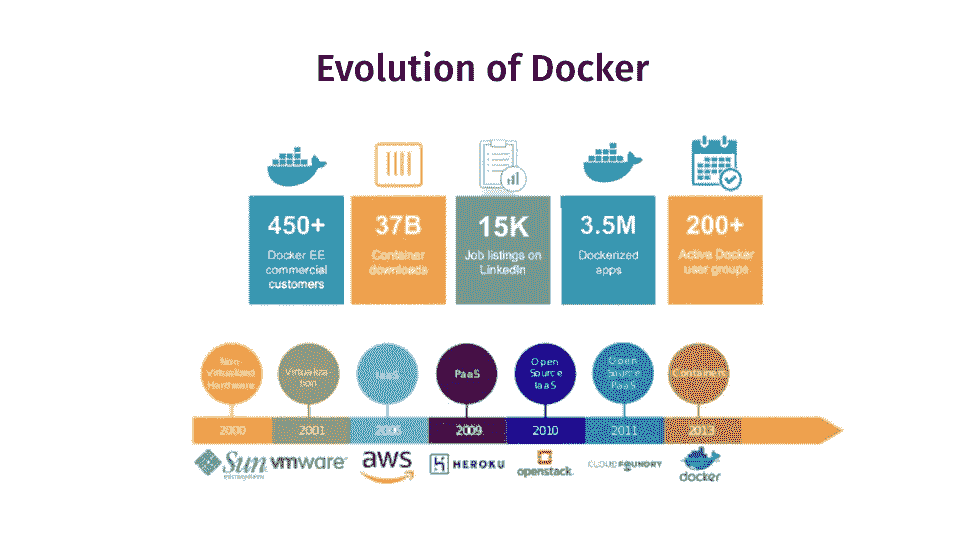

容器的主要概念是为运行在同一主机上的多个进程提供 ***隔离。***1979 年， **chroot** 被引入，用于将进程及其子进程的根目录更改到文件系统中的新位置。然而， *chroot* 在进程隔离方面并没有提供更多。几十年后，FreeBSD 通过操作系统级虚拟化增加了对进程隔离的支持。随后，Linux-VServer 提供了文件系统、网络地址和内存分区。

容器技术的黄金时代大约在 2013 年 Docker 被发现的时候到来。Docker 有一个易于使用的图形用户界面，能够在一个操作系统上运行多个具有不同操作系统要求的应用程序。由于这些非凡的品质，Docker 在发布一年内就获得了超过 1 亿的下载量。

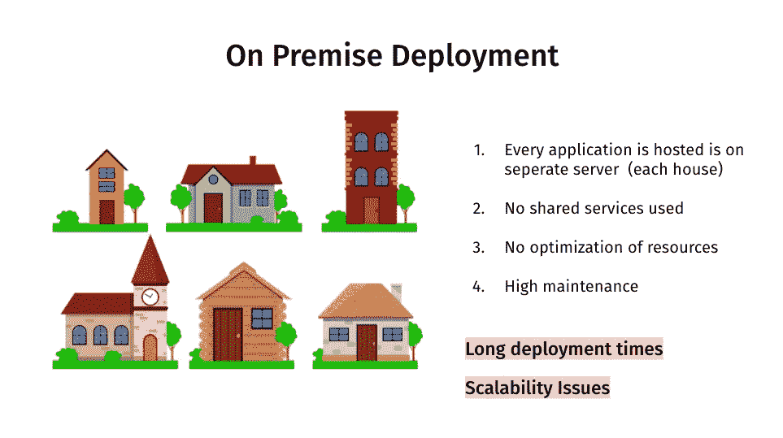

每个**房子**都是一个独立的应用程序，拥有自己的基础设施。他们有自己的供水、供电和所有其他公用设施。没有共享资源。内部部署的一些缺点是:

*   部署时间长
*   可扩展性问题

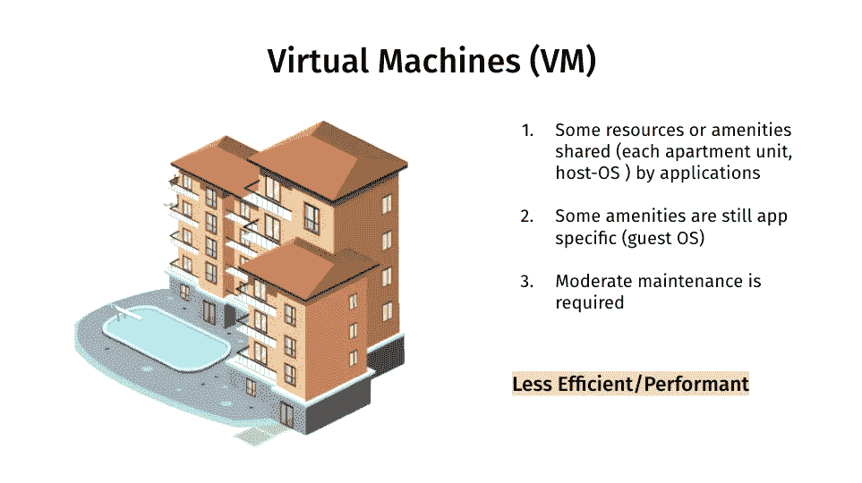

每个**公寓单元**拥有自己的基础设施；每个单元对于居住在那里的租户来说都是唯一的(每个虚拟机都有自己的客户操作系统)。一些资源如电和水可以在大楼内共享。由于每个单元都有一个运行在通用主机操作系统之上的不同客户操作系统，这增加了大量内存和存储空间开销，使其速度明显变慢。

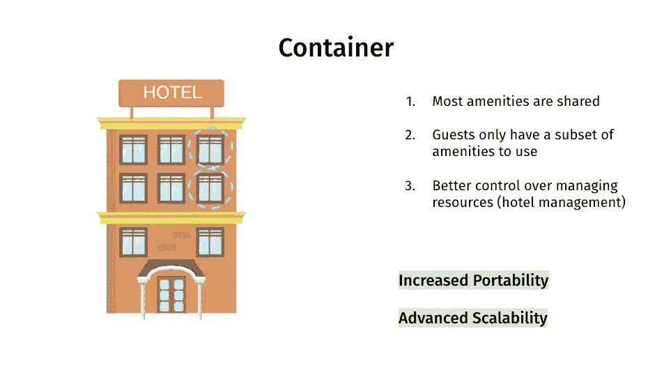

**酒店**围绕共享基础设施而建。每个人都共享相同的便利设施(管道、供暖、电力)，但每个客人只能使用有限的一部分便利设施。此外，公寓提供从工作室到多卧室的不同尺寸。

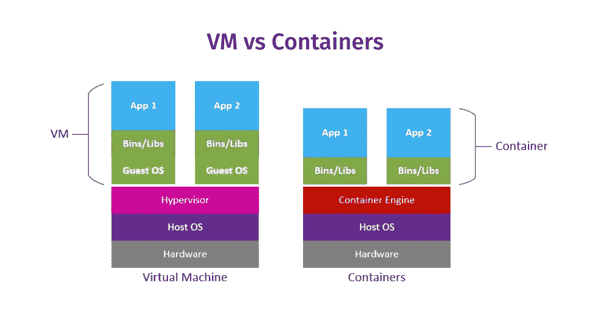

**容器**是操作系统的用户空间。Docker 是一种基于容器的技术。Docker 容器共享主机操作系统内核。**虚拟机**基于容器技术，它们主要由操作系统的内核空间和用户空间组成。在容器环境中，多个工作负载可以在一个操作系统上运行。它减少了 It 管理资源，加快了应用程序的运行，减少了需要传输的代码。但是，在虚拟机环境中，每个工作负载都需要一个完整的操作系统。

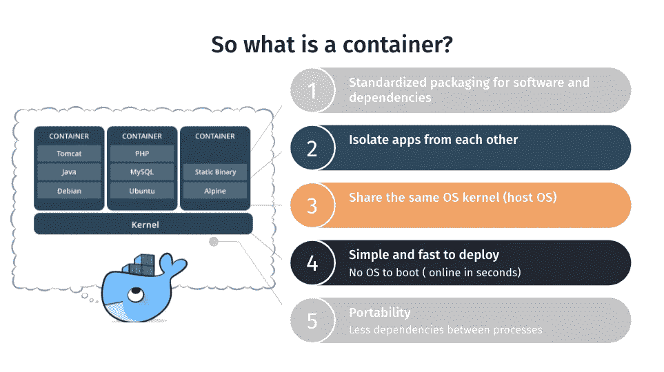

什么是容器？

**容器**是一个标准的软件单元，它封装了代码及其所有依赖项，允许开发人员将其应用程序与环境隔离开来，并具有以下属性:

*   极致便携性
*   快速启动
*   更容易扩展
*   高效率

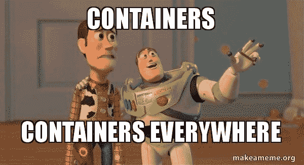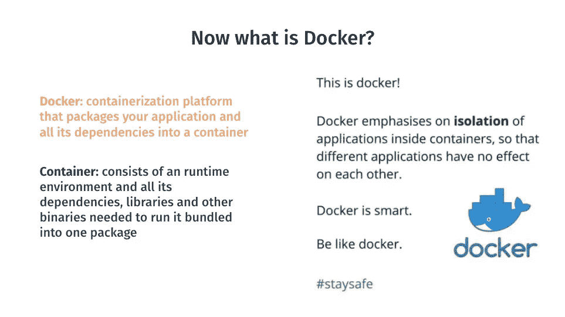

Docker 是什么？

Docker 是一个容器化平台，它允许你将应用程序和它们的依赖项打包到一个容器中，然后让你在任何地方运行它们。你使用什么样的技术并不重要。只要安装了 Docker，Docker 就知道怎么做了。

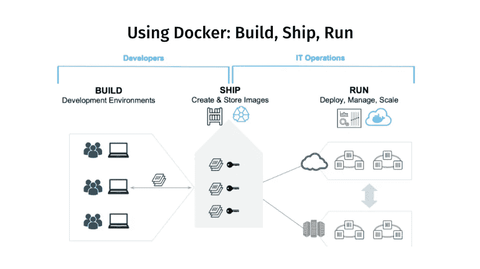

简单地说，码头工人

有了 Docker 镜像，人们就不必担心编程语言的运行时间和对本地机器的依赖性。它们被构建成一个 Docker 图像。Docker 图像是使用 docker 文件创建的。

一旦你有了 Docker 镜像，你就可以在 Ubuntu、macOS、Windows 或者任何安装了 Docker 的操作系统上运行这个应用。Docker 映像在线托管在注册表中(最常见的注册表是 Docker Hub)。同一个图像可能有多个版本，由它们的标签来标识。

**构建—** docker 允许您从微服务中构建您的应用程序，而不用担心环境的不一致性和依赖性

**Ship —** docker 使您能够轻松存储和分发 docker 图像

**运行—** docker 让您能够轻松可靠地部署和扩展服务

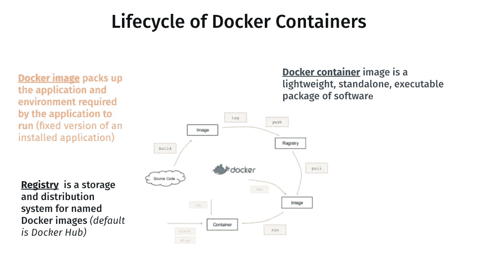

码头集装箱的生命周期

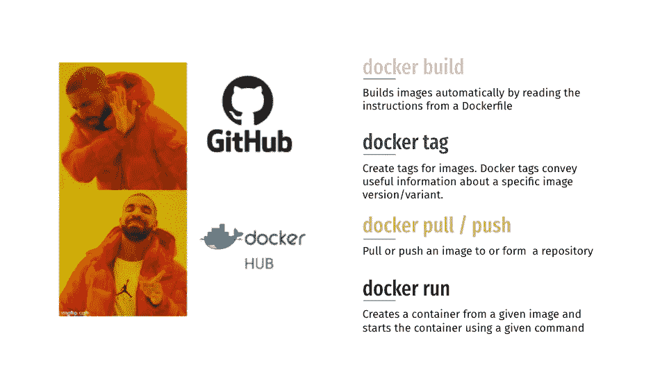

Docker 命令

Docker 命令行界面遵循这种模式:

```
docker <COMMAND>
```

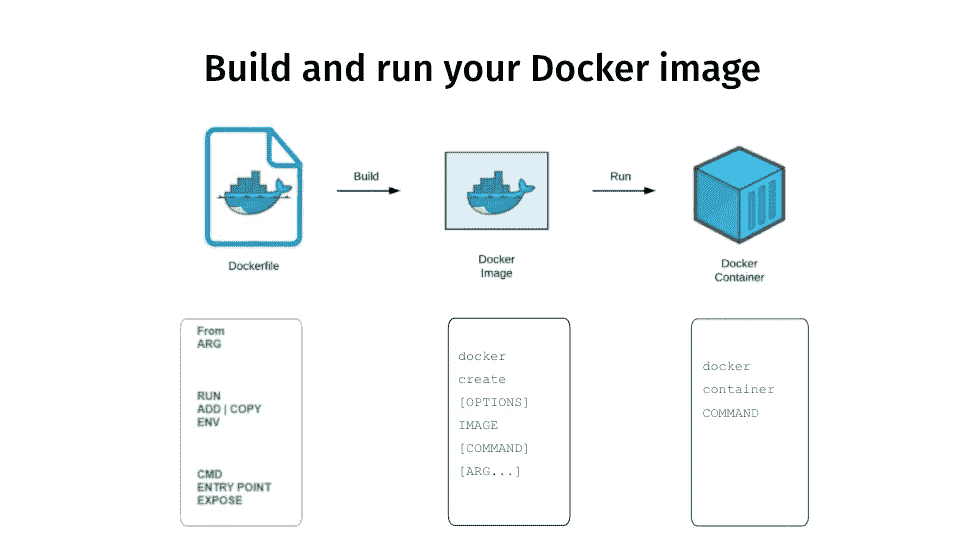

从 Docker 文件构建 Docker 映像

**Dockerfile** 是一个文本文档，包含用户可以在命令行调用的所有命令，以组合一个图像。

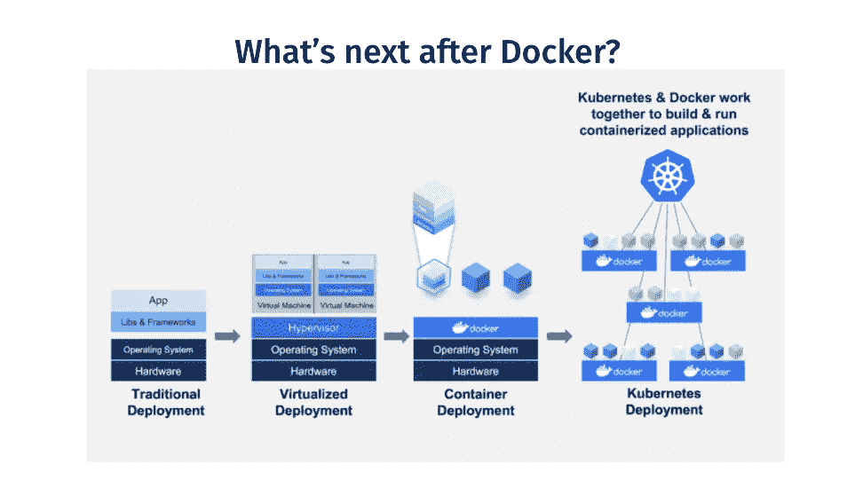

将 DevOps 实践与 Docker(容器)和 Kubernetes 相结合，进一步实现了微服务架构的基线，从而促进了云原生应用的可扩展和快速交付编排。换句话说，Kubernetes 自动化了缩放、管理、更新和移除容器的过程。

现在，你们都赶上了 Docker——建造、装运、运行！

和鲸鱼一起游泳愉快！🐳

—

资源:

*   [https://docker-curriculum.com/](https://docker-curriculum.com/)
*   https://www.docker.com/101-tutorial
*   【https://docs.docker.com/get-started/resources/ 