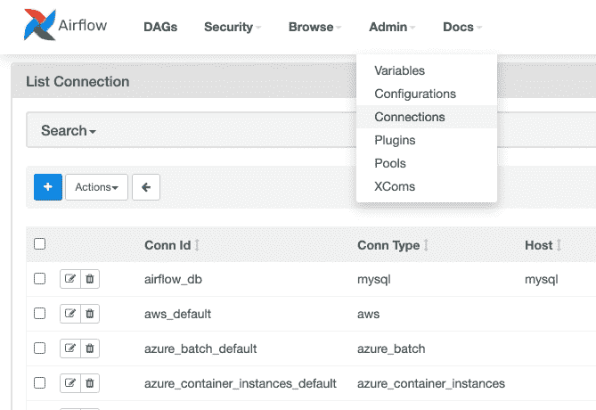
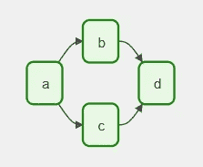
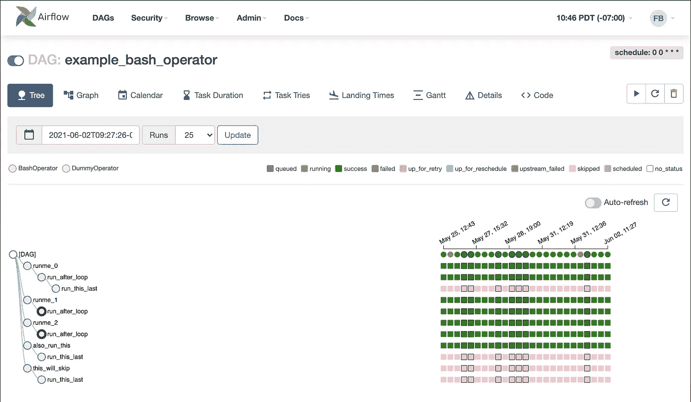

# 阿帕奇气流简介

> 原文：<https://blog.devgenius.io/introduction-to-apache-airflow-5398619364f2?source=collection_archive---------12----------------------->

## 自动化和计划工作流程的开源软件

假设您想要进行数据搜集以获得今天的汽油价格数据。作为一名程序员，您构建了一个简单的 python 脚本来完成这项工作。你运行脚本，然后，哒哒！你今天得到了汽油价格的数据。但是，你想明天再做一次。第二天也是。原来你需要每天都这样做。然后你需要在工作中做更复杂的事情。

然后你意识到一遍又一遍地做同样的事情似乎是多余的，而且扩展你的程序也是很难的——必须有一些简单的自动化和强大的工具来做到这一点。

## 救援气流

气流|凭证:气流凭证

[Airflow](https://airflow.apache.org/) ，正如[官方文档](https://airflow.apache.org/docs/apache-airflow/stable/index.html)所描述的，是一个开源平台，用于*编程*创作、调度和监控工作流。简单地说，这是你基本上可以做的:

1.  创建一组您希望机器执行的任务(工作流)
2.  安排它定期运行，例如:每天、每周、每月
3.  监控您的工作流程，确保其正常运行

Airflow 的优势在于，你可以做任何类型的工作流，包括执行 bash 脚本、python 脚本、查询 GCP 和 AWS 等数据库，或者做机器学习训练。是的…它可以是任何类型的工作流，只要你能把它编码！

气流是一个可靠的工具，它已经被大公司广泛使用，如 Twitter 和 Lyft。Twitter 使用气流来自动化他们的机器学习管道。Lyft 使用 Airflow 创建他们的批量 ETL(提取、转换和加载)数据管道，以便业务用户可以使用它来分析数据。这一切都是在实施气流的帮助下创造出来的。

气流接口|凭证:气流凭证

现在，让我们看看如何利用气流的基本功能。

## 创建您的工作流程

Airflow 将工作流定义为 DAG(有向无环图)。这是气流的核心概念，将你的任务集定义为一个图，这样你就可以设置它们如何相互依赖。例如，我们想运行任务" a ",在它完成后，它将运行" b "和" c ",在两者都完成后，它应该运行" d"。这是 DAG 的外观:

一个 DAG |信用:气流文件

Airflow 的美妙之处在于它将工作流定义为一种代码——一种 python 代码。这使得它们变得更易于维护、版本化、可测试和协作。它们也很简单，可读性很强。

您可以对工作流程进行大量的配置。例如，您可以配置当一些任务失败时要做什么，在它停止尝试之前应该重试多少次，或者甚至当您任务中有一些“如果”情况时进行分支。

## 安排您的工作流程

定义 DAG 后，Airflow 可以按时间周期(如每天、每周和每月)安排您的工作流程。您还可以使用字符串 cron 表达式进行更多的定制调度。然而，其中一个限制是，Airflow 目前没有针对分钟或小时周期的调度进行优化——要做到这一点，我们必须找到另一种支持*数据流*的工具。

在其他情况下，如果您想要在过去某个日期运行您的工作流，例如上周或上个月，您可以通过使用称为“回填”的气流功能来实现。例如，如果您需要为过去的数据运行 ETL 数据管道脚本，这将很有帮助。

## 监控您的工作流程

在创建和安排我们的工作流之后，您还可以在一个非常简单和直观的 UI 中监控您已经创建的 Dag。在 Airflow 的 web UI 中，您可以做很多事情，但其中最强大的一项是将 DAG 作为一棵树来监控。

在这里，我们可以看到我们的 DAG 如何运行。它显示哪个任务失败了，哪个任务成功了，以及 DAG 运行的日期之间的概述。这在我们工作流中的一个任务失败的情况下非常有用。我们可以确定哪个任务失败了，以及从哪里开始调试我们的工作流。

Airflow UI 将 DAG 定义为一棵树来监控任务|信用:Airflow 文档

Airflow 是一个强大的开源平台，可以自动执行一系列任务并对其进行监控。我们可以用气流做很多事情，因为它支持许多操作员运行我们的任务。它还易于维护和理解，因为它将工作流定义为 python 代码中的 DAG。对于自动化批量任务，气流可能是您的最佳选择之一。