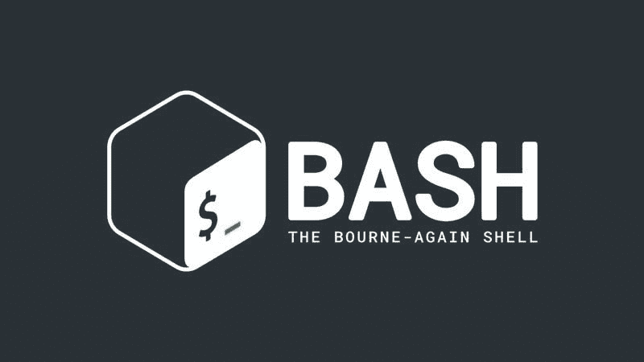
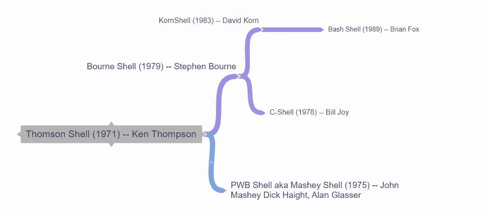
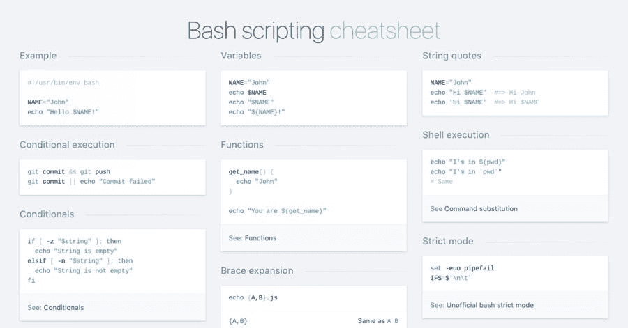

# Bash 系统管理和 Bug 赏金猎人简介

> 原文：<https://blog.devgenius.io/introduction-to-bash-for-system-administration-and-bug-bounty-hunting-6003e16dc87a?source=collection_archive---------1----------------------->

我的系列的建议入口点/先决条件:设计、开发和自动化一个分布式系统，该系统将适用于 Bug 赏金/漏洞披露程序



## Bash 到底是什么？

首先，我想做一个经常被忽视的区别:Bash 或“Bourne Again Shell”本质上是 Korn Shell、C-Shell，当然还有 Bourne Shell 的合并。此时，有必要知道 Bash Shell 的语法是由 AT & T 发布的 Bourne shell 语法的直接子集。Shell 本身是由 Brian Fox 开发的，并于 1989 年向公众发布。



不是最干净的，但也可以……(现代贝壳进化的图像)

任何使用过 Linux 的人都会告诉您，如果不使用 bash shell，您在大多数 Linux 发行版上都做不了什么。它实际上是您将用来与 Linux 内核交互的瑞士军刀。这是我作为安全研究员和漏洞猎人的职业生涯中遇到的最有用的工具。

除了作为机器和用户之间的中介之外，它还允许您编写称为“Bash 脚本”的脚本这些脚本允许您对与系统的交互进行编程，并且经常通过消除手动执行重复性任务的需要来节省您的时间。

有点像这个系列的目的是什么:*自动化*。

## **理解语法**

句法的词源可以追溯到希腊语单词 *suntaxix* ，来源于*sun-*' together '+*tassein*' arrange '。所以，它本质上意味着“安排在一起”作为一个 bug 赏金猎人，你将会做代码分析，并有希望编写自己的代码。所以理解语法很重要。

所有 Bash 命令的全局语法是:

```
command [options] [arguments] [optional file location]
```

简单…对吗？因此，让我们执行一个您经常会遇到的简单命令:

```
ls -al /etc 
```

这个命令显示/etc 目录的内容，这里要提到的重要一点是“a”和“l”被称为标志，它们代表一个命令可以执行的可选函数。我给你一个提示，告诉你-a 显示所有文件，即使它们是隐藏的。使用以下命令可以找到-l 标志的用法:

```
man ls 
```

这将提取手册页(如果存在)并将其打印到终端。注意:手册是你的朋友。这会让生活变得更容易。

其他一些基本的导航命令:

" pwd" =打印当前目录

“CD”=呼叫您希望呼叫的目录

" mkdir {folderName}" =创建文件夹

" mv { path/to/file } { new/file/path/file } " =移动文件

rm {file} =删除文件，不适用于文件夹。

rm -r {directory} =递归删除目录

这是一张备忘单:



**变量**

像任何其他语言一样，您可以分配变量，使用条件控制流程，并使用函数重用您的代码。如果你在这里读这篇文章，那么你显然很聪明，我也会这样对待你。

变量的赋值很简单，有几种不同的方法，我最喜欢的是:

```
variable1=potato 
```

**If 语句**

if 语句可以通过多种方式构建:

基于文件:

```
if [ -L symboliclink ]; then
```

基于字符串:

```
if [ -z "$emptystring" ]; then
```

基于整数:

```
if [ $num -lt 1 ]; then
```

## **结论**

我知道。有时候这些东西看起来有点混乱。但最终的结果是值得的。今天，我们可以通过构建文件结构化脚本，从自动化侦察平台的更大目标的一小部分开始:

```
!#/bin/bash/
#start by building directories
mkdir recon 
mkdir recon/HackerOne && mkdir recon/BugCrowd
mkdir recon/scripts
mkdir recon/tools 
mkdir recon/notes
cd recon/tools && mkdir gitHubTools
git clone [https://github.com/guelfoweb/knock](https://github.com/guelfoweb/knock)
git clone [https://github.com/danielmiessler/SecLists](https://github.com/danielmiessler/SecLists)
printf("Congratulations! Stay tuned for the next installment.")
```

看…其实一点也不难。我累了，所以我想我们将缩短这篇文章。

再来一次，拍手，跟我来，我跟着你回去！

谢谢，祝你黑客生涯愉快。

**资源**:

Unix 系统上发布的第一批书籍之一的 PDF:

[http://files . cat well . info/misc/mirror/the-UNIX-programming-environment-kernighan-pike . pdf](http://files.catwell.info/misc/mirror/the-unix-programming-environment-kernighan-pike.pdf)

**来源:**

> **维基百科文章:**
> 
> [https://en.wikipedia.org/wiki/Thompson_shell](https://en.wikipedia.org/wiki/Thompson_shell)
> 
> [https://en.wikipedia.org/wiki/C_shell](https://en.wikipedia.org/wiki/C_shell)
> 
> **Bourne Shell 编程&信息:**
> 
> ["https://www.ibm.com/docs/en/aix/7.1？topic = shell-bourne-shell](https://www.ibm.com/docs/en/aix/7.1?topic=shells-bourne-shell)
> 
> **C-Shell 编程:**
> 
> " http://www-cs . canis ius . edu/online stuff/UNIX/shell programming . html "