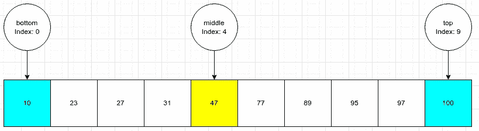
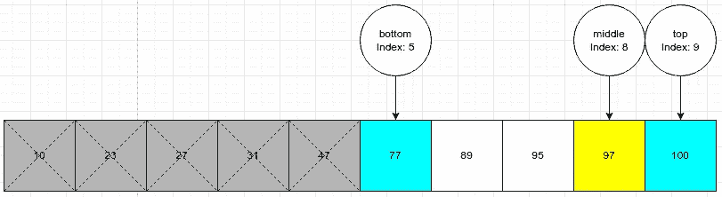
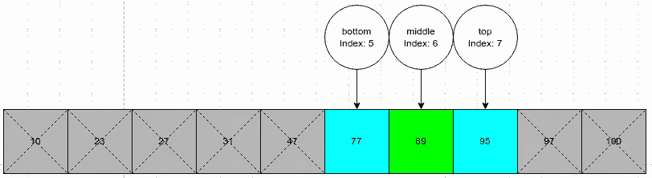

# 二分搜索法简介

> 原文：<https://blog.devgenius.io/introduction-to-binary-search-6c60304f42f7?source=collection_archive---------6----------------------->

假设你正在那些大电话簿中寻找一个名叫“文森特”的人。这些书可能有 100 页，以线性方式从头开始搜索每一页，直到找到那个人，这将是乏味的。幸运的是，这本书是按字母顺序排列的，所以我们可以使用 hack。

想象一下在中间打开书。你看着这一页，看到以“S”开头的名字。知道“V”在“S”之后，你把书撕成两半，把名字在“S”下面的那半本书扔掉。现在你只剩下一本更小的书要处理了。

接下来，你再把剩下的书打开一半。你看着你着陆的地方，看到以“X”开头的名字。你再把书撕成两半，把名字在“X”上面的那一半扔掉。

不断重复这个过程，很快你就会看到以“V”开头的页面。

这是**二分搜索法**的概念。二分搜索法是一种有效的算法，用于搜索按 T2 排序的数组或列表中的值。它是被称为 [*分治*](https://en.wikipedia.org/wiki/Divide-and-conquer_algorithm) 的一大类算法的一部分。这些类别的算法将一个复杂的问题分成更小的更容易解决的子问题。对二分搜索法来说，在解决方案的每个阶段，问题几乎每次都减半。

为了说明这个算法的过程，假设我们想在下面的有序数字数组中找到 89。图中的底部和顶部分别是保存开始和结束索引的变量。

我们首先使用底部和顶部变量计算中间值。中间值是 47，这不是我们想要的值。因为我们知道 47 < 89, we can eliminate the left half of the array (every value before and including 47). This is done by assigning the bottom variable to middle index + 1\. Our problem size has halved.

The process repeats again. We calculate the middle value to be 97\. Then we know that 97 > 89 和数组的右半部分可以通过将 top 变量设置为 middle index - 1 从搜索中消除。

我们再次重复这个过程。中间值计算为 89。我们看到 89 = 89，因此我们可以停止搜索并返回值或索引！

线性搜索需要我们走 7 步，但是二分搜索法只用了 3 步就找到了 89。对于较小的阵列，两种算法之间的计算时间可以忽略不计。然而，对于大型数据集——我们谈论的是数百万个值，[二分搜索法比线性搜索](https://www.khanacademy.org/computing/computer-science/algorithms/binary-search/a/running-time-of-binary-search)更有效。

# 伪代码

二分搜索法的步骤可以写成:

1.  创建一个名为“bottom”的变量，指向子数组的下限
2.  创建一个名为“top”的变量，指向子数组的上限
3.  创建一个名为“middle”的变量，指向子数组的中间
4.  当底部<= top, do the following:

*   Calculate the middle value
*   If middle value = target value, return the index
*   if middle value < target value, set bottom = middle + 1
*   If middle value >为目标值时，设定顶部=中间-1

5.数组中不存在目标值

[JS 中实现的一个例子](https://gist.github.com/xihai01/045cd00527f0ef7feebceca537d53f28)

# 视觉演示

这个小程序直观地展示了二分搜索法的想法。目标值是我们试图猜测的数字，用户的猜测是我们的二分搜索法算法中的中间值。

 [## React 应用

### 使用 create-react-app 创建的网站

xihai01.github.io](https://xihai01.github.io/binary-search/) 

GitHub 回购:

 [## GitHub -西海 01/二进制搜索:二分搜索法游戏

### 此时您不能执行该操作。您已使用另一个标签页或窗口登录。您已在另一个选项卡中注销，或者…

github.com](https://github.com/xihai01/binary-search)