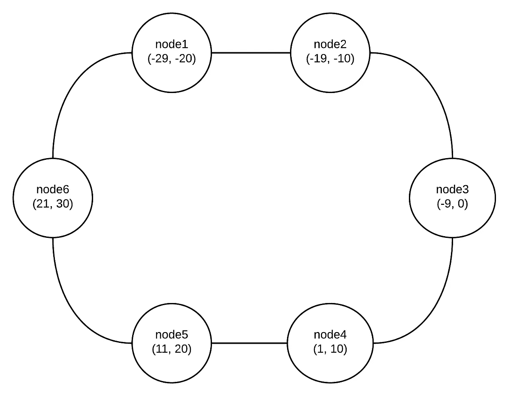
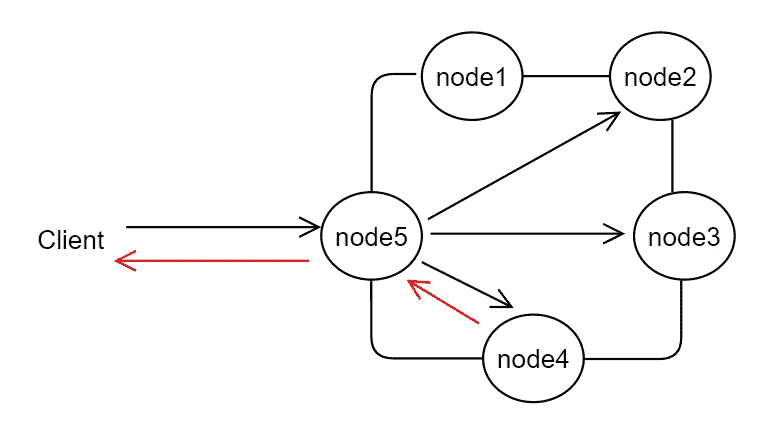
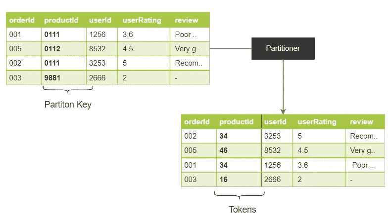
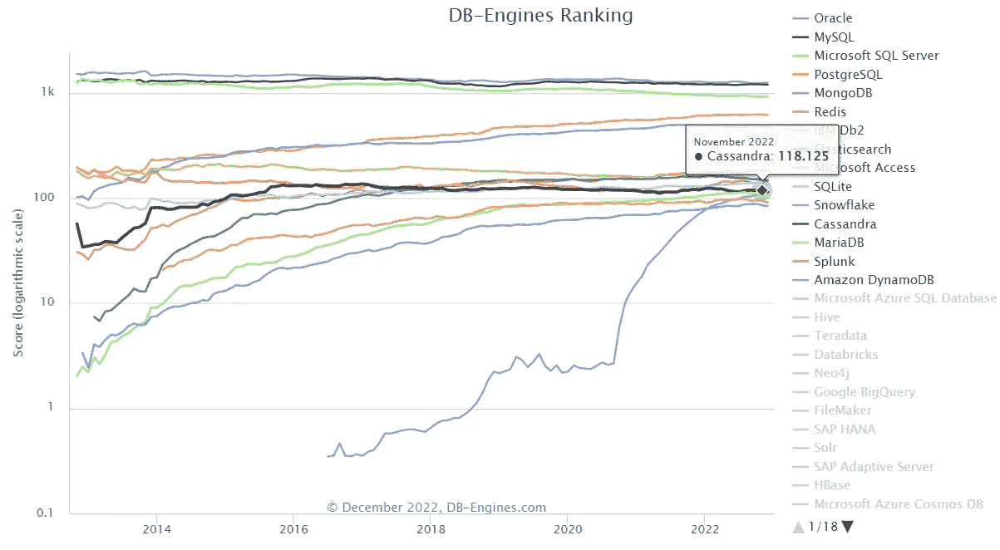

# Cassandra DB 简介

> 原文：<https://blog.devgenius.io/introduction-to-cassandra-db-b49729c5789d?source=collection_archive---------22----------------------->

Apache Cassandra，由脸书的 Avinash Lakshman 开发的 NoSQL 数据库，用于增强收件箱搜索。


Cassandra 是一个高性能和可靠的数据库，被一些大公司使用，如 Discord、网飞、Spotify、[等](https://cassandra.apache.org/_/case-studies.html)。Cassandra 的主要优势之一是，它可以跨商用服务器处理大量结构化数据，同时提供高数据可用性和无单点故障。与其他 NoSQL 数据库不同，Cassandra 以一种称为 [***宽列存储***](https://db-engines.com/en/article/Wide+Column+Stores) 的面向*列的*方式存储数据，这是一种 NoSQL 数据库，它将数据存储在*列*而不是*行*中。宽列存储通常用于需要快速访问大量数据的应用，例如*实时分析*和*互联网规模的应用*。

Cassandra 是一个分布式数据库，它在一个节点集群上均匀地存储数据。一个[分布式数据库](https://databasemanagement.fandom.com/wiki/Distributed_Database_Management_System_(DDBMS))是一个数据库，其中的存储设备并不都连接到一个公共的 CPU。它可以存储在位于同一物理位置的多台计算机中，或者存储在互连系统的网络上。

## 环形拓扑

一个 ***簇*** 在 Cassandra 架构中表示为一个 ***环*** 。下图显示了一个*环表示，*每个节点都有一个初始 ***令牌范围*** ，该范围决定了它在环中的位置以及它将存储的数据范围，每个节点都被分配了一个令牌，并负责从 ***前一个令牌(独占)到该节点的令牌(包含)*** 的令牌值。

如果你读到这里感到困惑，我不怪你。看看下图，有六个节点，每个节点存储的值范围从-29 到 30。节点 4 将存储值在 1-10 范围内的记录，1 除外。类似地，节点 6 拥有从 21 到 30 的值。



簇的环表示

## 八卦协议

Cassandra 使用一种名为 [*八卦*](https://docs.datastax.com/en/cassandra-oss/3.x/cassandra/architecture/archGossipAbout.html) *，*的协议，这是一种对等通信协议，其中节点定期交换关于它们自己和它们知道的其他节点的状态信息。这是在最多 3 个节点的情况下完成的，以避免网络过载，这也有助于检测[节点故障](https://docs.datastax.com/en/cassandra-oss/3.x/cassandra/architecture/archDataDistributeFailDetect.html)。



协调员和八卦协议

客户端可以连接到集群中的任何节点，因为 Cassandra 是一个对等网络。这使得所有节点都是平等的。连接的节点称为`coordinator`节点，它启动查询并识别哪些节点在该令牌范围内存储数据，并将查询转发给它们。在上图中，*客户端*向节点 5 *(协调器)*发出请求，节点 5*(协调器)*向三个节点发出请求，存储该散列值的节点将返回数据。**

## *分割*

*令牌是称为 ***分区器*** 的散列函数的结果，它使用 ***行/分区键*** 来确定哪个节点存储哪个数据。划分器使用两个哈希函数，称为***mur mur 3 partitioner***和***random partitioner***，将数据均匀分布在整个环中。*

*默认情况下，Cassandra 使用 ***Murmur3Partitioner。区分这些划分器的是它们的散列函数。***random partitioner***使用加密哈希函数和***mur 3 partitioner***使用非加密哈希函数**。**一般来说，加密哈希函数是非性能的，需要较长的时间。****

*让我们通过一个例子来更好地理解这一点。让我们创建一个表来存储产品的用户评论和评级。*

```
*CREATE TABLE product_reviews(
   orderId uuid(),
   productId uuid(), 
   userId uuid(),
   userRating float,
   review text,
   created_at timestamp  
   PRIMARY KEY ((productId), userRating));*
```

*上面的片段看起来很像 SQL，但它是 Cassandra 的一个略微修改的版本，叫做 CQL[***(Cassandra Query Langauge)***](https://cassandra.apache.org/doc/latest/cassandra/cql/)。拥有一种类似 SQL 的查询语言使事情变得更容易，但只是表面上的。为了充分利用宽列概念的优势，您仍然需要理解深刻而基本的差异。*

*对你来说最突出的事情是:*

1.  *`uuid()`是一个 [CQL 数据类型](https://docs.datastax.com/en/cql-oss/3.3/cql/cql_reference/cql_data_types_c.html#)，它生成一个随机的 4 型 UUID。*
2.  *`PRIMARY KEY()`，一般在 SQL 中你只有一个 PK，Cassandra 允许你有多个列作为复合或复合主键。位置决定它是什么类型的列。第一列是 ***分区/行键*** ，后面的列称为 ***聚簇键*** ，用于对分区中的数据进行排序。*

**

*对分区密钥进行哈希运算的分区程序*

*上面的图像显示了我们的`product_reviews`表。对分区键 *(productId)* 进行哈希运算，使用簇键 *(userRating)* 对表进行排序。*

## *分身术*

*Cassandra 促进了复制，以确保可靠性和容错性。复制策略决定放置副本的节点。Cassandra 在后台异步复制数据。*

*集群中副本的数量称为[复制因子](https://docs.datastax.com/en/cassandra-oss/3.0/cassandra/architecture/archDataDistributeReplication.html) *(RF)* 。本质上，这是根据设置的因子来存储集群中每一行的副本。也就是说，RF 为 1 将导致只有一个副本，类似地，RF 为 2 将存储每行的两个副本，其中每个副本位于不同的节点上。*

*所有的复制品都同样重要；没有主副本或主副本。一般来说，复制系数不应超过群集中的节点数。*

*因此，分区和复制使 Cassandra 成为一个高可用的数据存储库，具有 ***最终一致性*** 。*

## *一致性水平*

*以上段落中的*“最终一致性”*是什么意思？复制要求所有副本中的数据同步。这被称为数据一致性。最终一致意味着所有更新最终到达所有副本**。***

***默认情况下，Cassandra 将一致性设置为**1，**这表示，“嘿，如果您在一个副本节点上写/读，就足够了”。这个水平总体上是令人满意的和有成效的。一致性是[可调的](https://docs.datastax.com/en/cassandra-oss/3.0/cassandra/dml/dmlConfigConsistency.html)在 Cassandra 中，有不同的级别来提供不同级别的一致性和性能。***

## ***经验法则***

***在 Cassandra 中建模数据库时需要记住的一些经验法则；***

*   ***Cassandra 不应该像关系数据库那样建模。***
*   ***数据建模应该优先考虑查询，在 Cassandra 中，您只能使用主键进行查询，并且只能使用聚簇键进行范围搜索。***
*   ***Cassandra 不支持**连接**，也没有任何**参照完整性**。您可以在其他表中包含记录的外键，但它们必须通过客户端连接来访问。***
*   ***如上所述，没有连接，这意味着您必须**去规范化**您的表。***
*   ***最小化一次查询读取的分区数量。如 [gossip 协议](#d263)中的图像所示，协调器接收查询，然后将其转发到其他节点，当客户端发送查询以读取多个分区时，这可能是昂贵的，因为每个分区都在自己的不同节点中。对于您请求的每个分区，协调器需要向单独的节点发出单独的命令。这增加了开销并增加了延迟的变化。***
*   ***您的分区必须是均匀分布的，因此选择具有高基数的分区键来绕过热点，在这些热点中，一些节点处于高压力下，而其他节点处于空闲状态。***

***你可以在 Cassandra [这里](https://www.instaclustr.com/blog/cassandra-data-modeling/)阅读更多关于数据建模的内容。***

# ***结论***

***随着越来越多的语言支持和它在行业中的声誉，Cassandra 已经一路攀升。Cassandra 具有专为性能而设计的特性，它也可以在商用服务器上运行。它的竞争对手绝不逊色。到目前为止，顶级的 NoSQL 数据库，如 MongoDB、PostgreSQL 或 Redis 不仅很受欢迎，而且受到许多开发人员的喜爱。它们有很好的文档记录，提供了 NoSQL 数据库的所有优点，并且有出色的语言支持。***

******

***[2022 年 12 月 DB-发动机排名](https://db-engines.com/en/ranking_trend)***

***作为一名开发人员，我们关心的主要问题之一是数据存储和检索的性能，最终，一个应用程序的最佳数据库将取决于它的特定需求。***