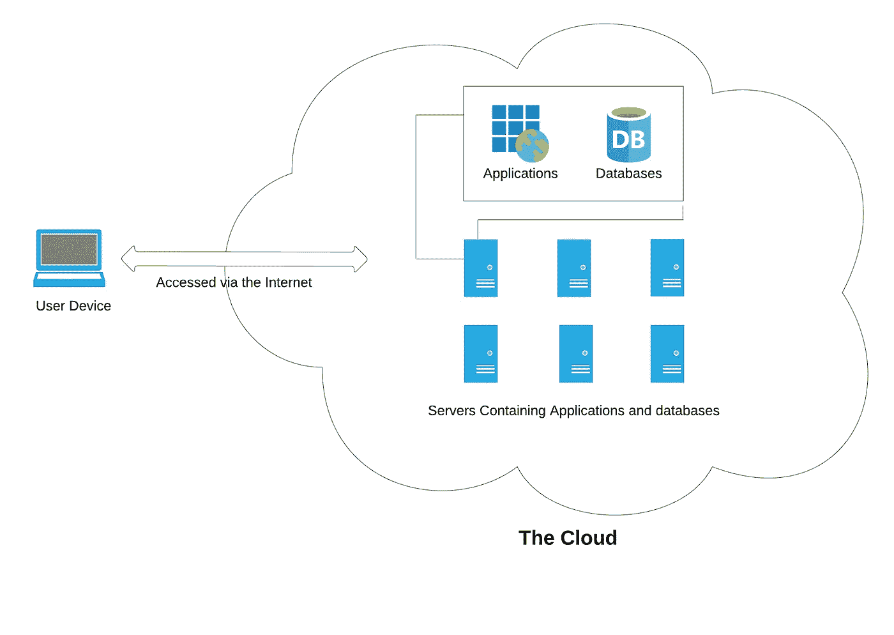
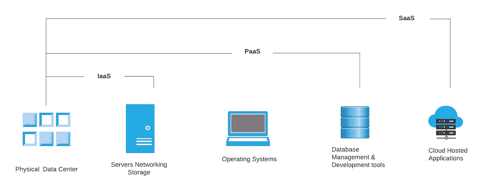
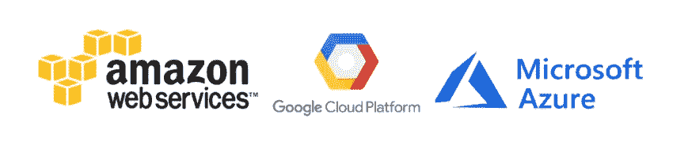
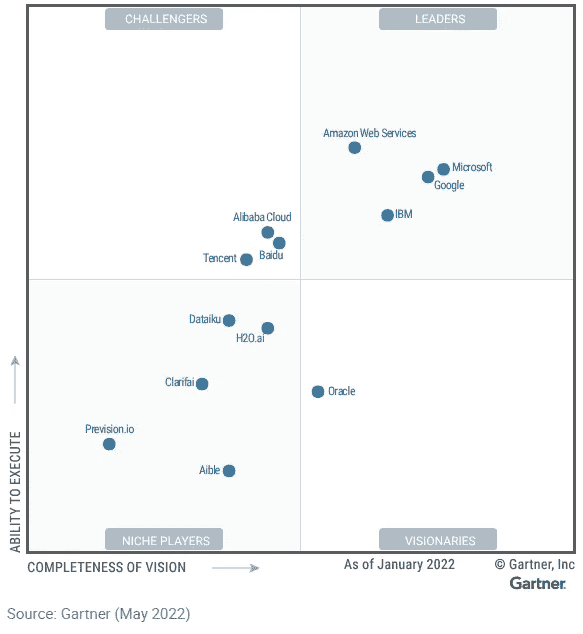

# 云计算简介

> 原文：<https://blog.devgenius.io/introduction-to-cloud-computing-f2ff10df8b69?source=collection_archive---------14----------------------->

**什么是云？**

> “云指的是通过互联网访问的服务器，以及在这些服务器上运行的软件和数据库。云服务器位于世界各地的数据中心。
> 
> 云使用户能够从几乎任何设备访问相同的文件和应用程序，因为计算和存储发生在数据中心的服务器上，而不是在用户设备上本地进行。这就是为什么用户可以在旧手机坏了之后在新手机上登录他们的 Instagram 帐户，但仍然可以找到他们的旧帐户，以及他们所有的照片、视频和对话历史。它与 Gmail 或 Microsoft Office 365 等云电子邮件提供商以及 Dropbox 或 Google Drive 等云存储提供商的工作方式相同。"

**什么是云计算？**

> “云计算是通过互联网按需交付 IT 资源，包括服务器、存储、数据库、网络、软件、分析和智能，以提供更快的创新、灵活的资源和规模经济。
> 
> 您通常只需为您使用的云服务付费，这有助于降低您的运营成本，更高效地运行您的基础架构，并随着业务需求的变化而扩展。您无需购买、拥有和维护物理数据中心和服务器，而是可以根据需要从云提供商那里获得技术服务。"

**云计算是如何工作的？**

> “云计算之所以成为可能，是因为一种叫做虚拟化的技术。虚拟化允许创建一个模拟的、纯数字的“虚拟”计算机，其行为就好像它是一台具有自己的硬件的物理计算机一样。这种计算机的技术术语是虚拟机。正确实施后，同一台主机上的虚拟机彼此隔离，因此它们根本不会相互交互，并且来自一台虚拟机的文件和应用程序对其他虚拟机不可见，即使它们位于同一台物理机上。
> 
> 虚拟机还能更有效地利用托管它们的硬件。通过同时运行多个虚拟机，一台服务器变成了多台服务器，一个数据中心变成了一整套数据中心，能够为许多组织提供服务。因此，与其他方式相比，云提供商可以同时向更多的客户提供使用他们服务器的服务，而且成本很低。
> 
> 即使个别服务器宕机，云服务器总体上也应该始终在线并且始终可用。云供应商通常在多台机器上跨多个地区备份他们的服务。"

**云计算的主要服务模式**

**软件即服务(SaaS)** :这是一种软件分发模式，由云提供商托管应用程序，并通过互联网提供给最终用户。用户不是在他们的设备上安装应用程序，而是通过互联网访问它们。SaaS 就像租房子:房东维护房子，但房客大多可以使用房子，就好像他们拥有房子一样。SaaS 应用程序的例子包括 Gmail、网飞和 Slack。

**平台即服务(PaaS)** :在这种模式中，PaaS 供应商通过互联网提供构建应用程序所需的一切，包括开发工具、基础设施和操作系统，而没有构建和维护通常与开发和启动应用程序相关的基础设施的复杂性。PaaS 可以比喻为租用建造房屋所需的所有工具和设备，而不是租用房屋本身。PaaS 的例子包括 Heroku、AWS 和微软 Azure。

**基础设施即服务(IaaS)** :这种模式按需提供基本的计算、存储和网络资源，按需付费。IaaS 就像一家公司租赁一块土地，他们可以在上面建造任何他们想要的东西，但是他们需要提供自己的建筑设备和材料。IaaS 提供商包括 DigitalOcean、谷歌计算引擎和 AWS、微软 Azure。

**功能即服务(FaaS)** : FaaS，也称为无服务器计算，将云应用程序分解成更小的组件，仅在需要时运行。它允许开发人员构建、计算、运行和管理作为功能的应用程序包，而不必维护他们自己的基础设施。想象一下，如果有可能一次租一点点房子:例如，房客只在吃饭时支付餐厅的费用，睡觉时支付卧室的费用，看电视时支付客厅的费用，当他们不使用这些房间时，他们不必支付租金。

FaaS 或无服务器应用程序仍然在服务器上运行，所有这些云计算模型也是如此。但是它们被称为“无服务器的”,因为它们不在专用的机器上运行，也因为开发应用程序的公司不需要管理任何服务器。

此外，随着越来越多的人使用该应用程序，无服务器功能会扩展或复制——想象一下，当更多的人来吃饭时，租户的餐厅可以按需扩展！

**不同类型的云部署**

与上面讨论的定义如何通过云提供服务的模型相反，这些不同的云部署类型与云服务器在哪里以及谁管理它们有关。

最常见的云部署有:

**私有云:**私有云是完全专用于一个组织的服务器、数据中心或分布式网络。

**公共云:**公共云是由外部供应商运行的服务，可能包括一个或多个数据中心中的服务器。与私有云不同，公共云由多个组织共享。使用虚拟机，不同的公司可以共享单独的服务器，这种情况称为“多租户”，因为多个租户在同一台服务器上租用服务器空间。

**混合云:**混合云部署结合了公共云和私有云，甚至可能包括内部部署的传统服务器。一个组织可能将他们的私有云用于某些服务，将他们的公共云用于其他服务，或者他们可能将公共云用作他们的私有云的备份。

**多云:**多云是一种涉及使用多个公共云的云部署类型。换句话说，一个拥有多云部署的组织从几个外部供应商那里租赁虚拟服务器和服务，继续上面使用的类比，这就像从不同的房东那里租赁几块相邻的土地。多云部署也可以是混合云，反之亦然。

**云计算优于内部部署的优势和劣势**

云的广泛采用导致许多供应商将重点从内部解决方案转移到云交付模式，从而引发了这样一个问题:“哪种模式最适合我的业务？”如果您想知道哪个选项更安全、更方便、更实惠，请研究一下这个方便的比较。

本质上，云软件与内部部署软件的根本区别在于它驻留在哪里。本地软件安装在您企业的计算机和服务器上，而云软件托管在供应商的服务器上，通过 web 浏览器访问。

**云计算的优势**

*   随时随地访问—您可以从任何设备通过 web 浏览器随时随地访问您的应用。
*   经济实惠—云不需要前期成本，相反，您需要定期支付费用，这使其成为运营支出(OpEx)。虽然每月成本会随着时间的推移而增加，但维护和支持服务已包括在内，因此不再需要签订年度合同。
*   可预测的成本—受益于可预测的每月付款，包括软件许可证、升级、支持和日常备份。
*   无忧 IT-由于云软件是为您托管的，您无需担心软件或硬件的维护，兼容性和升级由云服务提供商负责。
*   高级别的安全性-数据中心采用的安全措施超出了大多数企业的承受能力，因此您的数据在云中通常比在办公室的服务器上更安全。
*   快速部署–基于云的软件可在几小时/几天内通过互联网部署，因为相比之下，本地应用程序需要安装在物理服务器和每台 PC 或笔记本电脑上。
*   可扩展性—云技术提供了更大的灵活性，因为您只需为所使用的内容付费，并且可以轻松扩展以满足需求，例如添加和缩减许可证。
*   更低的能源成本-当您迁移到云时，您不再需要为本地服务器供电或维护其环境而付费。这大大减少了你支付的能源费用。

**云计算的弊端**

*   连接性—云解决方案需要可靠的互联网接入，以便您保持工作效率。
*   长期成本-虽然需要较低的前期投资，但云应用在系统生命周期中的成本可能会更高，从而增加总拥有成本(TCO)。
*   可定制性较差—云软件通常是可配置的，但根据托管方式的不同，云解决方案可能无法应对复杂的开发。

**云服务商领导，**

*感谢阅读！如果你喜欢你所读的，按住下面的* ***拍手按钮*** *，这样其他人可能会发现这一点，跟随将会非常感谢。这是我的* ***AWS 云*** ***精要*** *系列的第一篇文章。这只是对基本云概念的介绍，我们将在本课程的后面部分深入探讨每一个概念。*

更多信息请参考 [Cloudflare](https://www.cloudflare.com/en-gb/learning/cloud/what-is-the-cloud/) 。

第 2 条— [AWS 共担责任模式](https://medium.com/@jikaramit21/aws-shared-responsibility-model-17cdb482b325)