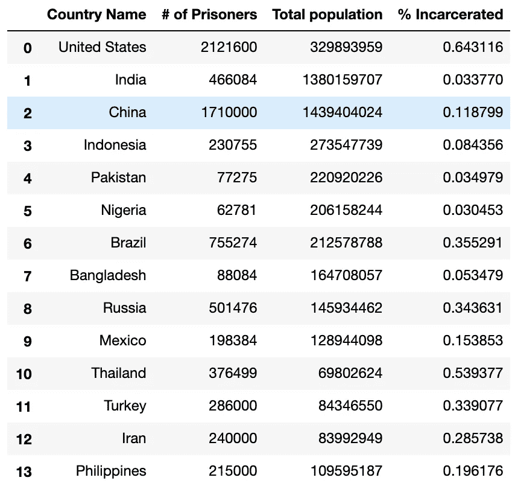

# 数据科学导论:全球监禁现象的简要分析

> 原文：<https://blog.devgenius.io/introduction-to-data-science-a-brief-analysis-of-incarceration-around-the-world-14a53d0ead31?source=collection_archive---------16----------------------->


卢克·切瑟在 [Unsplash](https://unsplash.com?utm_source=medium&utm_medium=referral) 上的照片

今天，我们将深入了解数据科学和相关领域的奇迹。数据科学的应用实际上是无止境的，大多数数据科学项目的主要目标是弄清楚变量之间的关系。今天主要关注的是围绕数据集分析的数据科学的基本途径。我将通过几个简单的步骤来指导您完成这一过程:

1.  **研究**你感兴趣的话题
2.  想出你想要答案的问题(并预测他们的答案)
3.  找一个**数据集**可以帮你回答这些问题
4.  **分析**数据集，以确认或拒绝您在步骤 2 中生成的假设。

我们将要研究的项目以监禁为中心。

# 1)什么是监禁？

如果你不熟悉这个问题，我可以给你一个非常简单的概述。谷歌对监禁的定义就是我们在这里开始的全部内容:

> 被监禁在监狱中的状态；监禁。

既然我们知道了被监禁对一个人意味着什么，我们就可以更详细地分析关于被监禁人群的数据。

*请注意，为了进行介绍性数据研究，这就是我们需要了解的全部内容。然而，为了更详细地观察任何事情，了解使问题突出、重要或有趣的细微差别是很重要的。*

# 2)我们想要答案的问题

为了这个项目，我们简单分析两个问题:

1.  哪些国家关押的被监禁人口最多？
2.  哪个国家的监禁人口比例最大？

我之所以选择这两个问题，是为了指出**标准**题和**相对**题的区别。要定义一个标准问题，我们可以看看我们选择的第一个问题。我们知道，人口多的国家往往会有更多的被监禁人口。虽然这个问题仍然有用，但在提供我们可以用来比较国家的信息方面用处不大。我们提出的第二个问题更具有相关性，因为我们已经去除了一个使第一个问题信息不太丰富的显著外部因素:我们现在已经考虑了国家之间的人口差异。完美。现在我们可以开始预测了。

这里有一些预测的例子(注意，证明你的预测是一个很好的实践…但是如果你真的不知道答案是什么，你可以随便猜一猜):

中国有最多的被监禁人口，因为它拥有最多的总人口。

*美国被监禁的人口比例高于任何其他国家被监禁的人口比例。*

# 3.创建/查找数据集

互联网是访问您可以在数据科学项目中使用的数据的最佳场所。考虑到我们提出的问题，我们的数据集需要具备以下指标:

1.  一个国家被监禁的人数
2.  国家总人口

请注意，如果我们知道这两个指标，我们实际上并不需要知道被监禁的总人口的百分比，因为我们可以从中推导出来。

我们可以在这里找到第一个度量[和第二个度量](https://www.prisonstudies.org/highest-to-lowest/prison-population-total?field_region_taxonomy_tid=All)[这里](https://www.worldometers.info/world-population/population-by-country/)。这样，我们可以创建如下所示的数据集:


你可能会问我为什么选择这些国家。我选择这些国家是基于之前对监禁的了解(这是我之前谈到的扩展研究)和我之前做出的假设，即人口越多的国家有被监禁人口越多的趋势。走上最后一步。

# 4)分析数据以回答我们的问题

我选择将上面的数据集保存为. csv(逗号分隔值)格式。还有许多其他常见的格式，但我个人更喜欢. csv。用于分析数据的一些最常见的语言是 Python 和 r。为了简单起见，在本教程中，我们将坚持使用 Python。有许多用于数据分析的标准库、包和工具，但最简单和最常用的是 Numpy、Pandas 和 Matplotlib。

首先，我们想要导入这些工具:

```
import numpy as np
import matplotlib.pyplot as plt
import pandas as pd
```

然后，我们希望创建一些函数，用于分析我们当前以数字形式存在的数据:

```
def read_and_preprocess(file_name, columns_to_drop, crucial_na_columns):
 df = pd.read_csv(file_name)
 df.dropna(subset = crucial_na_columns, inplace=True)
 df = df.drop(columns=columns_to_drop)
 return dfdef calculateIncarceratedPercent(df, country):
 df = df.loc[df[“Country Name”] == country];
 return df[“# of Prisoners”] / df[“Total population”]def plotColumn(df, column_name, title, xlabel, ylabel, filename):
 plt.style.use(‘ggplot’)
 x = df[“Country Name”]
 y = df[column_name]
 plt.bar(x, y)
 plt.title(title)
 plt.xlabel(xlabel)
 plt.ylabel(ylabel)
 plt.xticks(rotation=60)
 plt.savefig(filename, bbox_inches=’tight’)
```

我们现在有能力绘制我们想要绘制的数据。首先，我们需要认识到，为了回答我们的两个初步问题，我们当前的数据集需要修改。我们只需将监禁人口除以数据集中国家的总人口，即可生成一个新列，描述一个国家监禁人口的百分比。你可以这样做:

```
df = read_and_preprocess(“incarceration_data.csv”, [], [])df[“% Incarcerated”] = df[“# of Prisoners”] / df[“Total population”] * 100
```

现在，我们最终的数据集看起来像这样:



现在，我们可以简单地绘制所需的列来回答我们的问题，如下所示:

```
plotColumn(df, “# of Prisoners”, “# of Prisoners by Country”, “Country”, “# of Prisoners”, “priscount.png”)plotColumn(df, “% Incarcerated”, “% of Pop. Incarcerated by Country”, “Country”, “% of Pop. Incarcerated”, “pop%.png”)
```

输出应该如下所示:


现在是最后一步:回答问题。我们拒绝我们的第一个答案，因为我们可以清楚地看到，美国的监禁人口是最多的，尽管它不是人口最多的国家。然而，我们可以*宽松地*接受我们对第二个问题的假设，因为美国确实比上面列出的国家*监禁人口的比率更高(注意，为了得出完整的结论，我们将不得不绘制出不仅仅是人口最多的国家的图表)。然而，对于基线数据科学项目，这就是我们所需要的。*

# 结论

现在你知道了。您已经看到了就现实世界中的一些事情进行一个简洁的数据科学项目是什么样的。数据科学可以用于机器学习的应用，其中数据最终成为训练算法的主要模式。我希望你玩得开心！