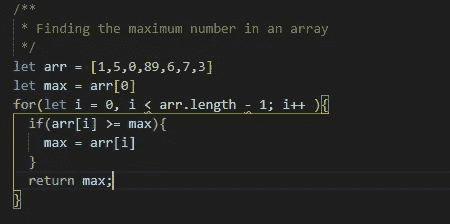
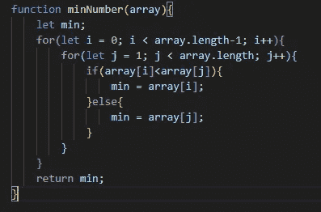

# 数据结构介绍

> 原文：<https://blog.devgenius.io/introduction-to-data-structures-462b550727f9?source=collection_archive---------3----------------------->

俗话说，“软件工程师所做的就是将数据从一个地方转移到另一个地方，从一个服务转移到另一个服务”。

> 数据结构是数据值、数据值之间的关系以及可应用于数据的功能或操作的集合
> 
> @维基百科(是，我知道)

不仅仅是软件工程师和数据科学家需要了解数据结构；你可能每天都在不知不觉中使用数据结构。如果你收到电子邮件并整理你的收件箱，恭喜你，你知道如何操作数据(结构)，除了当你过滤电子邮件时，你不关心幕后发生了什么。

在这篇长文中，我想向您介绍数据结构，并帮助您建立数据结构的基础，后续文章将更深入地探讨该主题。为了让一个点击我的 Whatsapp 状态链接的朋友认为我会谈论我对狗的爱，我会用通俗的语言解释概念，并希望他/她在关闭标签前了解一二。我会用不同的类比让你更容易理解，即使你对计算机科学不感兴趣。“这样想吧:我会试着向我妈妈解释这个话题……(”诺说！)

**复杂性分析**

与 Bing 相比，您使用 Google 搜索引擎搜索时需要多长时间才能得到结果？为什么每次加载同一个网站用的时间不一样？当你有不同的方法来解决同一个问题时，是什么让你选择一种算法而不是另一种算法？如果你一直在问自己这些问题，留下来学习一两件关于复杂性分析的事情。

**复杂性分析**是确定算法效率的过程。它用于确定一种算法有多好，以及一种算法是否优于另一种算法。它包括找到算法的空间和时间复杂度。

**时间复杂度**是衡量算法运行速度的指标。

**空间复杂度**是算法运行时使用多少内存空间的度量。

对于解决同一个问题的两个算法，运行速度较快的算法更好，运行速度稍慢的算法和占用空间较少的算法比占用空间稍多的算法更好。

那么，我们如何衡量算法的性能呢？我们稍后会谈到这一点，但让我们先谈谈记忆。

**内存**

为了更好地理解空间和时间的复杂性，我们必须知道你的设备是如何存储数据的。所以，对于我们的这位朋友，让我们把电脑内存想象成储物柜。

储物柜

每个储物柜都可以存放一些东西，当一个储物柜放不下行李时，你可以用另一个储物柜，但是如果你要用一个以上的储物柜，它们必须是背靠背的。

让我们假设你的第二个程序是 calculate myAge，它接受你的年龄并返回。哦，让我们更复杂一点，说你需要存储年龄，因为你可能想在不同的地方使用它。如果你是我的朋友，本，把一个内存插槽当作一个储物柜，就像我们有有限数量的储物柜一样，我们也有有限数量的内存插槽。因为我们的内存槽是有限的，占用越少越好。所以当你需要的时候，你的整数被存储在一个内存槽中。对于不同的数据结构，访问或操作存储的数据的操作需要不同的时间。

你可能听说过你的计算机只能理解 0 和 1，那么它是如何解释文本、图像等的呢？？原来它做的是字符映射，把一个字符串或者任何其他数据格式映射成一个二进制数。

以下是需要注意的其他事项:一个内存插槽只能容纳 8 位(1 字节)0 或 1。如果你计算一下，你会发现一个内存槽只能有 256 个不同的值(2 的 8 次方),那么，我们如何存储一个大于 256 的数，一个字符串，等等？？在大多数计算机体系结构中，我们用 32 位或 64 位格式表示整数。也就是说，如果您要存储一个 32 位整数，您将需要四个内存插槽(4 乘以 8 等于 32)，如果您要存储三个 32 位整数，您将需要 12 个背靠背的空闲内存插槽。你可以谷歌 [ASCII](https://theasciicode.com.ar/) 字符映射来更深入地理解数字是如何表示不同字符的。你可以在这里阅读更多关于二进制数[的内容。](https://www.electronics-tutorials.ws/binary/bin_1.html)

**大 O 批注**

如果你还记得我们在复杂度分析一节中讨论过的，空间复杂度测量它需要的内存，时间复杂度测量运行一个算法需要的时间。计算机科学家提供了一种谈论问题大小和程序运行时间之间关系的方式，而不是用分钟和秒来表达算法的性能。我们不能保证算法的运行时间，但是我们可以估计它会在两个界限和输入之间变化。但是，我们可以将它的性能表示为**最佳情况(大ω符号)**、**最差情况**、**(大 O 符号)**。此外，不管边界和输入大小如何，一些算法可能具有相同的性能。对于这些，我们可以使用**大 Theta 符号来表示它们的性能。**

但我们是程序员。对吗？我们需要保证我们将满足功能的最后期限，我们的计划将按时完成。好像他们只关心在最坏的情况下会发生什么。哦，我的天哪，我们还不如只讨论大 O 符号，因为它让我们很难保证这个过程会及时完成。

想象你正在举办一个有 n 位客人的聚会。为客人到来而打扫房间所需的时间并不取决于客人的数量。是吗？。打扫房子需要持续的时间。

**常数时间— O(1)**

采用 O(1)的算法是最快的，不管你有十个输入还是几十亿个输入，在那个算法上用 O(1)时间做一个运算都要花费恒定的时间。假设您有一个元素数组，并且您想在特定的索引处打印一个元素。在这种情况下，无论索引是 0 还是 10000000，花费的时间都是一样的，因为您已经知道了索引的确切位置，并且您不需要遍历数组来获取该元素。

在 Javascript 中访问特定数组索引上的数字

现在想象你要在聚会结束后清洗客人用过的盘子。你洗碗花的时间与参加聚会的客人数量成线性比例。所以，洗他们的碗需要线性的时间，除非你用过之后把盘子烧了:)

**线性时间— O(n)**

对于需要线性时间运行的算法，运行一个算法所需的时间与您提供给算法的输入数量成正比。一个例子是遍历整数数组来找到最大的数字。您需要访问数组中的每一项来查看它是否是最大的数字，运行一个包含 1000 项的数组所花费的时间比遍历一个包含 10 个数字的数组所花费的时间要长。

寻找数组中的最大数— Javascript

如果到达时，每个客人都拥抱其他人打招呼会怎么样？第一位客人拥抱你，第二位客人紧随其后，第三位以此类推。你总共会得到多少次拥抱？哦，每个人都拥抱了每个人。这就是大 O (n 的 2 次方),也就是所谓的二次时间。

**二次时间— O(n )**

对于需要二次时间运行的算法，运行算法所执行的操作数与输入的平方成正比。在进行选择排序时，每个元素都必须与其他元素进行比较。这意味着，如果你增加一个输入，它将必须与你已经有的所有输入进行比较，这将需要 n^2 运算。

通过比较数组中的每个数字和其余的数字来寻找一个最小的数字——Javascript

但仅此而已吗？你问。不，我们有其他单位，比如 O(nlogn)，O(n！)，等等，但是为了简洁和保持本文的介绍性，我们将在深入研究数据结构时讨论它们。所以，如果你是我的朋友，本，你还在读书；谢谢大家！下次我们深入研究不同的数据结构和算法时再见。