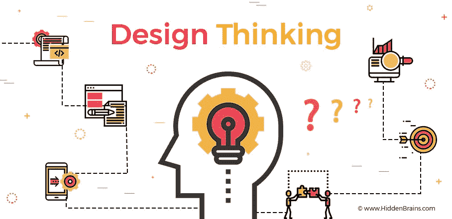
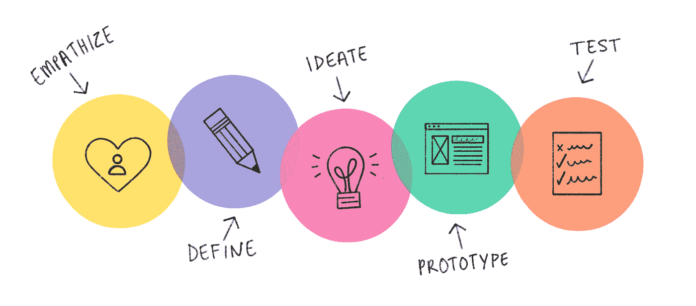
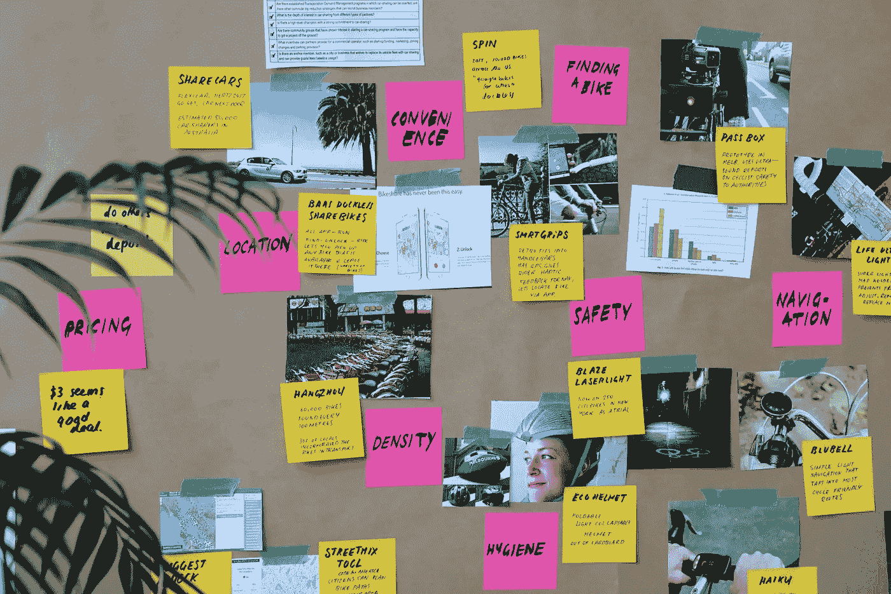
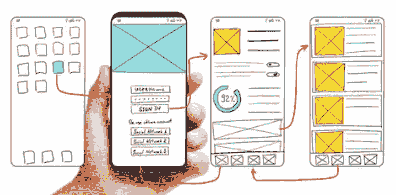
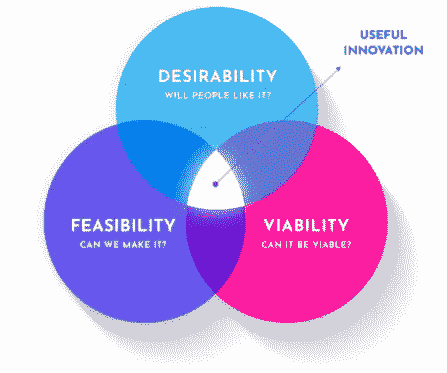

# 介绍产生好想法的设计思维

> 原文：<https://blog.devgenius.io/introduction-to-design-thinking-for-generating-good-ideas-8dd1c75df530?source=collection_archive---------32----------------------->

> “设计思维是一种用来解决复杂问题的思维方式，需要创新的方法”

设计思维是一种以用户为中心解决问题的方法。设计思维是由大卫·凯利(David Kelley)和 IDEO 的创始人蒂姆·布朗(Tim Brown)推广的，IDEO 是一家设计顾问公司，拥有基于创新的产品设计背景。

蒂姆·布朗(Tim Brown)认为，设计思维是一种创新思维，这种创新思维来自于人类和汽车研发人员的发明创造。

我们如何在我们的组织中发展设计思维？

1.  开放和协作的文化
2.  交叉学科
3.  支持创新的环境

# 设计思维框架

来源:goodnewsfromindonesia.id

## 有同感

在这一阶段，用户被接近以获得对要解决的问题的移情理解和知识。这可以通过直接到现场与他们会面进行访谈来实现，也可以像他们一样行事，以便真正想要解决的客户问题可以顺利解决。

有几种方法可以让用户感同身受，比如

1.  观察
    观察用户活动或行为，获得用户所面临问题的第一印象
2.  与目标用户直接互动，验证观察和假设
3.  沉浸在用户所做的事情中，这样我们就能真正感受到用户所感受到的问题

## 规定

对移情阶段收集的信息进行分析和综合，以确定要识别的核心问题。从这里
可以确定用户面临什么问题。

这个定义阶段将非常有助于解决客户问题，因为问题已经确定。从这里我们可以做出“一个好的问题陈述”。

详细定义问题有助于确定寻找创新想法的下一步。要找到一个对用户来说很重要的问题，可以通过查看有助于找到“绘画性”问题的模式来完成。

## 想象

这个阶段是产生想法的阶段。所有的想法都会被采纳，以解决在定义阶段就已经设定好的问题。在构思阶段的开始，获得尽可能多的想法或解决方案是很重要的。

在这个阶段应用“不要框定思维”原则是很重要的，这样才能产生许多想法和解决方案。这些想法然后被分为三类，即愉快的，现实的和意想不到的。最后，最后的想法是这三类想法的结合。

*创意阶段从关注一个问题开始>投票>分类>选择原型。*

## 原型

这个阶段的作用是将想法、解决方案、产品注入到可想象的事物中，这样想法就变得更加具体，因为它们可以被可视化为可感知的事物。

来源:云 App

在 prorotype 阶段，将生产产品的许多廉价和最小化版本，或者在产品中发现特殊功能，以便他们可以调查前一阶段产生的问题的解决方案。这个原型可以在你自己的团队或者其他几个团队中进行测试。当有输入时，对这个原型进行改进，直到产生一个真正好的原型。

## 试验

> 向顾客展示并获得反馈

向公众进行产品的测试和评估，结果将用于进行更改和改进，以摆脱问题解决方案，并深入了解产品及其用户。经过测试和评估的原型，然后经过修正和重复测试，以生产出正确的产品。

用户测试的最终目标是用设计思维方法找到一个有用的创新

斯普尔兹:海湾大桥数码公司

# 结论

设计思维整合了三件事，即作为创新对象的人的需求、技术被利用的可能性和商业需求。

> 为思考而建造

这五个阶段中如果有一个阶段出现故障，可以返回到允许它被修复的阶段。例如，在构思阶段不能解决问题，那么就可以回到强调阶段。