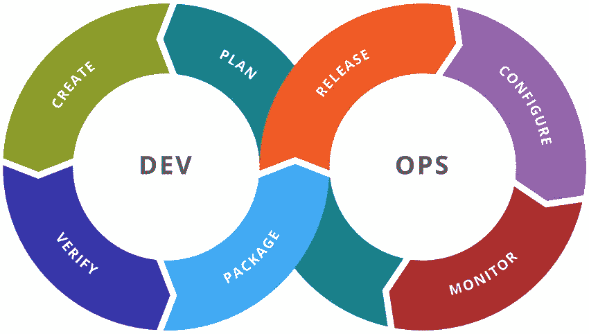

# Devops 简介

> 原文：<https://blog.devgenius.io/introduction-to-devops-4df554969d9d?source=collection_archive---------16----------------------->

# 介绍

DevOps 是文化哲学、实践和工具的组合，它提高了组织高速交付应用程序和服务的能力:以比使用传统软件开发和基础设施管理流程的组织更快的速度发展和改进产品。这种速度使组织能够更好地服务于他们的客户，并在市场中更有效地竞争。

# 概观

DevOps 是一种软件开发理念，旨在改善软件开发人员和信息技术(IT)专业人员之间的协作。这个术语指的是实践的集合，其目标是建立一种文化和环境，在这种文化和环境中，构建、测试和发布软件可以快速、频繁和更可靠地进行。DevOps 已经在各行各业获得了广泛的关注，它是一种让公司更快发展的方式，同时降低了与运营效率低下相关的风险和成本。

DevOps 是两个词的组合:“开发”+“运营。”这个术语是 Patrick Debois 在 2009 年 GOTO 会议上创造的(参考文献[1])。

# DevOps 是什么？

DevOps 是一种软件开发方法，它结合了开发和操作的精华。DevOps 打破了这些功能之间的壁垒，鼓励它们之间的协作，以更快地交付新功能和服务。

DevOps 是一种思维模式，但它也是 it 运营团队用来帮助他们在敏捷性、效率、质量保证(QA)、安全性或合规性等领域实现组织目标的一套工具。它涉及自动化工具，如 vagger 或 Docker，以及其他 DevOps 工具，如 Jenkins CI 管理或 Ansible 配置管理。这也是为了发展双方工程师之间的密切关系:开发人员与运营人员谈论他们彼此需要什么；运营人员谈论他们如何帮助开发人员更快地实现目标；每个人都朝着共同的目标努力，共享成功指标，如正常运行时间百分比或部署后自动化测试结果报告(也称为“冒烟测试”)。

# DevOps 值

DevOps 是一套帮助组织以更低的成本更快、更好的质量交付软件应用和服务的实践。DevOps 不仅仅是把开发者和 IT 运营集合在一起；这是一种文化，它结合了软件开发和 it 运营的精华，以支持持续交付并促进所有利益相关者之间的协作。

如果您是 DevOps 新手，或者正在寻找通过这种方法提高组织绩效的方法，这里有一些关于如何开始的提示。

# DevOps 生命周期

DevOps 生命周期可以被认为是一个持续的开发过程，它为应用程序的持续集成、持续交付和持续部署提供了一个框架。这也是一场重视人、协作和交流的文化运动。

我们将在下面详细介绍每个步骤:

*   持续集成(CI)——这一步着重于自动化您的构建过程，以便您可以在将代码集成到产品中之前测试和验证代码更改。CI 有助于通过减少部署过程中的人为错误来确保质量，并提高透明度，因为它允许团队在任何给定的时间看到其他团队正在做什么。它还通过在出现故障时提供更快的通知来提高可靠性，从而可以在投入生产之前进行修复；这减少了停机时间，同时提高了客户对您的产品或服务的满意度，因为进入用户设备/服务器等的错误更少了..
*   连续交付(CD) —这一步骤包括使用 Jenkins 或 Bamboo 等工具自动执行从源代码检入到发布管理的流程，这些工具有助于在将软件版本发布到生产环境之前，为所有类型的测试活动(如单元测试、功能测试和验收标准验证测试)创建一个自动化管道，在生产环境中，客户/用户/客户会使用这些软件版本，而他们需要这些版本具有完整的功能

# DevOps 工具

现在我们对 DevOps 有了更好的理解，让我们深入一些具体的工具和实践。

*   Jenkins:用于持续集成和部署(CI/CD)的工具，Jenkins 是用 Java 编写的开源自动化服务器。它与许多其他服务相集成，并支持从开发到生产的任何项目的构建、测试、部署和自动化。Jenkins 的可扩展架构允许您

1.  直接连接 GitHub 或 Bitbucket。
2.  从存储库中提取代码
3.  在不同操作系统的多个浏览器上测试代码
4.  运行单元测试
5.  执行测试覆盖报告
6.  将应用程序工件打包到一个包含依赖项的安装程序文件中
7.  为每个版本创建发布说明，这样您就可以在团队成员或公司高管每次发布新版本时看到发生了什么变化
8.  使用 NRPE (Nagios 远程插件执行器)在 Linux 服务器上安装应用程序后，监控应用程序日志中的错误
9.  将应用程序作为 Docker 容器运行，以便在将它们推送到 AWS 实例(如 EC2 AMIs (Amazon 机器映像))之前模拟生产环境。
10.  如果您需要比 VS 代码插件(如 Cypress JS Test Runner 或 NightwatchJs Testing Framework)提供的更高级的浏览器测试功能，您还可以使用 Jenkins 内置的 Selenium WebDriver 集成特性，这些插件根本不允许定制测试！

# 结论

DevOps 是一套实践、原则和工具，有助于提高组织以高速度、高可靠性和高质量交付应用程序和服务的能力。

DevOps 不仅仅是一个工作职能或部门，而是一种建立在开发、运营和其他 IT 职能部门之间沟通和协作基础上的文化。

这篇文章是一系列文章中的第一篇，它将带你了解 DevOps，即帮助软件组织更快地向他们的客户交付价值的实践和文化。在这篇文章中，我们介绍了什么是 DevOps，它是如何工作的，以及它的生命周期由什么组成。我们还研究了 DevOps 开发的一些关键工具，包括 GitLab 和 Jenkins。