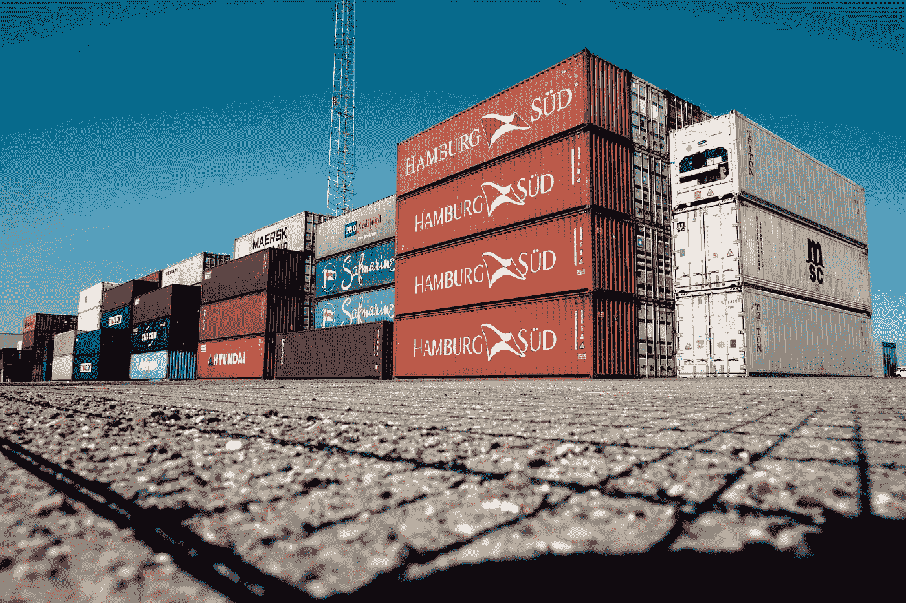
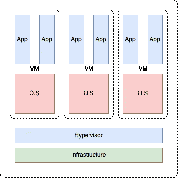
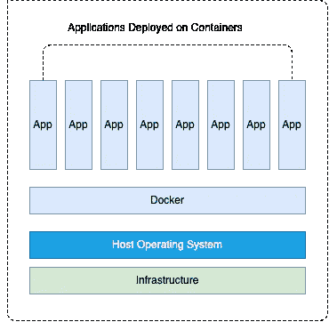
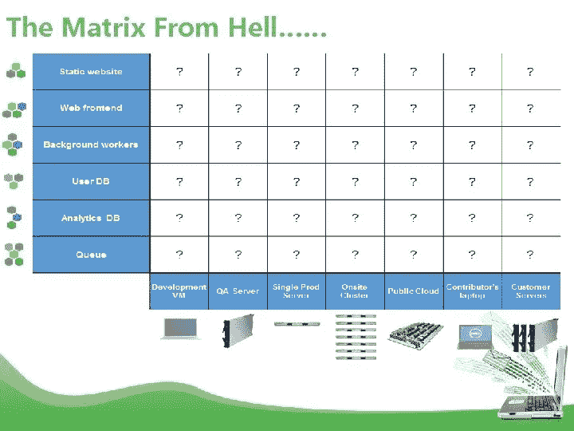

# Docker 简介

> 原文：<https://blog.devgenius.io/introduction-to-docker-c39fdb34a0c5?source=collection_archive---------0----------------------->

一点点，希望不会太晚！

构建容器和容器化应用程序的事实标准是 Docker。自从 Docker 问世以来，已经有大量关于 Docker、其架构以及 Docker 和虚拟机之间的差异的文章。尽管这些文章向开发人员介绍了底层架构，但他们并没有让工程师精通如何高效地使用 Docker。本文和接下来的几篇文章致力于提供更少的底层架构和更多的实践 Docker。

 [## Docker | Docker 入门

### 了解 Docker 提供的完整容器解决方案。为开发人员、IT 运营和…查找信息

www.docker.com](https://www.docker.com/get-started) 

乔纳斯·史密斯在 [Unsplash](https://unsplash.com?utm_source=medium&utm_medium=referral) 上拍摄的照片

# 为什么是 Docker？

Docker 有很多优点。由于采用了容器，互联网上充满了各种各样的成功故事。在我看来，Docker 是行业内云采用率高的主要原因之一。没有其他策略比选择容器化应用程序具有更高的投资回报率。这还具有节省成本的隐性好处，因为人们不必再让硬件资源闲置。以下是推动其采用的一些其他优势。

1 st 它帮助解决了 ***“它在我的机器上工作”*** 的问题。每个开发人员在他们的职业生涯中都至少听过几次这样的话。当您构建一个容器时，与团队中的另一个开发人员共享它变得很容易。如果您可以重用容器映像或重新构建容器，就成功了一半。

2 第二，Docker 帮助标准化环境，包括开发、持续集成、测试和部署。标准化可以减少缺陷，提高生产率。

第三，在这个版本控制代码和基础设施的时代，Docker 允许我们对可部署的进行版本控制。您只需构建一次映像，就可以在多个环境中部署它。

4 第四，Docker 容器可以在 AWS、GCE、Azure 这些主要的公有云提供商上运行。我们可以说内部数据中心和私有云堆栈也是如此。Docker 容器还可以轻松地与配置管理器如 Puppet、Chef 和 Ansible 一起工作。

第五，也是最后一点就是隔离和安全。Docker 通过保证资源隔离，帮助您在同一个主机节点上部署多个容器。这些容器可以使用完全不同的技术堆栈，而不会相互影响。安全性是隔离的一个额外好处，授予对容器内运行的应用程序的管理的完全控制权。每个容器被分配从 CPU 到网络的资源，并且不能查看其他容器。

除此之外，容器还解决了两个相互冲突的问题——密度和隔离。密度是指在同一台计算机上运行尽可能多的应用程序，以便高效利用处理器和内存。但是部署在一起的应用程序可能无法很好地协同工作。想象一下用 Java 和。NET 一起部署在同一台机器上，或者部署在具有完全不同的库或内存需求的应用程序上。将应用程序相互隔离是非常重要的，如果没有容器技术，我们就无法在一台服务器上部署大量的应用程序。

虚拟机

# Docker 是什么？

左侧的图像代表传统的虚拟机(VM)架构。绿色底部是一台物理机器。虚拟机管理程序是固件，安装或部署在物理机上。这一层负责协调客户虚拟机的操作系统和物理主机之间的通信。在虚拟机上，我们部署了应用程序。大多数内部部署架构都是该映像的变体。

部署在客户操作系统(OS)上的应用程序共享虚拟机资源。除此之外，虚拟机需要安装和运行完整的操作系统和大量不必要的库，这需要占用大量空间。虚拟机启动缓慢，这对于生产中的操作使用情形来说可能非常缓慢。另一个要考虑的问题是资源的浪费。当部署的应用程序看不到太多流量时，我们有一个对底线没有贡献的虚拟机。当您必须部署新服务时，基础架构的成本会增加并降低效率，并且必须花费时间和金钱来规划新硬件。

容器化应用

另一方面，容器运行在应用层。容器可以运行多个应用程序，并将依赖项与应用程序一起安装。容器比传统的虚拟机占用更少的空间，使得共享客户机器资源变得容易。可操作的容器很有意义，因为它很容易根据需求进行伸缩。

# 来自地狱的矩阵

地狱矩阵只不过是构建任何应用程序的挑战，而不考虑语言、框架或依赖性，以便它可以在任何云提供商上运行，而不管操作系统、硬件和基础设施如何。

来源: [sdtimes](https://sdtimes.com/containers/stuck-new-devops-matrix-hell/)

当 Docker 在 2013 年成为焦点时，它为开发人员和运营团队提供了将应用与底层操作系统分离的能力。

Docker 是领先的容器平台，它允许您在容器中构建和打包应用程序依赖项以及应用程序，使这些容器可以在任何机器上运行。

让我们考虑一个用 Java 编写的应用程序。Java 是一个现代化的平台，从那时起，它就开始每年发布一次。用 Java 8 编写的程序，如果在编译时不采取一些预防措施，很可能无法在 Java 5 上运行。为了避免版本冲突，Docker 会将应用程序包装在一个包含所有依赖项的容器中。

每个容器现在都有自己的一组库和依赖项。从而确保每个应用程序独立于其他应用程序。要获得更多的实践经验，请阅读下面的文章。

 [## Docker 实践——基础知识

### 弄脏你的手。

medium.com](https://medium.com/@mukundkrishnan/hands-on-with-docker-the-basics-445445d835e1)