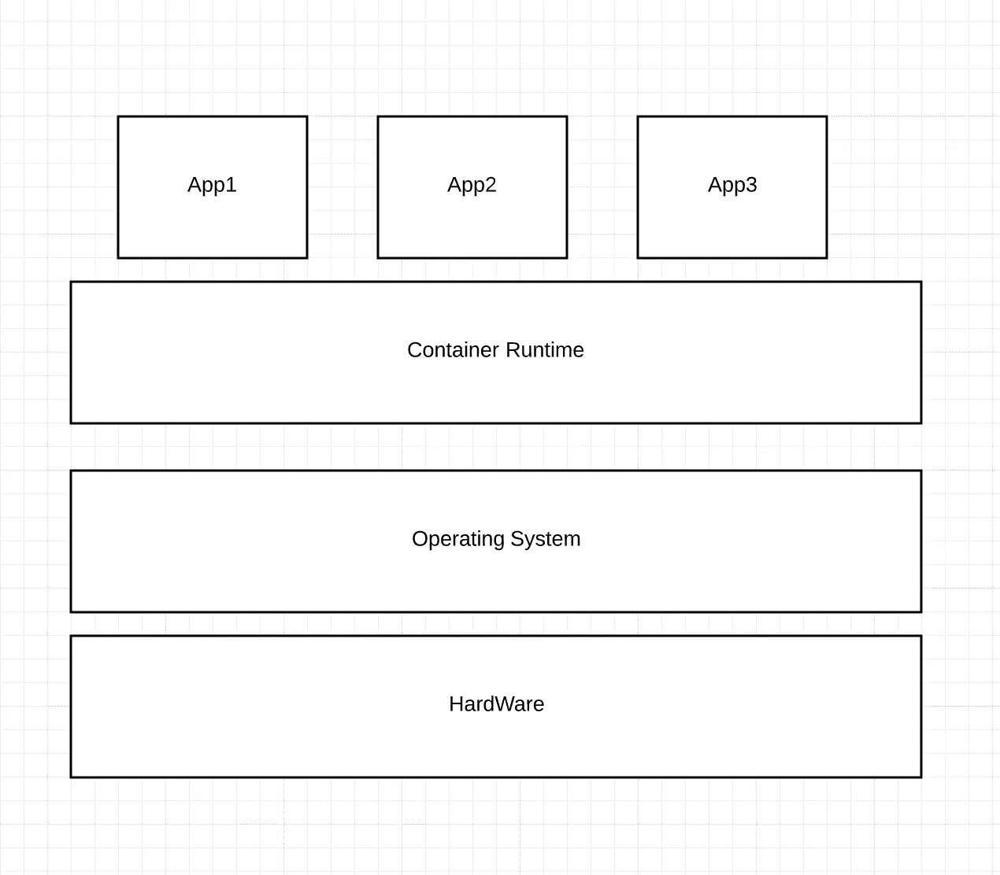
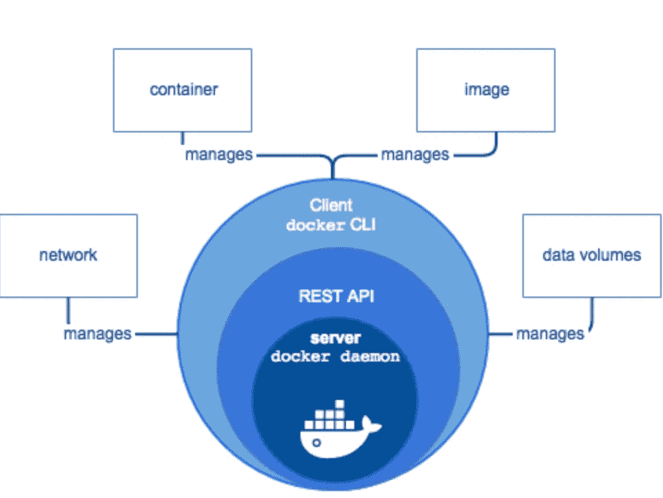
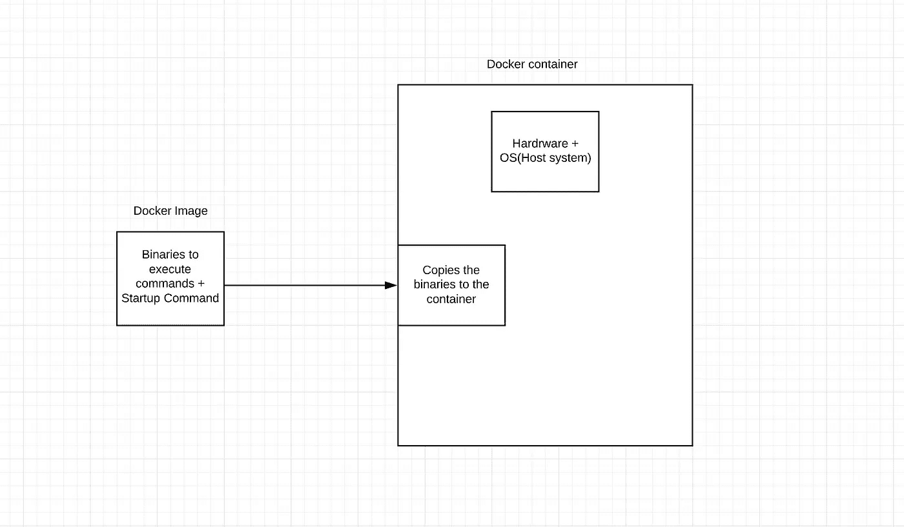
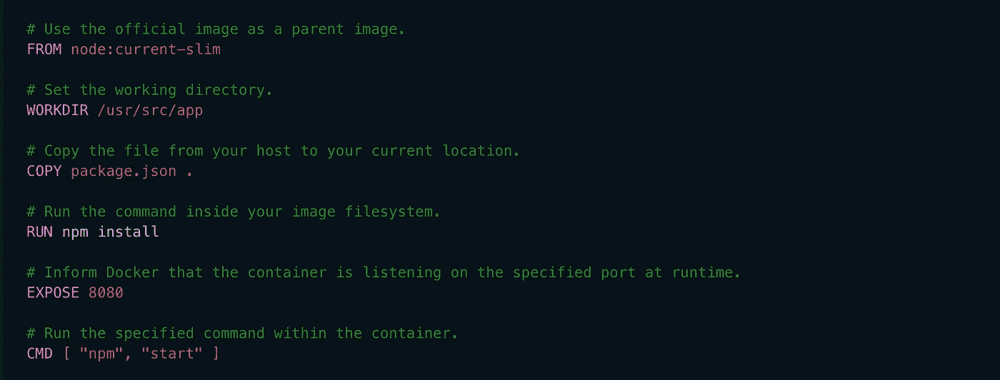

# Docker 简介

> 原文：<https://blog.devgenius.io/introduction-to-docker-ef7b00da40ed?source=collection_archive---------3----------------------->


Docker 是一个围绕创建和运行**容器的平台或生态系统。**为了更好地理解 docker，让我们首先试着理解什么是容器。

**什么是容器？**

容器是一个进程或一组进程，有一组专门分配给它的资源。与虚拟机不同，容器与主机共享相同的操作系统。它们提供了一种逻辑打包机制，应用程序可以从它们实际运行的环境中抽象出来。



**深入钻研 Docker**

让我们了解一下 docker 的积木。

*   **Docker Hub** :是 Docker Hub 提供的上传分享 Docker 图片的服务。
*   **Docker 守护进程:它**检查客户端请求，并与其他 **Docker** 组件通信，以便执行服务。
*   **Docker Rest API:** 一个 Rest API，程序可以使用它与守护进程对话，并指示它做什么。
*   **Docker CLI:**CLI 使用 Docker REST API 通过脚本或直接 CLI 命令来控制 Docker 守护进程或与之交互。



既然我们熟悉了 Docker 的基本组件，那么让我们来理解如何启动 Docker 容器。

**启动一个码头集装箱**

要启动 docker 容器，您需要创建一个 **docker 映像**，它由执行容器中的命令所需的一组二进制文件和一个启动命令(可选)组成。

```
docker run <image_name>
```

docker run 命令是两个命令的合并。

```
docker create <image_name> + docker start <container_id>
```

`docker create`命令在指定映像上创建一个可写容器层，并为运行启动命令做准备



Start 命令复制二进制文件

然后，您可以使用`docker start <container_id>`命令在任何点启动容器，该容器执行 docker 映像中指定的启动命令。

到目前为止，我们已经知道如何使用给定的 docker 映像启动容器，但是我们如何创建自己的 docker 映像呢？

**创建 docker 图像**

*   在项目文件夹中创建一个 docker 文件
*   指定要使用的基础图像
*   指定创建映像时要执行的一组命令
*   指定启动容器时调用的启动命令(可选)
*   使用 Dockerfile 建立你的形象。

```
docker build -t <imag_name> .
```



样本文档

**常用的 Docker 命令**

```
docker logs [OPTIONS] CONTAINER
```

它获取给定 docker 容器的日志。

```
docker ps
```

默认情况下，它只显示正在运行的容器。您可以添加`-a`标志来查看所有容器。

```
docker kill [OPTIONS] CONTAINER
```

它立即杀死一个或多个正在运行的容器 *(* ***发送 SIGKILL 或指定信号*** *)。容器内的主进程将被发送 SIGKILL，或任何由 option-signal*指定的信号

```
docker stop [OPTIONS] CONTAINER
```

它停止一个或多个正在运行的容器 *(* ***发送 SIGTERM，然后在宽限期过后 SIGKILL****)。容器内的主进程将接收 SIGTERM，在一段宽限期后，SIGKILL*

您可以查看 docker [文档](https://docs.docker.com/engine/reference/commandline/docker/)来了解其他 docker 命令。这里提到的几个就足够让你入门了。

如果你喜欢读这篇文章，别忘了鼓掌。👏👏

你也可以在 twitter [@Akash940](https://twitter.com/Akash940) 上关注我的 JavaScript 或 React 更新。

谢谢你！