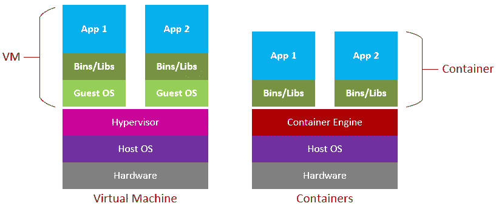
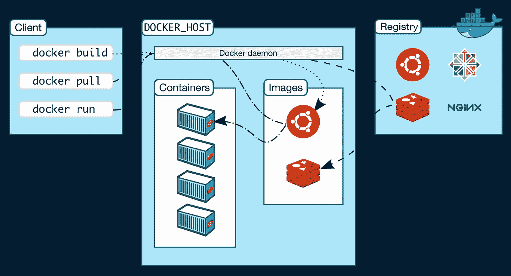

# R 中的 Docker 介绍

> 原文：<https://blog.devgenius.io/introduction-to-docker-in-r-cbc886faed3?source=collection_archive---------16----------------------->

Docker 技术已经成为软件开发领域中最常用的技术之一，开发者现在能够开发、复制和运输容器化的应用程序。该系统以这样一种方式工作，即容器运行在与主机隔离的环境中。一种密切相关的方式是通过旋转虚拟机，然后安装操作系统以及依赖项，但是与轻量级的容器化相比，这种方式在资源方面有点受限并且有点昂贵，因为容器化在共享方面是快速和可移植的。

下图有助于说明 docker 与虚拟机相比是如何工作的。



[图片来自 cloudblogs.microsoft.com]

**Docker 和 RShiny**

*   Shiny 是单线程的，这意味着一个应用程序的多个用户使用一个会话，这经常会产生问题。容器化解决了这个问题，因为有了 docker，每个用户都能得到一个容器化的闪亮应用。
*   通常情况下，包和依赖项在更新时会带来问题，比如一个运行良好的应用程序会因为之前使用的包的某个版本被更新为另一个版本而停止运行。
*   如果你想在一些托管平台上托管一个闪亮的应用程序，比如 [heroku](https://www.heroku.com) ，你需要对你的应用程序进行文档化。这些知识会派上用场。

**码头建筑**

下图向我们概述了 docker 系统的工作原理。



[图片来自 docs.docker.com]

**Docker 客户端**

客户端为用户提供了一个命令行界面，您可以在其中运行 docker 命令，这些命令通过 API 与 docker 守护进程进行对话。

**Docker 守护进程**

这是 docker 对象的管理器；图像、容器、网络和卷。

*   ***图像*** :这是一个带有指令的文件，用于创建一个容器。图像是从 docker 文件创建的。
*   ***Dockerfile*** :这是一个文本文件，包含构建图像的指令/命令。
*   ***容器*** :图像的可运行实例。
*   ***网络*** :连接 docker 容器的系统。

**Docker 注册表**

这是 docker 图像存储、共享和管理的地方。

**安装**

Docker 系统是在 linux 上构建的，但是，对于 windows 和 Mac 用户，您仍然可以安装桌面版本，如下所述:

*   [在 mac 上安装 docker](https://hub.docker.com/editions/community/docker-ce-desktop-mac)
*   [在 windows 上安装](https://hub.docker.com/editions/community/docker-ce-desktop-windows)
*   [沉迷于 ubuntu](https://docs.docker.com/engine/install/) 发行版

下面是一个 Dockerfile 文件的简单例子，它是我在[这篇](https://oyogo.github.io/shiny/2021/06/08/gentle-introduction-to-r-shiny.html)文章的前面开发的教育应用程序中构建的。

```
FROM rocker/shiny-verse:latest
USER rootRUN R -e 'install.packages("devtools")'
RUN R -e 'devtools::install_version("shiny", version = "1.6.0", dependencies= T)'  
RUN R -e 'devtools::install_version("ggplot2", version = "3.3.2", dependencies= T)'
RUN R -e 'devtools::install_version("plotly")' 
RUN R -e 'devtools::install_version("dplyr", version = "1.0.0", dependencies= T)'COPY ./www/ /shiny/dashboard/www/
COPY app.R /shiny/dashboard/EXPOSE 3838CMD R -e 'shiny::runApp("/shiny/dashboard", port = 3838, host = "127.0.0.1")'
```

*在命令行上，您可以使用*touch Dockerfile*创建一个空文件，然后使用您喜欢的文本编辑器向其添加层*

**来自**

这是我们 docker 文件的第一层，它指定了将用于构建新映像的基础映像。每一个 docker 文件都从这一层开始，你经常会使用另一个图像作为你的起点。另一种方法是通过安装所需的依赖项从头开始，但这将需要更多的工作，而这些工作可能是不必要的。

对于我们的图像，我们使用 rocker 的 r-base 作为我们的基础图像，然后添加图层。

**用户**

该命令指定用户，在本例中为 *root。*指定的用户将用于运行后续的*运行*、*复制*、*曝光*和 *CMD* 命令。

**复制**

copy 命令将文件或目录从主机复制到容器中。该命令有两条路径:

*主机路径和容器路径*

它的形式是:

对于文件:

```
path-in-host/files.txt path-in-container/#example
/shiny/dashboards/app.R /shiny/dashboards/
```

注意两条路径之间的间距。从上面一行，我们复制了文件应用程序。r 从里面亮晶晶的文件夹仪表板到容器里亮晶晶的文件夹下的文件夹仪表板。

对于文件夹:

```
path-in-host/myfolder/ path-in-container/
```

*   复制 *myfolder* 时，只有内容会被复制到*path-in-container*中，以创建 *myfolder* 然后写入*path-in-container/myfolder/
*   通过这样写——*my folder*将在容器文件系统中创建，而不需要使用 *mkdir* 命令，然后，
    来自主机的 *myfolder* 的内容将被粘贴到其中。
*   如果碰巧你的路径有空白，即*项目/我的文件夹/* ，那么使用 COPY*["/项目/我的文件夹/"，"/项目/我的文件夹/"]*
*   如果你有多个文件，比如从 mod 开始…那么你可以使用 COPY *mod* /myfolder/* 来复制所有的文件。所有以 mod 开头的文件都将被复制。
*   在我们的例子中，第一行复制了 www 文件夹，其中包含一些我们使用过的图片。第二行复制应用程序。r 脚本文件，其中包含用于构建我们的应用程序的 ui 和服务器代码。

## **运行**

这条指令在容器内部执行给定的命令。在这种情况下，我们使用它在容器中安装必要的包。
注意，我们首先从安装 devtools 开始，这样我们就可以用它来安装所需软件包的特定版本。

**CMD**

这个命令告诉 docker 在容器内部运行哪个命令。对于这种情况，其 ***R -e*** 命令如下所示:

```
R -e 'shiny::runApp("/shiny/dashboard", port = 3838, host = "127.0.0.1")'
```

**曝光 3838**

这个命令指示容器向外界开放网络端口 3838。

**构建映像**

一旦我们如上所述编写了 docker 文件，导航到包含您的应用程序文件的工作目录，并输入以下命令来构建映像:

```
$ docker build -t nameofimage .
```

[-t]标记我们的图像，因为它给我们的图像一个名字。
的[。]指示 docker 使用当前文件夹中的 docker 文件。否则我们会给它 docker 文件所在的路径。

N/B 请记住将图像的名称替换为您想要的名称。如果您有 docker hub 帐户，您可以使用***yournameindockerhub/nameofimage***

**旋转容器**

你需要等待几分钟来建立你的图像，这取决于你的电脑规格、网速和你的应用程序有多大。成功构建映像后，使用以下命令检查您的系统中是否存在该映像。

```
$ docker image
```

该命令列出了您的计算机中的所有图像，您要么建立或从 docker 注册表拉。

要从我们使用的图像旋转容器:

```
$ docker run -it --rm -p 3838:3838 -v '/pathtofolder/data':'/shiny/data' nameofimage
```

docker run 是从 docker 映像旋转容器的命令。
-**-*p 3838***对外公布港口。
- ***v*** :挂载一个卷。-v 标记告诉 docker 将位于'/pathtodatfolder/data '的数据文件夹挂载到容器内的' shiny/data '上。好吧，记得当我们创建 docker 文件时，我们没有创建数据目录，所以你可能想知道这是如何工作的，没必要担心。docker 会自动在容器中创建文件夹，然后将它链接到主机中的数据文件夹。

最后，您现在可以在我们的浏览器上查看***localhost:3838***来查看您的容器化应用程序。

# 这就对了！你已经容器化了你的应用程序

您可以抽出一些时间，访问以下页面进行进一步阅读:

1.  [docker 文档](https://docs.docker.com/get-started/overview/)
2.  [docker-课程表](https://docker-curriculum.com/)