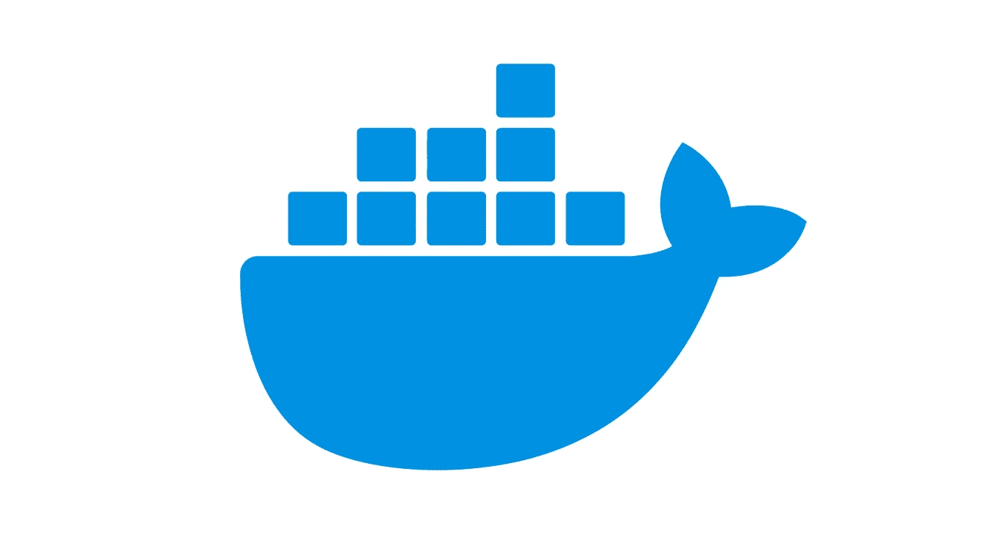
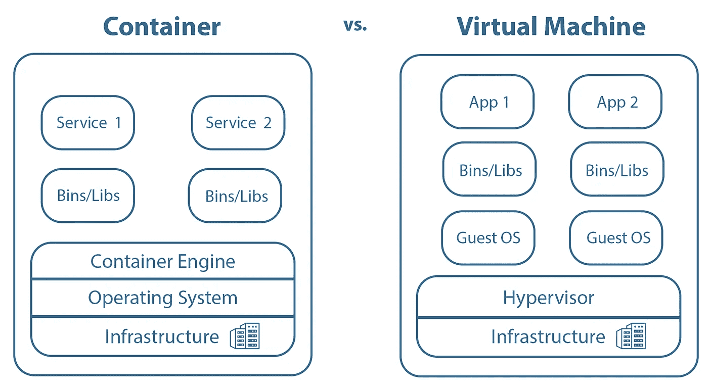

# Docker 简介—第 1 部分

> 原文：<https://blog.devgenius.io/introduction-to-docker-part-1-7646c995282c?source=collection_archive---------3----------------------->

## 如果你曾经面临“它在我的机器上工作的问题”, Docker 可能是解决方案。

# 介绍

Docker 是一个容器化平台，用于构建基于容器的应用程序和服务。总而言之，容器包含一个应用程序及其所有的依赖项，可以在不同的用户、位置和系统之间轻松共享。

# 容器与虚拟机

通常使用虚拟机的人可能会问自己，如果他们也可以使用虚拟机，为什么还要使用 Docker 和容器化。下图显示了主要区别。

容器与虚拟机

系统的基础始终是基础设施，如 PC 或服务器。容器和虚拟机的主要区别在于操作系统。虚拟机总是有自己的操作系统，称为客户操作系统。一个虚拟机管理程序可以管理多个使用不同操作系统的虚拟机。在集装箱化的情况下，需要一个集装箱引擎(如码头引擎)。容器总是与运行容器引擎的系统共享操作系统。所以叫共享 OS。此外，必须指出的是，单个虚拟机可以用于不同的服务，如数据库、web 服务和邮件服务器，而容器应该只用于单个服务。对于虚拟机示例，需要三个容器，一个用于数据库，一个用于 web 服务，一个用于邮件服务器。

总而言之，与虚拟机相比，Docker 的主要优势是:

*   **更快的启动:**不需要启动任何操作系统
*   **隔离:**每个服务都被隔离在自己的容器中，有自己的依赖关系
*   **可移植性:**一旦服务被容器化，容器就可以很容易地转移到不同的基础设施或其他人的系统上

# Docker 的组件

本文的下一部分将给出 Docker 提供的不同组件的一些见解。

## 码头引擎

每一种集装箱化技术都需要一个集装箱引擎。容器引擎是一个软件，用于管理容器、接受用户输入和处理图像或其他容器化对象。容器引擎的一个例子是 **Docker 引擎**。它由三部分组成:

*   **Docker 守护进程** `dockerd`:管理图像和容器等对象
*   **Docker API** :用于与`dockerd`通信的 RESTful API
*   Docker CLI:Docker 的命令行界面

关于 Docker 引擎的安装细节:[安装 Docker 引擎](https://docs.docker.com/engine/install/)

## Docker 图像

图像被用作启动容器的蓝图。它知道启动容器所需的一切，所需的源文件，以及其他一切。基本上，有两种方法可以获得所需的图像:

*   公共 Docker 图像
*   创建个人文档

## Dockerfile 文件

要创建个人图像来归档您自己的应用程序，可以使用归档文件。Dockerfile 是一个基于文本的文件，用于定义用户在命令行上调用的命令来构建图像，这将在后面描述。以下示例显示了如何将 NodeJS-application 容器化。关键字`FROM`定义了我们图像的基础图像。在这种情况下，基础映像是`node:16`，它提供了容器化 NodeJS-app 所需的一切。例如，基础映像也可以是在容器中运行 MySQL 数据库的`mysql`。 [Docker Hub](https://hub.docker.com/) 提供了大量图像，可以直接使用，也可以用作 Docker 文件中的基础图像。在定义基础图像之后，执行以下步骤:

1.  创建目录`/app`并定义为工作目录
2.  `COPY`的本地文件`package.json`到当前工作目录的容器中
3.  安装`package.json`中定义的 npm 包
4.  `COPY`将所需的源文件复制到当前工作目录
5.  `CMD`定义容器启动时执行的命令

从 Dockerfile 文件生成图像的过程称为构建。命令`docker build -t <Tag> .`将构建 Dockerfile 文件。标志`-t`用于标记图像，它基本上是给 Dockerfile 一个名称。末尾的`.`定义了 Dockerfile 的路径，在本例中是当前目录。

更多可以在 docker 文件中使用的命令以及关于它们的描述可以在[docker 文件参考](https://docs.docker.com/engine/reference/builder/)中找到。

## 。dockerignore

文件`.dockerignore`可用于在构建过程中忽略文件。如果你想忽略你的`node_modules`或类似的，这可能是需要的。因此，需要一个名为`.dockerignore`的文件，其中包含应该忽略的文件。下面的例子将忽略目录`.git`和`node_modules`。

关于语法的细节可以在这里找到:[。dockerignore 文件](https://docs.docker.com/engine/reference/builder/#dockerignore-file)

## 登记处

Docker 中的注册表用于存储、管理和提供图像。公共注册中心的一个例子是已经提到的 [Dockerhub](https://hub.docker.com/) 。Google 也提供了他们自己的容器注册表:[Google-Container-Registry](https://cloud.google.com/container-registry)。当已经使用 Gitlab 进行版本控制时，它也可以用作容器注册表，因为它提供了这个特性。除了公共注册中心，还可以部署个人注册中心。这可以通过使用 Docker 直接提供的 image [注册表](https://hub.docker.com/_/registry)来完成。

# 图像分层

Docker 图像构建在所谓的层中。docker 文件中的每一行都指向一层，而每一层只包含对前一层的更改。这样做的好处是，只有 docker 文件中真正有变化的命令才需要重新构建。对于我们的 NodeJS-app 来说，这意味着源代码的改变只会影响第二条`COPY`指令。所有其他步骤都将被缓存。

可以使用命令`docker history <Name>`分析图像。对于前面描述的 NodeJS-image，输出如下:

> 查看该系列的第 2 部分:

 [## Docker 简介—第 2 部分

### 如果你曾经面临“它在我的机器上工作的问题”, Docker 可能是解决方案。

blog.devgenius.io](/introduction-to-docker-part-2-73b36d0722e0)