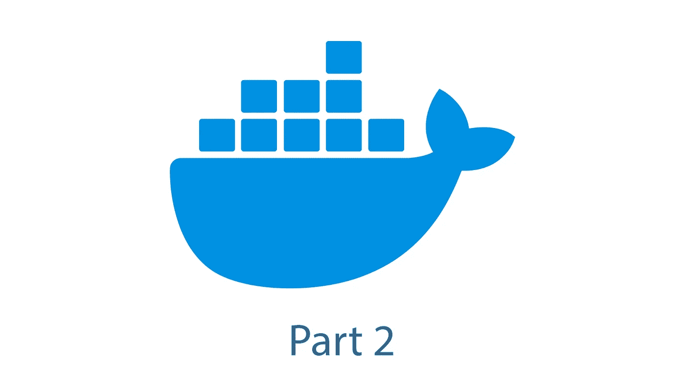
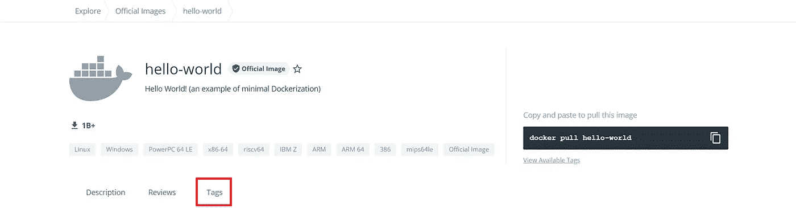

# Docker 简介—第 2 部分

> 原文：<https://blog.devgenius.io/introduction-to-docker-part-2-73b36d0722e0?source=collection_archive---------7----------------------->

## 如果你曾经面临“它在我的机器上工作的问题”, Docker 可能是解决方案。



欢迎回到我介绍 Docker 的第二部分。本系列的第一部分介绍了什么是容器，以及容器和虚拟机之间的区别。如果您尚未阅读，请点击此处查看:

[](https://medium.com/@eklatzerToGo/introduction-to-docker-part-1-7646c995282c) [## Docker 简介—第 1 部分

### 如果你曾经面临“它在我的机器上工作的问题”，Docker 可能是一个简单的解决方案

medium.com](https://medium.com/@eklatzerToGo/introduction-to-docker-part-1-7646c995282c) 

如第 1 部分所述，用于 Docker 的容器引擎是 **Docker 引擎**。为了与它通信，使用了 **Docker CLI** 。本系列的这一部分将讲述 Docker CLI 提供的最重要的特性。

# 图像管理

提醒一下，图像被用作容器的蓝图。图像可以存储在本地设备或注册表中。使用命令`docker images`列出所有本地图像。在这种情况下，出现了两个图像`mysql`和`nginx`。除了图像名称之外，还显示了关于图像的一些其他细节。

要仅获取单个图像的信息，该命令可扩展至`docker images <Imagename>`。在这种情况下，仅列出单个图像的标签。但是这些标签是什么呢？您可以将标签视为图像的一个版本。标签`latest`是一个特殊的标签，指的是已经发布的没有特定标签的图像的最新版本。多个标签可以是同一个图像，例如对于 nginx 图像，标签`1.21.6`、`mainline`、`1`、`1.21`和`latest`此时是相同的。以下输出显示图像`nginx`的标签`1.20`和`latest`存在:

要获取发布在 [Dockerhub](https://hub.docker.com/) 上的众多图像之一，可以使用命令`docker pull <Image>:<Tag>`。例如，要拉出 [Hello-World](https://hub.docker.com/_/hello-world`) 图像，可以使用命令`docker pull hello-world`。要获取标签列表，可以打开 Dockerhub 上的标签选项卡:



如果没有定义其他内容，Dockerhub 将用作默认注册表。要从不同的注册表中提取，必须指定注册表:

```
docker pull registry.klatzer.at/foo
```

这将从注册表`registry.klatzer.at`中提取图像`foo`。(注意:`registry.klatzer.at`不是一个真正的注册表，你将无法从那里拉一个图像)

如果您想在私有注册中心拉一个图像，在拉图像之前可能需要命令`docker login`。

要删除不再需要的图像，可以使用命令`docker rmi <Image>:<Tag>`。如果图像仍在使用，必须使用参数`-f`强制删除。如下例所示，其中图像`nginx:1.20`仍在使用中。

# 集装箱管理

Docker CLI 的第二个重要部分是容器的管理。使用命令`docker ps`列出所有正在运行的容器的一些细节。这表明两个容器正在运行，一个带有 nginx-server，另一个带有 MySQL 数据库。

为了包括没有运行的集装箱，必须使用标志`-a`。

## 启动

如果您没有启动任何容器，前面命令的输出当然会是空的。使用命令`docker start`启动一个新的容器。您可以尝试的第一件事是用命令`docker start hello-world`启动映像`hello-world`。

> 提示:如果在本地没有找到图像，则自动提取，因此不需要`docker pull`

`hello-world`图像验证您的本地 Docker 安装。输出应该包含以下几行:

`docker start`提供了几个标志来调整你的容器的行为。将通过一个示例介绍一些重要的标志。因此将使用图像`mysql`。

使用命令`docker run mysql`启动 MySQL 数据库。当尝试这样做时，会打印一个错误，并且容器不会启动。会引发以下错误:

大多数情况下，当启动一个容器时，必须设置配置字段。在这种情况下，必须设置`MYSQL_ROOT_PASSWORD`、`MYSQL_ALLOW_EMPTY_PASSWORD`或`MYSQL_RANDOM_ROOT_PASSWORD`。它们都是用于处理数据库用户`root`密码的变量。要用密码`root`启动数据库，必须用标志`-e`设置环境变量`MYSQL_ROOT_PASSWORD`。当尝试这样做时，您会注意到您无法用`root/root`连接到数据库。为了能够连接到数据库，必须发布容器的端口。这可以通过设置`-p <Host-Port>:<Container-Port>`来完成。例如，利用配置`-p 80:8080`，容器的端口`8080`被绑定到主机的端口`80`。对于我们的 MySQL 数据库，需要端口`3306`。

当容器消失时，容器中的数据也消失了。为了持久保存数据，可以将主机的目录装入带有`-v`标志的容器的目录中。我们将展示一个 MySQL 数据库的例子。关于在 Docker 中保存数据的细节可以在找到

带有上述所有标志的 MySQL 数据库所需的最后一个命令如下。

使用此命令时，容器将在前台启动。要在后台启动，必须将标志`-d`添加到启动命令中。运行该命令后，将打印容器的 id。要获取容器的日志，必须使用`docker logs <Container-ID>`。

除了启动容器之外，还提供了用于容器管理的其他命令:

*   启动一个容器:`docker start <Container-ID>`
*   停止容器:`docker stop <Container-ID>`
*   重启容器:`docker restart <Container-ID>`

使用命令`docker ps -a`可以找到容器的 id。

# 结论

本系列的这一部分已经展示了 Docker CLI 的一些命令和`docker run`最重要的标志。关于 Docker CLI 的更多信息可以在[官方文档](https://docs.docker.com/engine/reference/commandline/cli/)中找到。

请留下您对本系列的看法以及您对 Docker 系列即将到来的部分的希望，并查看我的其他文章。

查看该系列的下一部分:

[](/introduction-to-docker-part-3-9034ba335250) [## Docker 简介—第 3 部分

### 如果你曾经面临“它在我的机器上工作”的问题，Docker 可能是一个简单的解决方案

blog.devgenius.io](/introduction-to-docker-part-3-9034ba335250)