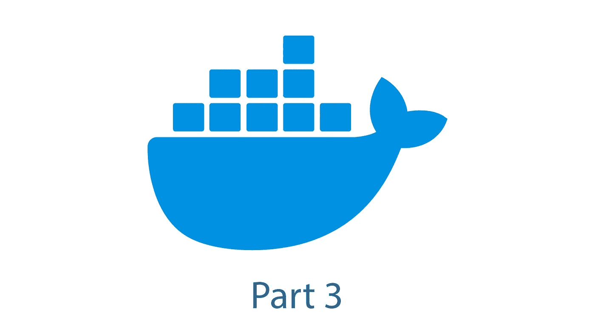

# Docker 简介—第 3 部分

> 原文：<https://blog.devgenius.io/introduction-to-docker-part-3-9034ba335250?source=collection_archive---------11----------------------->

## 如果你曾经面临“它在我的机器上工作”的问题，Docker 可能是一个简单的解决方案

# 介绍

欢迎回到我介绍 Docker 的第三部分。本系列的第一部分介绍了什么是容器以及容器和虚拟机之间的区别。第二部分处理 Docker CLI 最重要的命令。如果您还没有阅读前两部分，请点击此处查看:

 [## Docker 简介—第 1 部分

### 如果你曾经面临“它在我的机器上工作的问题”，Docker 可能是一个简单的解决方案

blog.devgenius.io](/introduction-to-docker-part-1-7646c995282c)  [## Docker 简介—第 2 部分

### 如果你曾经面临“它在我的机器上工作的问题”, Docker 可能是解决方案。

blog.devgenius.io](/introduction-to-docker-part-2-73b36d0722e0) 

在阅读本系列的前两部分时，您可能想知道如何设置一个包含多个容器的环境。这部分将是这个问题的答案。基本上，有两种处理这种情况的方法:

*   Docker 网络
*   **Docker 撰写**

## Docker 网络

Docker 提供了为容器创建网络的功能。因此，必须用`docker network create <network name>`创建一个 Docker 网络。之后，在启动容器时，必须添加标志`--network <network name>`。

另一种方式是用标志`--link`代表`docker run`。尽管该功能不应再使用，但详情可在[此处](https://docs.docker.com/network/links/)找到。

## Docker 撰写

Docker Compose 是多容器 Docker 应用的标准。为了组合，必须创建一个单独的`docker-compose.yml`，它包含容器的所有信息。因此定义了不同的关键字。

文件的开始总是`version`的定义。关于版本之间差异的详细信息可以在[这里](https://docs.docker.com/compose/compose-file/compose-versioning/)找到。

然后，定义所需的服务。每个服务都需要所用 Docker 映像的定义。这可以通过关键字`image`和之后的图像定义来完成。需要的语法是`image: <Imagename>:<Tag>`，比如`image: httpd:2`。第二种方法是定义本地 docker 文件的路径。这显示在以下示例中:

此`docker-compose.yml`定义了由两个容器组成的多容器设置:

*   `ubuntu_curl`:带 curl 的 Linux Ubuntu
*   `web` : Apache 网络服务器

对于服务`web`，使用预定义图像`httpd`。对于`ubuntu_curl`,使用本地图像。这是通过使用关键字`build`和 Dockerfile 的路径来完成的。用于此目的的 Dockerfile 仅使用图像`ubuntu`作为基础图像并安装`curl`。

使用命令`docker-compose up`启动完整的多容器设置。之后`docker ps`应该显示两个容器都在运行。为了执行容器中的命令，使用命令`docker exec <Container> <Command>`。为了验证设置，可以基于`ubuntu`从容器向 web 服务器发出 HTTP 请求。预期输出为`It works!`，因为这是图像`httpd`的默认输出。这显示在以下示例中:

基本上，本系列前一部分描述的所有标志也可以用 Docker Compose 设置。这将用一个例子来说明。该示例在我的另一篇文章中使用过，所需的多容器设置由两部分组成:

*   InfluxDB:时间序列数据库
*   Grafana:分析和可视化 web 应用程序

 [## 你为你的网络合同支付太多吗？

### 你也是那些为家里网速慢而苦恼的人之一吗？这篇文章可以帮助你！

levelup.gitconnected.com](https://levelup.gitconnected.com/do-you-pay-too-much-for-your-network-contract-e768e489b0bb) 

这里显示了所需的`docker-compose.yml`:

版本为`2`的`docker-compose.yml`定义了两个服务。对于这两种服务，都使用关键字`ports`来将容器的端口转发到容器的本地端口，就像使用`-p`标志时一样。此外，容器所需的环境变量用关键字`environment`设置，就像用`-e`设置`docker run`一样。作为`depends_on`的值`influxdb`的结果，当服务`influxdb`准备好时，服务`grafana`开始。为了持久存储，需要使用数据卷。

# 结论

本文展示了 Docker Compose 如何用于处理多容器设置。`.yml`中的定义足以轻松管理设置。因此，使用几乎相同的关键字，就像使用命令`docker start`一样。

更多关于 Docker Compose 的细节可以在[这里](https://docs.docker.com/compose/compose-file/)找到

查看本系列的下一部分:

 [## Docker 简介—第 4 部分

### 如果你认为你知道关于 Docker 的一切，你应该看看这些资源！

blog.devgenius.io](/introduction-to-docker-part-4-c487ebf4bdaf) 

如果你觉得这篇文章和内容有用，请与你的朋友分享，留着以后看，并留下你的👏甚至是 5️⃣0️⃣

如果你对软件开发和 IT 领域的其他话题感兴趣，请跟我来💯