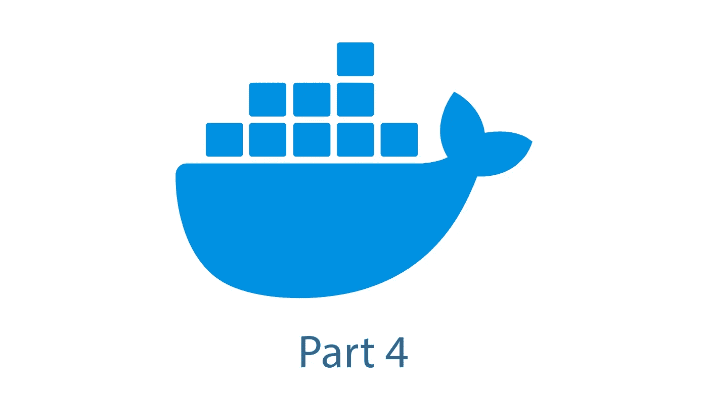

# Docker 简介—第 4 部分

> 原文：<https://blog.devgenius.io/introduction-to-docker-part-4-c487ebf4bdaf?source=collection_archive---------14----------------------->

## 如果你认为你知道关于 Docker 的一切，你应该看看这些资源！

欢迎回到我介绍 Docker 的最后一部分。前三部分介绍了使用 Docker 时最重要的概念。第一篇描述了 Docker 的**主要部分，第二篇介绍了使用 **Docker CLI** 管理 Docker 资源的最重要命令，第三篇展示了基于 **Docker Compose** 的多容器环境。如果您还没有阅读前三部分，请点击此处查看:**

 [## Docker 简介—第 1 部分

### 如果你曾经面临“它在我的机器上工作的问题”，Docker 可能是一个简单的解决方案

blog.devgenius.io](/introduction-to-docker-part-1-7646c995282c)  [## Docker 简介—第 2 部分

### 如果你曾经面临“它在我的机器上工作的问题”, Docker 可能是解决方案。

blog.devgenius.io](/introduction-to-docker-part-2-73b36d0722e0)  [## Docker 简介—第 3 部分

### 如果你曾经面临“它在我的机器上工作”的问题，Docker 可能是一个简单的解决方案

blog.devgenius.io](/introduction-to-docker-part-3-9034ba335250) 

这将是本系列的最后一部分，在这一部分中，我将介绍一些获得关于 Docker 的额外信息的来源，这将有助于将其集成到您的日常工作中。

# 官方文件

说到 Docker，最重要的资源是 Docker 提供的官方文档。在那里可以找到入门、下载和安装说明、不同主题的指南、特定语言的指南以及所有命令的参考。

 [## 码头文件

### Docker 文档的主页

docs.docker.com](https://docs.docker.com/) 

## Docker 撰写的文档

官方文档的一个重要子部分是关于 Docker Compose 的部分，因为单个容器在大多数情况下是不够的。

 [## Docker 编写概述

### 加速 Docker 桌面的新功能 Docker 桌面帮助你在 Mac 和…

docs.docker.com](https://docs.docker.com/compose/) 

# Dockerhub

在获取不同预定义图像及其配置可能性的信息时，Dockerhub 会非常有用。如果你正在寻找一个特定的图像，请查看 Dockerhub。

 [## Docker Hub 容器图像库|应用容器化

### 编辑描述

hub.docker.com](https://hub.docker.com/) 

# 科德克劳德

Kodekloud 为绝对的初学者提供了一个课程，处理初学者需要知道的最重要的主题和命令。最棒的是，这是一门真正的实践课程，所以你很快就会知道你是否真正理解了这些概念。看看吧，这是免费的！

 [## 面向绝对初学者的 Docker

### 通过简单易行的动手实验学习 Docker 4.8 学生如何评价 kode cloud 480000+学生授课教师:Mumshad…

kodekloud.com](https://kodekloud.com/courses/docker-for-the-absolute-beginner/) 

# 码头工人课程

关于 Docker 的另一个入门级课程也涉及一些细节，可以在这里找到:

 [## 面向初学者的 Docker 教程

### 学习使用 Docker 轻松构建和部署您的分布式应用程序到云中，Docker 由…

docker-curriculum.com](https://docker-curriculum.com/) 

# 结论

总而言之，互联网上有很多资源可以扩展你在集装箱领域的知识，尤其是 Docker。官方 Docker 文档还包含一个有价值的资源列表。

 [## 教育资源

### 预计阅读时间:2 分钟 Docker 和更广泛的 Docker 专家社区已经将许多不同的…

docs.docker.com](https://docs.docker.com/get-started/resources/) 

但一如既往，这是最好的学习方法，通过弄脏你的手。尽可能多地尝试 dockerize，以获得 Docker 领域的真正专家，并在日常生活中愉快地使用它。

如果你觉得这篇文章和这个系列很有用，请与你的朋友分享，留着以后再看👏甚至是 5️⃣0️⃣

如果你对软件开发和 IT 领域的其他话题感兴趣，请跟我来💯