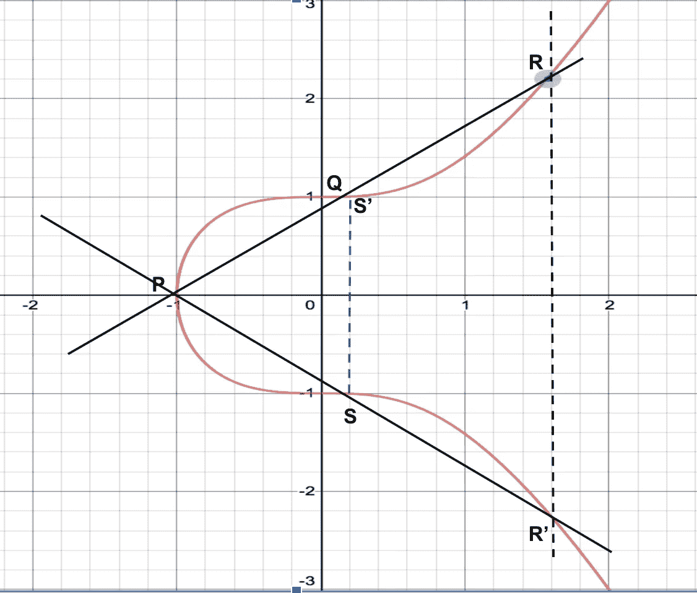

# 椭圆曲线密码简介

> 原文：<https://blog.devgenius.io/introduction-to-elliptic-curve-cryptography-567e47b0e49e?source=collection_archive---------2----------------------->

简单的椭圆曲线密码

**公钥加密**

# 介绍

在过去的一个世纪里，世界在密码学和计算机安全领域取得了前所未有的进步。在当今世界，所有电子设备都使用加密技术进行安全通信。自从二战时期纳粹使用恩尼格玛机进行军事通信以来，我们已经走过了漫长的道路。随着世界被量子霸权所吸引，加密可能会成为历史。

在本文中，我们将了解椭圆曲线加密(ECC)的基本原理。本文将涉及 ECC 的高级工作，而不深入研究数学细节。在此过程中，我们还将了解公钥加密的基础知识，以及 ECC 优于 RSA 的原因。

# 经典密码学

在非对称密钥密码出现之前，世界上广泛使用对称密钥密码。假设有两方通过网络通信，让我们称他们为爱丽丝和鲍勃。爱丽丝想给鲍勃发一些信息。

**一个人在网络上阅读消息**

网络上的任何人都可以读取正在交换的消息。在设计这样一个系统时，确保消息的*保密性*是至关重要的。这个问题通过**对称** **密钥**密码术解决了。这种机制在通信双方之间使用共享秘密或密钥。让我们看一个例子。

爱丽丝和鲍勃将首先见面并交换钥匙。Alice 在发送消息时会对消息进行加密，然后将其发送给 Bob。由于消息是加密的，只有拥有密钥的人才能解密消息。在这种情况下，只有 Bob 能够用共享密钥解密消息。类似地，Bob 也将向 Alice 发送加密的消息，并且通信将来回发生。这确保了消息在通信中的机密性。

**对称密钥加密**

你认为上述方法的缺点是什么？其中一个主要缺点是密钥必须与另一方共享。如果双方地理位置分离&无法见面，会发生什么？

其次，假设你正在设计一个类似比特币的网络。你会和其他人分享你的钥匙吗？此外，如何对发送消息的用户进行身份验证？换句话说，你怎么知道给你发信息的人是爱丽丝，而不是其他人呢？**公钥**或**非对称密钥**密码学回答以上问题。

# 公开/非对称密钥加密

公钥加密不是使用单个密钥进行加密，而是使用一对密钥，即公钥和私钥。这两把钥匙在数学上有联系。私钥就像一个密码，只有用户存储它。公钥充当您的地址&世界上的每个人都知道它。一个简单的形象比喻是，私钥就像你的 ATM 密码，而公钥就像你的银行账户。

世界上任何人都可以用你的公钥加密给你发信息。加密的邮件只能用您的私钥解密。因为只有你知道你的私人密钥，它保证没有其他人可以解密发送给你的消息。同样，当你想给别人发消息时，你可以用那个人的公钥加密并发送消息。

**公钥加密过程**

*椭圆曲线密码*是一种公钥密码。我们将在接下来的章节中了解 *ECC* 的基本原理。我们将学习椭圆曲线，在其上执行的操作，以及著名的陷门函数。

# **椭圆曲线**

椭圆曲线是椭圆曲线加密的基础。是由公式给出的数学曲线— **y = x + a*x + b** ，其中‘a’和‘b’为常数。下面是曲线 **y = x + 1** 的示意图。

**椭圆曲线**

您可以观察到上述曲线的两个独特特征:-

*   该曲线关于 X 轴对称。曲线上位于 X 轴上方的每一点都有一个倒影
*   如果画一条非垂直线，它最多可以与曲线相交 3 点

# **椭圆曲线上的运算**

椭圆曲线定义了加法运算，其中在曲线上选择两个点。在它们之间画一条线，找到这条线与曲线的交点。此外，X 轴上该点的反射成为结果。以下是上述操作的说明。

**椭圆曲线上的加法运算**

在上图中，选择了两点 **P** 和 **Q** 。连接这两点的直线在点 **R** 处与曲线相交。点 R 在 X 轴上的反射是**R’**。

现在可以用点 **P** 和**R’**重复该过程。如下图所示，这两个点的相加将导致 X 轴上方曲线上的**S’**。

**点 P 和 R’的相加产生 S’**

这个过程可以重复，被称为椭圆曲线标量乘法或点乘法。

# **陷门功能**

陷门函数构成了公钥加密的基石。简单地说，这个函数在一个方向上很容易计算，但在相反的方向上很难计算。

举个简单的例子，你需要找到两个乘积为 39203 的质数。你将从数字 2、3、5、7 等开始，直到你找到一个能除 39203 的质数。但是，如果给定其中一个数字是 197，您可以通过输入 39203 / 197 = 199 找到另一个数字。

通过增加位数，可以使上面例子中的函数变得困难。给定两个质数，你可以很容易地相乘并找到结果。然而，给定一个结果，很难(取决于数字)找到两个素数，使它们的乘积等于结果。

相同的概念被扩展到椭圆曲线。我们在曲线上选择一个点，并将其自身乘以' ***n*** '次。给定起点和' ***n*** '，我们可以很容易地找到目的点的位置。如果只给你目的点&起点，就很难求出' **n** 的值。

**椭圆曲线陷门功能示意图**

上图中，如果从 **P** 和 **n=2** 开始，就可以到达**S’**。然而，给定点 **P** 和**S’**，几乎不可能计算出 **n** 的值。

# **生成 ECC 中的公钥&私钥**

在曲线上选择预定的点。这个点就是众所周知的生成点( **G** )。私钥是随机生成的，对应于数字' **n** '。生成点( **G** )必须乘以自身的 **n** 倍才能找到点 **K** ，这就是公钥。

**点 G 与自身相乘**

加上一个点 G 本身就相当于在点 **G** 处画一条相切于曲线的切线。该切线与曲线相交于点 **-2G** 。点 **-2G** 在 X 轴上的反射为 2G。2G 与自身相乘得到 4G，以此类推，我们可以计算 8G，16G，32G，等等。

国家标准和技术研究所(NIST)已经用一组常数定义了椭圆曲线的标准。比特币用的是 secp256k1 也就是 **y = x + 7** 。

# **为什么要用椭圆曲线加密？**

ECC 帮助我们以更短的密钥长度实现与 RSA 相同的安全级别。例如，256 位 ECC 密钥提供的安全性相当于使用 RSA 的 3072 位密钥。

[Universal Security](https://eprint.iacr.org/2013/635.pdf) 引入了加密碳足迹的新概念。它将破解密码算法所需的能量与同样的能量可以烧开的水量进行比较。破解 228 位 RSA 密钥需要足够烧开一茶匙水的能量。而破解一个 228 位的 ECC 需要烧开地球上所有的水所需的能量。

与 RSA 相比，ECC 需要的 CPU 周期要少得多。在移动设备、可穿戴技术、比特币网络上实现 ECC 远比使用 RSA 高效。借助 ECC，我们可以实现 10%的存储和带宽优化。

# **ECC 的实际应用**

ECC 在日常生活中被广泛采用。以下是一些应用:-

*   比特币网络使用 ECDSA(椭圆曲线数字签名算法)进行认证交易
*   SSL/TLS 用于客户端和服务器之间的安全通信
*   政府用来保护内部通信的安全

# **参考文献**

*   [Cloudflare 博客](https://blog.cloudflare.com/a-relatively-easy-to-understand-primer-on-elliptic-curve-cryptography/)
*   [椭圆曲线理论](https://www.math.brown.edu/~jhs/Presentations/WyomingEllipticCurve.pdf)
*   [图纸](https://www.desmos.com/calculator/ialhd71we3)
*   [掌握比特币](https://unglueit-files.s3.amazonaws.com/ebf/05db7df4f31840f0a873d6ea14dcc28d.pdf)
*   [封面图片](https://www.google.com/url?sa=i&url=https%3A%2F%2Fwallpapersafari.com%2Fencryption-wallpapers%2F&psig=AOvVaw30KqM6ffGXeUMMjBmn4YfO&ust=1591417745121000&source=images&cd=vfe&ved=0CAIQjRxqFwoTCKiC_-bs6ekCFQAAAAAdAAAAABAE)