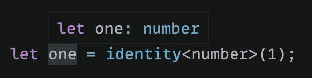
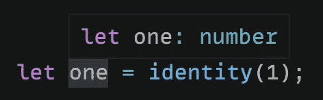
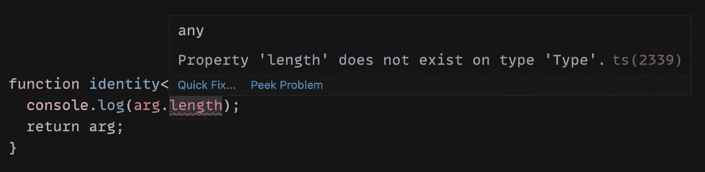
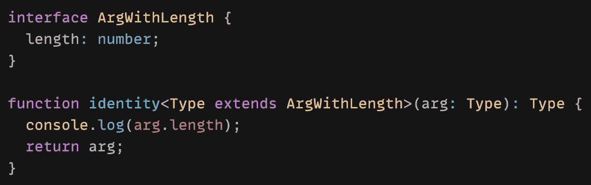
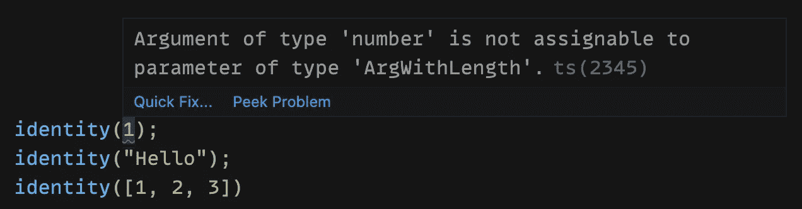

# TypeScript 中的泛型介绍

> 原文：<https://blog.devgenius.io/introduction-to-generics-in-typescript-e81ed146a330?source=collection_archive---------1----------------------->

## 什么是泛型，我们如何在 TypeScript 中使用它们？


照片由[西格蒙德](https://unsplash.com/@sigmund?utm_source=medium&utm_medium=referral)在 [Unsplash](https://unsplash.com?utm_source=medium&utm_medium=referral) 上拍摄

泛型是编程中一个强大的工具，可以帮助您防止代码重复。它们提供了一种创建可重用函数的方法，这些函数可以处理多种类型，而不是单一类型。

在本文中，我将介绍 TypeScript 中的泛型。我们将通过一些基本的例子来看看如何使用它们。

如果您不熟悉 TypeScript，请阅读下面的文章开始学习。

[](https://levelup.gitconnected.com/type-annotation-vs-type-inference-in-typescript-85ba2194ebe1) [## TypeScript 中的类型注释与类型推理

### 如何在 TypeScript 中向变量添加类型

levelup.gitconnected.com](https://levelup.gitconnected.com/type-annotation-vs-type-inference-in-typescript-85ba2194ebe1) 

# 如何在 TypeScript 中使用泛型？

为了开始使用泛型，我们将看一看 TypeScript [文档](https://www.typescriptlang.org/docs/handbook/2/generics.html#hello-world-of-generics)中所示的最基本的例子。

```
function identity(arg: number): number {
  return arg;
}function identity(arg: string): string {
  return arg;
}
```

这里我们有两个函数。一个接受一个数字作为参数并返回该数字；另一个接受一个字符串作为参数并返回该字符串。

遵循 TypeScript 的规则，在第一个`identity`函数中，我只能传入一个数字作为参数。如果我试图传递一个字符串或任何其他类型，我们会得到一个错误。在第二个`identity`函数中，我只能传入一个字符串作为参数。如果我试图传递一个数字或任何其他类型，我们将得到一个错误。

我们可以通过将这两个函数合二为一来减少可重复的代码。一种方法是使用`any`类型。如果我们给`identity`函数的参数和返回值一种类型的`any`，我们可以传入任何我们想要的值。

```
function identity(arg: any): any {
  return arg;
}
```

现在我们可以向这个函数传递一个数字或者一个字符串。然而，这种方法首先否定了使用 TypeScript 的理由。通过使用`any`类型，我们丢失了参数的类型信息。

更好的方法是在函数中添加一个类型变量。这就是泛型发挥作用的地方。我们可以通过在`<>`括号中传递一个类型来给函数添加一个类型变量。

```
function identity<Type>(arg: Type): Type {
  return arg;
}
```

这里，我们添加了一个名为`Type`的类型变量。类型变量正被用作参数类型和返回值类型。

现在，我们仍然可以传递一个数字或者一个字符串作为参数。这一次，我们可以显式地告诉 TypeScript 类型，它将被用作参数和返回值的类型。



或者我们可以使用类型参数推断让 TypeScript 自动设置类型。



# 如何创建通用约束？

如果我需要访问参数的属性或方法呢？例如，如果我想访问参数的`length`属性。

```
function identity<Type>(arg: Type): Type {
  console.log(arg.length)
  return arg;
}
```

不幸的是，TypeScript 会抱怨这一点。



目前，参数可以是传递给泛型函数的任何类型。这意味着它可以是字符串、数字或任何类型。如果参数是一个数字，`length`属性将不存在。这就是为什么我们会得到一个错误。

在这种情况下，我们可以创建一个描述约束的接口。这里我们可以说，参数必须有一个`length`属性，也就是一个`number`。

```
interface ArgWithLength {
  length: number;
}
```

然后，我们将在函数中扩展该类型，以包含该约束。

```
function identity<Type **extends ArgWithLength**>(arg: Type): Type {
  console.log(arg.length)
  return arg;
}
```

使用 extends 关键字后，我们会看到错误已经消失了。这是因为我们添加了一个约束，即无论传递给函数的参数是什么，都必须有一个`length`属性。



如果我试图将一个数字传递给`identity`函数，我们会得到一个 TypeScript 错误。这是因为数字没有`length`属性。但是，如果我们传递一个字符串或者数组，就没问题了。这是因为它们都有一个`length`属性。



# 结论

感谢阅读！我希望这篇文章对您开始使用 TypeScript 中的泛型有所帮助。当我第一次开始学习泛型时，它们看起来真的很复杂。但是在花一些时间学习它之后，它们实际上并不那么难理解。

能够使用泛型是一个强大的工具，可以帮助您编写可重用的函数，并防止重复代码。

如果您想继续学习更多关于 TypeScript 的知识，请查阅下面的文章。

[](https://javascript.plainenglish.io/typescript-tip-convert-an-array-of-strings-into-a-string-literal-union-type-ee46c2c6e337) [## TypeScript 提示:将字符串数组转换为字符串联合类型

### 使用“const”断言和索引访问类型

javascript.plainenglish.io](https://javascript.plainenglish.io/typescript-tip-convert-an-array-of-strings-into-a-string-literal-union-type-ee46c2c6e337)