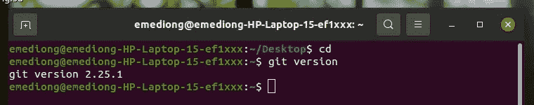
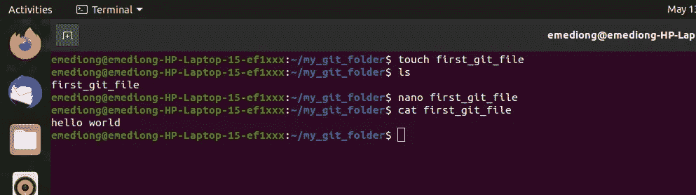

# GIT 简介

> 原文：<https://blog.devgenius.io/introduction-to-git-785f23d6beaf?source=collection_archive---------17----------------------->

您是否正在为高性能软件和 DevOps 团队寻找最佳实践？Git(版本控制)工具可能正是你所需要的。


又是我，是的，欢迎回到我的博客。今天我们将讨论一个叫做(git)的开源版本控制系统。你可能是来学习 git 的，这样你就可以在你的简历上增加一项新技能，对吗？太好了，即使不是这样，有你在这里还是很好。

**入门—关于版本控制**

在深入研究 git 之前，重要的是至少要理解 git 的保护伞。

## **版本控制**

什么是“版本控制”，为什么要关注它？版本控制是一种系统，它记录一段时间内对一个文件或一组文件的更改，以便您可以在以后调用特定的版本。

如果你是一个图形或网页设计师，并希望保留图像或布局的每个版本(这是你最想做的)，版本控制系统(VCS)是一个非常明智的选择。它允许您将选定的文件恢复到以前的状态，将整个项目恢复到以前的状态，比较一段时间内的更改，查看谁最后修改了可能导致问题的内容，谁引入了问题，何时等等。使用 VCS 通常还意味着如果你把事情搞砸了或者丢失了文件，你可以很容易地恢复。

## **什么是饭桶？**

简而言之，Git 是什么？这是需要理解的一个重要部分，因为如果你理解 Git 是什么以及它如何工作的基本原理，那么有效地使用 Git 对你来说可能会容易得多。当你学习 Git 时，试着忘记你可能知道的关于其他 VCS 的东西，比如 CVS、Subversion 或 Perforce——这样做可以帮助你在使用这个工具时避免微妙的混淆。尽管 Git 的用户界面与其他 VCS 非常相似，但是 Git 以非常不同的方式存储和思考信息，理解这些差异将有助于您在使用它时避免混淆。

## 命令行


使用 Git 有很多方法。有原始的命令行工具，也有许多不同功能的图形用户界面，但我的专业建议是您使用命令行，不是因为这是完成它的唯一方法，而是因为它非常简单，可以帮助您更快地学习 git 命令。其次，你可能有一天会参加 DevOps 的面试，你肯定不想给人留下你不了解命令行 lolz 的印象。

首先，让我们在您的计算机系统上运行 git。

[下载并安装最新版本的 Git](https://git-scm.com/downloads) 。

或者，您可以运行

```
$ sudo apt install git
```

下载完成后，您可以通过在终端上键入 *git 版本来确认。*

```
git version
```



当你显示出来的时候，那么欢呼你成功地安装了 git。

以下是从终端开始的方法。假设您在一个文件夹中有一个文件，或者您想创建一个新的文件，您想将它的内容推送到 git，只需打开该文件夹或创建一个新的文件夹。要创建一个新的文件夹，运行这个命令 **mkdir** "无论你想给这个文件夹起什么名字"例如…

```
mkdir my_git_folder
```

让我们称它为**我的 git 文件夹**…所以它将是 mkdir my_git_folder。现在让我们把 cd 放进那个文件夹。

```
cd my_git_folder
```

在该文件夹中，我们创建一个名为“first git file”的文件…所以现在它将是-touch first_git_file，这是因为您使用 touch 命令创建了一个新文件。

```
touch first_git_file
nano first_git_file
```

键入任何内容，例如“Hello world”

看看我的这张截图。



接下来，运行下面的命令

```
git init
```

这将在指定目录中创建一个空的 Git repo。不带参数运行，将当前目录初始化为 git 存储库。

```
git config user.name 
```

上述命令将定义用于当前 repo 中所有提交的名称。开发人员通常使用 global 标志来设置当前用户的配置选项。你可以用你的名字。

```
git add <mention the name of file you want to add>
e.g git add document.txt
```

上述命令为下一次提交转移所有更改。

```
git commit -m "discription"e.g git commit -m "fixed an error on line 6"
```

上面括号中的命令是您编写提交消息的地方。这样做的原因是，其他查看您代码的人可以知道提交的内容。

```
git status
```

以上命令列出了暂存、未暂存和未跟踪的文件。

```
git log
or
git log --oneline
```

这些使用默认格式显示整个提交历史。oneline 选项用于将输出显示为每行一次提交。

*如果你已经走到这一步，那就恭喜你。为下一篇关于 git (Git 第二部分)的文章做好准备*

祝你在学习旅途中一切顺利。

**干杯！**