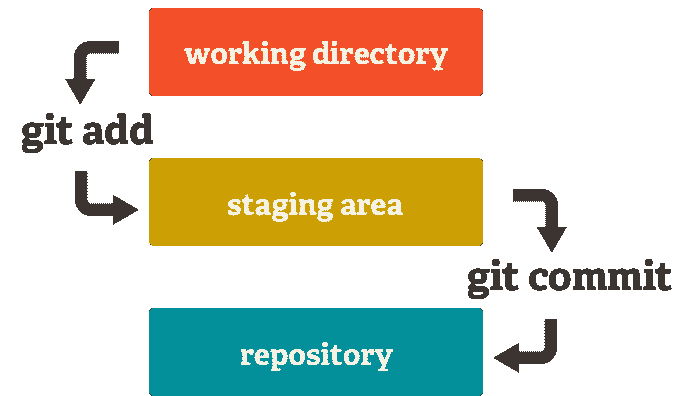
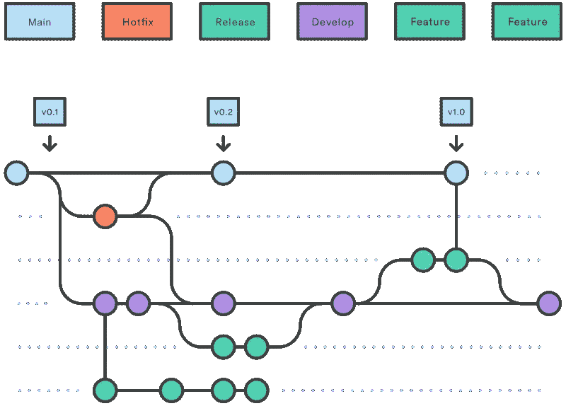
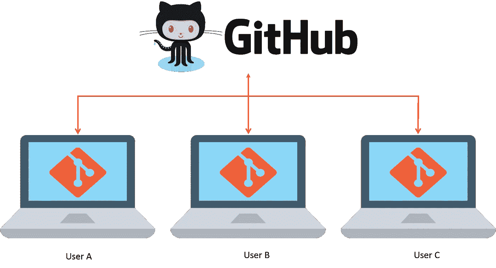

# Git 简介

> 原文：<https://blog.devgenius.io/introduction-to-git-9f6418f36b26?source=collection_archive---------11----------------------->

Git 的入门文章。关键概念、工作流、分支和资源。

# 饭桶

Git 是一个开源版本控制系统，它帮助软件开发团队以一种分布式和灵活的方式处理他们的项目。Git 是由 Linus Torvalds 在 2005 年发布的，他当时正在寻找一个更好的工具来管理 Linux 内核代码中的补丁和协作。

# 版本控制系统

版本控制系统是能够跟踪和管理源代码变更的系统。这些系统为团队提供了多种工具，因此他们可以记录随时间的变化。

版本控制软件在一个特殊类型的数据库中跟踪所有的代码修改。如果开发人员犯了一个错误，就有可能回到过去比较版本。版本控制系统并不强加某种工作方式，但它们确实提供了一系列指导方针和命令来执行所有类型的工作流。

我们可以根据版本控制系统的架构对其进行分类:本地、集中式和分布式。

1.  **本地**:更改保存在本地，不与任何人共享。这种架构是集中式和分布式的前身。
2.  **集中式**:在这个架构中，有一个包含所有版本化文件的服务器和多个从中央位置下载文件的客户端。其中就有 CVS 和 Subversion。
3.  **分布式**:在这种架构中，每个用户都有自己的存储库，不同的存储库之间可以交换和混合版本。其中有 Git 和 Mercurial。

# Git 安装

根据主机操作系统的不同，以下是一些安装参考指南:

*   [**安装到 Linux**](https://git-scm.com/download/linux)
*   [**安装到 MacOS**](https://git-scm.com/download/mac)
*   [**安装到 Windows**](https://git-scm.com/download/win)

# Git 工作流

Git 工作流主要基于通过 Git CLI 提供的命令来操作文件。这里重要的是要知道文件被移动到不同的区域进行操作。这些区域将允许我们知道一个文件是否准备好被发送到存储库或者简单地放弃更改。

这将我们带到了 Git 项目的三个主要部分:工作目录、暂存区和本地存储库。

1.  **工作目录**:这是流程的第一部分，由你当前正在处理的文件组成。在此部分中，文件处于“未跟踪”状态，可以发送到下一个称为“暂存区”的部分。使用命令`git add <file>`执行这两个部分之间的转移操作。
2.  **暂存区**:这是流程的第二个部分，它由准备正式添加到我们本地存储库中的文件组成。在此部分中，文件处于“已跟踪”状态，可以发送到下一个称为“本地存储库”的部分。使用命令`git commit <file>`在这两个部分之间进行传送操作。
3.  本地存储库(Local repository):这是流程的最后一部分，它由正式存储在项目的虚拟存储中的文件组成，并在工作目录中使用最后的正式更改重新开始流程。

请注意，浏览互联网时，我们会发现 Git 状态或区域的不同名称，例如，我们可以发现暂存区域称为索引，或者本地存储库称为 Git 目录。

# Git 分支

Git 工作流的另一个重要特性是使用分支。分支是独立的空间或环境，开发人员可以在不影响原始文件集的情况下使用和处理项目。分支基本上是用来分隔环境，在同一个项目的开发人员之间进行协作，而不会互相影响。分支工作流基于分支和聚合，其中有一个分离点和一个联合点。

[https://www . atlassian . com/es/git/tutorials/comparising-workflows/git flow-workflow](https://www.atlassian.com/es/git/tutorials/comparing-workflows/gitflow-workflow)

# Git 中最常用的命令

Git 目前提供了大量的命令，但是，有一组基本的命令经常在通用级别上用于处理分支和文件操作。

以下是对每种方法的简要描述:

*   **git init** :在 git 中初始化项目的命令，生成本地存储库。
*   **git clone** :从远程存储库下载现有源代码的命令。
*   **git pull** :从远程存储库获取更新到本地存储库的命令。
*   **git push** :将本地存储库的变更推送到远程存储库的命令。
*   **git 分支**:创建、列出和删除分支的命令。
*   git checkout :从一个分支切换到另一个分支的命令，也用于检查文件和提交。
*   **git status:** 命令查询 git 中的状态，提供关于当前分支的所有必要信息。
*   **git merge** :执行分支合并的命令。
*   **git add** :将文件从工作目录区更改到暂存区的命令。
*   **git commit** :将文件从临时区域提交到本地存储库的命令。
*   **git reset** :撤销已提交的提交并根据应用方式返回到暂存区或工作目录的先前部分的命令。

**注意** 🧐:这些命令中的大多数都支持多个选项和标志。参见本文参考资料部分提供的文档。

# 开源代码库

GitHub 是一个 web 平台，它整合了 Git 的版本控制特性，因此可以协同使用。它还包括项目和团队管理功能，以及网络和社交编码的机会。GitHub 充当远程存储库，能够在基于分布式架构的团队之间进行协作。

强调还有 GitLab 或 Bitbucket 等其他版本控制平台。我们提到 GitHub 是因为它是开发者中最受欢迎的平台。

# 资源 Git

*   [**主网站 Git**](https://git-scm.com/) :文档、社区、工具。
*   [**主网站 GitHub**](https://github.com/) :产品、价格、其他解决方案。
*   [**主网站 Atlassian Git**](https://www.atlassian.com/git) :资源、教程、提示。
*   [**Atlassian Git 备忘单**](https://www.atlassian.com/dam/jcr:e7e22f25-bba2-4ef1-a197-53f46b6df4a5/SWTM-2088_Atlassian-Git-Cheatsheet.pdf) : PDF，包含 Git 的命令和描述。
*   [**战略 Git 流**](https://www.atlassian.com/git/tutorials/comparing-workflows/gitflow-workflow) :分行工作流行策略。
*   [**GitHub Git**](https://github.com/git/git) :官方资源库。

# 结局

在本文中，我们以一种概念性的方式介绍 Git，我建议您查阅文档并熟悉命令，以实际的方式学习这个工具。

感谢你远道而来，如果你觉得这很有用，别忘了鼓掌👏。订阅以接收更多内容🔔。

如果你需要额外的帮助，请联系我🤠。

*   ✉️ [**给我发邮件**](mailto:dcortes.net@gmail.com)
*   🤝 [**在 LinkedIn 上联系我**](https://www.linkedin.com/in/dcortesnet/)
*   📮 [**在推特上联系我**](https://twitter.com/dcortes_net)

非常感谢您的阅读，我感谢您的时间。