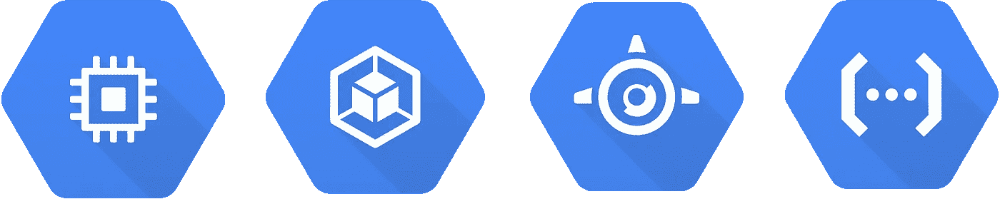

# 谷歌云平台计算简介

> 原文：<https://blog.devgenius.io/introduction-to-google-cloud-platform-compute-b05c2f50a096?source=collection_archive---------6----------------------->

在过去的十年里，云计算变得更加经济高效、可扩展和安全。这导致云成为大多数公司事实上的标准。这个故事旨在概述/介绍[谷歌云平台](https://cloud.google.com/) (GCP)计算。

谷歌云平台(GCP)于 2008 年推出，从那时起，它与 [AWS](https://aws.amazon.com/) 和[微软 Azure](https://azure.microsoft.com/en-us/) 一起成为领先的云提供商之一。谷歌的最终用户产品，如搜索、Gmail 和 YouTube，都是在同一个 GCP 基础设施上内部运行的，这就是为什么 GCP 有良好的地区和区域覆盖的原因。

GCP 提供基础设施即服务(IaaS)、平台即服务(PaaS)和无服务器计算环境。谷歌云提供了 90 多种产品，其中一些关键的计算服务将在本文中讨论。在专题报道中，我将介绍存储、数据库和网络服务。

# 计算服务

主要的 Google 云平台计算产品有 App Engine、Compute Engine、Kubernetes Engine 和云函数。

# 应用程序引擎(GAE)

它是平台即服务(PaaS)，提供自动扩展和完全托管的无服务器平台。您可以在 [App Engine](https://cloud.google.com/appengine) 中使用标准环境(容器预先配置了几个可用运行时之一)或灵活环境(定制支持的运行时或通过提供定制的 Docker 映像或 Docker 文件来提供您自己的运行时)运行您的应用程序，或者您甚至可以使用这两种环境。

它主要支持用 Go、Php、Java、Python、Node.js、C#和 Ruby 编写的应用程序。

对比其他云提供商，App Engine 等于 ***AWS 的弹性豆茎*** 和 ***微软的 App Services*** 。

**定价**大部分取决于实例环境。使用标准环境时，客户端根据实例运行时间收费，另一方面，使用灵活环境时，客户端根据资源使用情况收费。

# 计算引擎(GCE)

它是在谷歌云中运行的可定制的虚拟机(VM)。[计算引擎](https://cloud.google.com/compute)是谷歌云的非托管计算服务，它是基础设施即服务(IaaS)。GCP 确保资源是可用的、可靠的、随时可用的，但是您需要选择和配置平台组件。

Compute Engine 提供预定义的机器类型，其中包含 vCPU 和内存的一般组合，或者您可以通过选择所需的 vCPU 和内存的确切数量来自定义机器。

机器类型按系列分组，您可以选择通用型(性价比最高，用于网站、通用服务器和数据库)、内存优化型(大型内存数据库、分析等)。)，以及计算优化(高性能计算应用、游戏等)。)虚拟机实例。

支持的操作系统(OS)是 Debian、Fedora CoreOS、SUSE、Ubuntu LTS、容器优化操作系统和 Microsoft Windows。

**计算引擎**类似于 ***亚马逊 EC2*** *和* ***Azure 虚拟机*** *。*

定价基于资源使用情况。点击此[链接](https://cloud.google.com/compute/all-pricing)查看更多定价信息。

# 库伯内特发动机(GKE)

这是一个基于云的托管 Kubernetes 服务，用于部署容器化的应用程序。它提供自动扩展、监控、安全性和多集群支持。GKE 是容器即服务(CaaS)，它允许开发者只关注容器和应用程序就可以上传、组织、运行、扩展和管理容器。

Kubernetes 引擎使用**计算引擎**实例作为集群中的节点，其中每个节点运行 Docker 运行时。

对于那些不熟悉 Kubernetes 的人来说， [Kubernetes](https://kubernetes.io/) (k8s)是一个开源的容器编排系统，最初是由 Google 设计的。Kubernetes 由[云本地计算基金会](https://www.cncf.io/)维护。

 [## 生产级容器编排

### Kubernetes，也称为 K8s，是一个开源系统，用于自动部署、扩展和管理…

kubernetes.io](https://kubernetes.io/) 

Google Kubernetes 引擎类似于 ***亚马逊弹性 Kubernetes 服务*** 和****Azure Kubernetes 服务*** *。**

# *云函数*

*Google Cloud 是一个完全无服务器的环境，用于运行响应事件的小代码片段。它是一种功能即服务(FaaS)，允许客户开发、运行和管理应用功能，而无需管理服务器、软件、框架和运行时环境。*

*其中一个好处是定价，它基于函数的执行时间，计量到最近的 100 毫秒，当函数空闲时没有额外的计费。云功能会自动加速和减速以响应事件。*

*函数可以用 Node.js、Python、Go、Java、C#编程语言编写。*

*函数执行由事件触发，该事件可以是来自发布/订阅的消息、HTTP 请求、数据库中的更改或文件上传。*

*谷歌云功能相当于 ***AWS Lambda*** 和 ***Azure 功能*** 。*

**

***好消息！**谷歌云平台为新用户提供 300 美元免费探索、运行、测试、部署工作负载。 [**免费上手**](https://console.cloud.google.com/freetrial?_ga=2.239239811.1041383234.1605962514-1275213322.1603745192&_gac=1.180072278.1606058953.CjwKCAiAtej9BRAvEiwA0UAWXlNVw_SGn1lXRo546iBQ_5m0j2I05vXVfpBK09ytdsaySlC7ticcWhoCxTsQAvD_BwE)*

*感谢您的关注，希望这个故事对您有所帮助。欢迎留下你的评论，让我知道你的想法。**此外，为了避免 GCP 的额外收费，不要忘记在花费 300 美元后关闭实例***