# Java Pathfinder 简介

> 原文：<https://blog.devgenius.io/introduction-to-java-pathfinder-80828b53309a?source=collection_archive---------1----------------------->

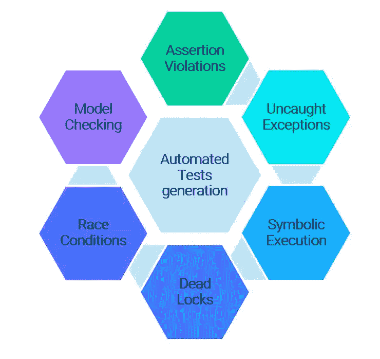

Java 探路者——强大的测试工具

Java Pathfinder (JPF)是一个验证可执行 Java 字节码程序的开源系统。美国宇航局艾姆斯研究中心的健壮软件工程小组开发了 JPF，自 2005 年 4 月起在 http://javapathfinder.sourceforge.net 的 NOSA 1.3 许可下开源

JPF 的核心是一个 Java 虚拟机。JPF 执行普通的 Java 字节码程序，可以存储、匹配和恢复程序状态。它不仅仅执行程序一次(像一个普通的 VM)，而是理论上以所有可能的方式执行，检查所有潜在的执行路径是否违反了属性，比如死锁或未处理的异常。如果它发现一个错误，JPF 报告导致它的整个执行过程。不像普通的调试器，JPF 跟踪每一步它是如何找到缺陷的。

**内置检查** : Java Pathfinder 可以执行下面列出的内置检查。

*   僵局
*   竞赛条件
*   断言违规
*   未捕获的异常

它的主要应用是[并发程序](https://en.wikipedia.org/wiki/Concurrent_computing)的[模型检查](https://en.wikipedia.org/wiki/Model_checking)，以发现诸如[数据竞争](https://en.wikipedia.org/wiki/Race_condition)和[死锁](https://en.wikipedia.org/wiki/Deadlock)之类的缺陷。

# **架构:**

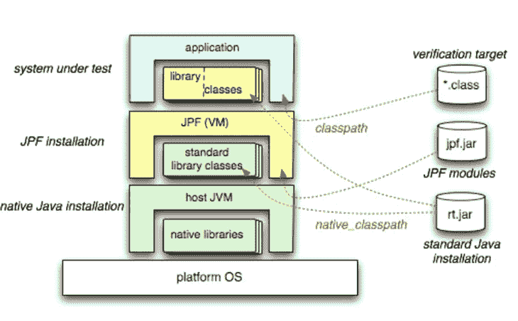

顶层视图

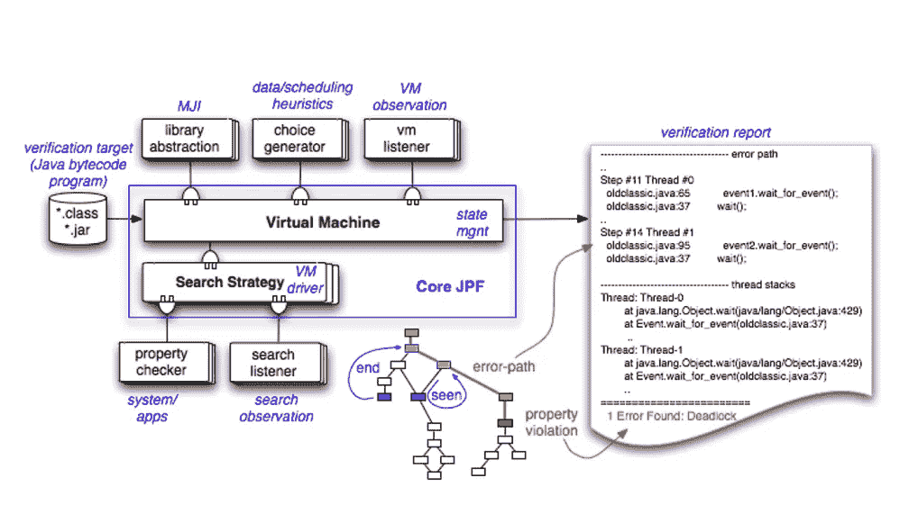

JPF 建筑

## **听众:**

*   听众是与 JPF 互动的首选方式
*   监听器被通知 VM 中的事件
    ,例如当 Java 类执行特定操作时
*   监听器可以与正在执行的代码
    进行交互，例如获取附加信息，如字段值

## **JPF 搜索:**

*   从头开始运行程序(即 main(…)的第 1 行)
*   执行一系列字节码，直到到达一个新的状态
    检查属性
    出错—停止。
*   查看我们是否已经访问过该州
    如果是—返回
    如果不是—访问继任者

# **安装和执行:**

**下载**:[https://github.com/javapathfinder/jpf-core](https://github.com/javapathfinder/jpf-core)T4**先决条件**:最低版本是 Java SE 8。确保您已经安装了 JDK，并且 JAVA_HOME 设置了
**Build&Execute JPF:**[https://git hub . com/javaphathfinder/jpf-core/wiki/如何安装-JPF](https://github.com/javapathfinder/jpf-core/wiki/How-to-install-JPF)

*   使用渐变
*   使用蚂蚁

**JPF IDE 插件:**

*   NetBeans
*   黯然失色

**与 Junit 的集成:** Ant script (build.xml)包含一个测试目标，该目标使用 [JUnit](http://junit.org/) 运行回归测试
**As JAVA 程序:** 最简单的“运行”JPF 的方法是指定一个与您的类相对应的. jpf 文件。该文件包含您要检查的属性。
例如:Java-jar C:\ JPF _ Home \ JavaPathFinder \ jpf-core-Java-8 \ build \ runjpf . jar C:\ JPF _ Home \ JavaPathFinder \ jpf-core-Java-8 \ src \ examples \ racer . jpf
**与 Jenkins 的集成:** Jenkins 可以与 Jenkins 集成，作为 Jenkins 作业定期执行。

# 测试示例:

*   模型检查
*   竞态条件
*   死锁

**模型检查:** 什么是模型检查？

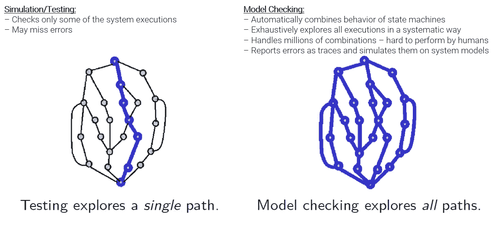

**模型检查**

下面参考 Java 代码及其作为 Java 程序执行后的输出

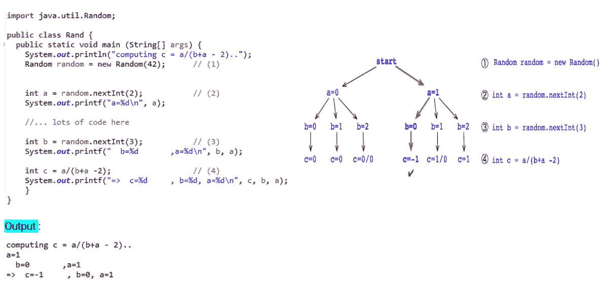

**用于模型检查的 Java 代码示例**

JPF 探索了多种可能的执行，发现了错误条件“除零”

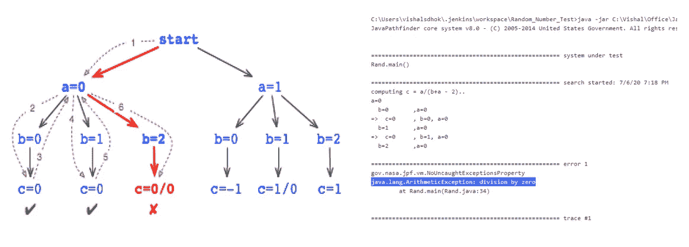

**JPF 发现“除零”错误**

**竞争条件:** 以下所指的 Java 代码及其执行后的输出为 Java 程序

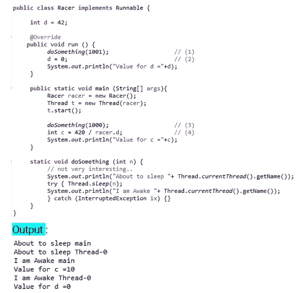

**赛车状态检查 Java 代码示例**

JPF 在代码中检测到种族状况。请参考以下 JPF 执行上述程序的输出。

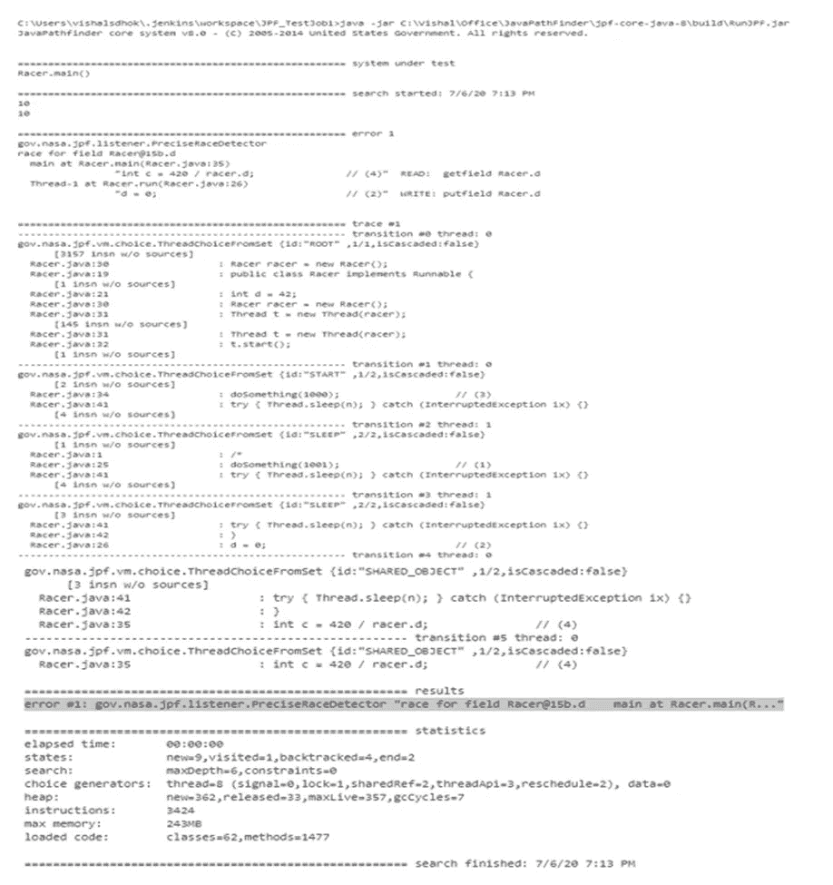

JPF 在代码中检测到种族状况

**死锁条件:** 下面以 Java 代码为例说明代码中的死锁条件

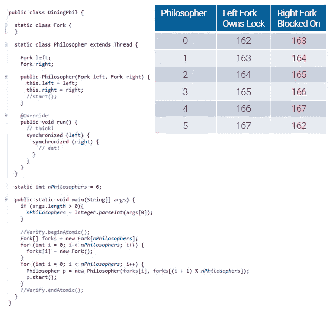

**死锁条件检查的 Java 代码示例**

JPF 在代码中检测到死锁情况。请参考以下 JPF 执行上述程序的输出。

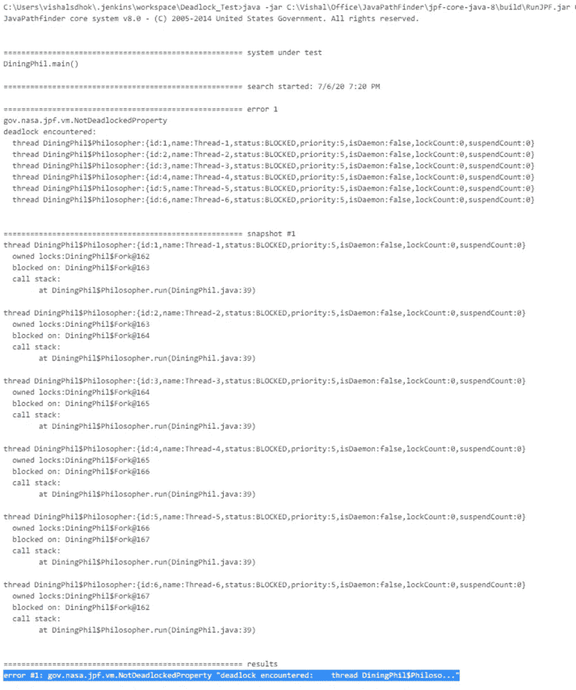

JPF 在代码中检测到死锁条件

**象征性 JPF** :
象征性 JPF 支持象征性处决。请参考下面的例子来理解符号执行。

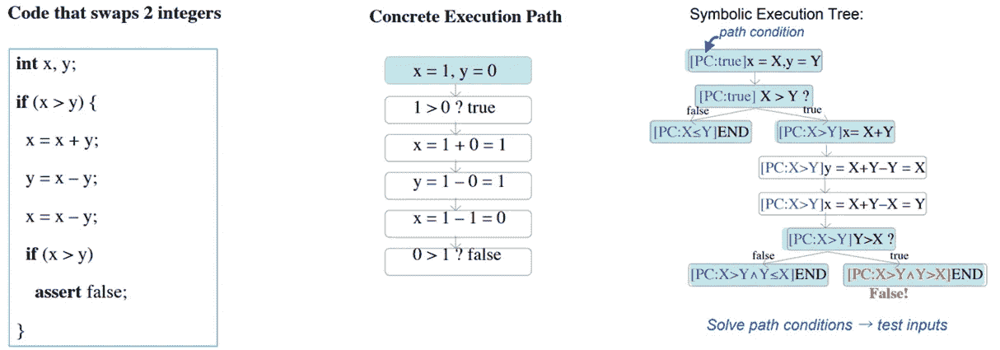

符号执行

*   它是系统的路径探索，在路径生成期间，我们生成并解决许多约束。这些约束是从所分析的代码中的条件收集的。
*   它有变量的符号值和表达式，而不是具体的值和表达式。
*   记住路径条件和程序计数器，并回溯它的覆盖范围。
*   一旦路径条件变得不可满足，搜索就在该路径上停止，因为没有可以通向该路径的输入。
*   主要用于自动化测试用例生成和提高测试覆盖率
*   符号执行与测试生成的模型检查器相结合

# **Java 探路者—可扩展性**

通过其各自的扩展，JPF 还可以用于各种其他目的，包括

*   分布式应用程序的模型检查
*   用户界面的模型检查
*   借助符号执行的测试用例生成
*   低级程序检查
*   程序检测和运行时监控

JPF 是一个开放的系统，可以通过多种方式进行扩展。主要的扩展结构有:

*   侦听器—实现复杂的属性(例如，时态属性)
*   对等类——在主机 JVM 级别(而不是 JPF)执行代码，这通常用于实现本机方法
*   字节码工厂——提供字节码指令的可选执行语义(例如，实现符号执行)
*   选择生成器—实现状态空间分支，如调度选择或数据值集
*   序列化器——实现程序状态抽象
*   出版商—制作不同的输出格式
*   搜索策略—使用不同的程序状态空间遍历算法

JPF 包括一个运行时模块系统，将这样的构造打包到单独的 JPF 扩展项目中。主 JPF 服务器提供了许多这样的项目，包括符号执行模式、数值分析、宽松内存模型的竞争条件检测、用户界面模型检查等等。

# **Java 探路者—参考文献**

【https://en.wikipedia.org/wiki/Java_Pathfinder 

[https://ti.arc.nasa.gov/tech/rse/vandv/jpf/](https://ti.arc.nasa.gov/tech/rse/vandv/jpf/)

[http://javapathfinder.sourceforge.net/](http://javapathfinder.sourceforge.net/)

[https://github.com/javapathfinder](https://github.com/javapathfinder)

[https://www.youtube.com/watch?v=YULakJJDaBg&列表=WL &指数=1](https://www.youtube.com/watch?v=YULakJJDaBg&list=WL&index=1)

[https://www.youtube.com/watch?v=r5jWd4V728c&list = pltigp 6 tmjgpnnh 5 tcvaisq 0 yzjinwsooc&index = 5](https://www.youtube.com/watch?v=r5jWd4V728c&list=PLtIGP6tmJgpnNh5TCVaiSq0yzJINwSOOc&index=5)

[https://dl.acm.org/doi/abs/10.5555/2486788.2487052](https://dl.acm.org/doi/abs/10.5555/2486788.2487052)

[https://link . springer . com/chapter/10.1007/978-3-030-17502-3 _ 18](https://link.springer.com/chapter/10.1007/978-3-030-17502-3_18)

[https://summerofcode . with Google . com/archive/2018/organizations/6274587650162688/](https://summerofcode.withgoogle.com/archive/2018/organizations/6274587650162688/)

[https://www . Reddit . com/r/Java/comments/2 HGB ft/im _ not _ sure _ I _ understand _ what _ Java _ path finder _ is/](https://www.reddit.com/r/java/comments/2hgbft/im_not_sure_i_understand_what_java_pathfinder_is/)