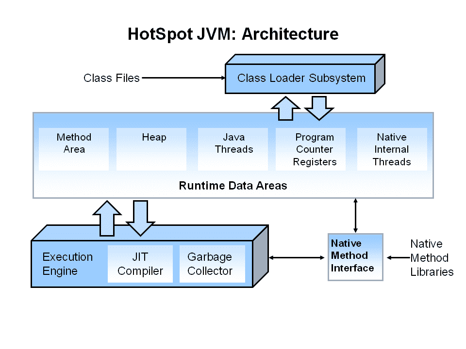

# Java 编程简介

> 原文：<https://blog.devgenius.io/introduction-to-java-programming-e8b9e217228d?source=collection_archive---------12----------------------->


本博客向您简要介绍了 Java 编程语言。

如果你没有 Java 的先验知识，那你就来对地方了。如果你是一个有经验的 java 开发人员，这个博客将作为你的复习工具。

所以让我们开始吧！

# 什么是 Java 编程语言？

***Java*** 编程语言是一种基于类和面向对象的高级语言。但是，它支持原始数据类型 int、char、double 和 float。因此，它不被认为是一种纯粹的面向对象编程语言。Java 有一个独特的功能，让应用程序开发人员**编写一次，在任何地方运行** (WORA)，这意味着编译后的 Java 代码可以在所有支持 Java 的平台上运行，而无需重新编译。

# Java 魔力——JVM！



JVM 内部结构

***Java 虚拟机(JVM)*** 是提供运行时环境来驱动 Java 代码或应用程序的引擎。它将 Java 字节码转换成机器语言。JVM 是 Java 运行环境(JRE)的一部分。JVM 被称为 Java 魔术，因为它允许 WORA 特性。

在 Java 编程语言中，所有的源代码首先都是用以 ***结尾的纯文本文件编写的。java*** 扩展。那些源文件然后被编译成 ***。类*** 文件由 java 编译器-javac 生成。一个 ***。*** 类文件不包含处理器本地的代码；相反，它包含字节码 JVM 的机器语言。然后，java 启动器工具用一个 JVM 实例运行应用程序。

因为 JVM 可以在许多不同的操作系统上使用，同样的 ***。class*** 文件能够在 Microsoft Windows、Solaris OS、Linux 或 Mac OS 上运行。

# Java 运行时环境


JRE 内部结构

***Java 运行时环境(JRE)*** 也可以写成 **Java RTE，**提供了执行 Java 应用的最低要求；它由 Java 虚拟机(JVM)、核心类和支持文件(Util、Lang、Math 等)组成。

# Java 开发工具包(JDK)


JDK 内部结构

***Java 开发套件(JDK)*** 是用于开发 Java 应用和小程序的软件开发环境。它包括 Java 运行时环境(JRE)和开发工具，如解释器/加载器(Java)、编译器(javac)、归档器(jar)等。

# Java 包


Java 包

***Java 中的包*** 是封装一组类、子包、接口的机制。

java 中的包可以分为两种形式，内置包和用户自定义包。

有很多内置的包比如 java，lang，awt，javax，swing，net，util，sql 等等。

# Java 中的自动内存管理

Java 使用一个自动的 ***垃圾收集器*******【GC】***来管理对象生命周期中的内存。程序员决定何时创建对象，一旦不再使用对象，Java 运行时负责回收内存。一旦没有对对象的引用，不可到达的内存就有资格被垃圾收集器自动释放。*

*Java 的自动内存管理模型背后的一个想法是，程序员可以免除必须执行手动内存管理的负担。但是垃圾收集不能防止逻辑内存泄漏，即内存仍然被引用但从未被使用的情况。*

**

*垃圾收集者*

*垃圾收集可能随时发生。理想情况下，它会在程序空闲时发生。如果堆上没有足够的空闲内存来分配一个新的对象，它肯定会被触发；这可能会导致程序暂时停止。在 Java 中，显式内存管理是不可能的。*

# *Java 中的异常处理*

****异常处理****Java 中的异常处理是处理运行时错误的强大机制之一，以便维持应用的正常流程。异常处理是指处理运行时错误的机制，如 ClassNotFoundException、IOException、SQLException、RemoteException 等。**

****

**Java 中的异常处理**

## **Java 异常的类型**

**异常主要有两种类型: ***选中*** 和 ***未选中*** 。这里，一个 ***错误*** 被认为是未检查的异常。根据 Oracle 的规定，有三种例外情况:**

1.  **检查异常**
2.  **未检查的异常**
3.  **错误**

# **抽象类和接口**

## **抽象类**

**一个 ***抽象类*** 是一个声明为`abstract`的类——它可能包含也可能不包含抽象方法。一个 ***抽象方法*** 是一个没有实现声明的方法(没有大括号，后面跟一个分号)，就像这样:**

```
**abstract void moveTo(double deltaX, double deltaY);**
```

**抽象类不能实例化，但可以子类化。**

## **连接**

**Java 中的一个 ***接口*** 就是一个类的蓝图。它有静态常数和抽象方法。该接口没有实现代码，所有方法都是抽象的，即所有方法都是声明的，没有定义任何方法。接口是一种在 Java 中实现抽象和多重继承的机制。Java 接口也**代表了 IS-A 关系**。它不能像抽象类一样被实例化。**

# **Java 集合框架**

**Java 中的 ***集合*** 是一个框架，提供了存储和操作对象组的架构。Java 集合可以实现您对数据执行的所有操作，比如搜索、排序、插入、操作和删除。**

**Java 集合意味着单一的对象单元。集合接口( **java.util.Collection** )和映射接口( **java.util.Map** )是 java 集合类的两个主要的“根”接口。**

****

**集合框架**

**Java 集合框架提供了很多接口(Set、List、Queue、Deque)和类(ArrayList、Vector、LinkedList、PriorityQueue、HashSet、LinkedHashSet、TreeSet)。**

# **OOPS——封装、继承、多态和抽象**

****

**面向对象编程**

*****面向对象编程(OOP)*** 是一种计算机编程模型，它围绕数据，或对象，而不是功能和逻辑来组织软件设计。对象可以定义为具有唯一属性和行为的数据字段。**

**面向对象编程(OOP)是一个编程概念，它关注 4 个原则——封装(T18)、**继承(T21)、多态(T22)**和抽象(T24)**

## **1.包装**

*****封装*** 是将数据(变量)和功能(方法)包装在一起作为一个单一的单元。功能意味着“方法”，数据意味着“变量”。这一切都包在“类”里它是一个蓝图或一套指令。**

**类:类是定义变量和方法的蓝图或原型。例如:**

***类:汽车
数据成员或对象:颜色、类型、型号等。
方法:停车、加速、巡航。***

**对象:现在，一个对象是一个类的样本。就像上面的例子一样，我的汽车是汽车类的对象。**

****变量**:可以是局部的、实例的、静态的。局部变量是在方法体内声明的。实例变量在方法外部声明。它们是特定于对象的。**静态变量**仅在程序执行开始时初始化一次。静态变量首先被初始化，我们将在后面详细讨论静态。**

****方法**:方法是各种各样的功能，它只不过是一组代码，通过名字来引用，可以在程序中的任何一点被调用。您可以将多个值传递给一个方法，它会返回一个值。**

## **2.抽象**

*****抽象*** 是从更大的池中选择数据，只显示与对象相关的细节。下面的图表显示了不同的访问修饰符以及它是如何限制一个类中的数据的。**

****

## **3.遗产**

*****继承*** 是一个类获取另一个类的属性的机制。例如，一个孩子继承了他/她父母的特征。**

```
**class Developer{
  public void writeCode(){
  // writeCode method

}
class BackendDeveloper extends Developer{
  public void writeCode(){
  // writeCode method
  }
}
Class run{
  public static void main (String args[]){
    Developer developerObject = new Developer()
	// writeCode method in class Developer will be executed
    developerObject.writeCode();

    BackendDeveloper backendDeveloperObj = new BackendDeveloper();
    // writeCodemethod in class BackendDeveloper will be executed
    backendDeveloperObj.writeCode();
  }
}**
```

## **4.多态性**

**多态性是一个糟糕的概念，一个名字可以有多种形式，也称为重载。动态多态性是一种机制，通过这种机制，可以在超类和子类中用相同的名称和签名定义多个方法，也称为覆盖。**

*   **重载是同一个类中有多个同名但方法签名不同的方法。**
*   **重写处理两个方法，一个在父类中，一个在子类中，并且两者具有相同的名称和签名。**
*   **子类方法覆盖了超类的方法。**
*   **在覆盖中，子类访问修饰符必须大于父类，例如，如果我们在父类中使用 *public abc()* 而在子类中使用 *private abc()* ，将抛出异常。**

# **Java 中的多线程**

*****多线程*** 是 Java 的一个特性，它允许同时执行一个程序的两个或多个部分，以最大限度地利用 CPU。这样一个程序的每个部分被称为一个线程。一个 ***线程*** 是轻量级子进程，最小的处理单位。**

****

**Java 中的多线程**

**线程可以通过两种机制创建:
1 .**扩展螺纹类**
2。**实现可运行接口****

# **感谢您的阅读！我希望你喜欢它，如果你喜欢，请分享。**