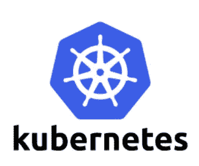
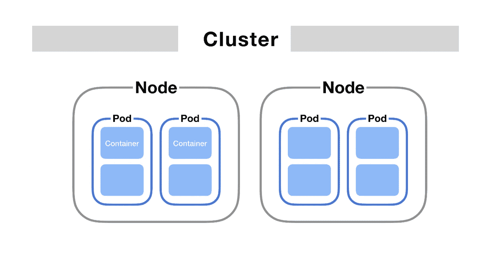
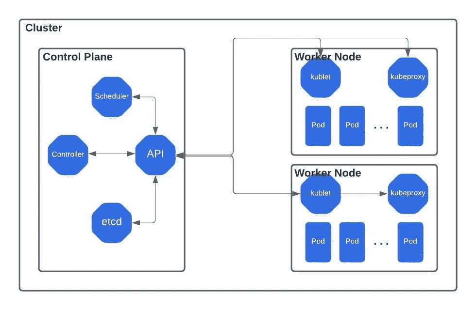
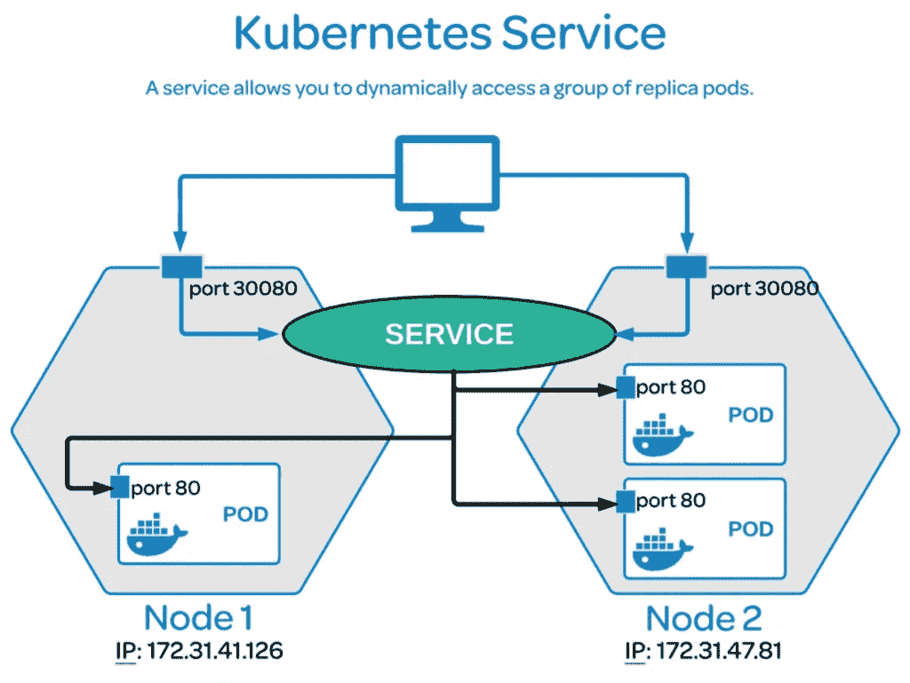
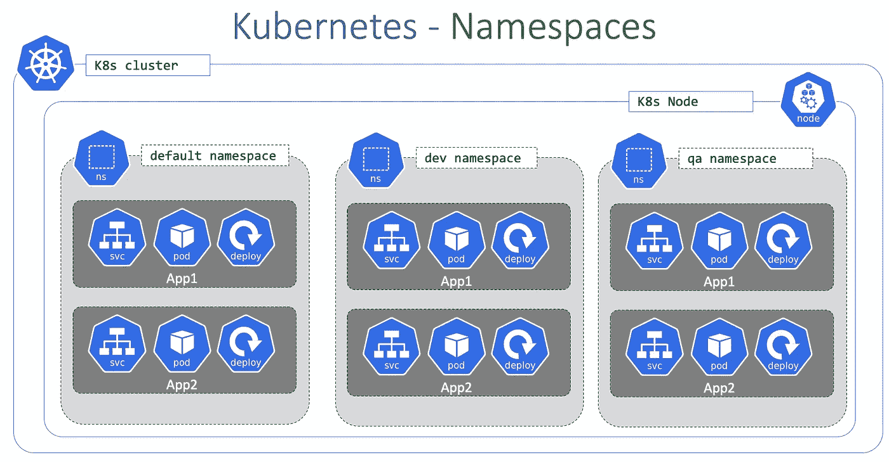
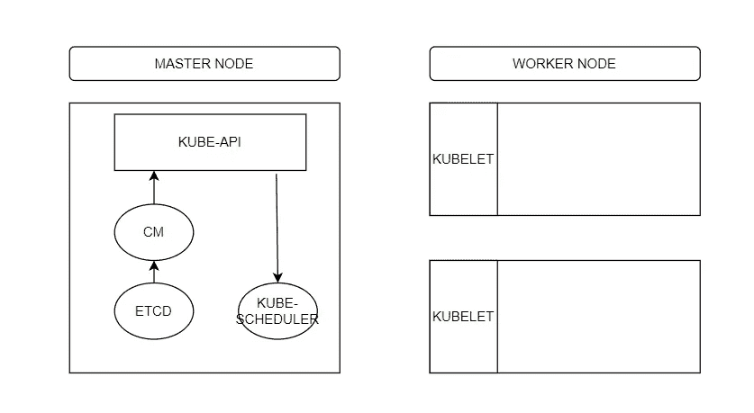
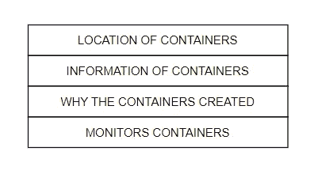
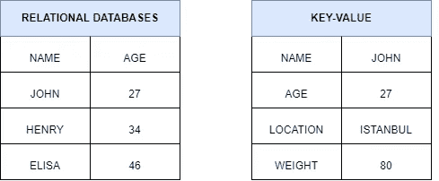

# Kubernetes-1 简介

> 原文：<https://blog.devgenius.io/introduction-to-kubernetes-1-3da06660ab5?source=collection_archive---------16----------------------->

你知道吗？Kubernetes 标志的七根辐条指的是该项目的原名*“九个项目中的第七个”*。

为了更好地理解所使用的术语，我们先来看看术语。

**术语**

1-POD:它是 Kubernetes 中最小的执行单元。pod 封装了一个或多个应用程序。pod 本质上是临时的，如果一个 pod(或它正在处理的节点)出现故障，Kubernetes 可以自动创建该 pod 的新副本来恢复操作。pod 包含一个或多个容器(如 Docker 容器)。

2-NODE:在 Kubernetes 中，节点是一个工作机，可以是虚拟机，也可以是物理机，这取决于集群。每个节点都由控制平面管理。一个节点可以有多个 pod，Kubernetes 控制平面自动处理集群中节点之间的 pod 调度。

3-CLUSTER:Kubernetes 集群是一组运行容器化应用程序的节点。容器化应用程序将一个应用程序与其依赖项和一些必要的服务打包在一起。它们比虚拟机更加轻量级和灵活。通过这种方式，Kubernetes 集群允许更容易地开发、移动和管理应用程序

4-副本集:如果我们希望有 n 个荚果，当数量减少时，它是一个荚果死亡时创建一个新荚果的单位。

5-DEPLOYMENT:DEPLOYMENT 是管理复制应用程序的对象，确保自动替换任何失败或无响应的实例。

部署有助于确保应用程序的一个(或多个)实例可用于服务用户请求。

6-服务:Kubernetes 服务帮助我们将应用程序与其他应用程序和用户连接起来

Kubernetes 服务可以有 4 种不同的类型:ClusterIP、NodePort、LoadBalacer 和 ExternalName。

7-名称空间:Kubernetes 可以在一个真实集群上托管几个虚拟集群，每个虚拟集群称为一个名称空间。

**库伯内特建筑**

Kubernetes 的目标是以容器的形式自动托管应用程序。因此，它可以被倍增和分布，并且容易地与不同的服务通信。

**主节点和组件**

主服务器上的组件实际上是执行集群所有控制功能的单元。除了管理功能之外，这也是做出运营决策的单位。

主节点的基本任务；

组件；

1-ETCD 集群

ETCD 是一个简单、安全、快速的分布式可靠的键值存储

什么是键值存储？

双 KUBE 调度程序

Kube 调度器只负责决定哪个 pod 去哪个节点。实际上，它并不把 pod 放在节点中，那是 kubelet 的工作。

为什么需要它？因为有多个节点和 pod。kube-scheduler 查看每个 pod，并尝试为其找到最佳节点。

3-KUBE-控制器管理器

*   观察状态
*   补救情况
*   节点监控周期= 5 秒
*   节点监视器宽限期= 40 秒
*   Pod 驱逐超时= 5 分钟

节点控制器负责监控其节点的状态，并执行必要的操作来保持应用程序的运行。这是通过 kube-api 服务器来实现的。

节点控制器每 5 秒记录一次其节点的状态。但是它会等待 40 秒，然后将其标记为不可到达。在将其标记为不可达后，它会在 5 分钟内返回，如果在 5 分钟内没有返回，它会将分配给该节点的 pod 移动到健康的节点。

如果 pod 是副本集的一部分，则下一个控制器是复制控制器。复制控制器，负责监控副本集的状态，并确保副本集中所需数量的单元始终可用。

4-KUBE API 服务器

它是集群的大脑。每次运行 kubectl 命令时，都会对 API 服务器进行 REST 调用。

1.  验证用户
2.  验证请求
3.  检索数据
4.  更新 ETCD
5.  调度程序
6.  库伯莱

工作节点和组件

节点组件可以在任何节点上运行，保护正在运行的 pods，并提供 Kubernetes 运行时环境。

1-库伯莱

它是运行在每个 kubernetes 节点上的代理。首先，将它所在的节点注册到 API 服务器作为节点资源，并使它对 Kubernetes 可见。在这个过程之后，它不断地监听 API 服务器，并检查是否有任何 Pods 被调度到它所在的节点。如果有计划的 Pod，它将在其所在的节点上运行 Pod 中定义的容器。

此外，它通过不断检查运行在节点上的容器是否启动来确保它们是可访问的。

2-KUBE 代理

Kube 代理是在 kubernetes 集群中的每个节点上运行的进程。

它的工作是搜索新服务，每次创建新服务时，它都会在每个节点上创建适当的规则，以便将该服务的流量转发到后端 pod。

3 容器运行时

指定用于引导容器的容器运行时。支持 Kubernetes 码头，集装箱…