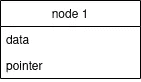

# 初学者链表介绍— JS 实现

> 原文：<https://blog.devgenius.io/introduction-to-linked-lists-for-beginners-js-implementation-55fb18dbc677?source=collection_archive---------3----------------------->

本文的目标是帮助初学者对这种常见的数据结构及其操作有一个基本的了解。首先，我们将在不实现任何编码的情况下，对链表进行抽象的高级视图。然后我们将简单讨论一些重要的概念，如指针和地址。最后，我们将开始用 JavaScript 编写链表，并看一个搜索并将它们插入这个数据结构的例子。让我们开始吧。

照片由[郭佳欣·阿维蒂西安](https://unsplash.com/@kar111?utm_source=medium&utm_medium=referral)在 [Unsplash](https://unsplash.com?utm_source=medium&utm_medium=referral) 上拍摄

# 结构建模

链表是由指针连接在一起的节点序列。你可以把一个节点想象成一个保存数据的容器和一个指向下一个节点的地址或位置的指针。下一个节点也将有一个保存数据的字段和一个指向下一个节点地址的指针，依此类推。

单一节点的结构

下图显示了一个长度为 3 的链表，其中节点数就是链表的长度。节点 1 中的指针连接到节点 2 的地址，节点 2 中的指针指向节点 3 的地址。

三节点链表的结构

我们差不多完成了创建长度为 3 的链表的模型。然而，还有一件事要做。我们如何访问列表的开头？最后一个节点的指针连接或指向什么？在这种情况下，我们需要一个指针指向第一个节点。我们称这个特殊的指针为“**头**”。最后一个节点的指针不能处于未连接状态，因为在一些低级语言(如 c)中这可能是危险的。由于指针指向内存中的地址，如果我们试图访问未连接指针(未初始化)的值，我们可能会使程序崩溃或执行恶意行为。此外，通过将最后一个指针连接到“ **Null** ，使得链表的遍历更加容易。

链表的完整结构

# 什么是指针和地址？

这是一个好问题。虽然本文的目的是讨论链表，而不是指针/地址，但我们将保持简短。然而，根据您来自哪种编程语言，理解这些概念很重要。

所有数据结构都存储在内存(RAM)中。所以这意味着原语(例如，整数、字符串、布尔值..等等)和复杂类型(如数组和对象)都在内存中分配了一些空间。当你在内存中存储一些东西时，会分配一个唯一的地址，这样你就可以在以后访问这些值。

c 语言示例

这意味着链表的节点存储在 RAM 的某个地方，每个节点都有唯一的地址。如果我们知道地址，我们不仅可以知道下一个节点的位置，还可以访问其中的数据。

所以你可能想知道，我们如何分配这些地址，存储它，并在以后使用它？这就是指针发挥作用的地方。

在我们的例子中，你可以把指针看作存储另一个变量或数据结构或节点的地址或位置的变量。

# JavaScript 中的指针

用 JavaScript 之类的高级语言……指针实际上并不存在。相反，每当我们将一个变量赋给一个数组或对象时，我们都是通过引用来赋值的。这意味着变量将保存对**原始**数组或对象的引用或 ***地址*** 。无论如何都不会复制。

显示按引用赋值的 JavaScript 示例

从视觉上看，这相当于下图。

arrayPointer 和 nodePointer 保存原始结构的引用或地址。看看第二个例子是怎样一个长度为 1 的链表？

所以当我们把一个变量赋给一个数组或对象时，它就像是 JavaScript 中的一个“指针”。记住这一点，因为接下来我们将使用这个强大的事实在 JavaScript 中实现链表。

# 在 JavaScript 中实现链表

如前所述，一个链表包含两个节点:数据和指向下一个节点的指针。使用类可以如下实现节点结构。

同样，链表的头部可以使用类来实现。注意，如果一个节点最初没有传递给头部，头部将指向 null。

现在，让我们把这些放在一起，用我们创建的类来创建一个长度为 3 的链表！

这相当于…

因为 head 和 nodes 是从类中作为对象实例化的，所以分配给它们的任何变量都将保存原始对象的地址。因此，“this.head”和“this.next”充当指向下一个节点的指针。

# 新节点的插入示例

这是一个遍历链表并插入新节点的例子。我们将使用上面定义的链表。为了保持简单并展示链表的优势，我将在 node2 和 node3 之间插入新节点(node42)。

新节点的 JavaScript 插入方法

我们也可以一步一步地想象程序执行时发生了什么。首先，我们从一个链表结构和一个未连接的新节点开始。

然后，我们初始化一个临时变量，在遍历列表时跟踪当前节点。temp 变量是一个指针，开始指向头或第一个节点的地址。

当 temp 没有指向最后一个节点时，遍历列表并检查该节点的数据是否与 targetNode 的数据匹配。如果没有，则通过分配 temp = temp.pointer 遍历到下一个节点，其中 temp.pointer 指向下一个节点。记住，列表中的最后一个节点指向 null。

一旦我们找到了 targetNode(在本例中是 node 2)，将 newNode 中的指针指定为指向 node3，并将当前节点指针重新指定为指向 newNode。这部分是在代码的第 35 行到第 39 行完成的。最后，打破循环，因为我们的工作现在已经完成。

# 链表和数组相比如何？

在内存中，链表的节点是随机存储的。对于数组，内存的连续块是并排分配的。事实证明，这两种数据结构在内存中的存储方式，对于您想要执行的操作来说，各有利弊。

优势:

1.  节点的插入和删除很容易。你可以在链表中插入一个新的节点或者删除一个现有的节点，只需要重新排列指针就可以了。

缺点:

1.  搜索一个元素比较慢，因为我们需要从头开始依次遍历节点。我们不能像在数组中那样随意访问元素。
2.  链表可能会使用更多的内存，因为我们需要存储指针。

# 参考

如果您想看到更多的链表操作，请查看 freecodecamp 上的这篇文章

 [## 如何在 JavaScript 中实现链表

### 如果你正在学习数据结构，链表是你应该知道的一种数据结构。如果你真的不…

www.freecodecamp.org](https://www.freecodecamp.org/news/implementing-a-linked-list-in-javascript/) 

要更深入地了解引用变量在 JavaScript 中是如何工作的，请查看这篇文章。作者深入比较了 JavaScript 中的按值赋值和按引用赋值。

 [## 了解 JavaScript 中引用的工作方式

### TL；DR:JavaScript 中没有指针，引用的工作方式与我们通常在大多数……

medium.com](https://medium.com/@naveenkarippai/learning-how-references-work-in-javascript-a066a4e15600) 

然而，如果你是一个视觉学习者，可以看看 Computerphile 的链表。Computerphile 制作了关于计算机科学主题的非常棒的视频。你会注意到他们的大部分视频都是理论性的，只有纸和笔。没有任何编码。我认为这很棒，因为一旦你理解了链表的一般概念，你就可以把它应用到任何语言中！

最后，我要感谢我的旧大学课本。通常我不喜欢参考我大学教授写的教科书，因为它们解释的主题过于复杂。然而，这本书是一个例外，在我的研究中，我发现关于指针和链表的章节非常有用。

使用 C 语言的计算机科学导论，(2011)第二版。

# 结论

哇，那是一次旅行。我希望在这篇文章结束时，你会对链表有更好的理解。概括地说，我们开始一个组件一个组件地构建链表结构的通用模型。然后我们简单讲了一下链表中指针和地址的重要性。最后，用 JavaScript 实现了一个链表，以及一个搜索和插入元素的例子。说到底，是使用链表还是数组，取决于你的需求和情况。如果你要做大量的插入和删除操作，可以使用链表。否则，如果要进行大量的搜索操作，数组会更好。

如果我的文章中有任何技术、语法或拼写错误，请在评论中告诉我，我会改正的。谢谢大家！

*特别感谢*[*Alex Raffa*](https://medium.com/u/13b7c65913c7?source=post_page-----55fb18dbc677--------------------------------)*的同行审阅并提供改进本文的建议。*