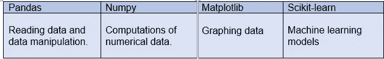

# 机器学习导论

> 原文：<https://blog.devgenius.io/introduction-to-machine-learning-4c8967a391d2?source=collection_archive---------42----------------------->

在 [Unsplash](/s/photos/information-technology-algorithms?utm_source=unsplash&utm_medium=referral&utm_content=creditCopyText) 上由[法扎德·纳齐菲](https://unsplash.com/@euwars?utm_source=unsplash&utm_medium=referral&utm_content=creditCopyText)拍摄的照片

什么是**机器学习？**

机器学习是一种获取数据并将其转化为见解的方式。我们使用计算机能力来分析过去的例子，并建立一个模型来预测新例子的结果。机器学习也被视为人工智能的一个子集。

什么是**机器学习模型？**

它是一个被训练用来识别特定类型模式的文件。你在一组数据上训练一个**模型**，为它提供一个算法，它可以使用这个算法来推理和学习这些数据。

建立机器学习模型有四个步骤。

*   数据准备
*   特征工程
*   数据建模
*   工作指标

## **数据+算法=模型**

**机器学习模型的例子。**

我们每天都会遇到机器学习模型。

*   社交媒体

你知道你的新闻提要是如何充斥着你大部分时间真正感兴趣的广告的吗？这是因为社交媒体平台正在利用机器学习来实现自身和用户的利益。除此之外，这里有几个例子，你已经注意到社交媒体的一个特点，但你不知道它是如何发生的，这些也只是机器学习的应用。

你可能认识的人:正如我们所知，机器学习基于一个简单的概念，即通过经验来理解。如果我们考虑脸书，它会持续注意你联系的朋友，你经常访问的个人资料，你的兴趣，工作场所等等。在不断学习的基础上，一份脸书用户名单建议你可以与之成为朋友。

*面部识别*:你有过这样的经历吗？当你和朋友上传一张照片时，脸书立刻认出了那个朋友，并要求给她/他贴上标签。脸书检查照片中的姿势和投影，注意到独特的特征，然后将它们与你朋友列表中的人进行匹配。这也不过 ML。

**机器学习方法**

根据学习系统可用的“信号”或“反馈”的性质，机器学习方法的早期分类有时会将其分为三大类。

这些是:

*   监督学习
*   无监督学习
*   强化学习

**学习算法的类型**

*   监督学习
*   无监督学习
*   半监督学习
*   强化学习
*   自我学习
*   特征学习
*   稀疏字典学习
*   异常检测
*   机器人学习
*   关联规则

***Python 为 ML***

机器学习专业人士最常用的语言之一是 **Python** 。Python 中的 Pandas、numpy、matplotlip 和 scikit-learn 包有助于解决机器学习问题。

Python 包的用法

所以这里只是一个总结，我希望在我的下一篇文章中讨论监督学习、非监督学习和强化学习。

谢谢你。保持联系！！^_^