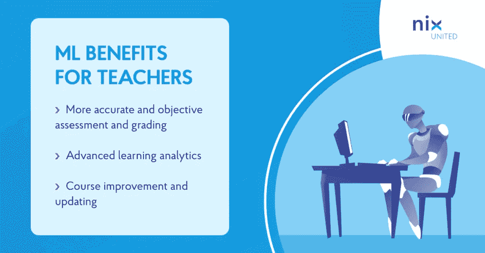
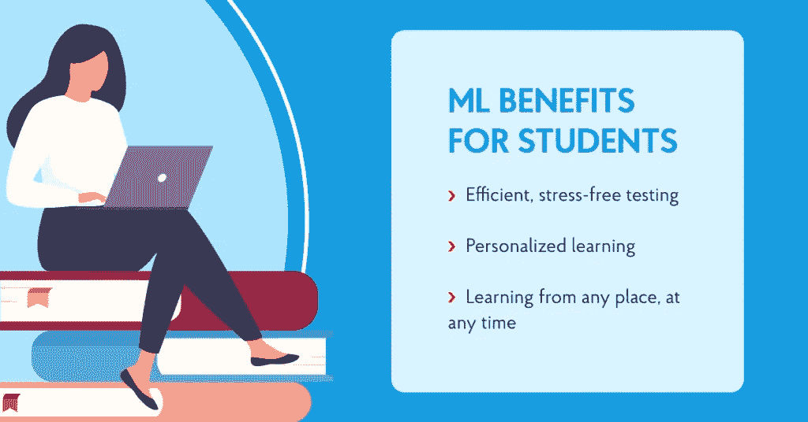

# 教育部门的机器学习简介— NIX United

> 原文：<https://blog.devgenius.io/introduction-to-machine-learning-in-the-education-sector-nix-united-30956416c093?source=collection_archive---------6----------------------->

尽管最新的技术进步不断渗透到包括教育在内的生活的各个领域，但是对于一些教育工作者和教育机构来说，仍然有许多地方存在过时的方法和过时的技术。

另一方面，那些将[机器学习和人工智能](https://nix-united.com/blog/artificial-intelligence-vs-machine-learning-vs-deep-learning-explaining-the-difference/)引入他们的教育过程的人几乎一致地注意到这项创新给他们带来的成功。

为了找出这是为什么，让我们更深入地了解什么是机器学习，以及它在教育领域的应用如何改变这个行业。

# 什么是机器学习？

机器学习(ML)是每个人都听说过但可能难以解释的术语之一。ML 是人工智能技术的应用之一，[正如我们在本文中详述的用于商业的](https://nix-united.com/services/ai-solutions-artificial-intelligence/)人工智能的类型。如果 AI 是机器像人类一样思考并执行模拟其行为模式的任务的能力，那么 ML 就是机器学习以这种方式思考的一种方式。

ML 包括使用数据分析技术学习和改进所学知识的能力。基于 ML 算法的解决方案可以根据从处理(训练)与特定任务相关的数据集获得的“知识”，在没有人工干预的情况下做出决策。

# 在教育领域应用机器学习

机器学习和教育围绕着同一个概念——学习。这就是这个基本原则如何被应用来革新这个行业。

# 适应性学习

在教育中应用机器学习的第一个例子是适应性学习，这意味着教育方法是根据学生的需求和能力量身定制的，而不是全部放在一个篮子里。该系统将识别学生是否正在努力学习该材料，或者该材料对她来说是否太容易了——这两种调整都可以在早期阶段进行，以防止出现表现问题。

适应性学习既可以集成到教室的辅助技术解决方案中，也可以作为一个独立的教育系统。它还可以帮助检测课堂上更小的细节，如过时的课程或教师注意力的不均匀分布。

# 提高效率

人工智能和机器学习通过几乎完全自动化许多重复、数据繁重但时间敏感的任务，如调度、作业和班级管理，增强了教师和教育平台的能力。这可以给教师更多的机会来将他们的努力转向那些需要人类关注的任务。学生获得了更多的“自动化个性化”——系统根据他们的进度进行调整，而不需要任何额外的努力。在线和专有的电子学习平台可以像时钟一样运行人工智能和人工智能。

对于教育工作者来说，腾出时间来做更有创造性的教学工作不仅解决了潜在的生产力问题。它还可以支持教师的福祉，因为他们可以将时间用于完成更有成就感的任务，这有助于教师与观众更深入地互动，学生也更积极地参与到这一过程中。

# 学习分析

教育中的机器学习有助于处理所有教育机构和电子学习平台积累的海量数据。这些数据是如此庞大，以至于人类专家即使想处理也无法在数年内完成。在快速收集和分析这种大数据方面，ML 是一个真正的救星。

因此，ML 让我们能够洞察到仅用我们的眼睛和大脑无法发现的有价值的模式。这些分析可用于多种目的，如更全面地了解教育细节、优化底层流程以及衡量绝对和比较绩效指标。

# 预测分析

预测性分析通常意味着获得对未来可能事件的实际见解，其明确意图是防止不良时刻或推进有益时刻。对于一个成功做到这一点的 ML 系统，它跟踪学生的进步，分析行为模式，并评估表现，以帮助学生释放他们的全部潜力。

教育工作者通过在工作中使用机器学习可以获得的最重要的见解包括:

*   谁最有可能在考试中表现最好或最差
*   如何提高课堂参与度
*   有百分之多少的学生会在即将到来的考试中取得优异成绩
*   有百分之多少的学生将放弃这门课程
*   如果课程材料被所有学生充分理解和参与

# 个性化学习

个性化学习仍然是目前在教育领域使用机器学习的最佳、最有价值的实践之一。在 ML 应用程序出现之前，除非是一对一的私人课程，否则几乎不可能处理和调整学习材料以适应班级中的每个人。

现在有一种更有针对性的方法，允许学生或员工在入职或资格培训过程中按照自己的进度学习材料，甚至选择自己的课程进度和偏好。

# 评估评估

机器学习作为一个有价值的人工智能分支，可以帮助教师和系统比人类更快、更准确、甚至更公正地给作业评分，因为它消除了即使是最优秀的教师也不幸存在的偏见。

人工智能绝不是人类教师的替代品，但它可以通过处理工作中单调的部分来补充他们的工作。评估评价仍然需要人的投入；然而，为了减少劳动，一个特殊的工具使用先进的评分机制来分析不同格式的书面作业。

# 机器学习在教育领域面临哪些挑战？

教育和研究中的机器学习，尽管是一个成功的新事物，但在其被完全接受的道路上仍然遇到一些挑战。最明显的一个问题是数据隐私。

由于机器学习使用各种工具来收集和处理关于学生和教师的机密信息，它对其安全性提出了相当合理的担忧。可以肯定地说，ML 学校的方法仍然需要更多的研究，以确保最高水平的数据安全。

预测准确性也是如此。虽然统计和算法在数据分析和模式识别中有巨大的帮助，但它仍然不是一种确定的表示，也不是真实世界情况的 100%准确的反映，无论它听起来有多么合乎逻辑。

学生在一种环境中的行为和反应——例如，在一个在线课堂或一个新的学习空间——并不一定意味着教师应该在另一个环境中期待相同的模式。

# 机器学习在教育中的应用示例

没有一篇文章不提到几个真实世界的例子是完整的，这不仅是为了证明一个观点，也是为了向那些考虑将 ML 集成到他们的业务中的人展示一些典型的案例。机器学习给了下面这些公司一个机会，让它们在自己的领域大放异彩，并帮助客户实现卓越。

[Grammarly](https://app.grammarly.com/) 是一个语法检查工具，作为虚拟助手来管理一个人可能有的几乎所有写作场景——无论是在学校、工作还是个人生活中。所提供的服务包括语法、拼写、风格、标点符号和抄袭分析，由于机器学习和高级语言处理之间的成功联盟，其卓越的准确性是可能的。

[Bakpax](https://www.bakpax.com/) 是一款为教师节省时间的课后任务自动化工具，使他们能够更有效地使用它，以丰富他们的教学方法或处理其他任务。该系统使用 ML 扫描和破译手写内容，以自动评分论文，给出反馈，共享和预做作业，并将所有教学内容数字化。

SchooLinks 是在教育中使用机器学习的另一个特例。这个平台通过提供全面的规划和指导，帮助学生在大学和随后的职业道路上做好“准备”。SchooLinks 帮助选择大学、实习和工作，建立文件夹，安排会议和活动，并通过分析学生的需求和个性来计算助学金和奖学金。

# 结论

虽然机器学习不是教育领域的通用解决方案，但它确实带来了提升整个教学和学习过程所必需的重要技术进步。[我们现在都在收获大数据的好处](https://nix-united.com/blog/how-big-data-is-transforming-the-education-process/)，普遍的共识是:我们输入系统的数据越大，它们能够做出的预测就越准确。机器学习帮助公司和教育机构提供服务，否则由于有限和陈旧的教学方法而无法获得这些服务。

*原载于 2021 年 11 月 10 日*[*https://nix-united.com*](https://nix-united.com/blog/introductory-guide-to-machine-learning-in-education/)*。*