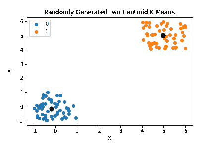

# 机器学习入门:K 的意思是

> 原文：<https://blog.devgenius.io/introduction-to-machine-learning-k-means-e1bb533bea8f?source=collection_archive---------14----------------------->

## 机器学习

## k 在 SKLearn 中的意思是


欢迎来到我们关于机器学习的第四期。在本模块中，我们将讲述 K-Means。K-Means 是一种基于[超参数](https://en.wikipedia.org/wiki/Hyperparameter_(machine_learning))“K”的[聚类算法](https://en.wikipedia.org/wiki/Cluster_analysis)，该超参数决定了将有多少个聚类。超参数只是一个我们可以调整的参数。每个集群都有一个“质心”或中心点，它将成为我们集群的锚。以下是 K 均值算法的步骤:

1.  绘制数据点
2.  随机绘制 K 个质心
3.  计算从每个点到每个质心的距离
4.  给每个点分配一个等于其聚类质心的标签
5.  计算每个聚类的中心→成为新的质心
6.  重复步骤 3 至 5，直到:
7.  质心停止移动
8.  迭代后，不会给数据点分配新的质心
9.  我们达到了最大迭代次数

视频教程:

[https://youtu.be/qONtUFyZ6II](https://youtu.be/qONtUFyZ6II)

在这个介绍性模块中，我们不打算手动实现 K-Means，我们只是要使用 Python 的 SKLearn 模块，它已经为我们实现了一个。让我们开始吧。开始使用 K-意味着我们必须安装一些库。我们将需要`sklearn`库，它有 K-Means 的实现，我们可以直接使用，`numpy`包含数值运算符，`pandas`是 Python 事实上的数据组织库，`matplotlib`我们已经多次使用，是 Python 最好的绘图库。我们可以在命令行中只使用一行代码来安装它们:

```
pip install sklearn numpy pandas matplotlib
```

# 随机生成的样本数据 K 均值

好了，现在我们已经安装了我们的库，我们可以开始了。我们将在这里讨论两个不同的 K-Means 例子。第一个例子是一个有两个质心的随机生成数据的人为例子。例号 2 将出现在由`sklearn`提供的[数字数据集](https://scikit-learn.org/stable/modules/generated/sklearn.datasets.load_digits.html)上。一如既往，我们要做的第一件事是处理我们的进口。

```
import random
import pandas as pd
from sklearn.cluster import KMeans
import matplotlib.pyplot as plt
```

# 生成随机样本数据

接下来，我们将随机生成 100 个数据点。这些点将是两个集群，一个在`(0,0)`周围，另一个在`(5,5)`周围。我们将使用一个循环 100 次的 for 循环来实现这一点，并在偶数迭代中围绕`(0,0)`生成一个集群，在奇数迭代中围绕`(5,5)`生成一个集群。为了随机生成数据点，我们将创建两个值，一个`x`和一个`y`值。每个值都是通过生成一个介于-1 和 1 之间的均匀随机数，并将其与 0 或 5 相加而得到的。一旦我们生成了所有 100 个样本，我们将把我们的数据转换成一个`pandas` `DataFrame`对象，以便进一步处理。

```
samples = 100
data = []
for i in range(100):
    if i%2 == 0:
        base = 0
    else:
        base = 5
    x = random.uniform(-1,1) + base
    y = random.uniform(-1,1) + base
    data.append([x,y])
df_rand = pd.DataFrame(data)
```

现在我们可以使用`sklearn`来实现 2 个集群的 K-Means。首先我们将创建一个 K-Means 对象，然后在我们之前制作的`DataFrame`上调用它的`fit_predict`模块。一旦我们有了标签，我们将把带标签的数据分成两个单独的数据帧来绘制图表。

```
k2means = KMeans(n_clusters=2)
label_rand=k2means.fit_predict(df_rand)
flabels1 = df_rand[label_rand==1]
flabels0 = df_rand[label_rand==0]
```

# 绘制随机样本数据

现在我们所要做的就是用`matplotlib`来散点图。我们还将使用之前创建的 K Means 对象的`cluster_centers_`属性来获取质心。

```
plt.scatter(flabels1[0], flabels1[1], label=0)
plt.scatter(flabels0[0], flabels0[1], label=1)
centroids_rand = k2means.cluster_centers_
plt.scatter(centroids_rand[:,0], centroids_rand[:,1], s=80, color="black")
plt.legend()
plt.xlabel("X")
plt.ylabel("Y")
plt.title("Randomly Generated Two Centroid K Means")
plt.show()
```

一旦我们绘制了这些，我们应该会看到类似下图的东西。



# 数字数据集 K 表示

好了，现在我们已经看到了一个虚构的例子，让我们看看一个更真实的例子会是什么样的。对于本例，我们将对 digits 数据集运行 K 均值。和往常一样，我们将从导入我们的库开始。我们将从`sklearn.datasets`导入`load_digits`模块来加载数字数据集。我们将从分解中导入`PCA`,将这个具有 64 个特征的数据集变成一个具有 2 个特征的数据集。PCA 是[主成分分析](https://pythonalgos.com/2021/11/12/intermediate-machine-learning-principal-component-analysis-pca/)，在本例中，我们将使用它进行降维。我们已经在上面导入了`KMeans`和`matplotlib.pyplot`,但是我把它们放在这里只是为了向你展示我们在这个例子中需要这些库。对于这个例子，我们还需要`numpy`。

```
from sklearn.datasets import load_digits
from sklearn.decomposition import PCA
from sklearn.cluster import KMeans
import numpy as np
import matplotlib.pyplot as plt
```

我们将从加载数字开始，并应用 PCA 将我们的 64 个特征数据集转换为 2 个特征数据集。

```
data = load_digits().data
pca = PCA(n_components=2)
df = pca.fit_transform(data)
```

# 加载和检查数据

一旦我们转换了数据，让我们应用`KMeans`。因为有 10 个数字，所以我们给它 10 个簇。

```
kmeans = KMeans(n_clusters=10)
label = kmeans.fit_predict(df)
print(label)
```

标签将是一个数字列表，其中每个数字是每个数据集的`KMeans`预测。


这就是`KMeans`的全部，让我们来看看当我们设计它的时候会是什么样子。我们将使用`np`，我们的`numpy`库的别名，从我们之前制作的标签中创建一组独特的标签。然后我们将使用我们创建的 K Means 对象中的`cluster_centers_`来获取质心。现在，对于每个独特的标签，我们将在散点图上绘制对应于该标签的数据点。一旦我们绘制了所有的标签，我们将创建一个质心散点图。对于质心，你会注意到我传入了一个`s`参数。这个参数说明了点的大小，一个常规点的大小是 72。

# 绘图数据

一旦我们绘制了我们的数据，我们只需简单地标记我们的图表，添加一个图例，然后打印出来。

```
unique_labels = np.unique(label)
centroids = kmeans.cluster_centers_
for i in unique_labels:
    plt.scatter(df[label==i, 0], df[label==i, 1], label=i)

# s is a size indicator

plt.scatter(centroids[:,0], centroids[:,1], s=80, color="black")
plt.xlabel("X")
plt.ylabel("Y")
plt.title("Digits K Means")
plt.legend()
plt.show()
```

我们的情节应该是这样的:


就是这样，这就是 K-Means 的全部内容。非常简单，只用几行代码就可以实现。

如果你喜欢这篇文章，请在 Twitter 上分享！为了无限制地访问媒体文章，今天就注册成为[媒体会员](https://www.medium.com/@ytang07/membership)！别忘了关注我，[唐](https://www.medium.com/@ytang07)，获取更多关于增长、技术等方面的文章！

# 进一步阅读

*   [长短期记忆(LSTM)在 Keras](https://pythonalgos.com/long-short-term-memory-lstm-in-keras/)
*   [识别命名实体的最佳方式](https://pythonalgos.com/the-best-way-to-do-named-entity-recognition-ner/)
*   [构建你自己的人工智能文本摘要器](https://pythonalgos.com/build-your-own-ai-text-summarizer-in-python/)
*   [Python 字符串操作的完整指南](https://pythonalgos.com/a-complete-guide-to-python-string-manipulation/)
*   [Python 中带伪代码的克鲁斯卡尔算法](https://pythonalgos.com/graph-algorithms-kruskals-algorithm-in-python/)