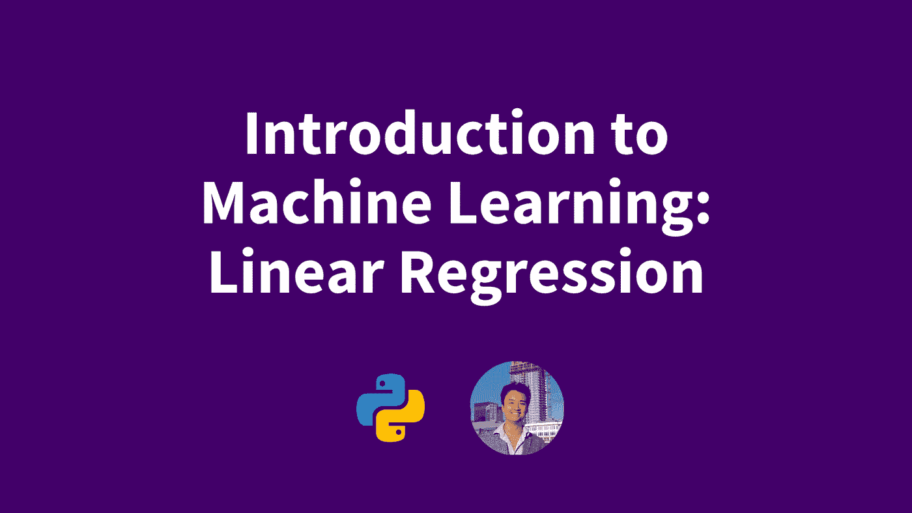
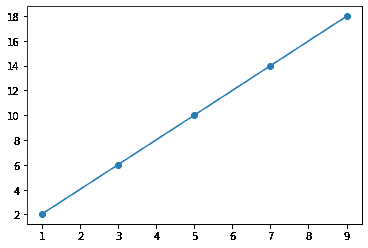
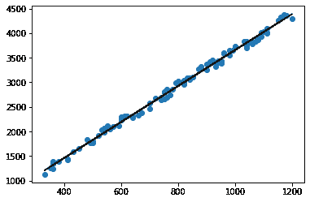
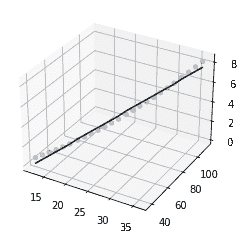

# 机器学习导论:线性回归

> 原文：<https://blog.devgenius.io/introduction-to-machine-learning-linear-regression-fefab2aab1e7?source=collection_archive---------10----------------------->

## 机器学习

## 如何用 SKLearn 做线性回归



机器学习简介:线性回归

线性回归是一种在给定数据集的情况下创建线性方程的技术。当我们期望有一个线性相关性时，我们使用这个，也许像一个公寓的平方英尺与租金价格的比较。

首先，我将通过 sklearn 向您展示一个线性回归如何工作的示例，然后我们将构建一个对. csv 文件运行线性回归的项目。对于这个项目，我们的示例数据将是公寓的平方英尺与租金价格的比较。

在我们完成简单的线性回归之后，我们将讨论一个有多个独立变量的线性回归的例子，通常也称为多元线性回归。

在我们开始之前，如果您没有安装 numpy、pandas、sklearn 和 matplotlib 库，我们需要安装它们，我使用 pip，但是如果您使用 Anaconda Python 安装，您也可以使用 conda。

```
pip install numpy pandas sklearn matplotlib
```

我们将从导入我们需要的库开始。

```
libraries for linear regression with sklearnimport numpy as np
import math
from sklearn.linear_model import LinearRegression
import matplotlib.pyplot as plt
from mpl_toolkits import mplot3d
import random
```

# 随机数据集的线性回归

接下来，我们将从 x 值中随机生成一组 y 值。我们将使函数`y = 2x`的方差为`+/- 0.1`

```
randomize a dataset for linear regressionarr = [1, 3, 5, 7, 9]
def _func(x):
    return 2 * x + random.uniform(-.1, .1)
x_arr = np.array(arr).reshape(-1, 1)
y_1 = [_func(a) for a in arr]
y_arr = np.array(y_1)
```

请注意，我将一组 x 值转换成了一个垂直数组，这对于调用 sklearn 的线性回归函数
非常重要。现在让我们来看看我们的 x 和 y 值

```
print(x_arr)
print(y_arr)# expected output
[[1]
 [3]
 [5]
 [7]
 [9]]
[ 2.07448972  5.9836436  10.02023471 13.99454233 17.97974717]
```

我们将调用`LinearRegression()`将我们的点拟合到一个模型中，然后我们将根据我们的原始点绘制生成的线

```
run linear regression from sklearnmodel = LinearRegression().fit(x_arr, y_arr)
plt.scatter(x_arr, y_arr)
plt.plot(x_arr, model.predict(x_arr))
plt.show()
```



看起来它真的很适合，让我们检查我们的模型的系数和截距，以确保。我们期望截距接近 0，系数 1 应该接近 2

```
print(model.coef_)
print(model.intercept_)# expected output
[1.99107068]
0.05517809795209949
```

很好，我们已经验证了线性回归返回的值接近我们预期的值，现在让我们检查每个预测的平均偏差。为此，我们将采用均方误差(MSE ),将其除以条目数，然后求平方根。

```
mse = sum((y_arr - model.predict(x_arr))**2)
avg_err = math.sqrt(mse/5)
avg_err# expected output
0.02417347631277344
```

因为我们稍后将再次检查 mse 和平均误差，所以我在这里将它们定义为函数。

```
def mse(i, j):
    return sum((i - j)**2)
def avg_err(sum_err, _len):
    return math.sqrt(sum_err/_len)
```

可以看到我们的平均误差也在 0.1 以内。当我们创建我们的函数时，我们添加了+/- 0.1 的随机偏移，并且我们每个条目的平均预测误差小于 0.1，这验证了我们的线性回归模型给出了良好的预测。

# 使用 CSV 中的真实数据进行线性回归

现在我们已经做了一个小例子，让我们继续线性回归的一些更适用的用途。首先，我们将读入一个. csv 文件，并由此形成 x 和 y 数组，然后我们将构建并检查这个新模型。

```
run sklearn linear regression on real csv dataarrs = np.genfromtxt("lin_reg_data.csv", delimiter=",", skip_header=1)
x = arrs[:, 0].reshape(-1, 1)
y = arrs[:, 1]
model = LinearRegression().fit(x, y)
```

让我们检查一下每个条目的平均误差(我们期望这个误差在 100 以下)，系数和截距，看看我们的线相对于常规点是什么样的。

```
# average error
_len = y.size
_avg_err = avg_err(mse(y, model.predict(x)), _len)
print("The average price error per apartment from this model is", _avg_err)# coefficients and intercepts
print("The linear scaling coefficient for square feet in this model is", model.coef_[0])
print("The offsetting price/intercept of this model is", model.intercept_)# plot
plt.scatter(x, y)
plt.plot(x, model.predict(x), color="black")# expected output
The average price error per apartment from this model is 62.58835009983644
The linear scaling coefficient for square feet in this model is 3.6575960237228298
The offsetting price/intercept of this model is 1.3200558525759334
```



酷！这个模型看起来很好，我们的平均价格误差在 100 以内。这个城市(西雅图)的房租很贵，每平方英尺 3.66 美元。我们看到截距是 1.32，这看起来也是正确的，因为我们在模型中做了完全合理的假设，即公寓价格只随平方英尺直接变化。
现在，对于我们的最后一个漫游项目，我们将尝试根据硬木树的高度和半径，为硬木树的重量(以吨为单位)拟合一个线性模型。

```
sklearn linear regression on 3d csv dataarrs = np.genfromtxt("trees.csv", delimiter=",", skip_header=1)
x = arrs[:, 0:2].reshape(-1, 2)
y = arrs[:, 2]
model = LinearRegression().fit(x, y)
```

现在让我们绘制模型(在 3D 中！)并获得`R^2`分数

```
plot 3D linear regression outputx1 = []
x2 = []
for entry in x:
    x1.append(entry[0])
    x2.append(entry[1])
fig = plt.figure()
ax = plt.axes(projection = '3d')
ax.scatter(x1, x2, y, alpha=0.3)
ax.plot(x1, x2, model.predict(x), color='black')
```



用蓝色绘制点，用黑色绘制线性回归的平面，我们可以直观地看到，我们的线性回归模型预测实际值相当好，现在是时候用验证这一点了。来自 sklearn 的线性回归的 score()函数。

```
print("Our R squared value is", model.score(x, y))# expected output
Our R squared value is 0.9824677872384431
```

哇，这是一个非常好的`R^2`值，`R^2`值越接近 1，线性模型就越精确。我们也来看看系数和截距。

```
print(model.coef_)
print(model.intercept_)# expected output
[0.12629947 0.05877378]
-3.575930068798057
```

# 结论

查看我们的模型的系数和截距告诉我们，尽管我们的飞机在这些值上有多好的拟合，这个模型并不真正有意义。我们预测的值是树的重量，以吨为单位，所以截距-3.76 没有意义，我们应该期望截距为 0。

此外，通过肉眼检查“trees.csv”数据，我们会看到随着高度和半径的增加，模型的重量看起来越来越大。检查我们的图，我们可以看到，这些点显然形成了某种曲线，这种线性拟合效果很好的原因是因为我们的数据集中的值。

这就结束了我们的线性回归模块。在本模块中，我们先看一个小的一维线性回归示例，然后看一个从 csv 文件读取的更大的示例，最后看一个用测试数据集验证的多元线性回归示例。在下一个模块中，我们将讲述逻辑回归。

## 更多由作者

*   [tensor flow Keras 优化器简介](https://pythonalgos.com/keras-optimizers-in-tensorflow-and-common-errors/)
*   [Python Firebase + Pyrebase 用户授权](https://pythonalgos.com/python-firebase-authentication-integration-with-fastapi/)
*   [用 Python 进行命名实体识别(NER)](https://pythonalgos.com/the-best-way-to-do-named-entity-recognition-ner/)

如果你喜欢这篇文章，请在 Twitter 上分享！为了无限制地访问媒体文章，今天就注册成为[媒体会员](https://www.medium.com/@ytang07/membership)！别忘了关注我，[唐](https://www.medium.com/@ytang07)，获取更多关于增长、技术等方面的文章！