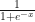

# 机器学习导论:逻辑回归

> 原文：<https://blog.devgenius.io/introduction-to-machine-learning-logistic-regression-ab19c49247c0?source=collection_archive---------21----------------------->

## 机器学习

## 平！这又是一封垃圾邮件吗？还是合法的？你的垃圾邮件过滤器如何辨别？

平！这又是一封垃圾邮件吗？还是合法的？你的垃圾邮件过滤器如何辨别？也许它使用了一种简单的机器学习技术。在这篇文章中，我们将了解它是什么，以及我们如何创建一个 Python 逻辑回归程序。

我们将涵盖:

*   机器学习:什么是逻辑回归？
*   随机数据集上的 Python 逻辑回归
*   用 Python 实现 Iris 数据集逻辑回归

# 机器学习:什么是逻辑回归？

与[线性回归](https://pythonalgos.com/introduction-to-machine-learning-linear-regression/)不同，逻辑回归用于分类，而不是沿着连续范围进行预测。逻辑回归的秘诀是一个“激活函数”,它对独立变量进行评分，如果所得分数低于阈值，则返回一个`0`,如果所得分数高于阈值，则返回`1`。它可以用于各种二进制分类问题，如预测患者是否患有癌症或电子邮件是否是垃圾邮件。

乙状结肠激活函数是



看起来像


在本模块中，我们将回顾一个简单的逻辑回归模型，并使用来自 [sklearn](https://scikit-learn.org/stable/index.html) 的 Iris 数据集进行多项式逻辑回归和训练/测试分割。
我们将从导入我们需要的库开始。这些是我们在上一篇文章[机器学习简介:线性回归](https://pythonalgos.com/2021/11/04/introduction-to-machine-learning-linear-regression/)中安装的相同的库。

```
imports for logistic regression with sklearnimport numpy as np
import math
from sklearn.linear_model import LogisticRegression
import matplotlib.pyplot as plt
import random
```

# 随机数据集上的 Python 逻辑回归

让我们创建一个测试数据集。我们将基于上面的图像创建一个数据集，记住，基于阈值`(0.5)`，所有负数(和`0`)将被分类为`0`，正数将被分类为`1`。

```
create data pointsx = np.array([-3, -2, -1, 0, 1, 2, 3]).reshape(-1, 1)
y = np.array([0, 0, 0, 0, 1, 1, 1])
```

现在，我们所要做的就是从 sklearn 库中创建我们的逻辑回归模型，并运行一个测试来看看它是如何工作的。

```
using sklearn's logisticregression function# fit the model
model = LogisticRegression().fit(x, y)# test data
new_x = np.array([-13, -0.5, 1, 0.3, -5, 11, 12]).reshape(-1, 1)
new_y = np.array([0, 0, 1, 1, 0, 1, 1])# predict
model.predict(new_x)# expected output
array([0, 0, 1, 0, 0, 1, 1])# score the model
model.score(new_x, new_y)# expected output (this is equal to 6/7 points classified correctly)
0.8571428571428571
```

我们的模型在这个数据集上做得不太好，但这不是模型的错，我们只是给了它`7`个点来处理。它对`6/7`进行了正确的分类，我们可以看到在`0`周围有一个误差范围，因为`0.3`被错误地分类了。下面，我们将用蓝色标出预期点，用红色标出预测点，以及 [softmax 函数](https://en.wikipedia.org/wiki/Softmax_function)。

```
scatter plot the results with matplotlibplt.scatter(new_x, new_y, color="blue", alpha=0.5)
plt.scatter(new_x, model.predict(new_x), color="red", alpha=0.5)
logx = np.linspace(-13, 12, 100)
logy = 1/(1+math.e**-logx)
plt.plot(logx, logy)
```

预期的输出是:(这是我在上面演示逻辑曲线时使用的同一张图片)


# 用 Python 实现 Iris 数据集逻辑回归

在我们的下一个例子中，我们将从 sklearn 的 Iris 数据集导入数据，对其进行逻辑回归。在我们加载数据集之后，我们需要在对其进行回归之前检查数据的外观。让我们加载`y`值，以及第一个和最后一个`10` `X`值。

```
load the iris dataset from sklearnfrom sklearn.datasets import load_iris
X, y = load_iris(return_X_y = True)
print(y)
print(X[0:10])
print("...")
print(X[-10:])# expected output
[0 0 0 0 0 0 0 0 0 0 0 0 0 0 0 0 0 0 0 0 0 0 0 0 0 0 0 0 0 0 0 0 0 0 0 0 0
 0 0 0 0 0 0 0 0 0 0 0 0 0 1 1 1 1 1 1 1 1 1 1 1 1 1 1 1 1 1 1 1 1 1 1 1 1
 1 1 1 1 1 1 1 1 1 1 1 1 1 1 1 1 1 1 1 1 1 1 1 1 1 1 2 2 2 2 2 2 2 2 2 2 2
 2 2 2 2 2 2 2 2 2 2 2 2 2 2 2 2 2 2 2 2 2 2 2 2 2 2 2 2 2 2 2 2 2 2 2 2 2
 2 2]
[[5.1 3.5 1.4 0.2]
 [4.9 3\.  1.4 0.2]
 [4.7 3.2 1.3 0.2]
 [4.6 3.1 1.5 0.2]
 [5\.  3.6 1.4 0.2]
 [5.4 3.9 1.7 0.4]
 [4.6 3.4 1.4 0.3]
 [5\.  3.4 1.5 0.2]
 [4.4 2.9 1.4 0.2]
 [4.9 3.1 1.5 0.1]]
...
[[6.7 3.1 5.6 2.4]
 [6.9 3.1 5.1 2.3]
 [5.8 2.7 5.1 1.9]
 [6.8 3.2 5.9 2.3]
 [6.7 3.3 5.7 2.5]
 [6.7 3\.  5.2 2.3]
 [6.3 2.5 5\.  1.9]
 [6.5 3\.  5.2 2\. ]
 [6.2 3.4 5.4 2.3]
 [5.9 3\.  5.1 1.8]]
```

我们看到我们的 y 值是离散的，所以我们可以对它们进行逻辑回归。我们还可以看到，我们有`3`类，而不是通常的`2`类，逻辑回归就是用来做这个的。幸运的是，sklearn 的逻辑回归软件包提供了进行多类逻辑回归的选项。随着我们的训练测试分割，我们还将把`X`缩放到标准缩放器，以确保模型收敛。标准定标器的平均值为`0`，标准偏差为`1`。

```
train_test_split for logisticregression# imports for preprocessing
from sklearn import preprocessing
from sklearn.model_selection import train_test_split# create normalized x values
xscaler = preprocessing.StandardScaler().fit(X)
xscaled = xscaler.transform(X)# create training/test datasets
x_train, x_test, y_train, y_test = train_test_split(xscaled, y, test_size=0.2, random_state=1)# create model
model = LogisticRegression(multi_class="multinomial", random_state=1).fit(x_train, y_train)# test model
model.score(x_test, y_test)# expected output
0.9666666666666667# let's take a look at the predictions
print(y_test)
print(model.predict(x_test))# expected output
[0 1 1 0 2 1 2 0 0 2 1 0 2 1 1 0 1 1 0 0 1 1 1 0 2 1 0 0 1 2]
[0 1 1 0 2 1 2 0 0 2 1 0 2 1 1 0 1 1 0 0 1 1 2 0 2 1 0 0 1 2]
```

很好，我们的模特做得很好。在`30`预测中，它只错过了`1`。不幸的是，由于我们的`X`变量具有`4`维度，我们将无法绘制它。

# 进一步阅读

*   [长短期记忆(LSTM)在 Keras](https://pythonalgos.com/long-short-term-memory-lstm-in-keras/)
*   [识别命名实体的最佳方式](https://pythonalgos.com/the-best-way-to-do-named-entity-recognition-ner/)
*   建立你自己的人工智能文本摘要器

如果你喜欢这篇文章，请在 Twitter 上分享！为了无限制地访问媒体文章，今天就注册成为[媒体会员](https://www.medium.com/@ytang07/membership)！别忘了关注我，[唐](https://www.medium.com/@ytang07)，获取更多关于增长、技术等方面的文章！