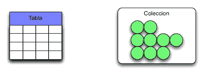
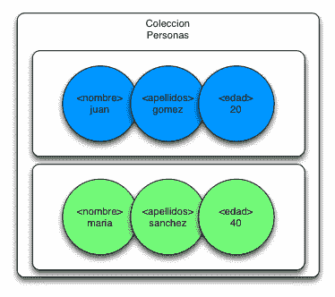
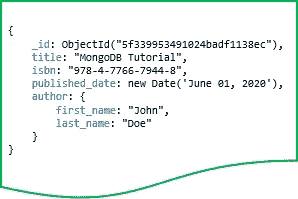
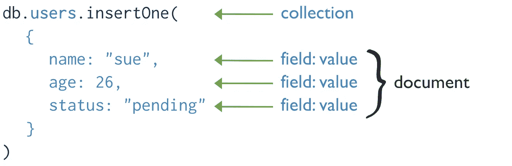

# MongoDB 简介

> 原文：<https://blog.devgenius.io/introduction-to-mongodb-84539a6104a4?source=collection_archive---------16----------------------->

对 MongoDB 必不可少的文章。组成、概念和参考结构。

# MongoDB

MongoDB 是一个面向文档的 **NoSQL** 数据库，于 2007 年由 Dwight Merriman、Eliot Horowitz 和 Kevin Ryan 资助，他们是 **DoubleClick** 的幕后团队。

MongoDB 就是为了解决当时现有数据库的缺点而诞生的。DoubleClick 公司在一个每秒提供 400，000 个广告的产品上存在可伸缩性和敏捷性问题。由此 MongoDB 产生。

# 面向文档的数据库

面向文档的数据库是其内容具有自然的、半结构化的、层次灵活的结构的数据库。它们属于 NoSQL 集团，主要基于嵌套的文档结构存储信息。这些数据库中包含的文档可以是文本、 **XML、**或 **JSON** 文档。

这种类型的数据库在大数据量的信息读取操作中表现突出。

# 用例 MongoDB

MongoDB 的用例主要基于其半结构化存储特性，因为这为我们提供了存储灵活性，没有模式或结构，非常适合不断变化的应用程序和敏捷环境。此外，它非常适合每秒钟必须处理多个读取查询的应用程序。一般来说，在这方面，文档数据库能够比关系数据库快得多。

# 安装 MongoDB

MongoDB 有两个服务器版本:**社区**和**企业**。企业版包括分销、保修和补偿，以及主动支持和培训。

根据操作系统的不同，以下是一些安装参考指南:

*   [**安装 Linux Ubuntu**](https://www.mongodb.com/docs/manual/tutorial/install-mongodb-on-ubuntu/)
*   [**安装 MacOS**](https://www.mongodb.com/docs/manual/tutorial/install-mongodb-on-os-x/)
*   [**安装 Windows**](https://www.mongodb.com/docs/manual/tutorial/install-mongodb-on-windows/)
*   [**安装 Docker**](https://www.mongodb.com/docs/manual/tutorial/install-mongodb-enterprise-with-docker/)

# 信息管理结构

*   集合:集合是关系数据库中表的直接映射。表存储记录(行)，而集合存储文档。

*   **文档**:文档:文档以 **BSON** 格式存储，是基于 **JSON** 的地图的二进制表示。这些文档由键值对组成，每个文档都可能与前一个文档有很大的不同。可以有多个键值或不同的名称。

## 数据类型 BSON

如上所述，BSON 结构由键-值组成，键必须是类型**字符串**，值必须是以下类型之一:

*   弦乐。
*   32 或 64 位整数。
*   64 位实数数据类型 IEEE 754。
*   日期(UNIX 时间中毫秒的整数)。
*   字节数组(二进制数据)。
*   布尔人。
*   空。
*   嵌套的 BSON 对象。
*   阵列 BSON。
*   正则表达式。

# MongoDB 查询语言(MQL)

MQL 这是一种语言的查询和操作的信息，蒙哥提供给我们。MongoDB 查询是基于 Javascript 语言的，有一些小的不同。MQL 的核心包含了非常多的选项、操作符、表达式和过滤器。官方的 MongoDB 文档比较了 MQL 和 SQL 的常见数据库操作。

下面是在 **MQL** 中进行**插入**操作的例子:

# MongoDB 地图集

MongoDB Atlas 是一个云数据库服务。允许您在世界任何地方通过它的平台创建和管理 DB Mongo。此外，Atlas 通过用户界面中的几次点击启用了一个管理数据库。

# 资源 MongoDB

*   [**主网 MongoDB**](https://www.mongodb.com/):MongoDB 的产品、解决方案、成本。
*   [**蒙哥图册**](https://www.mongodb.com/es/atlas/database):Entorno cloud Mongo y otras herramientas。
*   **MQL 简介:查询示例、文档和快速入门。**
*   **[**Mongo 大学**](https://university.mongodb.com/) :技术编队 MongoDB，教程，指南，官方认证。**
*   **[**开发者文档 Mongo**](https://www.mongodb.com/developer/) :入门，教程，API，开发者概念。**
*   **[**社区 MongoDB**](https://www.mongodb.com/community/forums/) :常见问题和社区程序。**
*   **[**MongoDB**中的金融服务](https://www.mongodb.com/industries/financial-services):银行系统使用 MongoDB 的成功案例。**

**感谢你远道而来，如果你觉得这很有用，别忘了鼓掌👏。订阅以接收更多内容🔔。**

**如果你需要额外的帮助，请联系我🤠。**

*   **✉️ [**给我发邮件**](mailto:dcortes.net@gmail.com)**
*   **🤝 [**在 LinkedIn 上联系我**](https://www.linkedin.com/in/dcortesnet/)**
*   **📮 [**在 Twitter 上联系我**](https://twitter.com/dcortes_net)**

**非常感谢您的阅读，我感谢您的时间。**