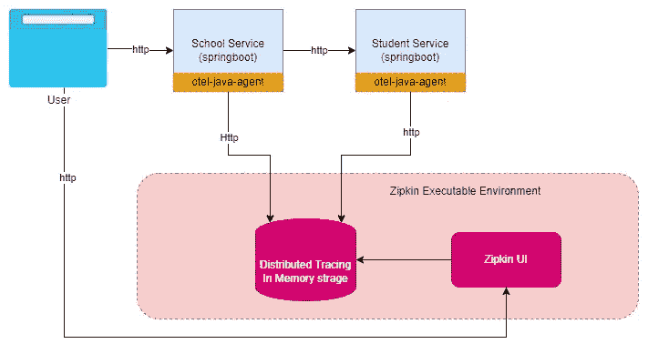
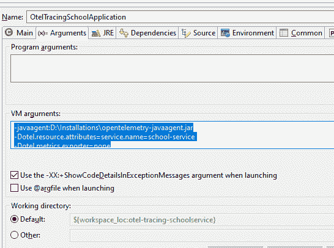
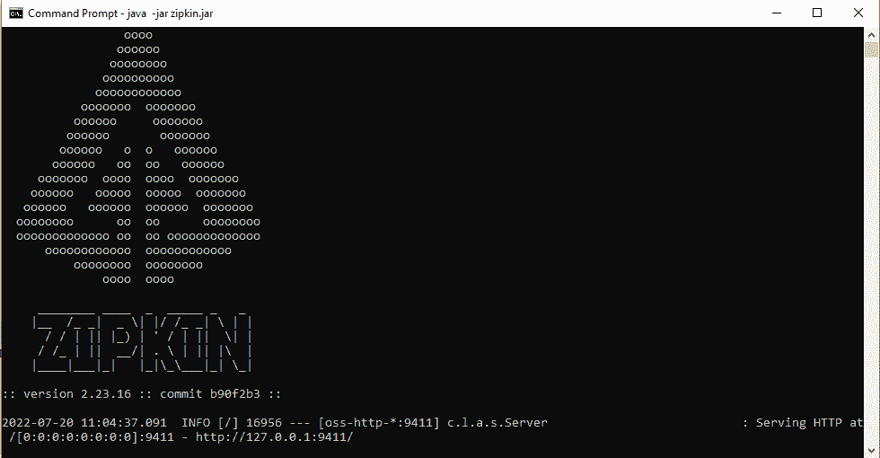
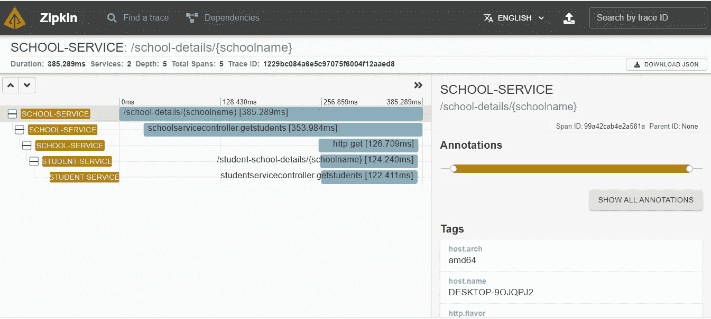

# OpenTelemetry 和分布式跟踪简介—第二部分

> 原文：<https://blog.devgenius.io/introduction-to-opentelemetry-distributed-tracing-part-ii-7ddab4a4cf15?source=collection_archive---------3----------------------->

在上一篇文章中，我们试图在高层次上理解这些概念。在这篇博文中，我们将深入研究一个工作示例，所以让我们开始吧。

下面是我们将要构建的示例的架构。在本例中，我们将使用 OpenTelemetry 的 Java 代理，它将自动检测代码，为我们生成跟踪数据。遥测数据将被导出到像 Zipkin 这样的可视化工具中。Zipkin 基本上是一个可执行的 jar，可以运行它来存储(在内存中)和查看跟踪信息。最终用户将能够访问 Zipkin UI 并查看使用 OpenTelemetry 库生成的跟踪数据。



我们有 2 个春季开机微服务— [学生服务](https://github.com/metalhead44/otel-spring-tracing/tree/main/otel-tracing-studentservice)和[学校服务](https://github.com/metalhead44/otel-spring-tracing/tree/main/otel-tracing-schoolservice)。我不会分享创建这个微服务的步骤，以保持这个博客专注于 OpenTelemetry。你可以[从我的 git repo](https://github.com/metalhead44/otel-spring-tracing) 下载代码，或者你可以使用任何现有的 spring boot 微服务来测试这个例子。

# **步骤 1:下载 OpenTelemetry java 代理**

OpenTelemetry 有两种用途。您可以使用 SDK 在您的代码库中编写您自己的跟踪信息，或者您可以使用 OpenTelemetry 的自动检测功能，它以自动化的方式提供或生成遥测数据。我们将在本例中使用**自动插装**技术，因为它提供了**零代码插装**。

下载 [**最新版本**](https://github.com/open-telemetry/opentelemetry-java-instrumentation/releases/latest/download/opentelemetry-javaagent.jar) 并放入文件夹。

# 步骤 2:配置您的服务，使用 VM 参数启动 java 代理

我使用 eclipse 进行开发，所以我编辑了两个服务的 *RunAs* 选项，如下所示。

```
-javaagent:D:\Installations\opentelemetry-javaagent.jar -Dotel.traces.exporter=zipkin -Dotel.resource.attributes=service.name=student-service -Dotel.metrics.exporter=none -Dotel.exporter.zipkin.endpoint=http://localhost:9411/api/v2/spans-javaagent:D:\Installations\opentelemetry-javaagent.jar -Dotel.traces.exporter=zipkin -Dotel.resource.attributes=service.name=school-service -Dotel.metrics.exporter=none -Dotel.exporter.zipkin.endpoint=http://localhost:9411/api/v2/spans
```

让我们理解这些参数的含义

*   **Dotel.traces.exporter** —此参数指定 otel 将跟踪数据推送到的导出器。
    -**dotel . metrics . exporter**= none—该参数指定我们不想导出任何指标数据。
    **-dotel . resource . attributes**=该参数指定服务名等属性来标识来自该组件的跟踪
    **-dotel . exporter . Zipkin . Endpoint**=该参数指定跟踪数据需要发送到的 **Zipkin** 端点。



Eclipse 虚拟机参数

# 步骤 3:下载并启动 Zipkin 服务器。

如果您安装了 Java 8 或更高版本，最快的开始方式是获取最新发布的[作为自包含的可执行 jar。](https://search.maven.org/remote_content?g=io.zipkin&a=zipkin-server&v=LATEST&c=exec)

使用命令运行 zipkin jar

```
java -jar {path to zipkin jar}/zipkin.jar
```



# **步骤 4:从 eclipse 或从 cmd 提示符启动这两个服务。**

例子—

```
java -javaagent:D:\Installations\opentelemetry-javaagent.jar -Dotel.traces.exporter=zipkin -Dotel.resource.attributes=service.name=student-service -Dotel.metrics.exporter=none -Dotel.exporter.zipkin.endpoint=http://localhost:9411/api/v2/spans -jar school-service.jar
```

启动这两个服务后，您应该能够在控制台上看到代理日志的前几行。

```
[otel.javaagent 2022-07-20 11:01:04:159 +0530] [main] INFO io.opentelemetry.javaagent.tooling.VersionLogger - opentelemetry-javaagent - version: 1.15.0
```

通过点击 URL 来测试服务

[http://localhost:9001/school-details/ABC school。](http://localhost:9001/school-details/abcschool.)

**学校服务**将点击**学生服务**并在浏览器上以 JSON 格式返回响应。

```
School Name - abcschool Student Details [{"name":"Sajal","className":"Class IV"},{"name":"Lokesh","className":"Class V"}]
```

# 第 5 步:在 Zipkin UI 中查看踪迹。

让我们在浏览器上通过点击

[**http://localhost:9411/zipkin/**](http://localhost:9411/zipkin/)

点击**运行查询**按钮查看痕迹



Zipkin UI

如您所见，追踪信息现在可以在 **Zipkin** UI 上看到。它显示了作为跟踪请求的一部分调用的方法和端点。您还可以在右侧窗格中看到其他属性。这些属性是由 java 代理自动生成的。您还可以将自定义属性添加到跟踪数据中，以便对处理跟踪进行更精细的控制。

你可以在 **Zipkin UI** 上看到痕迹，这是一个很好的开始。 **Kudos** ！！

**关联日志-**

在上面的例子中，各个服务的日志仍然没有关联。也就是说，如果有 100 个来自浏览器的请求，我们无法判断哪些日志语句属于两个服务上的哪个请求。我们需要一个惟一的标识符，比如可以以一种**自动化**的方式注入日志语句的 **TraceId** ，然后可以用它来关联日志。

关联前的日志-

```
/\\ / ___'_ __ _ _(_)_ __  __ _ \ \ \ \
( ( )\___ | '_ | '_| | '_ \/ _` | \ \ \ \
 \\/  ___)| |_)| | | | | || (_| |  ) ) ) )
  '  |____| .__|_| |_|_| |_\__, | / / / /
 =========|_|==============|___/=/_/_/_/
 :: Spring Boot ::                (v2.6.9)

2022-07-20 11:16:15.301  INFO 25032 --- [           main] c.n.o.o.OtelTracingSchoolApplication     : Starting OtelTracingSchoolApplication using Java 17.0.2 on DESKTOP-9OJQPJ2 with PID 25032 (D:\git\otel-tracing-schoolservice\target\classes started by Nitin in D:\git\otel-tracing-schoolservice)
2022-07-20 11:16:15.332  INFO 25032 --- [           main] c.n.o.o.OtelTracingSchoolApplication     : No active profile set, falling back to 1 default profile: "default"
2022-07-20 11:16:18.267  INFO 25032 --- [           main] o.s.b.w.embedded.tomcat.TomcatWebServer  : Tomcat initialized with port(s): 9001 (http)
2022-07-20 11:16:18.379  INFO 25032 --- [           main] o.apache.catalina.core.StandardService   : Starting service [Tomcat]
2022-07-20 11:16:18.380  INFO 25032 --- [           main] org.apache.catalina.core.StandardEngine  : Starting Servlet engine: [Apache Tomcat/9.0.64]
2022-07-20 11:16:18.665  INFO 25032 --- [           main] o.a.c.c.C.[Tomcat].[localhost].[/]       : Initializing Spring embedded WebApplicationContext
2022-07-20 11:16:18.665  INFO 25032 --- [           main] w.s.c.ServletWebServerApplicationContext : Root WebApplicationContext: initialization completed in 3202 ms
2022-07-20 11:16:19.807  INFO 25032 --- [           main] o.s.b.w.embedded.tomcat.TomcatWebServer  : Tomcat started on port(s): 9001 (http) with context path ''
2022-07-20 11:16:19.831  INFO 25032 --- [           main] c.n.o.o.OtelTracingSchoolApplication     : Started OtelTracingSchoolApplication in 5.837 seconds (JVM running for 9.663)
2022-07-20 11:16:20.297  INFO 25032 --- [nio-9001-exec-1] o.a.c.c.C.[Tomcat].[localhost].[/]       : Initializing Spring DispatcherServlet 'dispatcherServlet'
2022-07-20 11:16:20.298  INFO 25032 --- [nio-9001-exec-1] o.s.web.servlet.DispatcherServlet        : Initializing Servlet 'dispatcherServlet'
2022-07-20 11:16:20.301  INFO 25032 --- [nio-9001-exec-1] o.s.web.servlet.DispatcherServlet        : Completed initialization in 2 ms
School service is Healthy
School service is Healthy
Getting School details for abcschool
Response Received as [{"name":"Sajal","className":"Class IV"},{"name":"Lokesh","className":"Class V"}]
```

现在让我们使用 OpenTelemetry 的强大功能将 **TraceId** 注入到我们服务的每个请求的日志语句中。

**步骤 1:将 OpenTelemetry 日志依赖项添加到 pom 文件中。**

```
<!-- https://mvnrepository.com/artifact/io.opentelemetry.instrumentation/opentelemetry-logback-1.0 --><dependency>
<groupId>io.opentelemetry.instrumentation</groupId>  <artifactId>opentelemetry-logback-1.0</artifactId>
<version>1.9.2-alpha</version>
<scope>runtime</scope>
</dependency>
```

**第二步:在 logback.xml 中添加自定义包装器到日志 appender**

示例- logback.xml

```
<?xml version="1.0" encoding="UTF-8" ?>
<configuration>
<appender name="STDOUT" class="ch.qos.logback.core.ConsoleAppender"><encoder>
  <pattern><![CDATA[%date{HH:mm:ss.SSS} [%thread] %-5level %logger{15}#%line %X{req.requestURI} traceId: %X{trace_id} spanId: %X{span_id} %msg\n]]></pattern>
</encoder>
</appender><appender name="OTEL" class="io.opentelemetry.instrumentation.logback.v1_0.OpenTelemetryAppender">
   <appender-ref ref="STDOUT" />
</appender><root>
  <level value="INFO" />
  <appender-ref ref="STDOUT" />
</root>
</configuration>
```

让我们重新启动服务，现在您可以看到 **TraceId** 被附加到跨服务的日志中。

```
13:50:23.158 [http-nio-9001-exec-1] INFO o.s.w.s.DispatcherServlet#547 traceId: 241abff9a2782b4dc3e161225c47eecb spanId: aa4211e7549e3c79 Completed initialization in 2 ms
13:50:23.305 [http-nio-9001-exec-1] INFO c.n.o.o.SchoolServiceController#25 **traceId: 241abff9a2782b4dc3e161225c47eecb spanId: 4594f9ef350d0a26** Getting School details for abcschool
13:50:24.283 [http-nio-9001-exec-1] INFO c.n.o.o.SchoolServiceController#30 **traceId: 241abff9a2782b4dc3e161225c47eecb spanId: 4594f9ef350d0a26** Response Received as [{"name":"Sajal","className":"Class IV"},{"name":"Lokesh","className":"Class V"}]
```

希望您能够使用 OpenTelemetry 代理并成功地跟踪和查看服务，还能够使用 **TraceId** 跟踪日志。

在本系列 的第 3 部分 [**中，我们将更详细地介绍使用**弹性搜索**来确保我们能够持久存储我们的跟踪信息。我们还将关注添加**业务标识符**的定制，以便于理解和使用跟踪数据。在以后的文章中，我还将介绍 Otel 收集器的概念。**](https://nitin-rohidas.medium.com/introduction-to-opentelemetry-distributed-tracing-part-iii-9b1bce59c1bd)