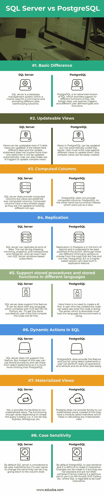
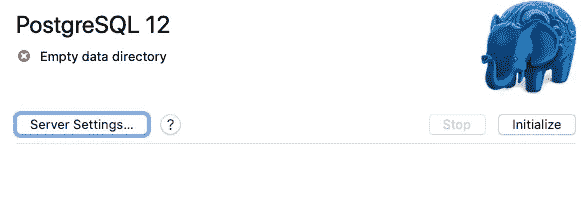
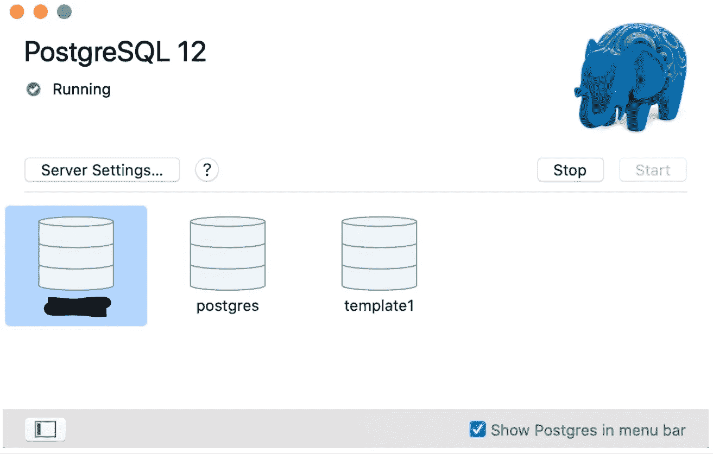

# PostgreSQL 和 Postgres.app 简介

> 原文：<https://blog.devgenius.io/introduction-to-postgresql-and-postgres-app-792c6a8aab2f?source=collection_archive---------1----------------------->

## 在选择数据库时，PostgreSQL 是一个强有力的竞争者。请继续阅读，了解更多关于 PostgreSQL 以及如何使用 Postgres app 安装它的信息！


[陈虎](https://unsplash.com/@huchenme?utm_source=medium&utm_medium=referral)在 [Unsplash](https://unsplash.com?utm_source=medium&utm_medium=referral) 上拍照

# 目录

1.  [简介](#973e)
2.  [什么是 PostgreSQL？](#1c3e)
    2a。[PostgreSQL 的历史](#4bff)2b。[PostgreSQL 的定义](#77ce)
    2c。[PostgreSQL 与 SQL 有何不同](#bdb2)
3.  [Postgres.app](#d31e)
    3a。[安装 postgres . app](#d87e)3b。[故障排除](#cf0a)
4.  [结论&要点](#b5b2)
5.  想要更多吗？查看其他资源！

# 简介**💭**

我在 Flatiron School 期间，当我们在 Mod 2 中开始项目时，有人建议我们用 PostgreSQL 数据库创建应用程序，因为当我们想要部署它时会更容易。当时，这是我需要用 PostgreSQL 创建应用程序的唯一原因。既然我已经毕业了，我想了解更多。作为我通过钻研我“已经知道”的东西来学习新事物的方法的一部分，我将分享我在 PostgreSQL(又名 Postgres)上的发现，以及如何用 Postgres 应用程序安装它。🤓

# **什么是 PostgreSQL？🙋**

为了理解 PostgreSQL，我将这一部分分成了三个部分:“[PostgreSQL 的历史](#4bff)”、“[PostgreSQL 的定义](#77ce)”和“[PostgreSQL 与 SQL 的不同之处](#bdb2)”。

## **PostgreSQL 的历史📜**

你会经常看到 PostgreSQL 和 Postgres 被使用，老实说，一开始我搞不清楚它们是两个独立的东西还是同一个东西。答案是，虽然它们不是分开的，但它们不是同一件事。其实 PostgreSQL 就是从 Postgres 衍生出来的。

PostgreSQL 的起源可以追溯到 1986 年，当时 POSTGRES 项目是由加州大学伯克利分校的迈克尔·斯通布雷克教授领导的。在早期，它发布了许多突破性的主要版本，直到 1993 年，其外部用户群体几乎翻了一番。随着这种增长，项目的维护和支持对伯克利团队来说变得太多了。结果，伯克利 POSTGRES 项目在那一年以 4.2 版本正式结束。

当然，这并不是 PostgreSQL 的终结！1994 年，Andrew Yu 和 Jolly Chen 在 POSTGRES 项目的基础上添加了一个 SQL 语言解释器。他们以新的名字 Postgres95 发布到网络上，在那里它被称为原始 POSTGRES Berkeley 代码的开源后代。然而，到了 1996 年，“Postgres95”这个名字已经过时了。因此，PostgreSQL 成为新的官方名称，以强调原始 POSTGRES 和最近的 SQL 功能之间的关系。

名字选择的一个意想不到的副作用是如何发音的困惑。事实上，由于 PostgreSQL 的发音不是很清楚，一场关于是否要切换回 Postgres 的大辩论开始了。官方的发音是“Post-Gres-Q-L ”,然而大多数人在谈到 PostgreSQL 时仍然使用“Postgres ”,无论是因为传统还是因为它更容易发音。

总而言之，PostgreSQL 是从 Postgres 项目中派生出来的，因此虽然这两个名称经常互换使用，但 PostgreSQL 是正式名称，POSTGRES 是它的昵称。

## **PostgreSQL 的定义🦉**

现在我们知道了 PostgreSQL 的背景，让我们来回顾一下它是什么。根据 PostgreSQL 官方文档，“PostgreSQL 是一个强大的开源对象关系数据库系统，它使用并扩展了 SQL 语言，并结合了许多功能，可以安全地存储和扩展最复杂的数据工作负载”。

换句话说，在高级 PostgreSQL 中:

*   是一个开源数据库，由关系数据库(RDBMS)和面向对象数据库(OODBMS)组成，在其模式和查询语言中支持任何面向对象数据库模型的基本组件。
*   “使用 SQL 语言”,因为您能够进行 SQL 和 JSON 关系和非关系(NoSQL)查询。
*   “扩展”了 SQL，因为它支持 SQL 标准的扩展子集(即不同的事务、外键、子查询和触发器)。
*   是高度可扩展的，因为用户能够包含和定义他们自己的数据类型和函数。

## 【PostgreSQL 与 SQL 有何不同💡

虽然这两者之间有许多不同之处，但重要的是不要忘记它们也有重叠之处，因为 PostgreSQL 使用 SQL。

在决定数据库“风格”时，您不可避免地需要考虑成本。由于 PostgreSQL 是开源的，并且有巨大的社区支持，所以它是免费的，并且会不断更新补丁和新特性。SQL 是由微软建立和维护的，所以除了付费服务之外，它只能在 Windows 和 Linux 上运行。因此，SQL 主要用于电子商务和作为数据仓库的解决方案。

要了解更多关于 SQL 和 PostgreSQL 不同之处的技术细节，请查看 educba 下面这张很棒的信息图:



比较 SQL 和 PosgreSQL 基本差异的信息图，可更新视图、计算列、复制、支持不同语言的存储过程和存储函数、SQL 中的动态操作、实体化视图和区分大小写。

# **Postgres.app🐘**

有几种在电脑上安装 PostgreSQL 的方法供你使用。如果你使用的是 Mac，安装 PostgreSQL 最简单的方法之一就是使用 Postgres.app，它在菜单栏中运行，不需要安装程序。当您打开应用程序时，您将有一个 PostgreSQL 服务器准备好并等待新的连接，一旦您关闭它，服务器将关闭。

## **安装 Postgres.app💾**

要安装 Postgres.app，首先导航到:【https://postgresapp.com 

1.  下载应用程序
2.  将应用程序移到“应用程序”文件夹
3.  双击应用程序打开它(一旦你双击你应该看到一个大象出现在你的菜单栏上)
4.  单击“初始化”创建新的服务器
5.  可选:配置您的$PATH 以使用包含以下命令的命令行工具。

```
sudo mkdir -p /etc/paths.d &&
echo /Applications/Postgres.app/Contents/Versions/latest/bin | sudo tee /etc/paths.d/postgresapp
```

6.现在您已经在 Mac 上运行了 PostgreSQL 服务器，要连接 psql(命令行客户端)，请双击一个数据库。您也可以通过键入 psql 从命令行直接连接。

## **故障排除🙈**

后来我尴尬地意识到，当我安装这个应用程序时，我并没有真正使用它。希望你能按照上面的步骤安装并运行这个应用程序，但是如果你不能，就按照我错过的步骤来做吧！

安装后，当您打开应用程序时，您应该会看到以下内容:



打开 Postgres.app 后，您会在左上角看到您下载的 PostgreSQL 版本号(例如:PostgreSQL 12)。在下面，您会看到一个带有白色“x”的读取圆圈，表示这是一个空的数据目录。您还会在右侧看到一个蓝色的大象，下面有“初始化”按钮和禁用的“停止”按钮。

然而，当我点击“初始化”时，什么也没有弹出，什么也没有改变。不确定这是不是我应该看到的(我当时认为不是，但老实说不确定它应该是什么样子)，我继续做我的项目。后来，这促使我进一步研究该应用程序，在单击“初始化”后，我会得到一个弹出窗口，显示“端口 5432 已经在使用中”。

在这两种情况下，我发现的一个解决方案是，您需要卸载其他 PostgreSQL 安装(即，如果您之前安装了带有 Homebrew 的 PostgreSQL)。这是因为当另一个服务器已经在同一个端口上运行时，Postgres.app 无法启动。我应该在我的终端中运行:

```
brew services stop postgresql
```

之后，再次单击“Initialize ”,您应该会看到创建了一些默认数据库，包括使用您的系统用户名的数据库:



如果您正在成功运行 Postgres.app，带有“x”的红色圆圈现在将变成带有白色复选标记的绿色圆圈，表示它正在运行。“初始化”按钮现在被禁用，文本变为“开始”，而“停止”按钮现在处于活动状态。在所有内容的下面，您将看到三个数据库图标，很可能是:“postgres”、“template1”和您的系统用户名。

现在，每次创建 PostgreSQL 数据库时，您都会看到它被添加到您的应用程序中！因此，当你运行你的应用程序时，确保它已经打开并运行。如果您想要连接特定的数据库，请在应用程序中双击它。这将通过命令行连接到它，并为您打开一个终端。

以下是一些我认为非常酷的命令:

```
// To connect to your default database:
psql// To check where PostgreSQL is install:
which psql// To check how many processes are running have:
ps auxwww | grep postgres// If for some reason you want to delete a database, from the repo connected to the database:
dropdb <db_name>
dropdb library_api_test
```

# **结论&外卖🚀**

因为我是伴随着它长大的，所以我经常忘记编程相对来说还是比较新的。研究 PostgreSQL 时，我惊讶于它增长和扩展的速度，并想起了开源的力量。了解它的历史，没想到它会觉得这么有趣；尤其是它的名字和昵称的联系。仔细看看它是如何从 SQL 构建和扩展的，我明白它给许多应用程序带来的好处，不再认为它只是更容易部署我自己的项目。另一方面，我现在更有信心了，因为我对 Postgres.app 以及我可以用它做什么有了更多的了解。

作为对我们所讲内容的一个提醒，以下是关键要点:

*   PostgreSQL 作为 POSTGRES 项目于 1986 年在加州大学伯克利分校启动。
*   在 1994 年获得了它的 SQL 功能，这也是它成为开源的时候。
*   发音是“Postgres-Q-L”，昵称是 Postgres。
*   它是一个对象关系数据库，使用并扩展了 SQL，因此共享了 SQL 的许多传统特性，并在此基础上进行构建。
*   关于 SQL 和 PostgreSQL 的更多区别，请查看 [educba 的信息图](#6b4a)！
*   在 Mac 上安装 postgresql 的方法之一是使用 Postgres.app，但请确保您没有安装其他 PostgreSQL，或者如果您运行 brew 服务，请停止 PostgreSQL。

感谢您的阅读！我希望您喜欢 PostgreSQL 并从中了解到一些新的东西。如果你喜欢这篇文章，可以看看我的其他文章；一个好的起点是“[创建您的全栈应用程序:Rails API 和 React](https://medium.com/dev-genius/creating-your-full-stack-application-rails-api-and-react-7155026e453a) ”。

# **想要更多吗？查看其他资源！**

## **对象关系数据库**

📖[https://www . techopedia . com/definition/8714/object-relational-database-ord](https://www.techopedia.com/definition/8714/object-relational-database-ord)

## PostgreSQL 是什么？

📖[https://aws.amazon.com/rds/postgresql/what-is-postgresql/](https://aws.amazon.com/rds/postgresql/what-is-postgresql/)📖[https://www.postgresql.org/about/](https://www.postgresql.org/about/)

## Postgres vs PostgreSQL

📖[https://table plus . com/blog/2018/10/postgres-vs-PostgreSQL . html](https://tableplus.com/blog/2018/10/postgres-vs-postgresql.html)

## SQL vs PostgreSQL

📖[https://www.educba.com/sql-server-vs-postgresql/](https://www.educba.com/sql-server-vs-postgresql/)

## 使用 Postgres.app 的演示视频

📖[https://www.youtube.com/watch?v=WcCjNGb8g0o](https://www.youtube.com/watch?v=WcCjNGb8g0o)