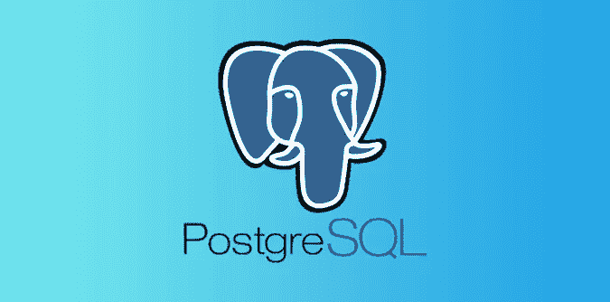
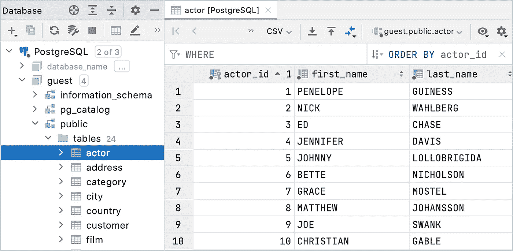
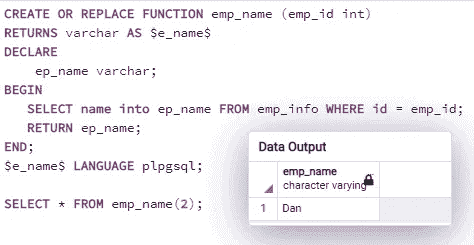
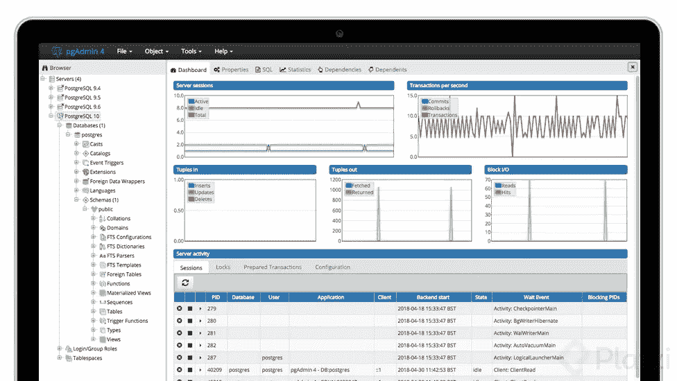

# PostgreSQL 简介

> 原文：<https://blog.devgenius.io/introduction-to-postgresql-fcb647af03d7?source=collection_archive---------7----------------------->

基本 PostgreSQL 文章。组成、概念和参考结构。

# 一种数据库系统

PostgreSQL 是 1996 年推出的高性能开源关系数据库，目前由 PGDG (PostgreSQL 全球开发组)维护。PostgreSQL 由加州大学柏克莱分校的迈克尔·斯通布雷克教授诞生。

# 关系数据库

关系数据库是存储和提供对彼此相关的数据点的访问的数据库。关系数据库基于关系模型，关系模型基本上是一种在表中表示数据的方式。反过来，表由属性表示的列和记录表示的行组成。提到关系数据库是由一种叫做 SQL(结构化查询语言)的结构化查询语言支持的。

这种类型的数据库因其在多个操作中关联信息和完整性的巨大容量而脱颖而出。

# 用例 PostgreSQL

PostgreSQL 用例主要基于数学，因为 PostgreSQL 能够存储和处理几何类型的数据，支持空间、矢量、拓扑查询，以及与 MatLab 等语言的集成。它也是关系域中的通用数据库。目前，PostgreSQL 是世界上最先进的关系数据库，远远超过了 MySQL 等其他竞争对手的功能和性能。

# PostgreSQL 安装

PostgreSQL 有两个服务器版本:**开源**和**企业**。区别在于企业版(EDB·波斯特格里斯)有保证和赔偿，以及业务性能、更多的安全性和其他业务功能。

根据主机操作系统的不同，以下是一些安装参考指南:

*   [安装 Linux Ubuntu](https://www.postgresql.org/download/linux/ubuntu/)
*   [**安装 MacOS**](https://www.postgresql.org/download/macosx/)
*   [**安装 Windows**](https://www.postgresql.org/download/windows/)

# 酸

PostgreSQL 支持并使用事务系统的所有 ACID 属性(原子性、一致性、隔离性、持久性)。术语 ACID 来自 Andreas Reuter 和 Theo Harder，他们在 20 世纪 80 年代开发了该术语来描述可靠交易的必要特征。

以下是每个功能的简要描述:

*   **原子性**:指的是一个原子系统，也就是说，一个改变必须全部完成，或者根本不改变任何东西，这也被称为全有或全无。原子系统必须保证任何操作和情况下的原子性，包括电源故障、错误和系统崩溃。
*   **一致性**:系统必须确保每一笔交易都必须符合所有已定义的规则、标准和限制。任何改变都必须从一个有效状态引导到另一个有效状态。
*   **隔离**:所有的系统操作，即使同时进行，也必须隔离执行，一个操作不能影响另一个操作。
*   **持久性**:系统一旦完成改变，就必须保留，哪怕整个系统都失效。

# 信息管理结构

*   **表格**:表格是数据容器对象，其中的表格以类似电子表格的行列格式排列。
*   **列**:列代表表格中包含的信息类别。每一列都包含名称、数据类型和其他属性。
*   **行**:行代表数据的一个实例，由列的数据类型控制。

## PostgreSQL 中的数据类型

像所有 RDBMS(关系数据库管理系统)一样，PostgreSQL 实现了 SQL3 标准定义的数据类型，并添加了一些其他数据类型。

以下是 PostgreSQL 中最常用的数据类型:

*   **数字**:小整数，整数，十进制 y 序列。
*   **字符** : Varchar y 文本。
*   **二进制:**字节**。**
*   **时间**:时间戳，日期 y 时间。
*   **布尔:**布尔。

# PL/pgSQL

PL/pqSQL(过程语言/PostgreSQL 结构化查询语言)是由 PostgreSQL 提供的语言，它允许通过命令式语言使用函数来执行 SQL 命令。这种语言通过扩展 SQL 的功能来执行复杂的计算，对 SQL 进行了补充。PL/pqSQL 包括控制结构、条件、函数和事件。

# PgAdmin

它是一个用于管理 PostgreSQL 数据库的开源附加工具。PgAdmin 有多个版本，既可以在桌面上使用，也可以在 web 服务器上使用。其中最显著的特性是大型监控控制面板、查询视图和调试器。

# Recursos PostgreSQL

*   [**主网站 PostgreSQL**](https://www.postgresql.org/) :产品、解决方案、支持。
*   [**主网站 pg admin**](https://www.pgadmin.org/):PostgreSQL 的管理和工具。
*   [**文档 PostgreSQL**](https://www.postgresql.org/docs/) :文档和版本间的兼容性。
*   [**社区 PostgreSQL**](https://www.postgresql.org/community/) :渠道、用户群、贡献。
*   [**PostgreSQL EDB**](https://www.enterprisedb.com/training/postgres-certification):PostgreSQL 技术培训、教程、指南、官方认证。

感谢你远道而来，如果你觉得这很有用，别忘了鼓掌👏。订阅以接收更多内容🔔。

如果你需要额外的帮助，请联系我🤠。

*   ✉️ [**给我发邮件**](mailto:dcortes.net@gmail.com)
*   🤝 [**在 LinkedIn 上联系我**](https://www.linkedin.com/in/dcortesnet/)
*   📮 [**在 Twitter 上联系我**](https://twitter.com/dcortes_net)

非常感谢您的阅读，我感谢您的时间。