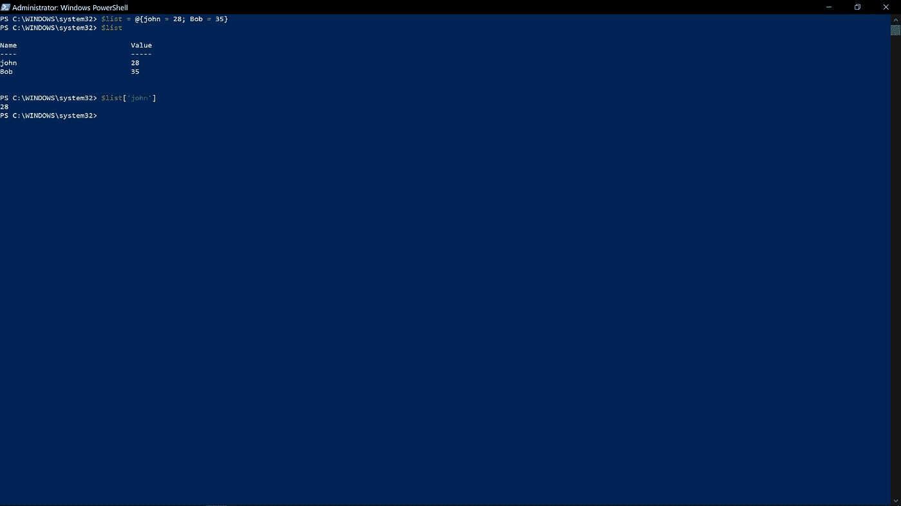

# PowerShell 简介第 2 部分。

> 原文：<https://blog.devgenius.io/introduction-to-powershell-part-2-d8586d7f0e56?source=collection_archive---------12----------------------->

在这篇文章中，我会根据具体情况不断地交换 PS 和 PowerShell。请记住，它们是一样的东西。继续，在我写的关于 PowerShell 的上一篇文章中，我不可能在一集里包含我想要传递的所有信息，所以我答应我们我会制作另一集，尽我所能把复杂的术语分解成简单的形式。让我们进入正题:

我相信你看到过我使用“@、*、$、( )、|”等字符。在前一集里。然而，我从来没有解释过它们到底是什么，也没有解释过它们是做什么的。因此，在这一集里，我们将仔细看看这些角色是什么，它们是如何工作的，PowerShell 是如何工作的，从我们上次停止的地方继续探索等等。

运算符:“@( )、*、{}、()、+、-”这些特殊字符称为运算符。在 PowerShell 中，运算符是可以在命令或表达式中使用的字符。它们告诉编译器执行特定的任务，并为我们产生最终结果。

PowerShell 支持以下运算符:

算术运算符:

Add-Member 允许我们添加注释属性。“+、-、*、/、%”用于计算给定命令中数据类型的值。您可以加、减、乘、除并返回数据类型的余数。

赋值运算符:

" =、+=、-=、*=、/=、%= "这些运算符用于为变量赋值和更改值。

数组子表达式运算符@():

该运算符以数组形式返回一个或多个命令的结果。

比较运算符:

"-ne、-eq、-gt、-lt、-le、-ge ' '这些运算符用于比较数据类型和测试条件，以了解它们是否为真、是否相等等。

逻辑运算符:

“-与，-或，-异或，-非，！”这些运算符用于将条件语句连接成一个单一的复杂条件。

子表达式运算符$():

这个操作符做了一项特殊的工作，为单个命令结果返回一个或多个语句，它也可以为多个命令返回结果。

管道操作员|:

该运算符将一个命令的结果传递给跟在它后面的另一个命令，以获得进一步的结果。

后台操作员& amp；

该操作符以前在后台运行管道。它返回一个对象作为输出。它也可以用作命令终止符。

强制转换运算符[ ]:

该运算符将对象转换为特定的数据类型。

注:参考:[https://docs . Microsoft . com/en-us/powershell/module/Microsoft . powershell . core/about/about _ operators？查看=powershell-7.2](https://docs.microsoft.com/en-us/powershell/module/microsoft.powershell.core/about/about_operators?view=powershell-7.2) 了解更多详情

既然我们已经弄清楚了这一点，让我们仔细地、批判性地看看 PowerShell 在它的所有层中实际上是如何工作的:

CLR(核心语言运行时)位于 PowerShell 系统的最核心部分，这是所有 PowerShell 对象的来源，我们能够使用这些对象来运行命令，因为 CLR 提供了一个称为“JIT 编译器”的实体。JIT 编译器收集垃圾，即清除未使用的内存。继续，CLR 的正上方是。NET 库。。NET 为我们提供了数以千计的对象和代码，用于各种各样的事情，比如访问和处理文件的方式，处理文件编码的方式，数百种

库函数等。在下面。NET 是“库”，库是一个实体，它将自己的对象和代码添加到. NET 中的可用对象中。例如，windows 中的 DLL 文件都是库。现在 PowerShell 直接位于。网本身。这是 PowerShell 建立的地方，也是它的核心，换句话说，这是 PowerShell 得以存在的原因。最后，位于所有这些实体之上的是“PowerShell 模块”,它们就像库一样，但是不同之处在于它们是用来扩展的

PowerShell，即它们是自己的 PowerShell 命令，并且它们利用 PowerShell 的对象。

接下来，让我们深入了解一些其他重要术语。

原语:可以说是一种特殊类型的对象，没有可以轻易分解的属性。原语对象是在 CLR(核心语言运行时)内部创建的，记住 CLR 是。网。CLR 上承载的原语列表有:数字、布尔值、字符串、数组。

下面是一个实例:int32。这是它在计算机内存中存储方式的一个完整分解:它占用 32 位& 4 字节的内存空间。也就是说，每一个整数都是一个本原，它们统称为整数或 int32。

SCRIPT:PS 中的 SCRIPT 这个词，基本上是指一个包含 PowerShell 代码的文件。解释完之后，让我们详细讨论一下脚本:

要创建 PS 脚本，这次直接从 pc 创建，无需任何外部文本编辑器:

打开记事本，转到文件。

选择您想要保存它的位置。

选择另存为，给它起一个你喜欢的名字，在名字后面加上一个“. ps1”，这个扩展名告诉计算机你正在创建一个 ps 脚本。

当您想要运行您的脚本时，右键单击该脚本并选择使用 PowerShell 运行，或者您可以通过执行以下操作直接从 PowerShell 环境本身运行它:

cd PSDemo (cd 表示您指的是通常称为 PSDemo 的 PowerShell 目录)。接下来是键入脚本名:

。/script.ps1

注意:默认情况下，PS 不允许我们运行任何类型的脚本，出于安全考虑，为了绕过这一限制，请在 PowerShell 中键入以下命令:set-Execution Policy Unrestricted 按 enter，close 并重新启动 PS。

静态成员:

与非静态成员不同，这些成员在相同类型的所有对象之间共享。它们的独特之处在于，它们不会出现在同一类型的单个对象上；更确切地说，它们是在实际的类型上，并且是为每种类型定制的。更详细地解释，静态成员就像函数；它们不属于任何特定的物体组。它们通常在旅途中被调用，它们返回数据或创建数据等。就这样结束了。让我们来看看“static DateTime new() property”这个属性在这里接受一个命令，然后设置或获取数据作为回报。要访问一个静态属性或一个类型中可用的静态属性，我们指定后跟两个冒号的类型，然后是事物的名称；就像这样:

[类型]::东西。

这里有一个实际的例子:

以 DateTime 为例，让我们先获得它的静态成员，要获得它，我们必须这样写命令:[DateTime ] | Get-Member -static。

注意:我们可以使用上面相同的方法获得任何类型的静态成员。

现在，让我们访问一个 Int 类型的静态属性:he

在这个例子中，我们选择了静态 int maxvalue 属性(我突出显示了它，这样我们可以很容易地发现它)。观察我们遵循的模式，首先是类型，然后是两个冒号::最后是我们想要访问的东西。

此外，有些类型本质上只是静态的。这意味着你不能把它们做成一个物体；其中一种类型是“环境”类型。它只包含一堆告诉我们环境的静态类型

收藏:

集合是由几个更小的物体组成的东西。一些集合类型有:

一个数组(我在上一集讲过这个)。

另一种类型的集合是哈希表。虽然我在上一集介绍了一个哈希表，但这次让我们花点时间更好地理解它。与数组不同，我们使用这个“@()”来访问数组中的数据，我们使用这个“@{}”来访问哈希表中的数据。此外，为了访问哈希表中的特定数据，我们使用了一种称为按键和值访问的模式。为了更好地理解，我们来看一个实例:

假设我们有一个包含人名和年龄列表的哈希表，为了获得表中特定姓名的年龄，我们需要使用表中的姓名来访问年龄。这意味着每个名字都是指向一个年龄值的一个键。

现在，为了找出表中某个人的年龄，我们必须以这种方式写出命令“$age['John']”为了创建哈希表，我们必须以这种方式写出命令“@ { John = 28Bob=35}”

这就是现在的结束，在下一集我会给你更多的定义，然后我们将开始使用我们到目前为止所涵盖的所有内容来制作脚本，在我们使用 PowerShell 构建了一个具有图形用户界面的完整应用程序之后，我已经很兴奋了，我希望你也是！！直到下一次，如果你有任何问题，请随意提问，我会尽我所能及时回复。