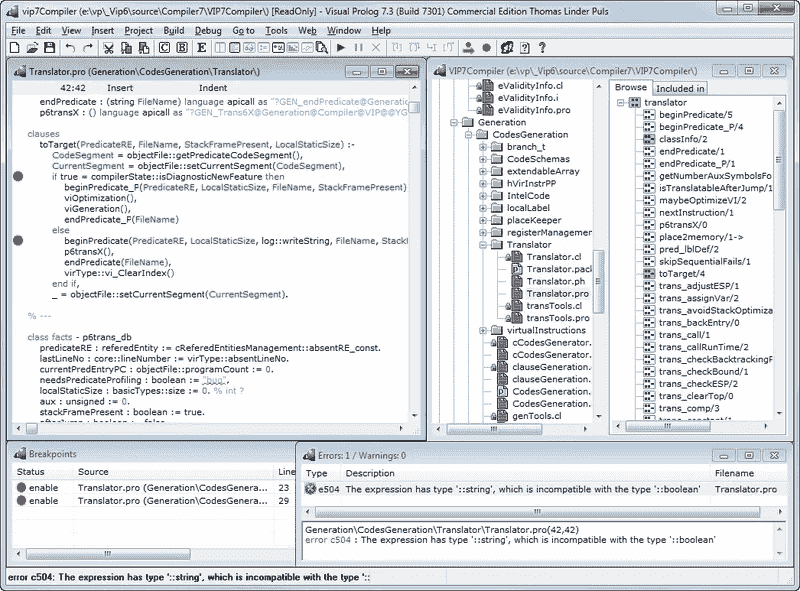

# Prolog 介绍:一种人工智能编程语言

> 原文：<https://blog.devgenius.io/introduction-to-prolog-a-programming-language-for-artificial-intelligence-320b75455381?source=collection_archive---------0----------------------->



Prolog 示例

# **什么是 Prolog？**

Prolog 是一种非常适合开发基于逻辑的人工智能应用程序的编程语言。它是一种声明性编程语言，这意味着它允许程序员指定关于问题域的规则和事实，然后 Prolog 解释器将使用这些规则和事实来自动推断问题的解决方案。

# 是什么让 Prolog 与众不同？

Prolog 的关键特性之一是它处理不确定或不完整信息的能力。在 Prolog 中，程序员可以指定一组已知为真的规则和事实，但他们也可以指定可能为真或假的规则和事实。然后，Prolog 解释器将使用这些规则和事实来自动推理问题域，并在给定可用信息的情况下找到最有可能正确的解决方案。

# 我们如何使用 Prolog？

使用 Prolog 的一种方法是定义一组规则，这些规则描述问题域中不同对象或概念之间的关系。例如，您可以定义规则，指定某些对象比其他对象大，或者某些对象颜色相同。然后，您可以使用 Prolog 来询问有关这些对象及其关系的问题，解释器将使用您的规则来推断答案。

要使用 Prolog，您需要在计算机上安装 Prolog 解释器。有几种不同的 Prolog 解释器可用，包括 SWI-Prolog、GNU Prolog 和 B-Prolog。一旦安装了解释器，就可以开始使用文本编辑器编写 Prolog 程序，然后使用解释器运行它们。

总之，Prolog 是一种强大而灵活的编程语言，非常适合开发基于逻辑的人工智能应用程序。它允许程序员指定一组关于问题域的规则和事实，然后使用这些规则和事实来自动推断问题的解决方案。

# 基础 Prolog 程序

在 Prolog 中，程序由两个主要部分组成:事实和规则。事实是被假定为真实的陈述，如“约翰是个男人”或“法国的首都是巴黎”规则是描述不同事实之间关系的逻辑陈述，例如“如果约翰是男人，玛丽是女人，那么约翰不是玛丽。”

Prolog 程序是使用类似于自然语言的语法编写的。例如，一个简单的 Prolog 程序可能如下所示:

```
man(john).
woman(mary).
capital_of(france, paris).

not(X,Y) :- man(X), woman(Y).
```

在这个例子中，前三行是事实，而第四行是规则。该规则使用`not/2`谓词来声明，如果`X`是一个男人而`Y`是一个女人，那么`X`不是`Y`。

# 使用 Prolog 时要记住的事情

Prolog 没有单一的“语法”,因为该语言允许多种不同的编程风格和方法。但是，以下是一些常用的 Prolog 语法的基本元素:

*   **事实**是被假定为真实的陈述。在 Prolog 中，事实是用一个谓词名后跟一个用括号括起来的参数列表来编写的。例如:`man(john).`
*   **规则**是描述不同事实之间关系的逻辑陈述。在 Prolog 中，规则是使用谓词名称编写的，后跟一个圆括号中的参数列表，后跟一个冒号和一个连字符(:-)，以及规则体。比如:`not(X,Y) :- man(X), woman(Y).`
*   **变量**用于表示可以改变或由解释器决定的值。在 Prolog 中，变量使用以大写字母开头的名称编写。比如:`X`
*   **查询**用于要求解释器根据程序中的规则和事实找到问题的解决方案。在 Prolog 中，查询使用与事实相同的语法编写，后跟一个问号(？).例如:`not(john, mary)?`

# 事实是如何工作的？

在 Prolog 中，事实是假设为真的语句。它们用于向解释器提供关于问题域的信息，解释器将使用这些信息来自动推断问题的解决方案。

事实是用一个谓词名后跟一列括在括号中的参数来编写的。例如:

```
man(john).
woman(mary).
capital_of(france, paris).
```

在这个例子中，第一行声明`john`是一个男人，第二行声明`mary`是一个女人，第三行声明`paris`是`france`的首都。

Prolog 事实可以有任意数量的参数，参数可以是变量或常量。例如，以下事实有两个参数，其中一个是变量:

```
parent_of(X,Y) :- man(X), woman(Y).
```

在这种情况下，事实表明，如果`X`是男性，而`Y`是女性，那么`X`就是`Y`的父代。

一旦在 Prolog 程序中定义了事实，就可以使用它们来自动推断问题的解决方案。例如，您可以使用以下查询要求解释器查找法国的首都:

```
capital_of(france, X)?
```

在这个查询中，解释器将使用您之前定义的`capital_of/2`事实来确定法国的首都是巴黎，并将返回值`paris`作为解决方案。

# 规则是如何运作的？

在 Prolog 中，规则是描述不同事实之间关系的逻辑语句。它们用于指定某个事实为真所必须满足的条件。

规则是使用谓词名称编写的，后跟括号中的参数列表、冒号和连字符(:-)，以及规则体。例如:

```
not(X,Y) :- man(X), woman(Y).
```

在这个例子中，规则使用`not/2`谓词来声明如果`X`是一个男人而`Y`是一个女人，那么`X`不是`Y`。规则的主体由两个事实组成:`man(X)`和`woman(Y)`。

Prolog 规则可以有任意数量的参数，参数可以是变量或常量。例如，以下规则有三个参数，其中两个是变量:

```
bigger_than(X,Y,Z) :- size(X,Xsize), size(Y,Ysize), Xsize > Ysize.
```

在这种情况下，规则规定，如果`X`和`Y`分别是大小为`Xsize`和`Ysize`的对象，并且`Xsize`大于`Ysize`，则`X`大于`Y`。

一旦在 Prolog 程序中定义了规则，就可以使用它们来自动推断问题的解决方案。例如，您可以使用以下查询要求解释器找出哪个对象比另一个对象大:

```
bigger_than(X,Y,Z)?
```

在这个查询中，解释器将使用您之前定义的`bigger_than/3`规则来确定哪个对象比另一个大，并且它将为`Z`返回适当的值作为解决方案。

# 变量是如何工作的？

在 Prolog 中，变量用来表示可以改变或由解释程序决定的值。它们使用以大写字母开头的名称编写，如`X`或`Y`。

变量可以在事实和规则中使用，以表示在编写程序时未知的值。例如，以下事实使用一个变量来表示一个国家的首都:

```
capital_of(Country, Capital).
```

在这种情况下，事实表明给定的`Country`的`Capital`是未知的，当进行查询时，解释器将使用其他事实和规则来确定`Capital`的值。

# 查询是如何工作的？

查询用于要求解释器根据程序中的规则和事实找到问题的解决方案。在 Prolog 中，查询使用与事实相同的语法编写，后跟一个问号(？).例如:

```
capital_of(france, X)?
```

在这个查询中，解释器将使用前面定义的`capital_of/2`事实来确定法国的首都是巴黎，并将返回变量`X`的值`paris`作为解决方案。

您可以使用查询来要求解释器根据您在 Prolog 程序中定义的规则和事实，找到各种问题的解决方案。解释器将使用这些规则和事实来自动推理问题域，并在给定可用信息的情况下找到最有可能正确的解决方案。

# 另一个示例 Prolog 程序

下面是一个简单的 Prolog 程序，它定义了一组关于问题域的规则和事实，然后使用这些规则和事实来回答一些查询:

```
% Facts
man(john).
woman(mary).
capital_of(france, paris).
% Rule
not(X,Y) :- man(X), woman(Y).
% Query 1
not(john, mary)?
% Query 2
capital_of(france, X)?
```

在这个例子中，程序定义了三个事实:`man(john)`、`woman(mary)`和`capital_of(france, paris)`。这些事实表明约翰是男人，玛丽是女人，巴黎是法国的首都。

该程序还使用`not/2`谓词定义了一个规则。这条规则规定，如果`X`是男的`Y`是女的，那么`X`就不是`Y`。

最后，程序包括两个查询。第一个查询`not(john, mary)?`要求解释器根据`not/2`规则和`man/1`和`woman/1`事实确定 John 是否不是 Mary。解释器将使用这些规则和事实来推断 John 不是 Mary，并返回`true`作为查询的答案。

第二个查询`capital_of(france, X)?`，要求解释器确定法国的首都。解释器将使用`capital_of/2`事实来确定法国的首都是巴黎，它将返回变量`X`的值`paris`作为解。

总之，这个 Prolog 程序演示了如何定义一个问题域的规则和事实，以及如何使用这些规则和事实来自动推断问题的解决方案。

# Prolog 的人工智能应用实例

Prolog 人工智能应用的一个可能的例子是一个简单的医疗诊断工具。在此应用程序中，Prolog 程序将定义一组关于不同医疗状况及其症状的规则和事实，然后使用这些规则和事实根据患者报告的症状来诊断患者的状况。

下面是一个可用于此目的的 Prolog 程序的简单示例:

```
% Facts
has_symptom(flu, fever).
has_symptom(flu, headache).
has_symptom(flu, body_aches).
has_symptom(flu, cough).
has_symptom(flu, sore_throat).
has_symptom(flu, runny_nose).
has_symptom(allergy, sneezing).
has_symptom(allergy, watery_eyes).
has_symptom(allergy, runny_nose).
has_symptom(allergy, itchy_eyes).
has_symptom(cold, sneezing).
has_symptom(cold, watery_eyes).
has_symptom(cold, runny_nose).
has_symptom(cold, cough).
has_symptom(cold, sore_throat).
% Rule
has_condition(X,C) :- has_symptom(C,X).
% Query
has_condition(sneezing, X)?
```

在这个例子中，程序定义了一组事实，描述了三种不同医疗状况的症状:流感、过敏和普通感冒。该程序还使用`has_condition/2`谓词定义了一个规则，该规则声明，如果一个病人有某种症状，那么他们就有与该症状相关的医疗条件。

最后，该程序包括一个查询，要求解释器根据患者报告的症状来确定患者患有哪种疾病。在这种情况下，查询指定患者有打喷嚏的症状，并要求解释器确定患者的医疗状况。解释器将使用`has_condition/2`规则和`has_symptom/2`事实来推断患者患有流感、过敏或普通感冒，并将返回这些条件中的一个作为查询的解决方案。

这个简单的 Prolog 程序演示了如何使用该语言来开发一个可以根据症状诊断医疗状况的 AI 应用程序。当然，在现实世界的应用程序中，程序需要更加全面和复杂，具有更大的规则和事实集，以及处理更广泛的症状和条件的能力。

总之，对于开发人工智能应用程序，Prolog 是一种强大而灵活的语言。如果您有兴趣亲自探索 Prolog 的功能，可以考虑下载一个 Prolog 解释器，并尝试编写自己的程序。你可能会对从一组简单的规则和事实中自动推断出的见解和解决方案感到惊讶。试试 Prolog，看看它能为您做些什么！