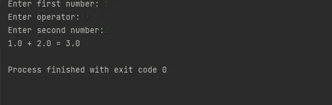

# python 条件语句简介

> 原文：<https://blog.devgenius.io/introduction-to-python-conditional-statements-9bcaa80ac978?source=collection_archive---------4----------------------->

## 学习 python if 语句的基础知识


迪安·普在 [Unsplash](https://unsplash.com/s/photos/python-programming?utm_source=unsplash&utm_medium=referral&utm_content=creditCopyText) 上的照片

Python 代码通常按照编写的顺序执行。然而，有时我们希望在满足条件的情况下执行特定的代码。为此，我们依赖条件语句。在执行代码之前，条件语句首先确定特定的条件是否存在。这使您能够控制代码流，并拥有不同的代码行，这些代码行仅在满足特定条件时执行。例如，在创建计算器应用程序时，您可能希望检查用户输入了哪个运算符，并根据该运算符执行特定的代码。您将在示例练习中这样做。

在本教程中，您将学习条件语句，并在我们创建一个简单的计算器应用程序时练习使用它们。记住，学习编程的最好方法是亲自动手写一些代码。让我们开始吧。

## 如果语句

在 python 中，条件语句使用以下格式的 if-else 语句。如果条件为真，则执行第一个代码，否则，程序移动并执行 else 语句下提供的代码。

```
#syntax for a conditional statement 
if condition:
    code to execute if true 
else: 
    code to execute otherwise 
```

为了建立直觉，让我们开始研究我们的计算器。假设我们有一个 python 程序，它接受来自用户的三个输入，num1、operator 和 num2，并根据运算符返回结果。为此，我们需要检查用户输入了哪个操作符，并执行函数的相关部分。

我们必须首先提示用户输入两个数字和运算符。请注意，为了获得用户输入，我们依赖于 python 内置的输入法。请访问谷歌了解一下。默认情况下，输入将是一个字符串，所以我们需要使用 float("string ")将它转换为一个 float:

```
#get user input 
#get first number
num1 = float(input("Enter first number: ")
#get operator 
op = input("Enter operator: ")
#get second number
num2 = float(input("Enter second number: ")
```


获取用户输入的代码

**输出**:


获取用户输入的输出

此时，我们的程序只是请求用户输入三个不同的输入，并将它们分配给相关的操作员。现在让我们来定义我们的计算器函数。在您喜欢的编辑器中创建一个 python 文件(simpleCalculator.py ),让我们开始吧。你可以在这里了解更多关于函数[的信息。](https://www.learnbyexample.org/python-functions/)

```
#function to add two numbers 
def add(x, y):
    return x+y
#function to subtract two numbers 
def subtract (x, y): 
    return x-y
#division function 
def division (x, y): 
    return x / y #function to find remainderdef mod (x, y):
    return x%y
#function to multiply to numbers 
def multiply (x,y): 
    return x * y 
#function to return exponent 
def exp (x,y): 
    return x ** y 
```


用于定义不同计算器功能的代码

下一步，我们将需要一个 if 语句来检查运算符是加号还是减号:

```
# define an answer variable to hold our solution 
answer = 0
# if addition sign
if op == "+":
    # call the add function
    answer = add(num1, num2)
    # print the results 
    print(num1, "+", num2, "=", answer)
else:
    # call the subtract function 
    answer = subtract(num1, num2)
    # print the results 
    print(num1, "-", num2, "=", answer)
```


加法或减法函数的简单 if 语句

**输出**



简单 if-else 语句的输出

## if-elif-else 语句

到目前为止，我们的计算器只能做两个功能，加法和减法。如果我们想扩展它的功能并利用我们定义的其他函数，我们将需要使用一个“ *elif 语句”*—else if 的缩写。这将允许我们在使用 else 语句退出之前检查多个其他条件。对于用户输入无效算术符号的情况，我们将使用最后一个条件(else)。参见代码:

```
# define an answer variable to hold our solution
answer = 0
# if addition sign
if op == "+":
    # call the add function
    answer = add(num1, num2)
    # print the results
    print(num1, "+", num2, "=", answer)
# if subtraction sign
elif op == "-":
    # call the subtract function
    answer = subtract(num1, num2)
    # print the results
    print(num1, "-", num2, "=", answer)
# if multiplication sign
elif op == "*":
    # call the multiple function
    answer = multiply(num1, num2)
    # print the results
    print(num1, "*", num2, "=", answer)
# if division sign
elif op == "/":
    # call the division function
    answer = division(num1, num2)
    # print the results
    print(num1, "/", num2, "=", answer)
# if modulus sign
elif op == "%":
    # call the mod function
    answer = mod(num1, num2)
    # print the results
    print(num1, "%", num2, "=", answer)
# if exponential
elif op == "**":
    # call the exp function
    answer = exp(num1, num2)
    # print the results
    print(num1, "^", num2, "=", answer)
# if not a recognized arithmatic sign
else:
    print("Invalid operator")
```


if-elif-else 语句的代码

输出-1


减法符号输出

输出-2


指数算子输出

输出-3


无效的操作员输出

现在轮到你玩了，看看不同的结果。尝试我们代码中所有不同的操作符。

## 嵌套 if 语句

也可以将另一个“ *if-elif-else 语句”*放在另一个 if 语句中。这被称为“*嵌套 if 语句”。*事实上，嵌套允许你在另一个 if 语句中添加多个 *if-elif-else* 语句。例如，我们可以修改代码来检查第二个数是否不为零，以避免被零除。将代码修改如下:

```
elif op == "/":
    # if second number is zero 
    if num2 == 0:
        print("Error - division by zero")
    else:
        # call the division function
        answer = division(num1, num2)
        # print the results
        print(num1, "/", num2, "=", answer)
# if modulus sign
```


**输出**


除以零输出—嵌套 if-else 语句

## 结论

我们现在已经到了教程的结尾。你已经学会了如何使用 *if-else* 语句、 *if-elif-else* 语句和嵌套的 *if 语句*。现在轮到你练习了。考虑如何改进计算器来检查用户是否输入了 num1 和 num2 的数字。在评论中分享你的结果。