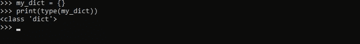
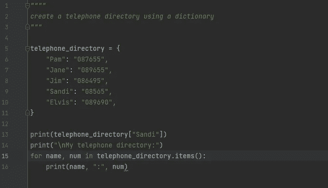
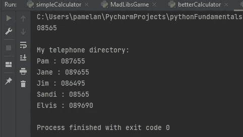
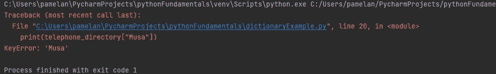
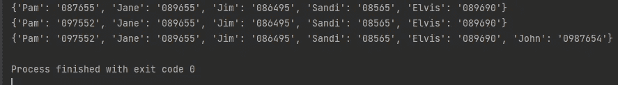

# python 词典简介

> 原文：<https://blog.devgenius.io/introduction-to-python-dictionaries-89045c9bf315?source=collection_archive---------5----------------------->

## 介绍


文章封面图片。来源:@ emilep—[https://unsplash.com/photos/xrVDYZRGdw4](https://unsplash.com/photos/xrVDYZRGdw4)

python 中有用的数据结构之一是字典。python 字典类似于列表，因为它是对象的集合。然而，与列表不同，字典是不可变的，值是通过字典键而不是索引来访问的。其他编程语言可能将字典称为“关联数组”。在本教程中，您将学习用 python 创建自己的字典，如何访问、添加或删除字典中的元素，以及常用的内置方法。

## 如何创建字典？

字典包含 ***键:值*** 对，并使用花括号“***{ }”***创建，每个 ***键:值*** *对由逗号分隔。*每个键映射到一个关联的值。值可以是任何数据类型，并且可以重复。另一方面，键必须是惟一的，并且必须是不可变的。

```
#creating an empty dictionary 
my_dict = {}
```

现在轮到你创建自己的空字典了。打开 python shell 或创建新的。py 文件，然后输入下面的代码。



在 python shell 中打印出 my_dict 的类型。输出为<class></class>

一般语法如下:

```
my_dict = {key1: value1, key2: value2, key3:value3, keyN: valueN}
```

为了提高可读性并尽量减少引入错误的机会，相同的代码可以写成:

```
my_dict = {
           key1: value1, 
           key2: value2,
           key3: value3,
           keyN: valueN,
          }
```

# 例子

现在你知道了如何创建一个字典，让我们来看一个例子，在这个例子中我们将创建一个包含我们朋友的名字和电话号码的电话簿。

```
telephone_directory = {
                       "Pam": "087655",
                       "Jane": "089655",
                       "Jim": "086495",
                       "Sandi": "08565",
                       "Elvis": "089690",
                       }
```

## 访问字典的值

假设您现在想要查看 Sandi 的电话号码，您必须键入以下命令:

```
#print Sandi's phone number 
print(telephone_directory["Sandi"])#output: 08565
```

我们可以使用 for 循环来打印目录中的所有值:

```
for name, num in telephone_directory.items():
    print(name,":",num)
```

请参见下面的代码截图:



电话号码簿使用字典代码截图

**输出:**



电话号码簿输出使用字典代码截图

如果我们尝试访问字典中不存在的值，将会返回一个 KeyError 消息。尝试在编辑器中键入以下代码:

```
print(telephone_directory["Musa"])
```

**输出**:



尝试访问字典中不存在的值时的 KeyError 输出消息

另一种访问字典值的方法是 ***get()*** 方法。

```
 #use the get method 
print(telephone_directory.get("Pam")**#Output*:* 087655**
```

当试图用 get()方法访问一个不存在的值时，程序返回 ***None*** 而不是错误消息。

```
#use get() to access invalid key 
print(telephone_directory.get("Musa")**#Output: None**
```

如果键不存在， **get()** 方法允许您指定要打印的第二个参数，而不是“None”。

```
#specify message to be printed if key does not exist 
print(telephone_directory.get("Musa","Invalid key"))**#Output: Invalid Key**
```

## 检查字典的长度

检查字典的长度非常简单:

```
dict_len = len(telephone_directory)
print(dict_len) **#Output*:* 5** 
```

## 添加或更改字典元素

与元组不同，字典是可变的，这意味着您可以添加、更改或删除字典中现有项的值。

```
# changing the value
print(telephone_directory)
telephone_directory["Pam"] = "097552"
print(telephone_directory)
#adding new name
telephone_directory["John"] = "0987654"
print(telephone_directory)
```

**输出:**



**从字典中删除元素**

使用内置方法从字典中删除元素非常容易。要从字典中删除特定的条目，我们可以使用 ***pop()*** 方法，该方法删除给定键的条目并返回值。

```
#remove element using pop() 
print(telephone_directory.pop("Jane"))**#Output: 089655**
```

**popitem()** 方法从字典中删除最后一个键值对项，并将其作为元组返回:

```
#remove last item using popitem() method 
print(telephone_directory.popitem())**#Output: ('John', '0987654')**
```

要一次删除所有项目，您可以使用 ***clear()*** 方法:

```
#Delete all items in the dictionary 
telephone_directory.clear()
print(telephone_directory)**#Output: {}**
```

**其他字典方法**

以下是可用于字典的内置方法

*   **copy()** :返回字典的副本。
*   **get():** 返回指定键的值。
*   **pop():** 删除指定键对应的元素。
*   **popitem():** 删除最后插入的元素(值-键对)。
*   **值**:返回所有值的列表。
*   **items():** 为每个键值对返回一个带有元组的列表。
*   **type():** 返回变量类型。
*   **clear():** 从字典中删除所有元素。
*   **str():** 返回字典的字符串表示。
*   **update()** :用键值对更新字典。

## **了解更多信息**

恭喜阅读到教程结束。现在，您应该理解 python 中字典数据结构的基础，并且应该能够创建自己的字典。记住，最好的学习方法是练习。所以继续吧！