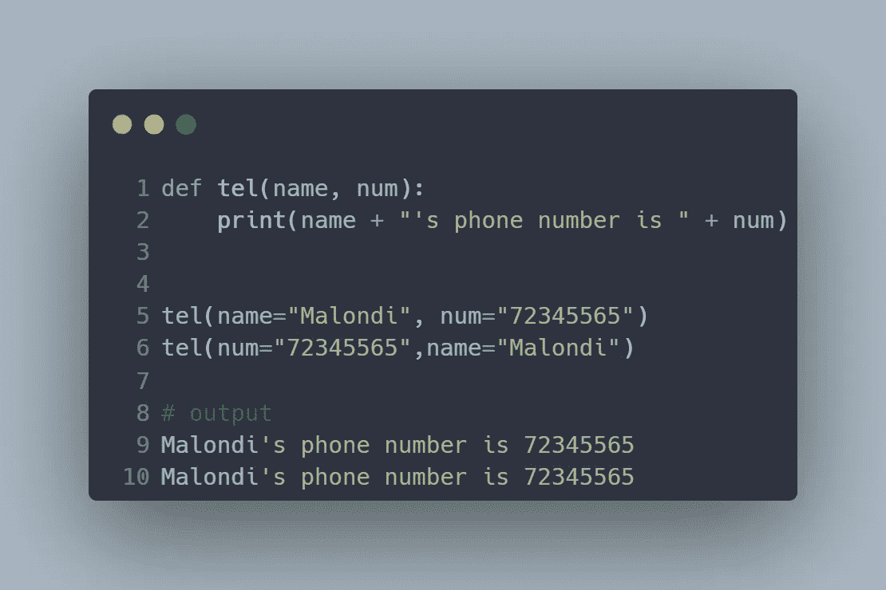
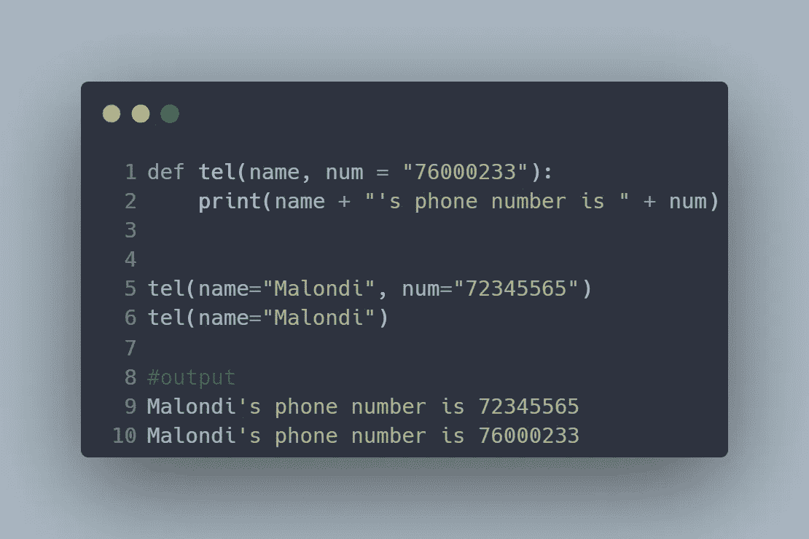

# Python 函数简介

> 原文：<https://blog.devgenius.io/introduction-to-python-functions-166785cb7771?source=collection_archive---------9----------------------->

关于如何在 python 中定义和使用函数的初级教程

作为 Python 开发人员，创建可重用代码是您需要掌握的技能之一。俗话说“不要重复自己(干)”Python 函数提供了一种定义一组执行特定任务的相关语句的方法。当你从事更复杂的项目时，你会意识到函数是如何帮助你使你的代码更有组织性和可管理性的。

如果你已经编程一段时间了，甚至只是几天，你就已经遇到了诸如 *print(* )、 *len()* 或 *type()* 之类的函数。这些都是内置函数。在本教程中，您不仅将学习如何使用内置函数，还将了解如何定义和重用您的函数。这些被称为用户定义的函数。


照片由 [Hitesh Choudhary](https://unsplash.com/@hiteshchoudhary?utm_source=unsplash&utm_medium=referral&utm_content=creditCopyText) 在 [Unsplash](https://unsplash.com/s/photos/python?utm_source=unsplash&utm_medium=referral&utm_content=creditCopyText) 上拍摄

## 语法

python 中的函数具有以下语法。

```
def function_name (parameters):
    statement(s) 
    return statement 
```

***其中***

*   ***def:*** *是标记函数开始的关键字。*
*   ***function _ name:****是用来标识函数的唯一名称。*
*   ***参数*** *:用于向函数传递值。*
*   ***冒号(:)*** :标记函数头的结束和函数体的开始。
*   ***语句:*** *构成函数体的一部分，缩进。*
*   ***return 语句:*** *可选语句，用于将数据发送回函数调用方。*

## 定义您的职能

Python 有两种类型的函数，内置函数和用户自定义函数。用户定义的函数是我们自己创建来执行特定任务的函数。现在你已经熟悉了语法，让我们开始练习定义函数。让我们定义一个函数，它接受用户名并打印出“Hello [user_name]”。

一个简单的函数，打印“你好[用户名]！”

about 函数非常简单，它只接受一个参数，不返回值。我们可以退回问候语，而不是打印出来。让我们修改我们的代码。

带有 return 语句的函数示例

我们还可以创建一个函数，对两个数字进行简单的加法运算，并返回它们的和。继续发挥你的创造力吧！

带有 return 语句的函数的第二个示例

## 参数和自变量

术语“参数”和“自变量”通常可以互换使用，表示作为输入传递给函数的值。然而，从函数的角度来看，*参数*是函数定义中括号内列出的变量。这就是上面例子中的变量 num1 和 num2。A *参数*是在函数调用期间传递给函数的值。将一个参数赋给函数内部的参数变量。

> *参数*在 Python 文档中经常被缩写为 *args* 。

## 调用函数

调用函数非常容易。您只需输入函数名及其参数。我们的加法函数有两个*参数*，我们需要将它们包含在函数调用中，在括号内。假设我们想找到数字 234 和 453 相加的结果，我们可以如下调用我们的加法函数。我们的例子使用了位置变量，其中的值被按顺序复制到相应的参数中。数字 234 是我们的第一个参数，它被分配给参数变量 num1，第二个数字(453)在参数 num2 中。当使用位置参数时，您需要在函数调用过程中以正确的顺序传递它们。

```
#function call 
results = addition(234,453)#print results
print(results)**#output** 687
```

## 关键字参数

Python 提供了一种使用相应参数的名称来传递参数的方法。这有助于消除混乱，因为你不再需要记住他们的顺序。让我们看看这个简单的函数是如何工作的，它有两个参数——姓名和电话号码，并打印出来。



关键字参数示例

你会注意到，尽管改变了参数的顺序，输出并没有改变。

## 默认参数

也可以用默认值创建函数。如果在没有参数的情况下调用函数，默认值将传递给参数。我们可以使用赋值操作符(=)在函数定义中提供默认值。让我们修改一下我们的 tel()函数，让它有一个默认的电话号码。



默认参数示例

请注意，我们只在第二个函数调用中指定了 name 参数，并且该函数分配了一个默认的电话号码。

## 内置函数

Python 附带了几个内置函数，这些函数随时可供使用。你可以在这里找到内置函数列表[。](https://docs.python.org/3/library/functions.html)

## 结束了！

我们已经到了教程的结尾。我希望本教程为您提供了开始使用 Python 中的函数所需的基础。