# 通过 Torch Audio 介绍 PyTorch 音频数据

> 原文：<https://blog.devgenius.io/introduction-to-pytorch-audio-data-via-torchaudio-41dbea208d28?source=collection_archive---------5----------------------->

## 自然语言处理

## 如何使用 TorchAudio 处理音频数据

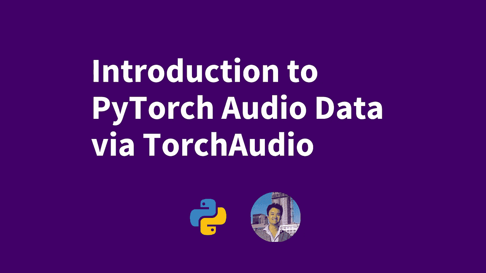

PyTorch 是 Python 中领先的机器学习框架之一。最近，PyTorch 发布了他们处理音频数据的框架的更新版本， [**TorchAudio**](https://github.com/pytorch/audio) 。TorchAudio 支持的不仅仅是使用音频数据进行机器学习。它还支持将音频数据用于机器学习模型所需的数据转换、扩充和特征提取。

在本帖中，我们将讨论:

*   **为音频数据增强设置 py torch torch Audio**
*   **使用 PyTorch TorchAudio 添加音频数据增强效果**
*   **在 TorchAudio 中使用音效**
*   **添加背景噪音**
*   **添加房间混响**
*   **使用 TorchAudio 对音频数据进行高级重采样**
*   **用 PyTorch TorchAudio 提取音频特征**
*   **总之**

# 为音频数据增强设置 PyTorch TorchAudio

在撰写本文时，`torchaudio`在版本`0.11.0`上，并且只适用于 Python 版本 3.6 到 3.9。对于这个例子，我们将使用 Python 3.9。在开始之前，我们还需要安装一些库。我们需要的第一个库是 PyTorch 的`torch`和`torchaudio`。我们将使用`matplotlib`来绘制我们的视觉表示，`requests`来获取数据，`librosa`来对光谱图进行更多的视觉操作。

首先，我们将把所有这些安装到一个新的虚拟环境中。 [**启动虚拟环境**](https://developers.deepgram.com/blog/2022/02/python-virtual-environments/) 运行`python3 -m venv <new environment name>`。然后运行`pip install torch torchaudio matplotlib requests librosa`，让`pip`安装本教程所需的所有库。

# 使用 PyTorch TorchAudio 添加音频数据增强效果

最近，我们讲述了 [**如何在 Python**](https://developers.deepgram.com/blog/2022/06/best-python-audio-manipulation-tools/) 中操作音频数据的基础知识。在这一节中，我们将介绍如何将音效选项传递给 TorchAudio 的基础知识。然后，我们将详细介绍如何在不同的声音级别添加背景噪音，以及如何添加房间混响。

在我们开始之前，我们必须设置一些东西。这段代码完全是辅助代码，你可以 [**跳过**](https://developers.deepgram.com/blog/2022/06/pytorch-intro-with-torchaudio/#using-sound-effects-in-torchaudio) 。如果您想继续对所提供的数据进行测试，那么理解这些代码会很有帮助。

在下面的代码块中，我们首先导入我们需要的所有库。然后，我们定义存储音频数据的 URL 和存储音频的本地路径。接下来，我们获取数据并定义一些辅助函数。

对于这个例子，我们将定义函数来获取噪声、语音和混响样本。我们还将定义函数来绘制我们正在处理的声音的波形、声谱图和`numpy`表示。

```
import math
import osimport matplotlib.pyplot as plt
import requests
import torchaudio
import torch_SAMPLE_DIR = "_assets"
SAMPLE_WAV_URL = "https://pytorch-tutorial-assets.s3.amazonaws.com/steam-train-whistle-daniel_simon.wav"
SAMPLE_WAV_PATH = os.path.join(_SAMPLE_DIR, "steam.wav")SAMPLE_RIR_URL = "https://pytorch-tutorial-assets.s3.amazonaws.com/VOiCES_devkit/distant-16k/room-response/rm1/impulse/Lab41-SRI-VOiCES-rm1-impulse-mc01-stu-clo.wav"  # noqa: E501
SAMPLE_RIR_PATH = os.path.join(_SAMPLE_DIR, "rir.wav")SAMPLE_WAV_SPEECH_URL = "https://pytorch-tutorial-assets.s3.amazonaws.com/VOiCES_devkit/source-16k/train/sp0307/Lab41-SRI-VOiCES-src-sp0307-ch127535-sg0042.wav"  # noqa: E501
SAMPLE_WAV_SPEECH_PATH = os.path.join(_SAMPLE_DIR, "speech.wav")SAMPLE_NOISE_URL = "https://pytorch-tutorial-assets.s3.amazonaws.com/VOiCES_devkit/distant-16k/distractors/rm1/babb/Lab41-SRI-VOiCES-rm1-babb-mc01-stu-clo.wav"  # noqa: E501
SAMPLE_NOISE_PATH = os.path.join(_SAMPLE_DIR, "bg.wav")os.makedirs(_SAMPLE_DIR, exist_ok=True)def _fetch_data():
   uri = [(SAMPLE_WAV_URL, SAMPLE_WAV_PATH),
           (SAMPLE_RIR_URL, SAMPLE_RIR_PATH),
           (SAMPLE_WAV_SPEECH_URL, SAMPLE_WAV_SPEECH_PATH),
           (SAMPLE_NOISE_URL, SAMPLE_NOISE_PATH),]
   for url, path in uri:
       with open(path, "wb") as file_:
           file_.write(requests.get(url).content)_fetch_data()def _get_sample(path, resample=None):
   effects = [["remix","1"]]
   if resample:
       effects.extend([
           ["lowpass", f"{resample // 2}"],
           ["rate", f"{resample}"]
       ])
   return torchaudio.sox_effects.apply_effects_file(path, effects=effects)def get_sample(*, resample=None):
   return _get_sample(SAMPLE_WAV_PATH, resample=resample)def get_speech_sample(*, resample=None):
   return _get_sample(SAMPLE_WAV_SPEECH_PATH, resample=resample)def plot_waveform(waveform, sample_rate, title="Waveform", xlim=None, ylim=None):
   waveform = waveform.numpy()
   num_channels, num_frames = waveform.shape
   time_axis = torch.arange(0, num_frames) / sample_rate figure, axes = plt.subplots(num_channels, 1)
   if num_channels == 1:
       axes = [axes]
   for c in range(num_channels):
       axes[c].plot(time_axis, waveform[c], linewidth=1)
       axes[c].grid(True)
       if num_channels > 1:
           axes[c].set_ylabel(f"Channel {c+1}")
       if xlim:
           axes[c].set_xlim(xlim)
       if ylim:
           axes[c].set_ylim(ylim)
   figure.suptitle(title)
   plt.show(block=False)def print_stats(waveform, sample_rate=None, src=None):
   if src:
       print("-"*10)
       print(f"Source: {src}")
       print("-"*10)
   if sample_rate:
       print(f"Sample Rate: {sample_rate}")
   print("Dtype:", waveform.dtype)
   print(f" - Max:     {waveform.max().item():6.3f}")
   print(f" - Min:     {waveform.min().item():6.3f}")
   print(f" - Mean:    {waveform.mean().item():6.3f}")
   print(f" - Std Dev: {waveform.std().item():6.3f}")
   print()
   print(waveform)
   print()def plot_specgram(waveform, sample_rate, title="Spectrogram", xlim=None):
   waveform = waveform.numpy()
   num_channels, num_frames = waveform.shape
   figure, axes = plt.subplots(num_channels, 1)
   if num_channels == 1:
       axes = [axes]
   for c in range(num_channels):
       axes[c].specgram(waveform[c], Fs=sample_rate)
       if num_channels > 1:
           axes[c].set_ylabel(f"Channel {c+1}")
       if xlim:
           axes[c].set_xlim(xlim)
   figure.suptitle(title)
   plt.show(block=False)def get_rir_sample(*, resample=None, processed=False):
   rir_raw, sample_rate = _get_sample(SAMPLE_RIR_PATH, resample=resample)
   if not processed:
       return rir_raw, sample_rate
   rir = rir_raw[:, int(sample_rate*1.01) : int(sample_rate * 1.3)]
   rir = rir / torch.norm(rir, p=2)
   rir = torch.flip(rir, [1])
   return rir, sample_ratedef get_noise_sample(*, resample=None):
   return _get_sample(SAMPLE_NOISE_PATH, resample=resample)
```

# 在 Torchaudio 中使用声音效果

现在我们已经设置好了一切，让我们来看看如何使用 PyTorch 的`torchaudio`库来添加音效。我们将向来自`torchaudio`的`sox_effects.apply_effects_tensor`函数传递一个字符串列表(`List[List[Str]])`对象)。

列表列表中的每个内部列表都包含一组定义效果的字符串。序列中的第一个字符串表示效果，接下来的条目表示如何应用该效果的参数。在下面的例子中，我们展示了如何添加一个低通滤波器，提高速度，并添加一些混响。有关可用音效选项的完整列表，请查看 sox 文档[](http://sox.sourceforge.net/sox.html)**。注意:这个函数返回两个返回值，波形和新的采样率。**

```
# Load the data
waveform1, sample_rate1 = get_sample(resample=16000)# Define effects
effects = [
   ["lowpass", "-1", "300"],  # apply single-pole lowpass filter
   ["speed", "0.8"],  # reduce the speed
   # This only changes sample rate, so it is necessary to
   # add `rate` effect with original sample rate after this.
   ["rate", f"{sample_rate1}"],
   ["reverb", "-w"],  # Reverbration gives some dramatic feeling
]
# Apply effects
waveform2, sample_rate2 = torchaudio.sox_effects.apply_effects_tensor(waveform1, sample_rate1, effects)
print_stats(waveform1, sample_rate=sample_rate1, src="Original")
print_stats(waveform2, sample_rate=sample_rate2, src="Effects Applied")
plot_waveform(waveform1, sample_rate1, title="Original", xlim=(-0.1, 3.2))
plot_specgram(waveform1, sample_rate1, title="Original", xlim=(0, 3.04))
plot_waveform(waveform2, sample_rate2, title="Effects Applied", xlim=(-0.1, 3.2))
plot_specgram(waveform2, sample_rate2, title="Effects Applied", xlim=(0, 3.04))
```

**绘制波形和光谱图的打印输出如下。请注意，添加混响需要一个多声道波形来产生这种效果。从效果上可以看出波形和声谱图的区别。降低速度会拉长声音。添加滤波器会压缩部分声音(在声谱图中可见)。最后，混响增加了噪声，我们可以看到它主要反映在波形的“更细”或更安静的部分。**

**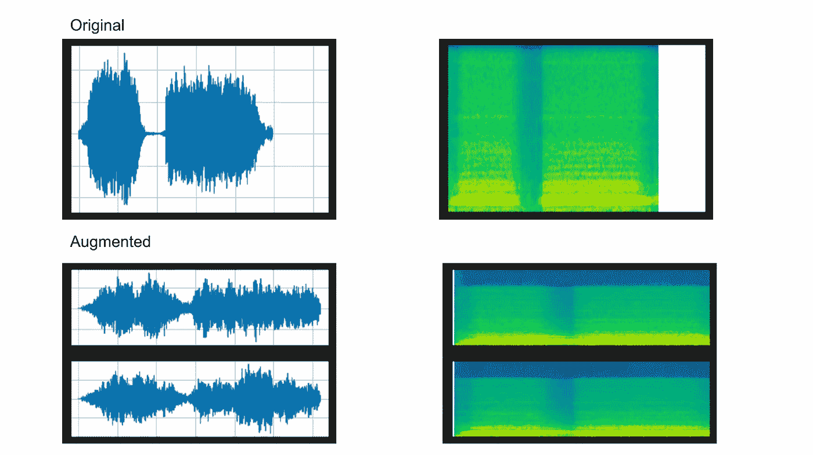**

***上图:原始波形和声谱图 TorchAudio 添加的效果***

# **添加背景噪音**

**现在我们知道了如何使用`torchaudio`给音频添加效果，让我们深入一些更具体的用例。如果您的模型需要能够在有背景噪音的情况下检测音频，那么在训练数据中添加一些背景噪音是一个好主意。**

**在下面的例子中，我们将从声明一个采样速率开始(8000 是一个非常典型的速率)。接下来，我们将调用我们的助手函数来获取语音和背景噪声，并对噪声进行整形。之后，我们将使用`norm`函数将语音和文本规范化到 [**二阶**](https://pytorch.org/docs/stable/generated/torch.norm.html) 。接下来，我们将定义一个分贝列表，我们希望在演讲中播放背景噪音，并在每个级别创建一个“背景噪音”版本。**

```
sample_rate = 8000
speech, _ = get_speech_sample(resample=sample_rate)
noise, _ = get_noise_sample(resample=sample_rate)
noise = noise[:, : speech.shape[1]]speech_power = speech.norm(p=2)
noise_power = noise.norm(p=2)snr_dbs = [20, 10, 3]
noisy_speeches = []
for snr_db in snr_dbs:
   snr = math.exp(snr_db / 10)
   scale = snr * noise_power / speech_power
   noisy_speeches.append((scale * speech + noise) / 2)plot_waveform(noise, sample_rate, title="Background noise")
plot_specgram(noise, sample_rate, title="Background noise")
```

**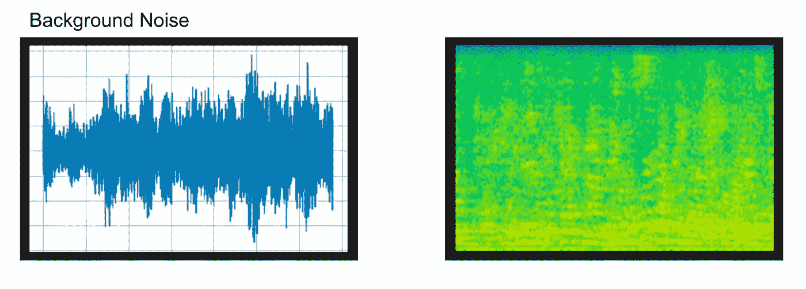**

**以上图片显示了背景噪音的波形和声谱图。我们已经在上面的代码中创建了所有的噪声语音音频数据剪辑。下面的代码将它们全部打印出来，这样我们就可以看到不同音频级别的数据是什么样子。请注意，20 dB `snr`意味着信号(语音)与噪声(背景噪声)的比率为 20dB，而不是播放的噪声为 20dB。**

```
# background noise at certain levels
snr_db20, noisy_speech20 = snr_dbs[0], noisy_speeches[0]
plot_waveform(noisy_speech20, sample_rate, title=f"SNR: {snr_db20} [dB]")
plot_specgram(noisy_speech20, sample_rate, title=f"SNR: {snr_db20} [dB]")snr_db10, noisy_speech10 = snr_dbs[1], noisy_speeches[1]
plot_waveform(noisy_speech10, sample_rate, title=f"SNR: {snr_db10} [dB]")
plot_specgram(noisy_speech10, sample_rate, title=f"SNR: {snr_db10} [dB]")snr_db3, noisy_speech3 = snr_dbs[2], noisy_speeches[2]
plot_waveform(noisy_speech3, sample_rate, title=f"SNR: {snr_db3} [dB]")
plot_specgram(noisy_speech3, sample_rate, title=f"SNR: {snr_db3} [dB]")
```

**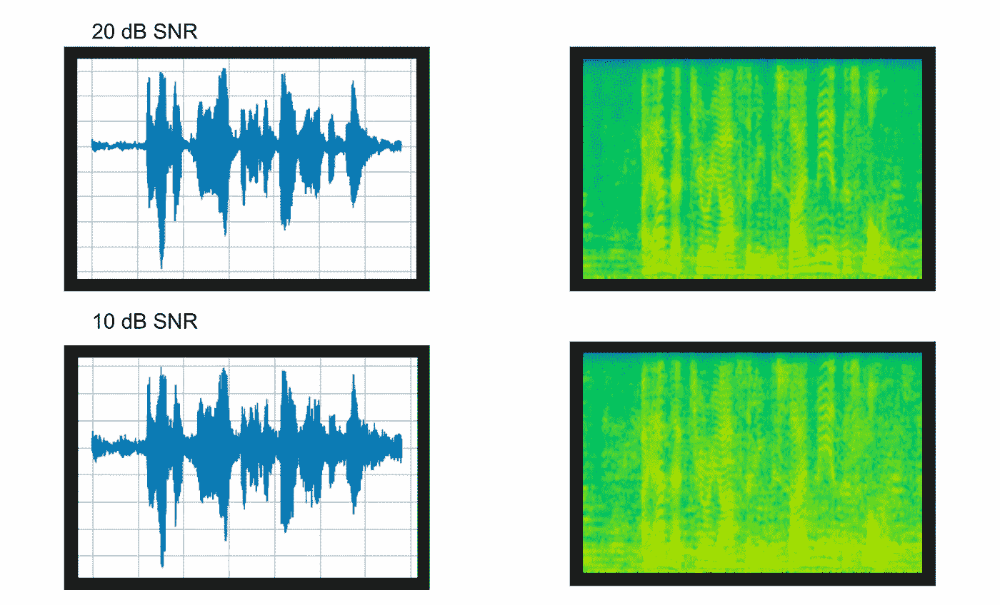**

***上图:通过 PyTorch TorchAudio 添加了 20 和 10 dB SNR 的背景噪声可视化效果***

**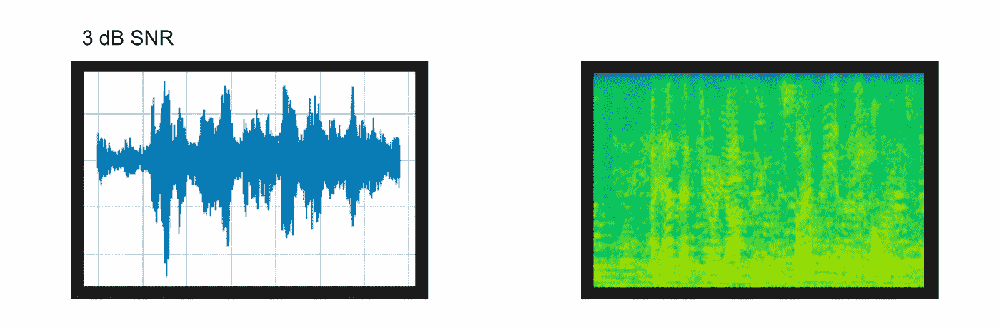**

***上图:添加背景噪声的 3 dB 信噪比波形和频谱图***

# **添加房间混响**

**到目前为止，我们已经应用了不同噪声水平的音频效果和背景噪声。让我们也来看看如何添加一个混响。给音频剪辑添加混响会给人一种音频是在回声室内录制的感觉。您可以这样做，让它看起来像是您在电脑上做的演示实际上是在剧院里给观众做的。**

**要添加房间混响，我们首先要使用上面的一个函数(`get_rir_sample`)在线请求音频。我们先看一下波形，然后再对其进行剪辑，以获得声音的“混响”，将其归一化，然后翻转声音，使混响正常工作。**

```
sample_rate = 8000rir_raw, _ = get_rir_sample(resample=sample_rate)plot_waveform(rir_raw, sample_rate, title="Room Impulse Response (raw)", ylim=None)
plot_specgram(rir_raw, sample_rate, title="Room Impulse Response (raw)")rir = rir_raw[:, int(sample_rate * 1.01) : int(sample_rate * 1.3)]
rir = rir / torch.norm(rir, p=2)
rir = torch.flip(rir, [1])print_stats(rir)
plot_waveform(rir, sample_rate, title="Room Impulse Response", ylim=None)
plot_specgram(rir_raw, sample_rate, title="Room Impulse Response (raw)")
```

**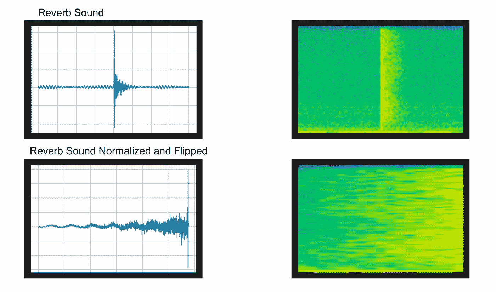**

***上图:PyTorch TorchAudio 的原始和增强混响声音可视化效果***

**一旦我们对声音进行了标准化和翻转，我们就可以用它来增强现有的音频。我们将首先使用 PyTorch 创建一个使用语音和增强声音的“填充”。然后，我们将使用 PyTorch 对声音进行一维卷积。**

```
speech, _ = get_speech_sample(resample=sample_rate)speech_ = torch.nn.functional.pad(speech, (rir.shape[1] - 1, 0))
augmented = torch.nn.functional.conv1d(speech_[None, ...], rir[None, ...])[0]plot_waveform(speech, sample_rate, title="Original", ylim=None)
plot_specgram(speech, sample_rate, title="Original")
play_audio(speech, sample_rate)plot_waveform(augmented, sample_rate, title="RIR Applied", ylim=None)
plot_specgram(augmented, sample_rate, title="RIR Applied")
play_audio(augmented, sample_rate)
```

**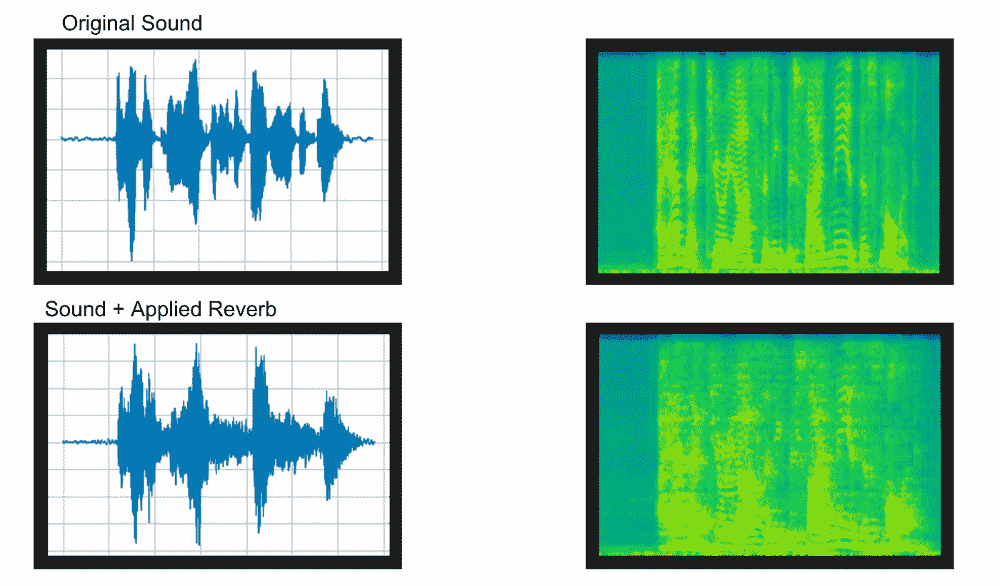**

***上图:TorchAudio 应用混响后的音频可视化效果***

**从上面的打印输出中我们可以看到，添加房间混响会将类似回声的声音添加到波形中。我们还可以看到，声谱图的清晰度低于接近话筒的清晰声音。**

# **使用 TorchAudio 对音频数据进行高级重采样**

**我们简要地提到了在使用`pydub`和`sklearn`库之前如何重新采样数据。TorchAudio 还可以让您使用多种方法轻松地对音频数据进行重新采样。在本节中，我们将讨论如何使用低通滤波器、滚降滤波器和窗口滤波器对数据进行重采样。**

**正如我们在上面所做的，在我们真正开始对数据进行重采样之前，我们需要设置一些辅助函数。这些设置功能中的许多功能与上述功能相同。这里需要注意的是`get_sine_sweep`，我们将使用它来代替现有的音频文件。所有其他功能，如获取刻度和反向对数频率，都是为了绘制数据。**

```
import math
import torchimport matplotlib.pyplot as plt
from IPython.display import Audio, display DEFAULT_OFFSET = 201
SWEEP_MAX_SAMPLE_RATE = 48000
DEFAULT_LOWPASS_FILTER_WIDTH = 6
DEFAULT_ROLLOFF = 0.99
DEFAULT_RESAMPLING_METHOD = "sinc_interpolation"def _get_log_freq(sample_rate, max_sweep_rate, offset):
   """Get freqs evenly spaced out in log-scale, between [0, max_sweep_rate // 2] offset is used to avoid negative infinity `log(offset + x)`. """
   start, stop = math.log(offset), math.log(offset + max_sweep_rate // 2)
   return torch.exp(torch.linspace(start, stop, sample_rate, dtype=torch.double)) - offsetdef _get_inverse_log_freq(freq, sample_rate, offset):
   """Find the time where the given frequency is given by _get_log_freq"""
   half = sample_rate // 2
   return sample_rate * (math.log(1 + freq / offset) / math.log(1 + half / offset)) def _get_freq_ticks(sample_rate, offset, f_max):
   # Given the original sample rate used for generating the sweep,
   # find the x-axis value where the log-scale major frequency values fall in
   time, freq = [], []
   for exp in range(2, 5):
       for v in range(1, 10):
           f = v * 10 ** exp
           if f < sample_rate // 2:
               t = _get_inverse_log_freq(f, sample_rate, offset) / sample_rate
               time.append(t)
               freq.append(f)
   t_max = _get_inverse_log_freq(f_max, sample_rate, offset) / sample_rate
   time.append(t_max)
   freq.append(f_max)
   return time, freqdef get_sine_sweep(sample_rate, offset=DEFAULT_OFFSET):
   max_sweep_rate = sample_rate
   freq = _get_log_freq(sample_rate, max_sweep_rate, offset)
   delta = 2 * math.pi * freq / sample_rate
   cummulative = torch.cumsum(delta, dim=0)
   signal = torch.sin(cummulative).unsqueeze(dim=0)
   return signaldef plot_sweep(
   waveform,
   sample_rate,
   title,
   max_sweep_rate=SWEEP_MAX_SAMPLE_RATE,
   offset=DEFAULT_OFFSET,
):
   x_ticks = [100, 500, 1000, 5000, 10000, 20000, max_sweep_rate // 2]
   y_ticks = [1000, 5000, 10000, 20000, sample_rate // 2] time, freq = _get_freq_ticks(max_sweep_rate, offset, sample_rate // 2)
   freq_x = [f if f in x_ticks and f <= max_sweep_rate // 2 else None for f in freq]
   freq_y = [f for f in freq if f >= 1000 and f in y_ticks and f <= sample_rate // 2] figure, axis = plt.subplots(1, 1)
   axis.specgram(waveform[0].numpy(), Fs=sample_rate)
   plt.xticks(time, freq_x)
   plt.yticks(freq_y, freq_y)
   axis.set_xlabel("Original Signal Frequency (Hz, log scale)")
   axis.set_ylabel("Waveform Frequency (Hz)")
   axis.xaxis.grid(True, alpha=0.67)
   axis.yaxis.grid(True, alpha=0.67)
   figure.suptitle(f"{title} (sample rate: {sample_rate} Hz)")
   plt.show(block=True)def plot_specgram(waveform, sample_rate, title="Spectrogram", xlim=None):
   waveform = waveform.numpy() num_channels, num_frames = waveform.shape figure, axes = plt.subplots(num_channels, 1)
   if num_channels == 1:
       axes = [axes]
   for c in range(num_channels):
       axes[c].specgram(waveform[c], Fs=sample_rate)
       if num_channels > 1:
           axes[c].set_ylabel(f"Channel {c+1}")
       if xlim:
           axes[c].set_xlim(xlim)
   figure.suptitle(title)
   plt.show(block=False)
```

**我把两个`torchaudio`导入放在这里是为了澄清这是我们将用来提取函数的`T`和`F`字母(相对于 true 和 false！).我们将声明一个采样速率和一个重采样速率，它们是什么并不重要，你可以随意改变它们。**

**我们要做的第一件事是使用`get_sine_sweep`函数创建一个波形。然后，我们将不传递任何参数进行重采样。接下来，我们来看看当我们使用低通滤波器宽度参数时，扫描是什么样子的。为此，我们需要功能性的`torchaudio`包。**

**从技术上来说，频率是无限的，所以低通滤波器可以滤除低于某一频率的声音。低通滤波器的宽度决定了该滤波器的窗口大小。Torchaudio 的默认值是 6，所以我们的第一次和第二次重采样是相同的。这里的值越大，噪波越“尖锐”。**

```
import torchaudio.functional as F
import torchaudio.transforms as T
sample_rate = 48000
resample_rate = 32000waveform = get_sine_sweep(sample_rate)
plot_sweep(waveform, sample_rate, title="Original Waveform")print("basic resampling")
resampler = T.Resample(sample_rate, resample_rate, dtype=waveform.dtype)
resampled_waveform = resampler(waveform)
plot_sweep(resampled_waveform, resample_rate, title="Resampled Waveform")print("lowpass resampling")
lp6_resampled_waveform = F.resample(waveform, sample_rate, resample_rate, lowpass_filter_width=6)
plot_sweep(resampled_waveform, resample_rate, title="lowpass_filter_width=6")lp128_resampled_waveform = F.resample(waveform, sample_rate, resample_rate, lowpass_filter_width=128)
plot_sweep(resampled_waveform, resample_rate, title="lowpass_filter_width=128")
```

**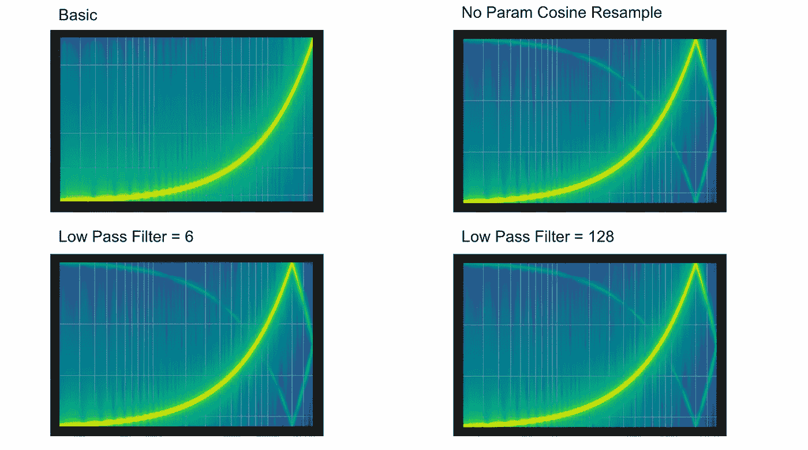**

***上图:TorchAudio 的基本和低通滤波器示例频谱图***

**过滤器不是我们唯一可以用于重采样的东西。在下面的示例代码中，我们将同时使用默认的汉恩窗口和 Kaiser 窗口。两个窗口都用作自动过滤的方式。使用滚降进行重采样可以达到同样的目的。在我们的示例中，我们将采用 0.99 和 0.8 的滚降。衰减表示音频的衰减比例。**

```
print("using a window to resample")
hann_window_resampled_waveform = F.resample(waveform, sample_rate, resample_rate, resampling_method="sinc_interpolation")
plot_sweep(resampled_waveform, resample_rate, title="Hann Window Default")kaiser_window_resampled_waveform = F.resample(waveform, sample_rate, resample_rate, resampling_method="kaiser_window")
plot_sweep(resampled_waveform, resample_rate, title="Kaiser Window Default")print("user rollof to determine window")
rolloff_resampled_waveform = F.resample(waveform, sample_rate, resample_rate, rolloff=0.99)
plot_sweep(resampled_waveform, resample_rate, title="rolloff=0.99")rolloff_resampled_waveform = F.resample(waveform, sample_rate, resample_rate, rolloff=0.8)
plot_sweep(resampled_waveform, resample_rate, title="rolloff=0.8")
```

**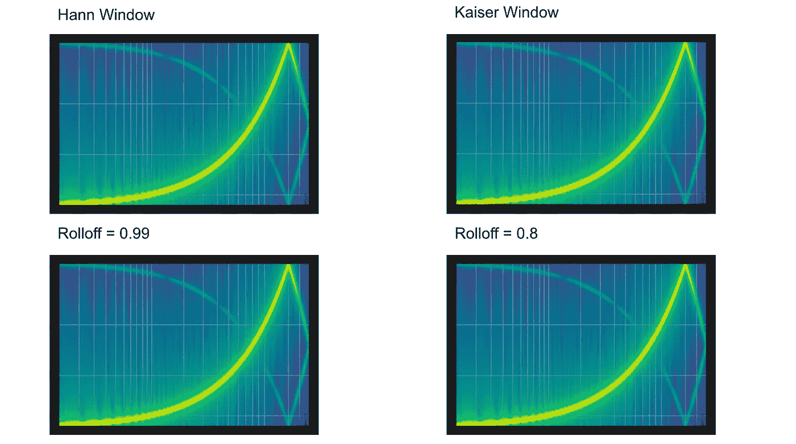**

***上图:TorchAudio 的窗口和滚降参数重采样可视化***

# **基于 PyTorch TorchAudio 的音频特征提取**

**到目前为止，我们已经了解了如何以多种方式使用`torchaudio`来处理我们的音频数据。现在我们来看看如何用`torchaudio`做特征提取。正如我们在上面两个部分中所做的那样，我们将从设置开始。**

**我们的设置函数将包括获取数据的函数，以及像上面的“效果”部分那样可视化数据的函数。我们还添加了一些用于 Mel 缩放桶的函数。我们将使用 [**梅尔标度**](https://en.wikipedia.org/wiki/Mel_scale) 桶来制作梅尔频率倒谱系数(MFCC)，这些系数代表音频音色。**

```
import osimport torch
import torchaudio
import torchaudio.functional as F
import torchaudio.transforms as T
import librosa
import matplotlib.pyplot as plt
import requests _SAMPLE_DIR = "_assets"SAMPLE_WAV_SPEECH_URL = "https://pytorch-tutorial-assets.s3.amazonaws.com/VOiCES_devkit/source-16k/train/sp0307/Lab41-SRI-VOiCES-src-sp0307-ch127535-sg0042.wav"  # noqa: E501
SAMPLE_WAV_SPEECH_PATH = os.path.join(_SAMPLE_DIR, "speech.wav")os.makedirs(_SAMPLE_DIR, exist_ok=True) def _fetch_data():
   uri = [
       (SAMPLE_WAV_SPEECH_URL, SAMPLE_WAV_SPEECH_PATH),
   ]
   for url, path in uri:
       with open(path, "wb") as file_:
           file_.write(requests.get(url).content) _fetch_data() def _get_sample(path, resample=None):
   effects = [["remix", "1"]]
   if resample:
       effects.extend(
           [
               ["lowpass", f"{resample // 2}"],
               ["rate", f"{resample}"],
           ]
       )
   return torchaudio.sox_effects.apply_effects_file(path, effects=effects) def get_speech_sample(*, resample=None):
   return _get_sample(SAMPLE_WAV_SPEECH_PATH, resample=resample) def plot_spectrogram(spec, title=None, ylabel="freq_bin", aspect="auto", xmax=None):
   fig, axs = plt.subplots(1, 1)
   axs.set_title(title or "Spectrogram (db)")
   axs.set_ylabel(ylabel)
   axs.set_xlabel("frame")
   im = axs.imshow(librosa.power_to_db(spec), origin="lower", aspect=aspect)
   if xmax:
       axs.set_xlim((0, xmax))
   fig.colorbar(im, ax=axs)
   plt.show(block=False) def plot_waveform(waveform, sample_rate, title="Waveform", xlim=None, ylim=None):
   waveform = waveform.numpy() num_channels, num_frames = waveform.shape
   time_axis = torch.arange(0, num_frames) / sample_rate figure, axes = plt.subplots(num_channels, 1)
   if num_channels == 1:
       axes = [axes]
   for c in range(num_channels):
       axes[c].plot(time_axis, waveform[c], linewidth=1)
       axes[c].grid(True)
       if num_channels > 1:
           axes[c].set_ylabel(f"Channel {c+1}")
       if xlim:
           axes[c].set_xlim(xlim)
       if ylim:
           axes[c].set_ylim(ylim)
   figure.suptitle(title)
   plt.show(block=False) def plot_mel_fbank(fbank, title=None):
   fig, axs = plt.subplots(1, 1)
   axs.set_title(title or "Filter bank")
   axs.imshow(fbank, aspect="auto")
   axs.set_ylabel("frequency bin")
   axs.set_xlabel("mel bin")
   plt.show(block=False)
```

**我们在这里要做的第一件事是绘制声谱图，并将其反转。将波形转换成声谱图，然后再转换回来。为什么将波形转换成声谱图对特征提取有用？这种表示有助于提取频谱特征，如频率、音色、密度、滚降等。**

**在创建光谱图和反转光谱图之前，我们将定义一些常数。首先，我们要定义`n_fft`，快速傅立叶变换的大小，然后是窗口长度(窗口的大小)和跳跃长度(短时傅立叶变换之间的距离)。然后，我们将调用`torchaudio`将我们的波形转换成声谱图。为了将声谱图转换回波形，我们将使用来自`torchaudio`的`GriffinLim`函数，使用与上面相同的参数将波形转换成声谱图。**

```
# plot spectrogram
waveform, sample_rate = get_speech_sample()n_fft = 1024
win_length = None
hop_length = 512# create spectrogram
torch.random.manual_seed(0)
plot_waveform(waveform, sample_rate, title="Original")spec = T.Spectrogram(
   n_fft=n_fft,
   win_length=win_length,
   hop_length=hop_length,
)(waveform)
plot_spectrogram(spec[0], title="torchaudio spec")# reverse spectrogram to waveform with griffinlim
griffin_lim = T.GriffinLim(
   n_fft=n_fft,
   win_length=win_length,
   hop_length=hop_length,
)
waveform = griffin_lim(spec)
plot_waveform(waveform, sample_rate, title="Reconstructed")
```

**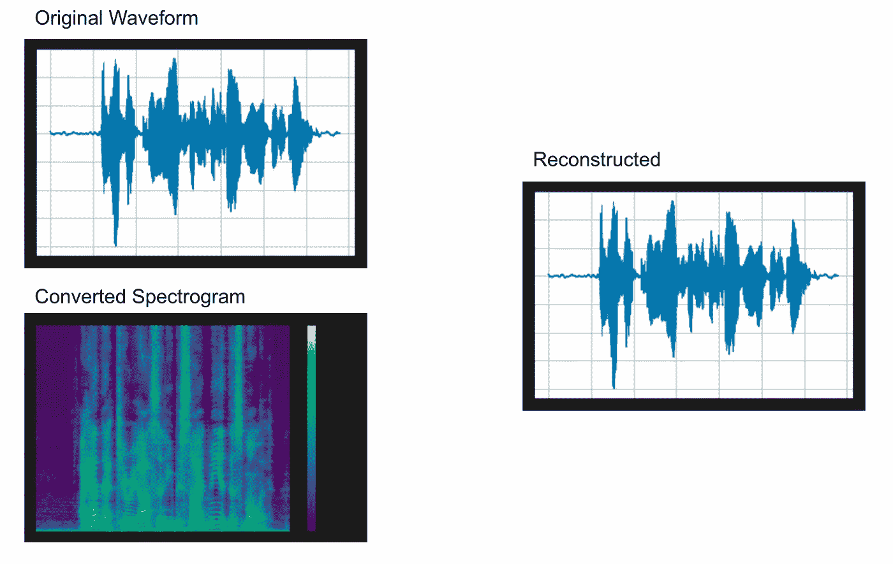**

***上图:在 PyTorch 中创建和反转光谱图***

**让我们来看看我们可以用频谱特征做的更有趣的事情之一， [**梅尔频率倒谱**](https://en.wikipedia.org/wiki/Mel-frequency_cepstrum) 。梅尔频率频谱系数(MFCC)代表音频的音色。在我们开始获取这些特征系数之前，我们将定义一些 mel 滤波器组(256)和一个新的采样速率。**

**我们为 MFCC 需要的第一件事是得到梅尔滤波器组。一旦我们得到了 mel 滤波器组，我们就可以用它来得到 mel 谱图。现在，我们准备好得到系数了。首先，我们需要定义我们想要多少系数，然后我们将使用梅尔滤波器组和梅尔频谱图来创建一个 MFCC 图。这是我们的 mel 谱图在减少到我们上面指定的系数数量时的样子。**

```
# mel spectrogram
# mel scale waveforms
# mel scale bins
n_mels = 256
sample_rate = 6000mel_filters = F.melscale_fbanks(
   int(n_fft // 2 + 1),
   n_mels=n_mels,
   f_min=0.0,
   f_max=sample_rate / 2.0,
   sample_rate=sample_rate,
   norm="slaney",
)
plot_mel_fbank(mel_filters, "Mel Filter Bank - torchaudio")# mel spectrogram
mel_spectrogram = T.MelSpectrogram(
   sample_rate=sample_rate,
   n_fft=n_fft,
   win_length=win_length,
   hop_length=hop_length,
   center=True,
   pad_mode="reflect",
   power=2.0,
   norm="slaney",
   onesided=True,
   n_mels=n_mels,
   mel_scale="htk",
)melspec = mel_spectrogram(waveform)
plot_spectrogram(melspec[0], title="MelSpectrogram - torchaudio", ylabel="mel freq")n_mfcc = 256mfcc_transform = T.MFCC(
   sample_rate=sample_rate,
   n_mfcc=n_mfcc,
   melkwargs={
       "n_fft": n_fft,
       "n_mels": n_mels,
       "hop_length": hop_length,
       "mel_scale": "htk",
   },
)mfcc = mfcc_transform(waveform)plot_spectrogram(mfcc[0])
```

**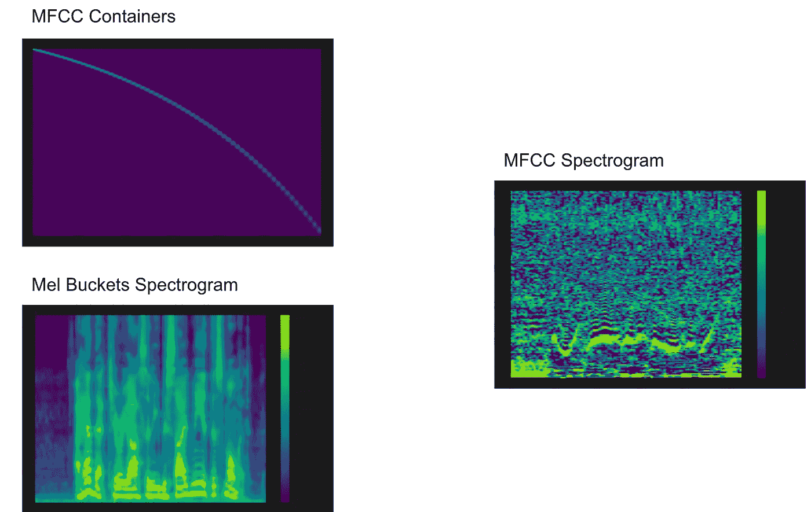**

***上图:用 PyTorch TorchAudio 提取音频数据的 MFCC 特征***

# **概括起来**

**在这篇史诗般的文章中，我们介绍了如何使用 PyTorch 的`torchaudio`库的基础知识。我们看到，我们可以使用`torchaudio`来做详细和复杂的音频操作。我们讨论的具体例子是添加音效、背景噪音和房间混响。**

**TorchAudio 还提供了其他音频处理方法，如高级重采样。在我们的重采样示例中，我们展示了如何使用 TorchAudio 的`functional`和`transform`库中的多个函数和参数，使用不同的过滤器进行重采样。我们使用低通滤波器、滚降滤波器和窗口滤波器。**

**最后，我们介绍了如何使用 TorchAudio 进行特征提取。我们展示了如何创建频谱图以获得频谱特征，使用 Griffin-Lim 公式反转频谱图，以及如何创建和使用梅尔尺度箱以获得梅尔频率倒谱系数(MFCC)特征。**

# **进一步阅读**

*   **[Python 中的 Dijkstra 算法](https://pythonalgos.com/dijkstras-algorithm-in-5-steps-with-python/)**
*   **建立你自己的人工智能文本摘要器**
*   **[在 Python 中进行命名实体识别(NER)的最佳方式](https://pythonalgos.com/the-best-way-to-do-named-entity-recognition-ner/)**

**如果你喜欢这篇文章，请在 Twitter 上分享！为了无限制地访问媒体文章，今天就注册成为[媒体会员](https://www.medium.com/@ytang07/membership)！别忘了关注我，[唐](https://www.medium.com/@ytang07)，获取更多关于增长、技术等方面的文章！**