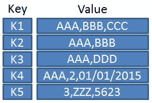
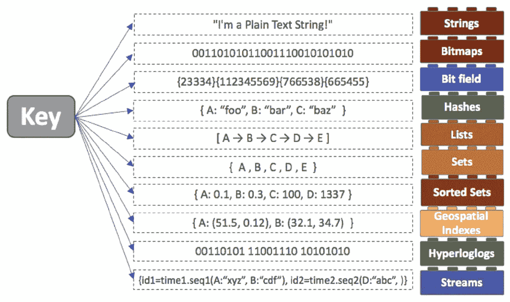
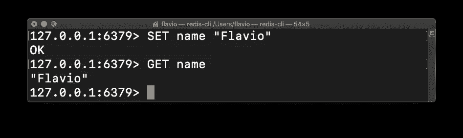

# Redis 简介

> 原文：<https://blog.devgenius.io/introduction-to-redis-bc567c402a37?source=collection_archive---------6----------------------->

文章对 Redis 至关重要。组成、概念和参考结构。

# 雷迪斯

Redis(远程词典服务器)是由 Salvatore Sanfilippo 于 2009 年创建的一个键值型数据库 **NoSQL** 。

它的诞生源于改进 times 的需要，以响应 Salvatore 的一个名为 LLOG 的项目。2012 年，VMWare 聘请了 Salvatore 和 Pieter Noordhius 等其他成员来开发 Redis。

# 数据库键值

key-value 类型的数据库是只有两列表的数据库。其中一个保存一个键，另一个保存一个值。key-value 类型的数据库表示字典或哈希表的范例结构。

这种类型的数据库的突出之处在于它在搜索元素方面的巨大收益，这是键和值之间的简单连接。

# 用例 Redis

*   **缓存存储**:实现高可用性内存缓存以减少数据访问延迟的绝佳选择。减轻我们应用程序的工作量和响应的完美选择。
*   **消息传递和发布/订阅** : Redis 支持发布/订阅消息传递范式，为高度轻量级的消息传递提供了一个很好的选择，充分利用了 Redis 的所有优势。
*   **会话存储**:开发者存储和管理互联网规模应用的会话的首选。
*   **实时分析** : Redis 可以与 Apache Kafka 或 Amazon Kinesis 等解决方案流协同工作，实现实时低延迟处理。

# 安装 Redis

Redis 有两个服务器版本:社区版和企业版。不同之处在于，企业版包含高性能特性，如自动伸缩、高可用性、自动监控和警报。

以下是根据 SO 进行安装的一些参考指南:

*   **Linux Ubuntu**:[https://redis . io/docs/get-started/installation/install-redis-on-Linux/](https://redis.io/docs/getting-started/installation/install-redis-on-linux/)
*   **MAC OS**:[https://redis . io/docs/getting-started/installation/install-redis-on-MAC-OS/](https://redis.io/docs/getting-started/installation/install-redis-on-mac-os/)
*   **Windows**:[https://redis . io/docs/getting-started/installation/install-redis-on-Windows/](https://redis.io/docs/getting-started/installation/install-redis-on-windows/)
*   **码头工人**:[https://redis.io/docs/stack/get-started/install/docker/](https://redis.io/docs/stack/get-started/install/docker/)

# Redis 数据类型

如上所述，Redis 由包含键和值的表组成，其中键必须是 string 类型，而值可以是以下类型之一。

*   **字符串**:最大 512MB 的文本或二进制数据。
*   **列表**:按插入顺序排列的字符串集合。
*   **套**:串集，可散置、组合，以及其他不同的套型。
*   **Hashes** :键值对的集合。
*   JSON :嵌套对象和半结构化的值，允许数字、字符串、布尔、矩阵和其他对象。
*   **位图**:提供比特级操作的数据类型。
*   **地理空间**:根据经纬度输入地图。

# Redis CLI

redis 命令行界面(redis-cli)是一个用于发送命令和从 Redis 服务器读取响应的程序。Redis CLI 的核心包含多个命令，这些命令有助于实现我们的工作，从插入元素到高级查询，再到搜索和聚合。

下面是在 **Redis CLI** 上 **INSERT** 和 **GET** 操作的一些例子:

# 资源 Redis

*   [**Redis 主网站**](https://redis.io/):Redis 的产品、解决方案、成本。
*   [**Redis 命令**](https://redis.io/commands/) : Redis 命令列表、查询行、信息。
*   [**Redis 大学**](https://university.redis.com/certification/) :技术培训、教程、指南、官方认证。
*   [**Redis 开发者指南**](https://developer.redis.com/) :入门、教程、API、开发者概念。
*   [**Redis 社区**](https://medium.com/r?url=https%3A%2F%2Fredis.io%2Fcommunity%2F) :常见问题和社区计划。

感谢你远道而来，如果你觉得这很有用，别忘了鼓掌👏。订阅以接收更多内容🔔。

如果你需要额外的帮助，请联系我🤠。

*   ✉️ [**给我发邮件**](mailto:dcortes.net@gmail.com)
*   🤝 [**在 LinkedIn 上联系我**](https://www.linkedin.com/in/dcortesnet/)
*   📮 [**在推特上联系我**](https://twitter.com/dcortes_net)

非常感谢您的阅读，我感谢您的时间。