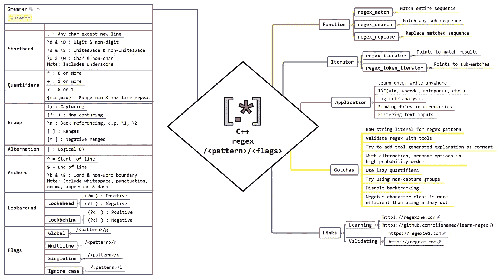

# 现代 C++正则表达式简介

> 原文：<https://blog.devgenius.io/introduction-to-regular-expression-with-modern-c-2d6e50e6d5a7?source=collection_archive---------10----------------------->



到目前为止，正则表达式(或简称为 regex)是现代 C++中一个非常讨厌且被低估的话题。但与此同时，正确使用正则表达式可以省去您编写许多行代码的麻烦。如果你在这个行业呆了足够长的时间。如果不知道正则表达式，那么你将会失去 20-30%的生产力。既然如此，我强烈推荐你学习 regex，因为它是一次性投资(类似于 ***学一次，随处写*** 的哲学)。

> */！\:本文已原创发表于我的* [*博客*](http://www.vishalchovatiya.com/regex-c/) *。如果你有兴趣接收我的最新文章，* [*请报名参加我的简讯*](http://eepurl.com/gDNybv) *。*

最初，在本文中，我决定也包含 regex-in-general。但是这没有意义，因为已经有人/教程在教 regex 方面比我做得更好。但是，我仍然留了一小部分来说明[动机](http://www.vishalchovatiya.com/regex-c/#Motivation) & [学习正则表达式](http://www.vishalchovatiya.com/regex-c/#Learning_Regex)。在本文的其余部分，我将关注 C++提供的使用 regex 的功能。如果你已经知道正则表达式，你可以用上面的思维导图作为复习。

*指针*:c++标准库提供了几种不同“风格”的正则表达式语法，但是默认风格(我在这里演示的是你应该一直使用的风格)是从 [ECMAScript](https://www.wikiwand.com/en/ECMAScript) 的标准中大量借用的。

# 动机

*   我知道它可怜又有些混乱的工具集。以下面的正则表达式模式为例，提取 24 小时格式的时间，即 HH:MM。

```
\b([01]?[0-9]|2[0-3]):([0-5]\d)\b
```

*   我是说！谁想用这个神秘的文本工作？
*   无论你在想什么都是 100%合理的。其实， ***我也因为同样的原因*** 耽误过两次学习正则表达式。但是，相信我，所有丑陋的东西都没有那么糟糕。
*   我在这里描述的方法( **↓** )不会花费超过 2-3 个小时来太直观地学习 regex。学习之后，你会看到随着时间的推移，投资回报的复合效应。

# 学习正则表达式

*   不要谷歌太多&尝试分析哪个教程是最好的。其实不要浪费时间在这样的分析上。因为这样做没有意义。在这个时间点(嗯！如果你不知道正则表达式)真正重要的是“开始”，而不是“什么是最好的！”。
*   ***直接去***[***【https://regexone.com】***](https://regexone.com/)***不用多想*** 。完成所有的课程。在这里相信我，我探索了很多文章，[课程](https://www.udemy.com/course/regex-academy-an-introduction-to-text-parsing-sorcery/)(<=此篇免费，BTW) &书籍。但是这是最好的不失去动力的开始。
*   在这之后，如果你还有胃口去解决更多的问题和练习。考虑以下链接:

1.  [关于 regextutorials.com 的练习](http://regextutorials.com/)
2.  [hacker rank 在 regex 上的练习题](https://www.hackerrank.com/domains/regex)

# [STD::regex](https://en.cppreference.com/w/cpp/regex/basic_regex)&STD::regex _ error 举例

```
int main() {
    try {
        static const auto r = std::regex(R"(\)"); // Escape sequence error
    } catch (const std::regex_error &e) {
        assert(strcmp(e.what(), "Unexpected end of regex when escaping.") == 0);
        assert(e.code() == std::regex_constants::error_escape);
    }
    return EXIT_SUCCESS;
}
```

*   你看！我使用的是[原始字符串文字](https://en.cppreference.com/w/cpp/language/string_literal)。您也可以使用普通字符串。但是，在这种情况下，您必须使用双反斜杠作为转义序列。
*   当前的`std::regex`实现很慢(因为它需要在运行时创建正则表达式解释&数据结构)，臃肿并且不可避免地需要堆分配(不支持分配器)。所以， ***如果你在一个循环中使用***`***std::regex***`*就要当心了(参见[c++ Weekly-Ep 74-STD::regex optimize by 简森·特纳](https://www.youtube.com/watch?v=7hfSyxNxFfo))。另外，我认为只有一个成员函数可能有用，那就是[STD::regex::mark _ count()](https://en.cppreference.com/w/cpp/regex/basic_regex/mark_count)，它返回许多捕获组。*
*   *此外，如果您在运行时使用多个字符串来创建 regex 模式。然后你可能需要[异常处理](http://www.vishalchovatiya.com/7-best-practices-for-exception-handling-in-cpp-with-example/)即`std::regex_error`来验证其正确性。*

# *[std::regex_search](https://en.cppreference.com/w/cpp/regex/regex_search) 示例*

```
*int main() {
    const string input = "ABC:1->   PQR:2;;;   XYZ:3<<<"s;
    const regex r(R"((\w+):(\w+);)");
    smatch m; if (regex_search(input, m, r)) {
        assert(m.size() == 3);
        assert(m[0].str() == "PQR:2;");                // Entire match
        assert(m[1].str() == "PQR");                   // Substring that matches 1st group
        assert(m[2].str() == "2");                     // Substring that matches 2nd group
        assert(m.prefix().str() == "ABC:1->   ");      // All before 1st character match
        assert(m.suffix().str() == ";;   XYZ:3<<<");   // All after last character match // for (string &&str : m) { // Alternatively. You can also do
        //     cout << str << endl;
        // }
    }
    return EXIT_SUCCESS;
}*
```

*   *`smatch`是 [std::match_results](https://en.cppreference.com/w/cpp/regex/match_results) 的专门化，它存储关于要检索的匹配的信息。*

# *[标准::正则表达式 _ 匹配](https://en.cppreference.com/w/cpp/regex/regex_match)示例*

*   *你可能在每本 regex 书中总能找到的简短而有趣的例子是电子邮件验证。这就是我们的`std::regex_match`功能完美契合的地方。*

```
*bool is_valid_email_id(string_view str) {
    static const regex r(R"(\w+@\w+\.(?:com|in))");
    return regex_match(str.data(), r);
}int main() {
    assert(is_valid_email_id("vishalchovatiya@ymail.com") == true);
    assert(is_valid_email_id("@abc.com") == false);
    return EXIT_SUCCESS;
}*
```

*   *我知道这不是完全证明电子邮件验证正则表达式模式。但我的意图也不是那样。*
*   *你应该想知道为什么我用了`std::regex_match`！不是`std::regex_search`！基本原理很简单`***std::regex_match***` ***匹配整个输入序列*** 。*
*   *另外，值得注意的是 ***静态正则表达式对象避免了每次*** 函数进入时构造(“编译/解释”)一个新的正则表达式对象。*
*   *上面小小的代码片段中的 ***具有讽刺意味的是，它产生了大约 30k 行汇编*** 代码，这些代码也带有`-O3`标志。这太荒谬了。但是不要担心，这已经被带到了 ISO C++社区。不久我们可能会得到一些更新。与此同时，我们确实有其他选择(在本文末尾提到)。*

# *[STD::regex _ match](https://en.cppreference.com/w/cpp/regex/regex_match)&[STD::regex _ search](https://en.cppreference.com/w/cpp/regex/regex_search)的区别？*

*   *你可能想知道为什么我们有两个功能做几乎相同的工作？甚至我最初也有怀疑。但是，看了一遍又一遍 cppreference 提供的描述。我找到了答案。为了解释这个答案，我创建了这个例子(显然是在 StackOverflow 的帮助下):*

```
*int main() {
    const string input = "ABC:1->   PQR:2;;;   XYZ:3<<<"s;
    const regex r(R"((\w+):(\w+);)");
    smatch m; assert(regex_match(input, m, r) == false); assert(regex_search(input, m, r) == true && m.ready() == true && m[1] == "PQR"); return EXIT_SUCCESS;
}*
```

*   *`***std::regex_match***` ***只有当整个输入序列都匹配时才会返回*** `***true***` ***，而*** `***std::regex_search***` ***即使只有一个子序列匹配正则表达式也会成功。****

# *[std::regex_iterator](https://en.cppreference.com/w/cpp/regex/regex_iterator) 示例*

*   *当您需要关于匹配的&子匹配的非常详细的信息时，`std::regex_iterator`非常有用。*

```
*#define C_ALL(X) cbegin(X), cend(X)int main() {
    const string input = "ABC:1->   PQR:2;;;   XYZ:3<<<"s;
    const regex r(R"((\w+):(\d))"); const vector<smatch> matches{
        sregex_iterator{C_ALL(input), r},
        sregex_iterator{}
    }; assert(matches[0].str(0) == "ABC:1" 
        && matches[0].str(1) == "ABC" 
        && matches[0].str(2) == "1"); assert(matches[1].str(0) == "PQR:2" 
        && matches[1].str(1) == "PQR" 
        && matches[1].str(2) == "2"); assert(matches[2].str(0) == "XYZ:3" 
        && matches[2].str(1) == "XYZ" 
        && matches[2].str(2) == "3"); return EXIT_SUCCESS;
}*
```

*   *早期(在 C++11 中)有一个限制，使用`std::regex_interator`不允许被临时正则表达式对象调用。该错误已经用来自 C++14 的重载进行了纠正。*

# *[STD::regex _ token _ iterator](https://en.cppreference.com/w/cpp/regex/regex_token_iterator)示例*

*   *`std::regex_token_iterator`是您将在 80%的时间里使用的工具。与`std::regex_iterator`相比略有不同。*`***std::regex_iterator***`*`***std::regex_token_iterator***`***的区别在于******
*   **`***std::regex_iterator***` ***点匹配结果。*****
*   **`***std::regex_token_iterator***` ***分次赛。*****
*   **在`std::regex_token_iterator`中，每个迭代器只包含一个匹配的结果。**

```
**#define C_ALL(X) cbegin(X), cend(X)int main() {
    const string input = "ABC:1->   PQR:2;;;   XYZ:3<<<"s;
    const regex r(R"((\w+):(\d))"); // Note: vector<string> here, unlike vector<smatch> as in std::regex_iterator
    const vector<string> full_match{
        sregex_token_iterator{C_ALL(input), r, 0}, // Mark `0` here i.e. whole regex match
        sregex_token_iterator{}
    };
    assert((full_match == decltype(full_match){"ABC:1", "PQR:2", "XYZ:3"})); const vector<string> cptr_grp_1st{
        sregex_token_iterator{C_ALL(input), r, 1}, // Mark `1` here i.e. 1st capture group
        sregex_token_iterator{}
    };
    assert((cptr_grp_1st == decltype(cptr_grp_1st){"ABC", "PQR", "XYZ"})); const vector<string> cptr_grp_2nd{
        sregex_token_iterator{C_ALL(input), r, 2}, // Mark `2` here i.e. 2nd capture group
        sregex_token_iterator{}
    };
    assert((cptr_grp_2nd == decltype(cptr_grp_2nd){"1", "2", "3"})); return EXIT_SUCCESS;
}**
```

# **与[STD::regex _ token _ iterator](https://en.cppreference.com/w/cpp/regex/regex_token_iterator)反向匹配**

```
**#define C_ALL(X) cbegin(X), cend(X)int main() {
    const string input = "ABC:1->   PQR:2;;;   XYZ:3<<<"s;
    const regex r(R"((\w+):(\d))"); const vector<string> inverted{
        sregex_token_iterator{C_ALL(input), r, -1}, // `-1` = parts that are not matched
        sregex_token_iterator{}
    };
    assert((inverted == decltype(inverted){
                            "",
                            "->   ",
                            ";;;   ",
                            "<<<",
                        })); return EXIT_SUCCESS;
}**
```

# **[std::regex_replace](https://en.cppreference.com/w/cpp/regex/regex_replace) 示例**

```
**string transform_pair(string_view text, regex_constants::match_flag_type f = {}) {
    static const auto r = regex(R"((\w+):(\d))");
    return regex_replace(text.data(), r, "$2", f);
}int main() {
    assert(transform_pair("ABC:1, PQR:2"s) == "1, 2"s); // Things that aren't matched are not copied
    assert(transform_pair("ABC:1, PQR:2"s, regex_constants::format_no_copy) == "12"s);
    return EXIT_SUCCESS;
}**
```

*   **你看，在 transform_pair 的第二次调用中，我们传递了标志`std::regex_constants::format_no_copy`,它建议不要复制不匹配的东西。在 [std::regex_constant](https://en.cppreference.com/w/cpp/regex/match_flag_type) 下有很多这样有用的标志。**
*   **此外，我们还构造了保存结果的新字符串。但是如果我们不想要一个新的字符串呢？而是希望将结果直接附加到某个地方(可能是容器或流或已经存在的字符串)。你猜怎么着！标准库也通过重载`std::regex_replace`解决了这个问题，如下所示:**

```
**int main() {
    const string input = "ABC:1->   PQR:2;;;   XYZ:3<<<"s;
    const regex r(R"(-|>|<|;| )"); // Prints "ABC:1     PQR:2      XYZ:3   "
    regex_replace(ostreambuf_iterator<char>(cout), C_ALL(input), r, " "); return EXIT_SUCCESS;
}**
```

# **用例**

# **用分隔符拆分字符串**

*   **虽然`std::strtok`是最适合这样任务的&最佳人选。但是为了演示如何使用 regex:**

```
**#define C_ALL(X) cbegin(X), cend(X)vector<string> split(const string& str, string_view pattern) {
    const auto r = regex(pattern.data());
    return vector<string>{
        sregex_token_iterator(C_ALL(str), r, -1),
        sregex_token_iterator()
    };
}int main() {
    assert((split("/root/home/vishal", "/")
                == vector<string>{"", "root", "home", "vishal"}));
    return EXIT_SUCCESS;
}**
```

# **修剪字符串中的空白**

```
**string trim(string_view text) {
    static const auto r = regex(R"(\s+)");
    return regex_replace(text.data(), r, "");
}int main() {
    assert(trim("12   3 4      5"s) == "12345"s);
    return EXIT_SUCCESS;
}**
```

# **从文件中查找包含或不包含某些单词的行**

```
**string join(const vector<string>& words, const string& delimiter) {
    return accumulate(next(begin(words)), end(words), words[0],
            [&delimiter](string& p, const string& word)
            {
                return p + delimiter + word;
            });
}vector<string> lines_containing(const string& file, const vector<string>& words) {
    auto prefix = "^.*?\\b("s;
    auto suffix = ")\\b.*$"s; //  ^.*?\b(one|two|three)\b.*$
    const auto pattern = move(prefix) + join(words, "|") + move(suffix); ifstream        infile(file);
    vector<string>  result; for (string line; getline(infile, line);) {
        if(regex_match(line, regex(pattern))) {
            result.emplace_back(move(line));
        }
    } return result;
}int main() {
   assert((lines_containing("test.txt", {"one","two"})
                                        == vector<string>{"This is one",
                                                          "This is two"}));
    return EXIT_SUCCESS;
}
/* test.txt
This is one
This is two
This is three
This is four
*/**
```

*   **这同样适用于查找不包含模式为`^((?!(one|two|three)).)*$`的单词的行。**

# **在目录中查找文件**

```
**namespace fs = std::filesystem;vector<fs::directory_entry> find_files(const fs::path &path, string_view rg) {
    vector<fs::directory_entry> result;
    regex r(rg.data());
    copy_if(
        fs::recursive_directory_iterator(path),
        fs::recursive_directory_iterator(),
        back_inserter(result),
        [&r](const fs::directory_entry &entry) {
            return fs::is_regular_file(entry.path()) &&
                   regex_match(entry.path().filename().string(), r);
        });
    return result;
}int main() {
    const auto dir        = fs::temp_directory_path();
    const auto pattern    = R"(\w+\.png)";
    const auto result     = find_files(fs::current_path(), pattern);
    for (const auto &entry : result) {
        cout << entry.path().string() << endl;
    }
    return EXIT_SUCCESS;
}**
```

# **使用常规正则表达式的提示**

*   **使用原始字符串文字描述 C++中的 regex 模式。**
*   **使用正则表达式验证工具，如[https://regex101.com](https://regex101.com)。我喜欢的是 [regex101](https://regex101.com/) 的代码生成&耗时(在优化 regex 时会有帮助)特性。**
*   **此外，尝试将验证工具生成的解释作为注释添加到代码中正则表达式模式的正上方。**
*   **性能:**
*   **如果你使用交替，试着像`com|net|org`一样按照高概率顺序排列选项。**
*   **如果可能的话，尽量使用惰性量词。**
*   **尽可能使用非捕获组。**
*   **禁用回溯。**
*   **使用否定字符类比使用懒惰点更有效。**

# **离别赠言**

**不仅仅是你会把 regex 只和 C++或者任何其他语言一起使用。我自己主要在 IDE(在 vscode 中分析日志文件)和 Linux 终端上使用它。但是，请记住，过度使用正则表达式会给人一种聪明的感觉。而且，这是一个让你的同事(以及任何需要使用你的代码的人)对你非常生气的好方法。此外，对于您在日常工作中会遇到的大多数解析任务来说，regex 是多余的。**

**正则表达式确实在复杂的任务中大放异彩，在这些任务中，手写的解析代码无论如何都会很慢；对于极其简单的任务，正则表达式的可读性和健壮性超过了它们的性能成本。**

**更值得注意的是，标准库中当前的正则表达式实现(直到 2020 年 6 月 19 日)存在性能和代码膨胀问题。因此，明智地在 Boost、CTRE 和标准库版本之间进行选择。最有可能的是，你会继续哈娜·杜西科娃关于[编译时正则表达式](https://github.com/hanickadot/compile-time-regular-expressions)的工作。此外，她来自 [2018](https://www.youtube.com/watch?v=QM3W36COnE4&list=WL&index=9&t=0s) & 2019 的 CppCon 演讲将会很有帮助，尤其是如果你计划在嵌入式系统中使用 regex 的话。**