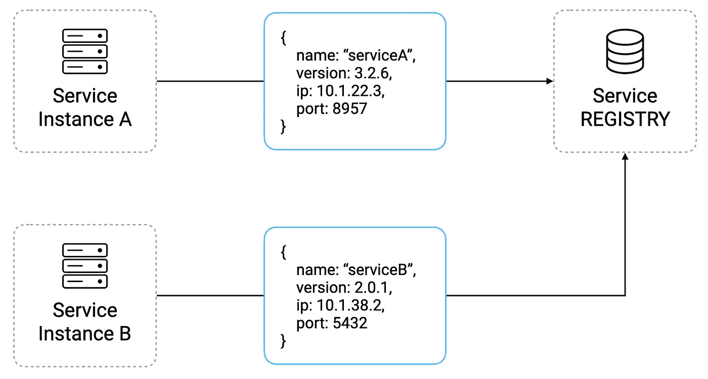
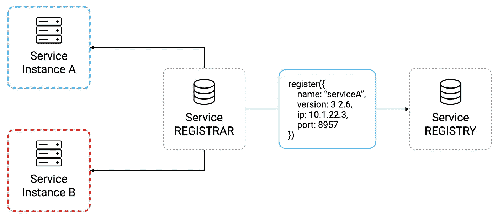
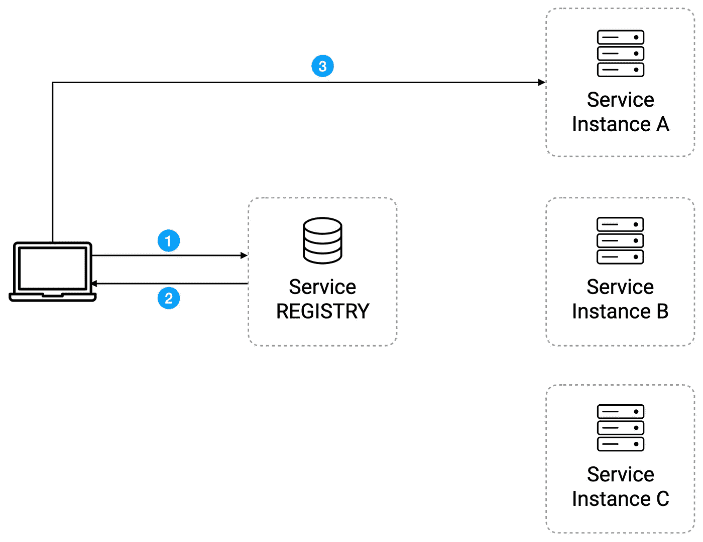
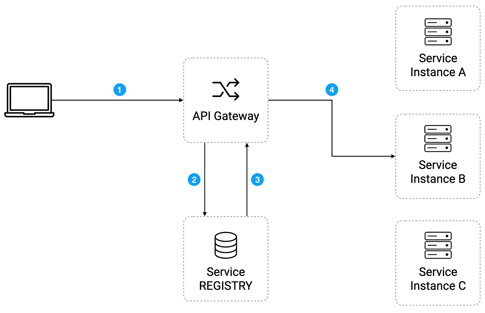

# 服务发现简介

> 原文：<https://blog.devgenius.io/introduction-to-service-discovery-34c5149f1587?source=collection_archive---------4----------------------->

🚀 [**打造分层微服务**](https://learnbackend.dev/books/build-layered-microservices) 这本书出来了！现在就在 [learnbackend.dev](https://learnbackend.dev/books/build-layered-microservices) 购买你自己的副本。

在传统的应用程序中，服务实例的网络位置通常是相当静态的，可以从配置文件中加载，而配置文件是由系统管理员不时手动更新的。

不幸的是，对于在虚拟化或容器化环境中运行的现代基于微服务的应用程序，这种解决方案几乎不起作用，因为实例的数量及其位置会动态变化。

这种动态性源于这样一个事实，即服务的生命周期通常是以秒或分钟来衡量的，因为它们会被放大或缩小、升级或干脆失效。

因此，我们必须实现一种机制，使服务能够相互定位，以便通过它们的 API 进行通信，这种机制称为**服务发现**。

尽管有许多可能的实现，但它们通常包括一个维护服务网络位置列表的中央服务器，称为**服务注册表**，以及连接到该中央服务器以更新和解析它们的客户端。

# 服务注册

**服务注册中心**是一个高度可用的数据库，包含各种服务实例的网络位置，并且是**服务发现**机制的主要组件，但是与基础设施的其他服务不同，它需要部署在一个固定且众所周知的 IP 地址上，以便于访问。

简而言之，它允许服务在启动和关闭时通过发送它们的网络位置和其他信息(例如它们的名称或版本号)来注册和注销它们自己，以便让其他服务知道它们的存在。

除此之外，服务还可以定期发送一种特殊类型的消息，称为**心跳**，这样服务注册中心就知道它们仍然可用并准备好接收请求。

也就是说，注册服务有两种方式。

## 自行注册

第一种是最简单的，称为**自注册**，因为它通过直接连接到注册中心，让服务负责管理自己的注册。

然而，这种方法将服务耦合到注册中心，因为注册代码必须在每个服务中以每种编程语言实现。

## 第三方注册

第二种方法是第三方注册，其中一个名为**注册器**的组件跟踪运行环境中服务的变化，并根据它们的状态自动注册或注销它们。

从不再需要在每个服务中实现注册逻辑的意义上来说，这是非常好的，但是它向需要正确设置和管理的基础设施中引入了一个具有高可用性的附加组件。

# 服务发现模式

## 客户端发现

当使用**客户端发现模式**时，客户端负责通过查询**服务注册中心获取可用服务实例的网络位置。**

它允许客户端通过**负载平衡**请求来做出特定于应用的决定，例如使用像**循环**这样的算法。

主要的问题是，每个客户端必须有一个查询逻辑的实现，因此可能每个语言或框架都有一个。例如，一个用 JavaScript 实现你的网站，另一个用 Java 实现你的 Android 应用。

## 服务器端发现

当使用**服务器端发现模式**时，客户端将其请求发送到**路由器**，路由器将负责查询**注册服务**，并使用自己的负载平衡算法将该请求重新路由到可用的实例。

这种模式的优点是发现逻辑从客户机中移除，但是您必须记住，它引入了一个需要小心管理的新的敏感组件，因为负载平衡器必须高度可用，因为没有它，任何请求都不会到达任何服务。

# 下一步是什么？

不要忘记👏🏻x50 如果你喜欢读我的作品！

👉你喜欢这种内容？查看 https://learnbackend.dev 上的书[**Build Layered micro services**](https://learnbackend.dev/books/build-layered-microservices)了解如何使用 Express framework 构建一个生产就绪的分层认证微服务，从第一行代码到最后一行文档，它在开发实践和软件架构方面符合行业标准。